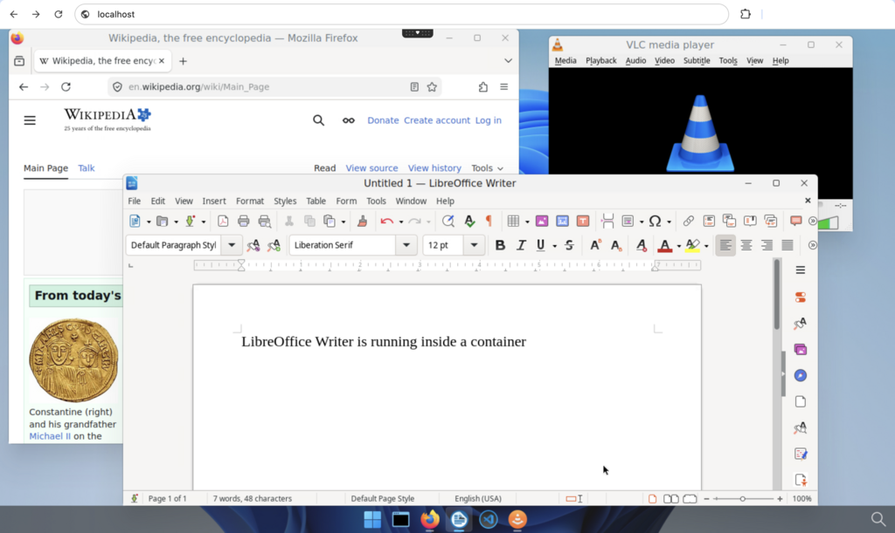

# abcdesktop.io documentation

[](https://www.abcdesktop.io/)
[](https://github.com/abcdesktopio)
[](https://hub.docker.com/u/abcdesktopio)
[](LICENSE)

This repository contains the source for the [abcdesktop.io](https://www.abcdesktop.io/) documentation website, built with [MkDocs](https://www.mkdocs.org/) and [Material for MkDocs](https://squidfunk.github.io/mkdocs-material/).

**abcdesktop.io** is a free, open-source, cloud-native virtual desktop platform for Kubernetes, delivering **Remote Browser Isolation (RBI)** and **Remote Application Isolation (RAI)** — accessible from any HTML5 web browser, with no client-side installation required.



Try it live on the public demo instance: [demo.gcp.abcdesktop.com](https://demo.gcp.abcdesktop.com/)

## For More Information

Refer to the public documentation website:
* [https://abcdesktopio.github.io/](https://abcdesktopio.github.io/)
* [https://www.abcdesktop.io/](https://www.abcdesktop.io/)

Related resources:
* Source code and container images: [github.com/abcdesktopio](https://github.com/abcdesktopio)
* Container images: [hub.docker.com/u/abcdesktopio](https://hub.docker.com/u/abcdesktopio)
* Frequently Asked Questions: [FAQ](https://www.abcdesktop.io/faq/faq/)

## Documentation Markup Language

The abcdesktop.io documentation is built with [MkDocs](https://www.mkdocs.org/). Clone the repository including all submodules with the following command:

```
git clone --recurse-submodules https://github.com/abcdesktopio/docs
```

To build and serve the documentation website, run:

```
make install
make docs
```

To preview your local changes, install the Python dependencies and start the development server:

```
pip3 install -r requirements.txt
mkdocs serve
# open your browser: http://127.0.0.1:8000
```

Alternatively, from within the `docs` directory:

```
cd docs
pip3 install -r requirements.txt
mkdocs serve -f opsdocs/mkdocs.yml
```
