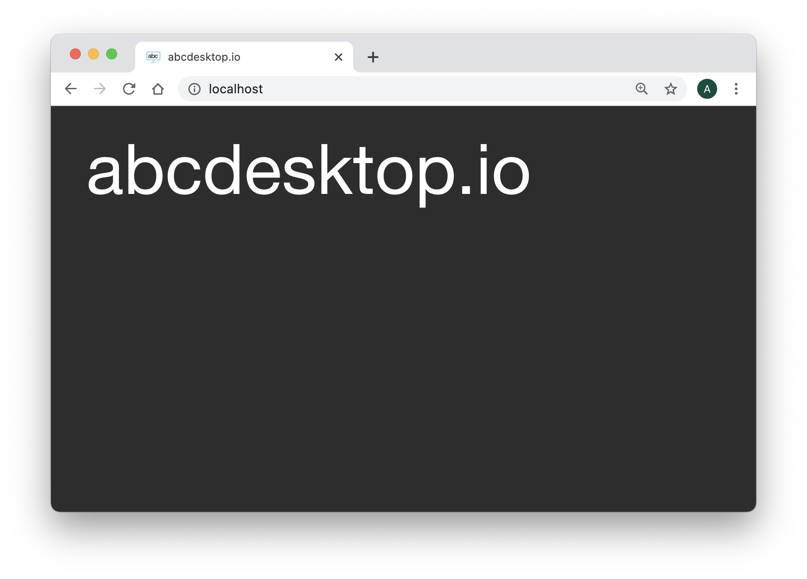

# Authentification

## Configuration file
The authentification configuration is set in the ```od.config``` file. In this chapter you will need to update the od.config configuration file. 
This update differs depending on the configuration docker mode or kubernetes mode. 

Read the 
[Update your configuration file and apply the new configuration file](editconfig.md) section to make change in od.config file for docker, or edit the abcdesktop.yaml file for kubernetes cluster.

## The dictionary authmanagers

The authmanagers is defined as a dictionnary object :

```
authmanagers: {
  'external': { },
  'explicit': { },
  'implicit': { }
}
```

The od.config defines 3 kinds of entries in the ```authmanagers``` object :

* ```external```: use for OAuth 2.0 Authentification
* ```explicit```: use for LDAP, LDAPS and ActiveDirectory Authentification
* ```implicit```: use for Anonymous Authentification

## Related authmanagers 

| authmanagers type  | Description  |
|--------------------|--------------|
|  [```external```](authexternal.md)|   OAuth 2.0 Authentification  |
|  [```explicit```](authexplicit.md) |   LDAP, LDAPS and Active Directory Authentification |
|  [```implicit```](authimplicit.md) |   Anonymous Authentification |

## Hands-on

### Requirements

You should have read the hands-on :

* [Edit your configuration file in docker mode](config/editconfig/)

### Change authmanagers configuration

Edit your od.config pyos configuration file, and set the value to the authmanagers dictionnay with empty values for ```implicit```, ```explicit```, and ```external```, as describe :

```
authmanagers: {
  'external': { },
  'explicit': { },
  'implicit': { }
}
```

Save your new od.config file.
> The config file ```od.config``` has changed and od.py running inside the container should restart. If it doesn't, restart your docker-compose to ake sure that the od.py the your new od.config file.
> 
>```docker-compose restart```
>


Start your web browser and open the URL ```http://localhost```



The Web home page should only show the title abcdesktop.io.
There is no ```authmanagers``` available.

Great you can now add some value to authenticate your users.


## authmanagers ```implicit```:

```implicit``` is the easyest configuration mode, and is used as 'Anonymous' authentification. 
Read the [authmanagers implicit](authimplicit.md) Section.


## authmanagers ```explicit```:

```explicit ``` is the easyest configuration mode, and is used as 'Anonymous' authentification. 
Read the [authmanagers explicit](authexplicit.md) Section.

## authmanagers ```external```:

```external ``` is the easyest configuration mode, and is used as 'Anonymous' authentification. 
Read the [authmanagers external](authexternal.md) Section.


## Authmanagers configuration sample
        
In the [authmanagers implicit](authimplicit.md) section, [authmanagers explicit](authexplicit.md) section, and [authmanagers external](authexternal.md) section, you have learned how to defined the providers. You can set a complete ```authmanagers``` dictionnary as described for example :


```
authmanagers: {
  'external': {
    'providers': {
      'facebook': { 
        'displayname': 'Facebook', 
        'enabled': True,
        'client_id':     'XXXXXXX', 
        'client_secret': 'YYYYYYY', 
        'dialog_url': 'https://www.facebook.com/dialog/oauth?client_id={client_id}&redirect_uri={callback_url}&response_type=code',
        'auth_url': 'https://graph.facebook.com/v2.3/oauth/access_token?code={code}&redirect_uri={callback_url}&client_id={client_id}&client_secret={client_secret}',
        'userinfo_url': 'https://graph.facebook.com/v2.6/me?access_token={access_token}&fields=picture.width(400),name',
        'callback_url': 'https://host.domain.com/API/auth/oauth?manager={manager.name}&provider={name}',
        'userinfomap': {
            '*': '*',
            'picture': 'picture.data.url'
        }
      },
      'orange': {       
        'displayname': 'Orange', 
        'enabled': True,
        'basic_auth': True,
        'userinfo_auth': True,
        'client_id':      'AAAAAAAA', 
        'client_secret':  'BBBBBBBB',
        'dialog_url': 'https://api.orange.com/oauth/v2/authorize?client_id={client_id}&redirect_uri={callback_url}&scope=openid+profile+offline_access&response_type=code&prompt=login+consent&state={callba
ck_url}',
        'auth_url': 'https://api.orange.com/openidconnect/fr/v1/token?code={code}&redirect_uri={callback_url}&grant_type=authorization_code', 
        'userinfo_url': 'https://api.orange.com/openidconnect/v1/userinfo',
        'callback_url': 'https://host.domain.com/API/auth/oauth?manager={manager.name}&provider={name}'
      },
      'mobileorange': { 
        'displayname': 'Mobile Connect', 
        'enabled': False,
        'client_id':     'CCCCCCCC', 
        'client_secret': 'DDDDDDDD',
        'basic_auth': True,
        'dialog_url': 'https://api.orange.com/oauth/v2/authorize?client_id={client_id}&redirect_uri={callback_url}&scope=openid+profile&response_type=code&prompt=login+consent&state=&state={callback_url}'
,
        'auth_url': 'https://api.orange.com/oauth/v2/token?code={code}&redirect_uri={callback_url}&grant_type=authorization_code', 
        'userinfo_url': 'https://api.orange.com/oauth/v2/authorize',
        'callback_url': 'https://host.domain.com/API/auth/oauth?manager={manager.name}&provider={name}'
      },
      'google': { 
        'displayname': 'Google', 
        'enabled': True,
        'client_id':     'EEEEEEEE.apps.googleusercontent.com', 
        'client_secret': 'FFFFFFFF',
        'scope': 'https://www.googleapis.com/auth/userinfo.email',
        'dialog_url': 'https://accounts.google.com/o/oauth2/v2/auth?client_id={client_id}&redirect_uri={callback_url}&response_type=code&scope={scope}',
        'auth_url': 'https://oauth2.googleapis.com/token?code={code}&grant_type=authorization_code&redirect_uri={callback_url}&scope={scope}&client_id={client_id}&client_secret={client_secret}',
        'userinfo_url': 'https://openidconnect.googleapis.com/v1/userinfo?access_token={access_token}',
        'callback_url': 'https://host.domain.com/API/auth/oauth?manager={manager.name}&provider={name}'
      }
    }
  },
  'explicit': {
    'show_domains': True,
    'default_domain': 'AD',
    'providers': {
      'AD': { 
        'config_ref': 'adconfig', 
        'enabled': True
       }
    }
  },
  'implicit': {
    'providers': {
      'anonymous': {
        'displayname': 'Anonymous',
        'caption': 'Have a look !',
        'userid': 'anonymous',
        'username': 'Anonymous'
      }     
    }
  }}


adconfig : { 'AD': {    'default'       : True, 
                        'ldap_timeout'  : 15,
                        'ldap_protocol' : 'ldap',
                        'ldap_basedn'   : 'DC=ad,DC=domain,DC=local',
                        'ldap_fqdn'     : '_ldap._tcp.ad.domain.local',
                        'domain'        : 'AD',
                        'domain_fqdn': 'AD.DOMAIN.LOCAL',
							 'servers'	: [ '192.168.1.12', '192.168.1.13'  ],
                        'kerberos_realm': 'AD.DOMAIN.LOCAL',
				  			 'query_dcs'	: True
}}
```

