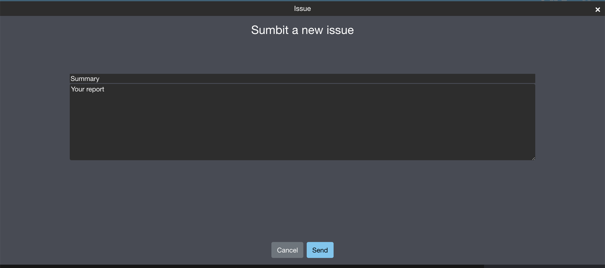
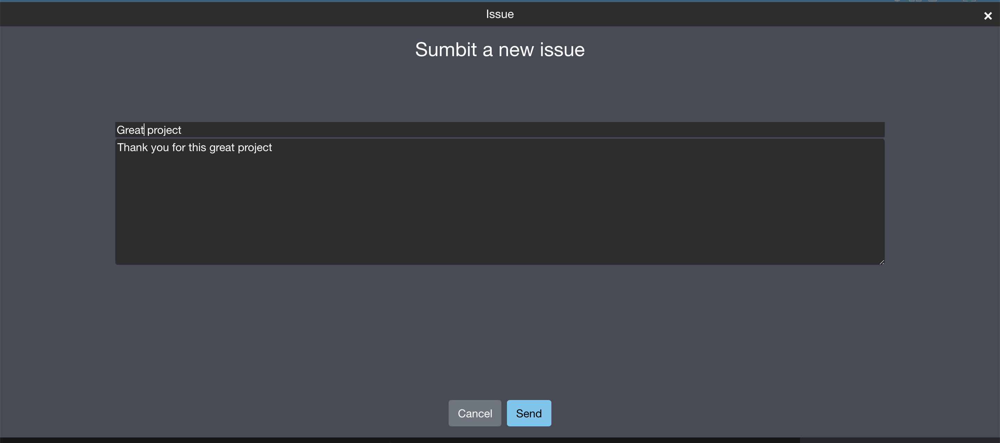
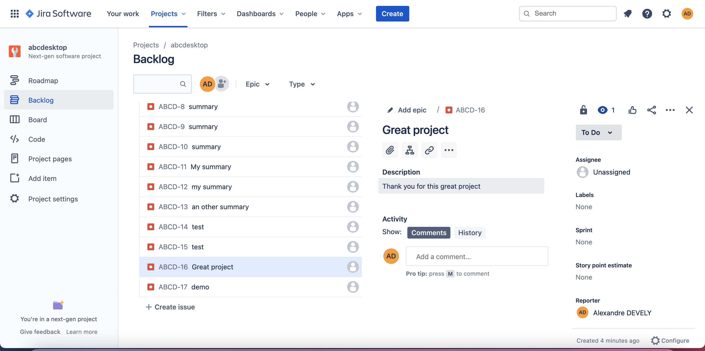

# JIRA configuration 

abcdesktop.io support JIRA 

## JIRA option

In ```od.config``` add the ```jira``` option.
```jira``` option is a dictionary with the entries :


| entry      | sample value			                        |
|------------|-----------------------------------------------|
| url 		   | https://domainexample.atlassian.net/          |
| project_id | ABCD                                          |
| username	| account@domain.local                          |
| apikey 	   | XXXXXXXXXXXXXXXXXXXX                          |
 

And fill the dictionary 

```
jira : { 
			'url': 			'https://domainexample.atlassian.net/',
         	'project_id': 	'ABCD',
         	'username': 	'account@domain.local',
         	'apikey' : 		'XXXXXXXXXXXXXXXXXXXX' }
```

Then apply the new configuration file ```od.config``` by retrasting the daemon.


When ```jira``` option is set, a new icon ```issue``` appears at the top.


Click on the ```issue``` icon, a new window is appear.



Fill ```Summary``` and ```Your Report``` values



Then press the ```Send``` button. A notification message appears on the left top corner.


Log into your jira server, and check your backlog 
 


Great you added a new issue tracking.

