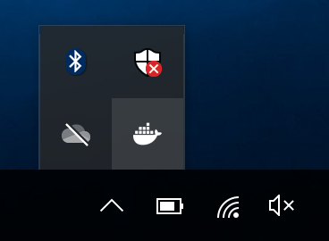
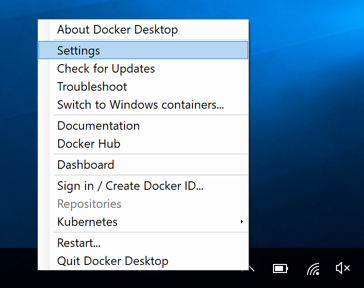
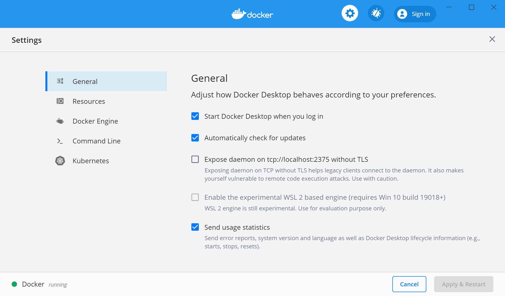
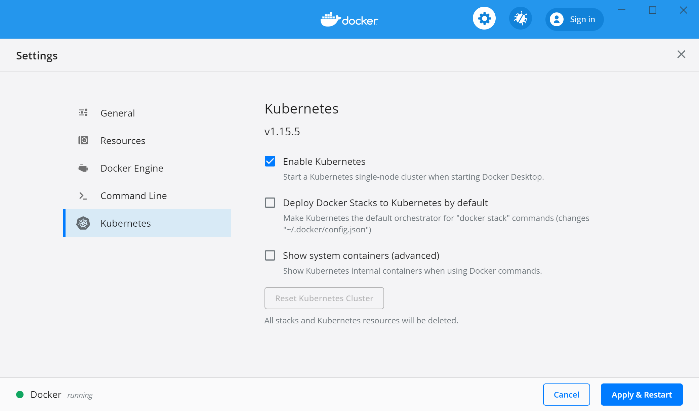
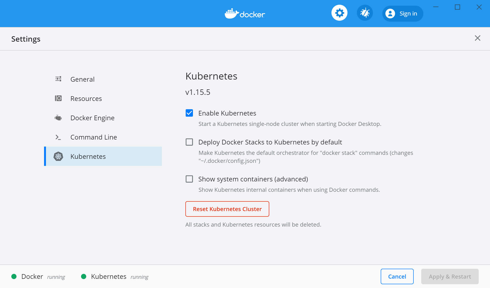

# Windows 10 Kubernetes Installation


## Enable Kubernetes on Windows 10

Click on the ```Docker Desktop``` icon in the windows tray.


The following menu should appear, choose ```Settings``` :



The following window should appear :



Choose ```Kubernetes```, then check the  ```Enable Kubernetes ``` 




Press the ```Apply and Restart``` button. Please wait to download all container images and for kubernetes installation process.



On the bottom you should read next ```Docker Running``` and ```Kubernetes Running```.

Great, you have installed Kubernetes on Windows 10.


## Run the new ```kubectl``` command

Open a Terminal ```cmd.exe```, then run the command ```kubectl version``` 

```
Client Version: version.Info{Major:"1", Minor:"15", GitVersion:"v1.15.5", GitCommit:"20c265fef0741dd71a66480e35bd69f18351daea", GitTreeState:"clean", BuildDate:"2019-10-15T19:16:51Z", GoVersion:"go1.12.10", Compiler:"gc", Platform:"windows/amd64"}
Server Version: version.Info{Major:"1", Minor:"15", GitVersion:"v1.15.5", GitCommit:"20c265fef0741dd71a66480e35bd69f18351daea", GitTreeState:"clean", BuildDate:"2019-10-15T19:07:57Z", GoVersion:"go1.12.10", Compiler:"gc", Platform:"linux/amd64"}
```

Run the command ```kubectl get pods``` 

``` 
kubectl get pods
No resources found.
```

Great, the kubectl command works. It's time to deploy abcdesktop.io