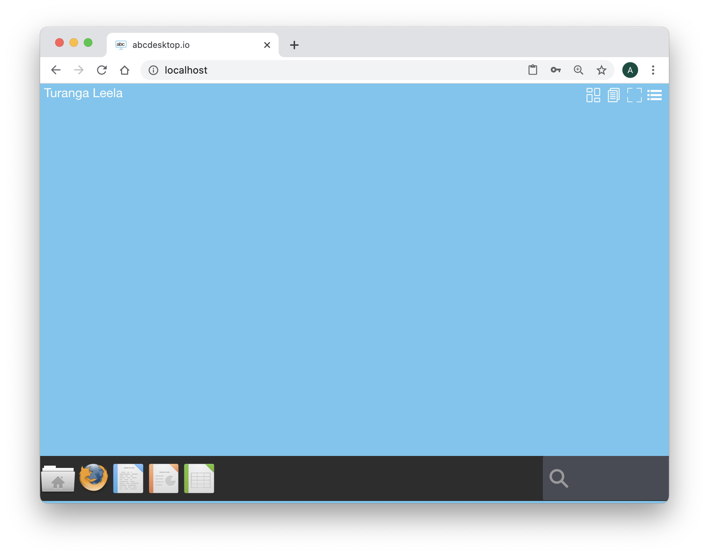
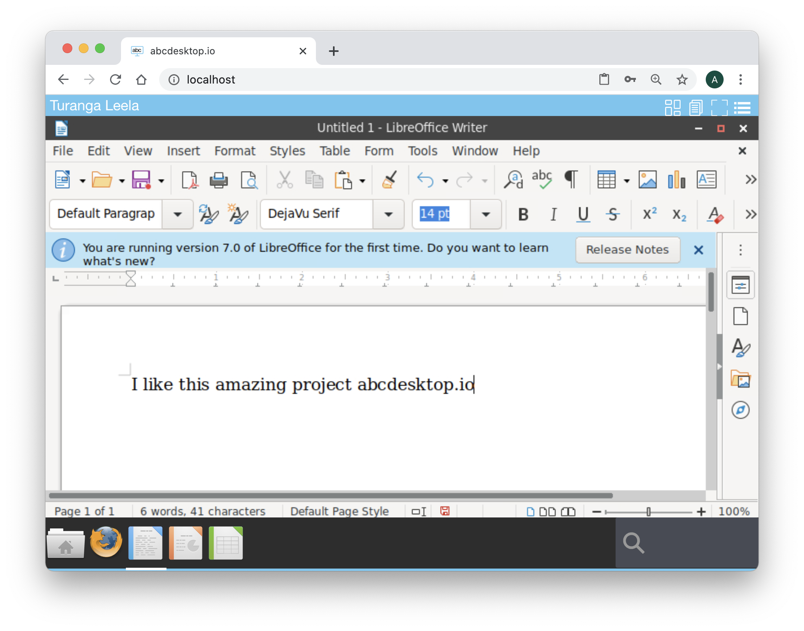

# Authentification `explicit` for LDAP Directory Services

## authmanagers `explicit` object

`explicit` authentification use a directory service. A bind operation is used to authenticate clients to the directory server, to establish an authorisation identity that will be used for subsequent operations processed on that connection. 

The `explicit` authentification configuration is defined as a dictionary object and contains an `explicit` provider. 


For example :

```
'explicit': {
    'providers': {
      'LDAP': { 
        'config_ref': 'ldapconfig', 
        'enabled': True
       }
}
```

In this example, `ldapconfig` dict must have a key `LDAP`


| Variable name      | Type   | Description   |
|--------------------|--------- |-------------|
|  `default_domain` | string | set the default domain name, if user does not prefix the login by domain\s. `default_domain` is  only used by Active Directory provider | 
|  `providers`      | dictionary | `{ 'LDAP': {  'config_ref': 'ldapconfig',  'enabled': True  }}`
|


### providers configuration

The `provider` authentification configuration is defined as a dictionary object and must contain a key name.
The key name must be set with the same value in provider configuration and `config_ref`.

The provider is formatted as a dictionary. Example for a `provider` defined as `planet`

```
 { 'planet': {  
 			'config_ref': 'ldapconfig',  
 			'enabled': True  
 		}
 }
```
 

| Variable name      | Type   | Description   |
|--------------------|--------- |-------------|
| config_ref         | string   |  For  increased readability , the configuration is defined in a dedicated and separated dictionary as (key,value) `'config_ref': 'planet'`, where `key` is `config_ref` and `value` is the dictionary variable name.           |
| enable             | boolean  | `True` to enable or `False` to disable the provider configuration |


The `ldapconfig` is a dictionary. 

For example :

``` json
ldapconfig : { 
  'planet': {    
    'default'       : True, 
    'ldap_timeout'  : 15,
    'ldap_protocol' : 'ldap',
    'ldap_basedn'   : 'ou=people,dc=planetexpress,dc=com',
    'servers'       : [ 'ldap://192.168.8.195' ],
    'serviceaccount': { 'login': 'cn=admin,dc=planetexpress,dc=com', 'password': 'GoodNewsEveryone' } 
  } 
 } 
}
```

## ldap configuration reference 

| Variable name        | Type		       | Description                        | Example  |
|----------------------|----------------|------------------------------------|----------|
|  `default`           | boolean        | Use this ldap configuration as default (if more than one ldap auth provider is defined)  | True     |
|  `auth_only`		   | boolean        | Do not run ldap queries, only use to run authentication | False     |
|  `auth_type`		   | string         | authentification protocol to bind the ldap server. Values can be 'KERBEROS', 'NTLM' or 'SIMPLE'  | The default value is 'SIMPLE'     |
|  `basedn`            | string         | LDAP base Distinguished Name    | `ou=people,dc=planetexpress,dc=com` |
|  `servers`           | list of string | list of LDAP servers (IP Adress or FQDN), if entry does not respond, the next one is used. This entry must be prefixed by the protocol `ldap` or `ldaps` for each server | `[ 'ldap://192.168.1.12', 'ldaps://192.168.1.13' ]` LDAP server address IP Address or FQDN value  |
|  `scope`		    	| LDAP           | Perform an LDAP search operation, with base as the DN of the entry at which to start the search, `scope` being one of `SCOPE_BASE` (to search the object itself), `SCOPE_ONELEVEL` (to search the object’s immediate children), or `SCOPE_SUBTREE` (to search the object and all its descendants). | `ldap.SCOPE_SUBTREE` |
|  `timeout`			   | integer        | ldap time out in second  | 10 |
|  `exec_timeout`      | integer        | execute time out in seconds, to obtain ntlm_auth credentials, or cntlm auth credentials, or kerberos keytab file the exec timeout is used to run external command line.  | 10 |
|  `users_ou`		    	| string         | Users Organisation Unit | `ou=people,dc=planetexpress,dc=com` |
|  `attrs `			   | list           | list of default attributs to read in user object. read the [Definition of the inetOrgPerson LDAP Object Class ](https://tools.ietf.org/html/rfc2798)|  |
|  `filter`           | string          | LDAP filter to find user object  | `(&(objectClass=inetOrgPerson)(cn=%s))` |
|  `group_filter`     | string          | LDAP filter to find group object | `(&(objectClass=Group)(cn=%s))` |
|  `group_attrs`      | string          | LDAP filter to find group object | `(&(objectClass=Group)(cn=%s))` |
|  `serviceaccount`   | dictionary      | entries to defined service account credentials | formatted like `{ 'login': 'cn=admin,dc=planetexpress,dc=com', 'password': 'GoodNewsEveryone' }` or `{ 'login': 'file://config/serviceaccount/login', 'password': 'file://config/serviceaccount/passwd' }` |


### ldap service account

Ldap service account permits service account binding. A service account can be defined using clear text `login` and `password` data, or as file reference `login` and `password` starting by `file://`. 

- If `login` starts by `file://`, then pyos open the defined file to read login data.
- If `password` starts by `file://`, then pyos open the defined file to read password data.

The file reference `file://` for `login` and `password` is used to read kubernetes secret file data.

## Configure Auth using the OpenLDAP container


### OpenLDAP container for testing 

To configure abcdesktop to use an explicit authentification, we need a directory service.
We use an OpenLDAP container for testing with provisioned values. [docker-test-openldap](https://github.com/rroemhild/docker-test-openldap) from [rroemhild](https://github.com/rroemhild/) works fine ans id very useful.

Read the OpenLDAP container for testing documentation on the url [abcdesktop OpenLDAP Docker Image for testing](https://github.com/abcdesktopio/oc.openldap)


## Update the `od.config` configuration file 

Update the `od.config` configuration file.

Add the `explicit` entry to the dictionary `authmanagers `.

```
authmanagers: {
  'external': {
  },
  'explicit': {
    'show_domains': True,
    'providers': {
      'planet': { 
        'config_ref': 'ldapconfig', 
        'enabled': True
       }
    }
  },
  'implicit': {
  }}      
```

> Note: the `config_ref` is `ldapconfig`. 

Add a new dictionary object named `ldapconfig` to the configuration file.
These values come from the LDAP structure of OpenLDAP Docker Image for testing


```
ldapconfig : { 'planet': {    
                        'default'       : True, 
                        'ldap_basedn'   : 'ou=people,dc=planetexpress,dc=com',
                        'servers'       : [ 'ldap://openldap' ] }}
```


Save your new od.config file.

Open the URL:`http://localhost:30443`
  
The authmanagers `explicit` is enabled. The Web home page insert the new input values `Login` and `Password` to authenticate this user.


## The LDAP structure of OpenLDAP container for testing 

### BaseDN
The `basedn` is `dc=planetexpress,dc=com`

### admin account
The admin account is described as

| Admin            | Secret           |
| ---------------- | ---------------- |
| cn=admin,dc=planetexpress,dc=com | GoodNewsEveryone |

### OU Users
* The User Orgnanistation Unit is `ou=people,dc=planetexpress,dc=com`

### Users

#### cn=Hubert J. Farnsworth,ou=people,dc=planetexpress,dc=com

| Attribute        | Value            |
| ---------------- | ---------------- |
| objectClass      | inetOrgPerson |
| cn               | Hubert J. Farnsworth |
| sn               | Farnsworth |
| description      | Human |
| displayName      | Professor Farnsworth |
| employeeType     | Owner |
| employeeType     | Founder |
| givenName        | Hubert |
| jpegPhoto        | JPEG-Photo (630x507 Pixel, 26780 Bytes) |
| mail             | professor@planetexpress.com |
| mail             | hubert@planetexpress.com |
| ou               | Office Management |
| title            | Professor |
| uid              | professor |
| userPassword     | professor |


#### cn=Philip J. Fry,ou=people,dc=planetexpress,dc=com

| Attribute        | Value            |
| ---------------- | ---------------- |
| objectClass      | inetOrgPerson |
| cn               | Philip J. Fry |
| sn               | Fry |
| description      | Human |
| displayName      | Fry |
| employeeType     | Delivery boy |
| givenName        | Philip |
| jpegPhoto        | JPEG-Photo (429x350 Pixel, 22132 Bytes) |
| mail             | fry@planetexpress.com |
| ou               | Delivering Crew |
| uid              | fry |
| userPassword     | fry |


#### cn=John A. Zoidberg,ou=people,dc=planetexpress,dc=com

| Attribute        | Value            |
| ---------------- | ---------------- |
| objectClass      | inetOrgPerson |
| cn               | John A. Zoidberg |
| sn               | Zoidberg |
| description      | Decapodian |
| displayName      | Zoidberg |
| employeeType     | Doctor |
| givenName        | John |
| jpegPhoto        | JPEG-Photo (343x280 Pixel, 26438 Bytes) |
| mail             | zoidberg@planetexpress.com |
| ou               | Staff |
| title            | Ph. D. |
| uid              | zoidberg |
| userPassword     | zoidberg |

#### cn=Hermes Conrad,ou=people,dc=planetexpress,dc=com

| Attribute        | Value            |
| ---------------- | ---------------- |
| objectClass      | inetOrgPerson |
| cn               | Hermes Conrad |
| sn               | Conrad |
| description      | Human |
| employeeType     | Bureaucrat |
| employeeType     | Accountant |
| givenName        | Hermes |
| mail             | hermes@planetexpress.com |
| ou               | Office Management |
| uid              | hermes |
| userPassword     | hermes |

#### cn=Turanga Leela,ou=people,dc=planetexpress,dc=com

| Attribute        | Value            |
| ---------------- | ---------------- |
| objectClass      | inetOrgPerson |
| cn               | Turanga Leela |
| sn               | Turanga |
| description      | Mutant |
| employeeType     | Captain |
| employeeType     | Pilot |
| givenName        | Leela |
| jpegPhoto        | JPEG-Photo (429x350 Pixel, 26526 Bytes) |
| mail             | leela@planetexpress.com |
| ou               | Delivering Crew |
| uid              | leela |
| userPassword     | leela |

### Groups

#### cn=admin_staff,ou=people,dc=planetexpress,dc=com

| Attribute        | Value            |
| ---------------- | ---------------- |
| objectClass      | Group |
| cn               | admin_staff |
| member           | cn=Hubert J. Farnsworth,ou=people,dc=planetexpress,dc=com |
| member           | cn=Hermes Conrad,ou=people,dc=planetexpress,dc=com |

#### cn=ship_crew,ou=people,dc=planetexpress,dc=com

| Attribute        | Value            |
| ---------------- | ---------------- |
| objectClass      | Group |
| cn               | ship_crew |
| member           | cn=Turanga Leela,ou=people,dc=planetexpress,dc=com |
| member           | cn=Philip J. Fry,ou=people,dc=planetexpress,dc=com |
| member           | cn=Bender Bending Rodríguez,ou=people,dc=planetexpress,dc=com |


## Insert the user credentials

Start your web browser and open the URL `http://localhost`

The Web home page contains the new input values `Login` and `Password` to authenticate this user.

You can use for example on user of the list above.

| Credentials        | Value            |
| ---------------- | ---------------- |
| Login |  Turanga Leela | 
| Password |  leela | 


Insert the login credentials :

`Turanga Leela` as login and `leela` as password, then click on the `Sign in` button.



Look at the top of the sreen. The user name is `Turanga Leela`: 


## Applications remainted

Start LibreOffice Writer, and start a new file for your instructor. 
Type few words for example :

```
I like this amazing project abcdesktop.io
```

Do not save your file and just close your web browser.


Start your web browser again, and open the same URL `http://localhost`, and log in with the same account: `Turanga Leela` as login and `leela` as password, then click on the `Sign in` button.

The application LibreOffice Writer is still running and the greeting message `I like this amazing project abcdesktop.io`



> All applications are maintained. 

Great, you have check how the explicit Authentification configuration works, install an openldap directory service, and check that all sessions are maintained. 

