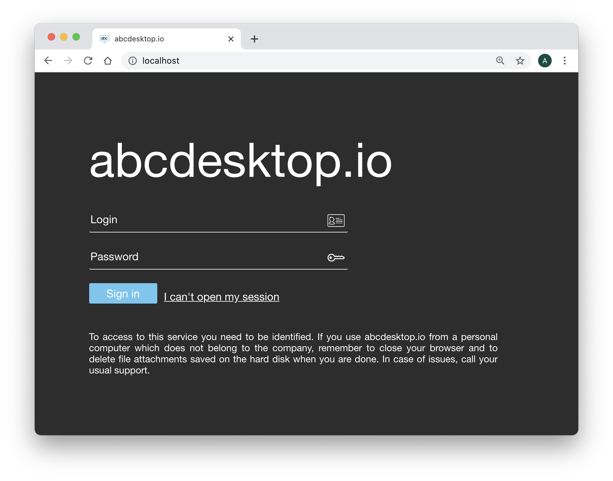

# Authentification `explicit`

## authmanagers `explicit`:


`explicit` authentification use a directory service. The bind operation is used to authenticate clients to the directory server, to establish an authorization identity that will be used for subsequent operations processed on that connection.

The `explicit` authentification configuration is defined as a dictionary object and contains an `explicit` provider. 

The `explicit` provider support the directory services `ldap`, `ldaps`, and `Microsoft Active Directory`, and `SIMPLE`, `NTLM` and `KERBEROS` protocols.


Configuration sample for `Microsoft Active Directory` with `KERBEROS` protocol :


```
'explicit': {
    'providers': {
      'AD': { 
        'config_ref': 'adconfig', 
        'enabled': True
       }
}
```


```
adconfig : { 'AD': {   'default'       : True, 
                       'ldap_timeout'  : 15,
                       'ldap_basedn'   : 'DC=ad,DC=domain,DC=local',
                       'ldap_fqdn'     : '_ldap._tcp.ad.domain.local',
                       'domain'        : 'AD',
                       'auth_type'     : 'KERBEROS'
                       'domain_fqdn'   : 'AD.DOMAIN.LOCAL',
                       'servers'       : [ 'ldap://192.168.7.12' ],
                       'kerberos_realm': 'AD.DOMAIN.LOCAL' } } }
```

### Home page authentification

If the authmanagers `explicit` is enabled. The Web home page insert the new input values `Login` and `Password` to authenticate this user.




### LDAP authmanagers :

Read the specific chapter on LDAP [explicit authmanagers](/config/authexplicit-ldap/)

### Microsoft Active Directory authmanagers :

Microsoft Active Directory is implemented as a LDAP Server, start reading the chapter on LDAP [LDAP and LDAPS explicit authmanagers](/config/authexplicit-ldap/), then read the specific chapter for Microsoft Active Director [Microsoft Active Directory explicit authmanagers](/config/authexplicit-ldap/)

Great, you have check how the explicit Authentification configuration works.

