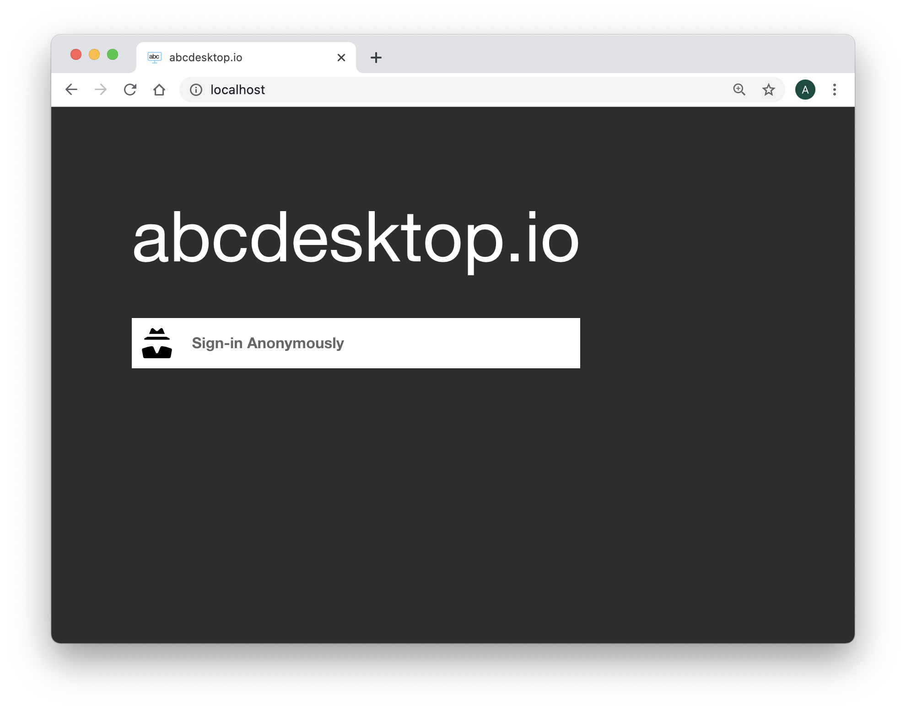
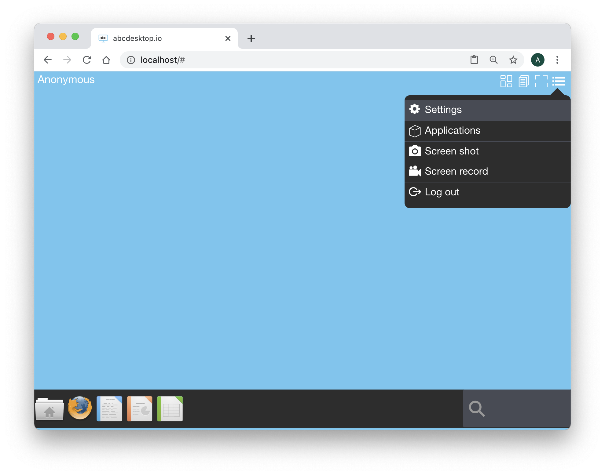
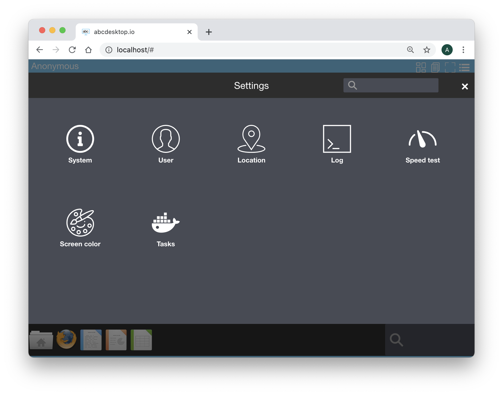
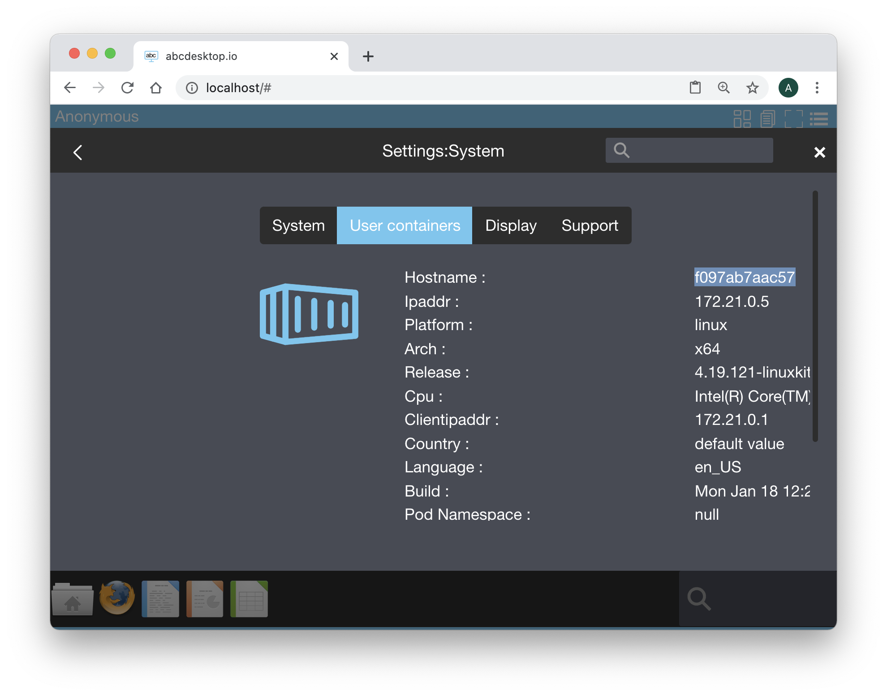

# Authentification `implicit`

## authmanagers `implicit`:

`implicit` is the easiest configuration mode, and is used as 'Anonymous' authentification. 

The provider is defined as a dictionary object and contains an `anonymous` provider.

`anonymous` provider always permits authentification, and create a uuid as userid. `anonymous` provider is used to skip the authentification process in a demonstration mode.

```
'implicit': {
    'providers': {
      'anonymous': {
        'displayname': 'Anonymous',
        'caption': 'Have a look !',
        'userid': 'anonymous',
        'username': 'Anonymous'
      }     
    }
```

`anonymous` provider always permit authentification, and create a uuid as userid. 

Set in your configuration file the `authmanagers` dictionary as described

```
authmanagers: {
  'external': { },
  'explicit': { },
  'implicit': { 
     'providers': {
         'anonymous': {
           'displayname': 'Anonymous',
           'caption': 'Anonymous',
           'userid': 'anonymous',
           'username': 'Anonymous'
      } 
   }
}
```

[Update your configuration file and apply the new configuration file](editconfig.md)

Open a new Web Browser and go to your abcdesktop URL. You should see the login HTML page with the Anonymous button :



Select the `Sign-In Anonymously` button.

Then, choose the `settings` in the menu at the upper right corner 



Choose the `System` in the settings control panel.

 

Then choose `User containers`



This screen show you the `hostname`. 

You can read the hostname. In the example the hostname is `f097ab7aac57`, from the container id.

Using a shell, run the command 

```
kubectl get pods -n abcdesktop 
```

Find a running container with the containerid previously  identified.

In this example the containerid is `f097ab7aac57 `

```
f097ab7aac57   abcdesktopio/oc.user.18.04   "/composer/docker-en…"   8 minutes ago    Up 8 minutes               4714/tcp, 6081/tcp, 29780-29781/tcp, 29783-29784/tcp, 29786/tcp, 55556-55557/tcp   g-06b686a5-c98d-4889-b73d-3455f692e6c2
```


Run the command ```docker inspect CONTAINERID```, replace the string CONTAINERID with your container id value.

> For example ```docker inspect f097ab7aac57 ```

```
docker inspect f097ab7aac57
```

Locate the `Mounts` description. User's containers created with an implicit provider anonymous have only one volume type. Anonymous home directory DO NOT USE persistant volume data.
Explicit and 

```
 "Mounts": [
            {
                "Type": "volume",
                "Name": "tmp-06b686a5-c98d-4889-b73d-3455f692e6c2",
                "Source": "/var/lib/docker/volumes/tmp-06b686a5-c98d-4889-b73d-3455f692e6c2/_data",
                "Destination": "/tmp",
                "Driver": "local",
                "Mode": "z",
                "RW": true,
                "Propagation": ""
            },
            {
                "Type": "volume",
                "Name": "home-06b686a5-c98d-4889-b73d-3455f692e6c2",
                "Source": "/var/lib/docker/volumes/home-06b686a5-c98d-4889-b73d-3455f692e6c2/_data",
                "Destination": "/home/balloon",
                "Driver": "local",
                "Mode": "z",
                "RW": true,
                "Propagation": ""
            }
        ],

```

When an anonymous user close his session, **the anonymous home directory is deleted**.

Great, you have check how the implicit Authentification configuration works.

