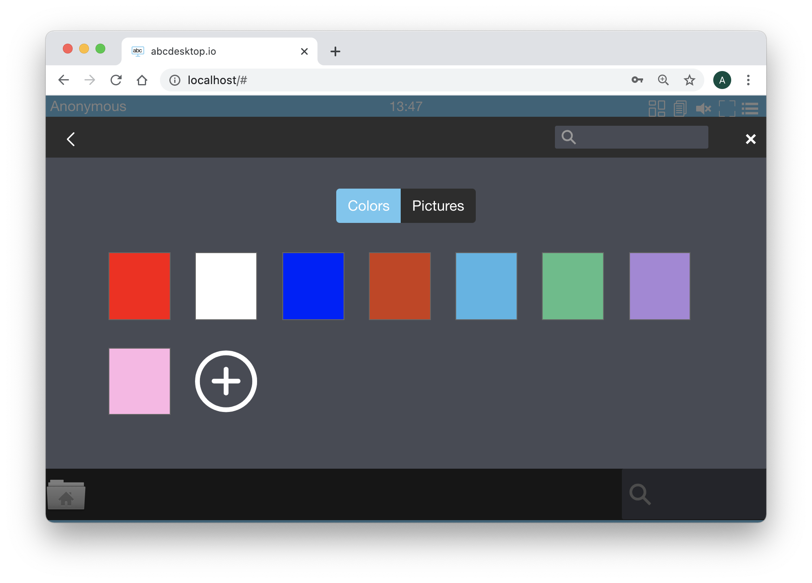

# How to edit `pyos` core service configuration file 


### Edit your configuration file 


Download the default od.config file and save it to your abcdesktop local directory.

To make change, edit your own `od.config` file

```
vim od.config 
```

Change the defaultbackgroundcolors option in the desktop options.

Locate the line ```desktop.defaultbackgroundcolors``` and update the first entries with the values ``` '#FF0000', '#FFFFFF',  '#0000FF' ```

```
desktop.defaultbackgroundcolors : [ '#FF0000', '#FFFFFF',  '#0000FF', '#CD3C14', '#4BB4E6', '#50BE87', '#A885D8', '#FFB4E6' ]
```

Save your local `od.config` file.

To apply changes, you can replace the `abcdesktop-config`

```
kubectl delete configmap abcdesktop-config -n abcdesktop
kubectl create --from-file=od.config -n abcdesktop
```


| you can also use the replace command `kubectl create configmap -n abcdesktop abcdesktop-config --from-file=od.config  -o yaml --dry-run | kubectl replace -n abcdesktop -f - `


Restart pyos daemonset

```
kubectl rollout restart daemonset daemonset-pyos -n abcdesktop
```

### Check that the new colours are presents in front :

Open the url `http://localhost:30443`, in your web browser, to start a simple abcdesktop.io container. 

```
http://localhost:30443
```

You should see the abcdesktop.io home page.

Press the `Sign-in Anonymously, have look`

At the right top corner, click on the menu and choose `Settings`, then click on `Screen Colors`

Choose your colour and you should have it as background colour :



Great, you can easily update your configuration file `od.config`. 

