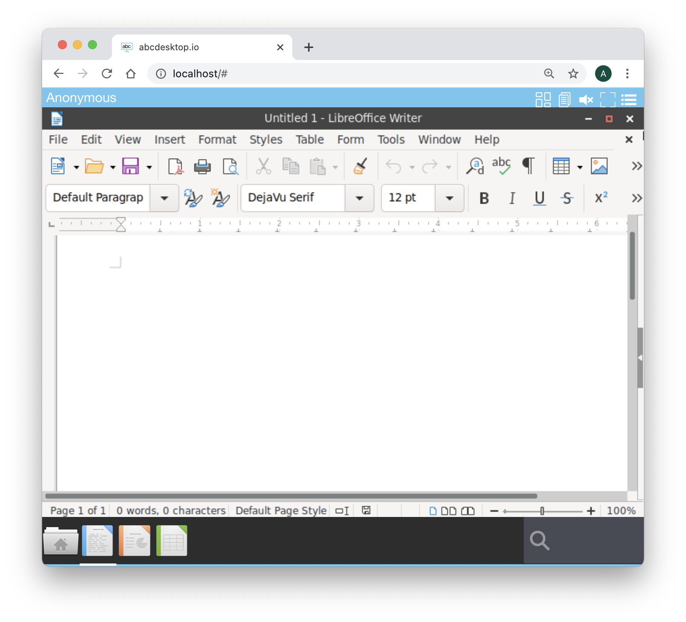
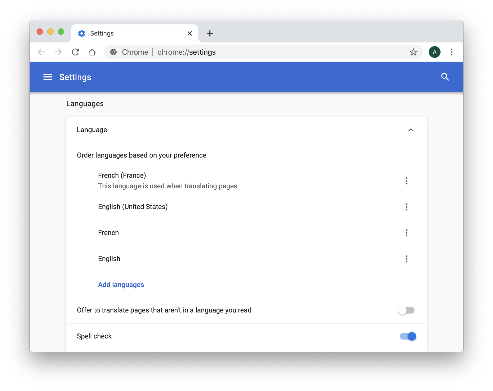
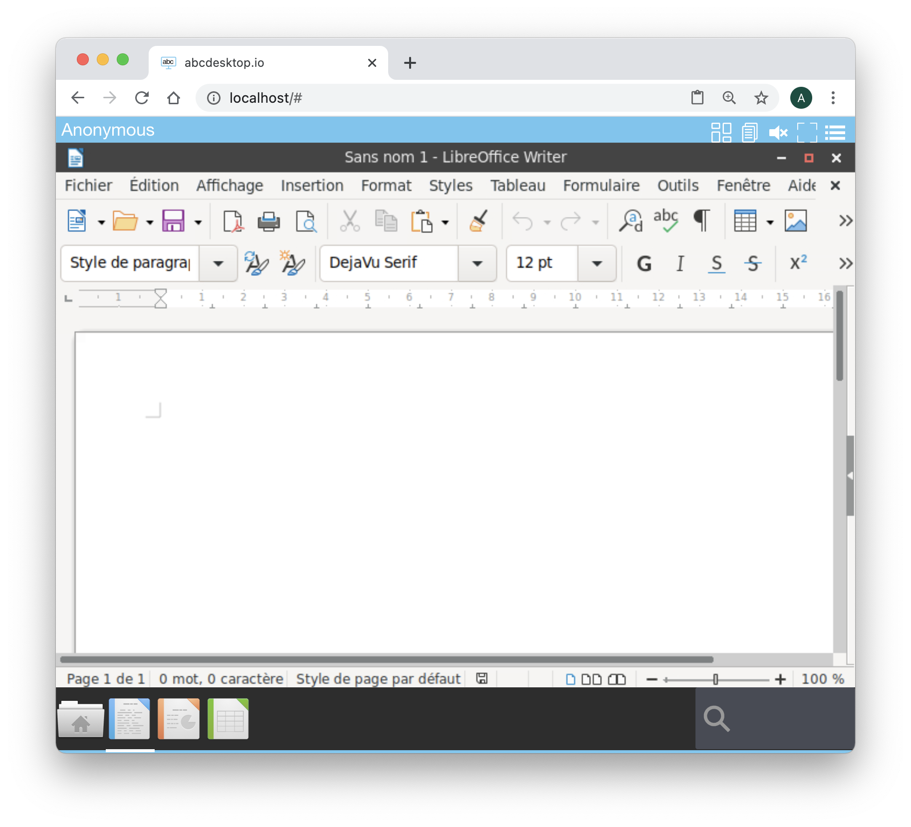

# Language entry in od.config

The language option is a list of string. Each string is formatted as a locale variable.
The locale is simply the language/country combination ```en + US = en_US```

## Language in abcdesktop.io oc.user

The language list must match with the oc.user local packages all ready installed.

If the language is not found, the default value is set to ```en_US```

The oc.user.18.04 is built-in with the default language package :

*  ```language-pack-en``` 
*  ```language-pack-fr```
  
  
```dockerfile
apt-get install -y \
	language-pack-en \
	language-pack-fr \
	&& locale-gen	 \
    && apt-get clean
```

The full supported language list is set by default 

```json
language : [  'af_ZA', 'am_ET', 'an_ES', 'ar_AE', 'ar_BH', 'ar_DZ', 'ar_EG', 'ar_IN', 'ar_IQ', 'ar_JO', 'ar_KW','ar_LB', 'ar_LY', 'ar_MA', 'ar_OM', 'ar_QA', 'ar_SA', 'ar_SD', 'ar_SY', 'ar_TN', 'ar_YE', 'as_IN', 'ast_ES', 'az_AZ', 'be_BY', 'bg_BG', 'bn_BD', 'bn_IN', 'bo_CN', 'bo_IN', 'br_FR', 'bs_BA', 'ca_AD', 'ca_ES', 'ca_FR', 'ca_IT', 'crh_UA', 'cs_CZ', 'cy_GB', 'da_DK', 'de_AT', 'de_BE', 'de_CH', 'de_DE', 'de_LI', 'de_LU', 'dz_BT', 'el_CY', 'el_GR', 'en_AG', 'en_AU', 'en_BW', 'en_CA', 'en_DK', 'en_GB', 'en_HK', 'en_IE', 'en_IN', 'en_NG', 'en_NZ', 'en_PH', 'en_SG', 'en_US', 'en_ZA', 'en_ZM', 'en_ZW', 'eo', 'eo_US', 'es_AR', 'es_BO', 'es_CL', 'es_CO', 'es_CR', 'es_CU', 'es_DO', 'es_EC', 'es_ES', 'es_GT', 'es_HN', 'es_MX', 'es_NI', 'es_PA', 'es_PE', 'es_PR', 'es_PY', 'es_SV', 'es_US', 'es_UY', 'es_VE', 'et_EE', 'eu_ES', 'eu_FR', 'fa_IR', 'fi_FI', 'fr_BE', 'fr_CA', 'fr_CH', 'fr_FR', 'fr_LU', 'ga_IE', 'gd_GB', 'gl_ES', 'gu_IN', 'he_IL', 'hi_IN', 'hr_HR', 'hu_HU', 'id_ID', 'is_IS', 'it_CH', 'it_IT', 'ja_JP', 'ka_GE', 'kk_KZ', 'km_KH', 'kn_IN', 'ko_KR', 'ku_TR', 'lt_LT', 'lv_LV', 'mai_IN', 'mk_MK', 'ml_IN', 'mn_MN', 'mr_IN', 'ms_MY', 'my_MM', 'nb_NO', 'nds_DE', 'nds_NL', 'ne_NP', 'nl_AW', 'nl_BE', 'nl_NL', 'nn_NO', 'oc_FR', 'or_IN', 'pa_IN', 'pa_PK', 'pl_PL', 'pt_BR', 'pt_PT', 'ro_RO', 'ru_RU', 'ru_UA', 'si_LK', 'sk_SK', 'sl_SI', 'sq_AL', 'sq_MK', 'sr_ME', 'sr_RS', 'sv_FI', 'sv_SE', 'ta_IN', 'ta_LK', 'te_IN', 'tg_TJ', 'th_TH', 'tr_CY', 'tr_TR', 'ug_CN', 'uk_UA', 'uz_UZ', 'vi_VN', 'xh_ZA', 'zh_CN', 'zh_HK', 'zh_SG', 'zh_TW' ]
```

This list must match with the ```Accept-Language``` request HTTP header.

## Language in abcdesktop.io Applications


abcdesktop.io use the web browser language property to set the application's language. This list must match with the ```Accept-Language``` request HTTP header. If the language is not found, the default value is set to ```en_US```.


> Hands-on: 
> 
> Change your web browser language, and run LibreOffice applications. The language setting use the web browser value. During this exercice you can keep the same abcdesktop.io users session.
> 

### Set the web browser's default language to ```en_US``` :


The launch LibreOffice Writer. The menu is set to ```en_US```

LibreOffice Writer use English/US ```en_US``` language.

### Set the web browser's default language to ```fr_FR``` :



> You can keep the same abcdesktop.io users session, you do not need to logout.

The launch LibreOffice Writer. The menu is set to ```fr_FR```

LibreOffice Writer use French ```fr_FR```language.

Great you have change the language settings of applications running inside an abcdesktop docker container
  
