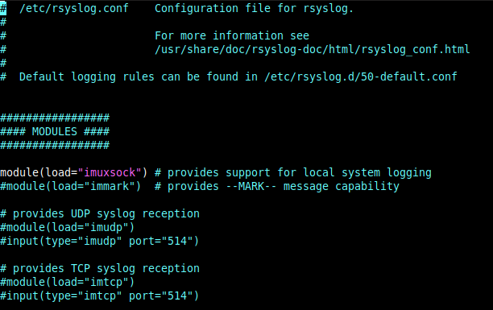
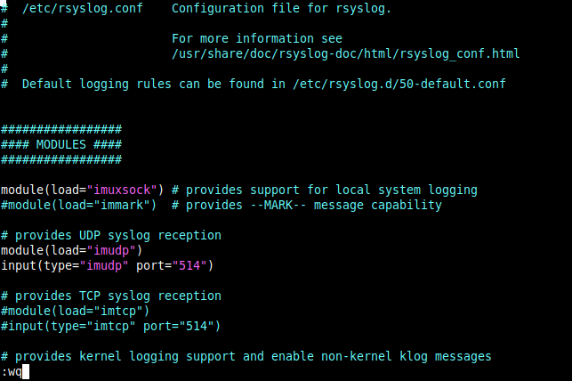
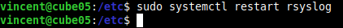

### Modify /etc/rsyslog.conf

By default syslog program is configured to log messages received over unix socket files.
rsyslog configuration file need to be modified to accept messages over UDP.

Edit /etc/rsyslog.conf file with your prefered linux text editor as sudo ou root:
```
sudo vi /etc/rsyslog.conf
```
 

Uncomment the following lines and save file :
```
module(load="imudp")
input(type="imudp" port="514")
```

 

#### Restart rsyslog
Now we have enabled rsyslog over UDP on 514 port in config file, we have to restart rsyslog to take new parameters into account.  
Execute the following command as sudo:
```
sudo systemctl restart rsyslog
```
 

