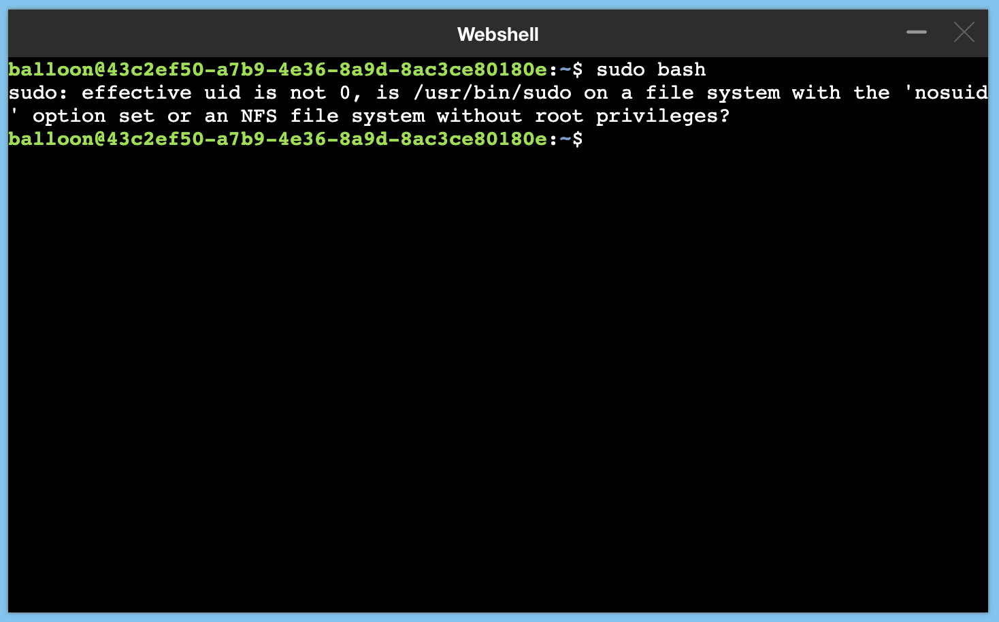

## How to get a root access inside a container running kubernetes abcdesktop ?


> run the sudo command inside the user kubernetes pods





```
balloon@43c2ef50-a7b9-4e36-8a9d-8ac3ce80180e:~$ sudo bash
sudo: effective uid is not 0, is /usr/bin/sudo on a file system with the 'nosuid' option set or an NFS file system without root privileges?
```

1. Download the default [abcdesktop.yaml](https://raw.githubusercontent.com/abcdesktopio/conf/main/kubernetes/abcdesktop.yaml)
2. Update the od.config file inside the ```configmap/abcdesktop-config```
3. Allow in the od.config section, update the option desktop.allowPrivilegeEscalation value to True 

```
    # desktop.allowPrivilegeEscalation
    # value True or False
    # This value is only avalaible in kubernetes mode,
    # The desktop.allowPrivilegeEscalation allow a user to run a sudo command.
    # This option set the runtime privilege and Linux capabilities
    # The execve system call can grant a newly-started program privileges that its parent did not have,
    # such as the setuid or setgid Linux flags.
    # The default value is False
    # You should only set desktop.allowPrivilegeEscalation to run sudo command.
    # In production this value MUST be set to False
    
    desktop.allowPrivilegeEscalation: True 
 
```

4. Update the kubernetes config with the new abcdesktop.yaml  

```
% kubectl apply -f abcdesktop.yaml
  configmap/abcdesktop-config configured
```

5. Restart the pyos pod 

List all pods 

```
% kubectl get pods -n abcdesktop
NAME                                   READY   STATUS    RESTARTS   AGE
43c2ef50-a7b9-4e36-8a9d-8ac3ce80180e   3/3     Running   0          17m
daemonset-nginx-bbbvj                  1/1     Running   0          37m
daemonset-pyos-ckqx6                   1/1     Running   0          39h
memcached-od-5bf65bf745-l62jr          1/1     Running   0          39h
mongodb-od-656d85c49f-jx2zj            1/1     Running   0          39h
openldap-od-5945946767-82qh4           1/1     Running   0          39h
speedtest-od-58b9847b4b-gllrt          1/1     Running   0          39h
```

Delete the pyos pod

```
% kubectl delete pods daemonset-pyos-ckqx6  -n abcdesktop
pod "daemonset-pyos-ckqx6" deleted
```

Kubenestes restart the new pyos pod

```
kubectl get pods -n abcdesktop                         
NAME                                   READY   STATUS    RESTARTS   AGE
43c2ef50-a7b9-4e36-8a9d-8ac3ce80180e   3/3     Running   0          18m
daemonset-nginx-bbbvj                  1/1     Running   0          38m
daemonset-pyos-fhbx5                   1/1     Running   0          3s
memcached-od-5bf65bf745-l62jr          1/1     Running   0          39h
mongodb-od-656d85c49f-jx2zj            1/1     Running   0          39h
openldap-od-5945946767-82qh4           1/1     Running   0          39h
speedtest-od-58b9847b4b-gllrt          1/1     Running   0          39h
```


6. Make sure that your user has done a logoff his pod, then login again and run terminal web shell 

The default balloon password is ```lmdpocpetit```

```
balloon@c182dc39-6a00-4869-8b01-2039f37c1eab:~$ sudo bash
[sudo] password for balloon: 
root@c182dc39-6a00-4869-8b01-2039f37c1eab:~# id
uid=0(root) gid=0(root) groups=0(root),105(lpadmin)
root@c182dc39-6a00-4869-8b01-2039f37c1eab:~#  
```

After the sudo command, you get a root level inside the shell of the users's pod


> In production this value should be set to False
