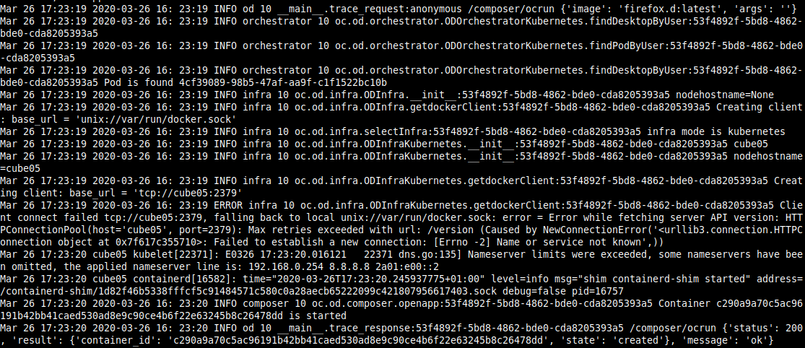

# Syslog configuration in od.config


## Add syslog server support
       'filters': [ 'odcontext' ],

syslog is a protocol for tracking and logging system messages in Linux. Applications use syslog to export all their error and status messages to the files in the /var/log directory.

syslog uses the client-server model; a client transmits a text message to the server (receiver). The server is commonly called syslogd, syslog daemon, or syslog server. syslog uses the User Datagram Protocol (UDP) port 514 for communication. 

### Start syslog container

Those running linux can simply modify their syslog configuration file following [linux syslog config](../linux_syslog_config) steps

For others (Windows/Mac) or those that don't want to modify their syslog config, you can simply run the following command :

```
docker run -it -p 514:514/udp --name syslog-ng balabit/syslog-ng:latest -edv
```

```
[2020-04-07T12:29:39.485318] Accepting connections; addr='AF_INET(0.0.0.0:514)'
[2020-04-07T12:29:39.485752] You have a TLS enabled source without a X.509 keypair. Make sure you have tls(key-file() and cert-file()) options, TLS handshake to this source will fail; location='/etc/syslog-ng/syslog-ng.conf:21:2'
[2020-04-07T12:29:39.485964] Accepting connections; addr='AF_INET(0.0.0.0:6514)'
[2020-04-07T12:29:39.486179] Accepting connections; addr='AF_INET(0.0.0.0:601)'
[2020-04-07T12:29:39.486600] Running application hooks; hook='1'
[2020-04-07T12:29:39.486621] Running application hooks; hook='6'
[2020-04-07T12:29:39.486674] syslog-ng starting up; version='3.26.1'
[2020-04-07T12:29:39.486850] Running application hooks; hook='2'
[2020-04-07T12:39:39.587220] Log statistics; processed='global(payload_reallocs)=0', processed='global(sdata_updates)=0', queued='global(scratch_buffers_bytes)=0', processed='src.internal(s_local#0)=0', stamp='src.internal(s_local#0)=0', processed='destination(d_local)=0', processed='source(s_local)=0', processed='source(s_network)=0', processed='global(msg_clones)=0', processed='center(received)=0', queued='global(scratch_buffers_count)=0', processed='center(queued)=0'
```

#### Modify logging entry

To let abcdesktop log events in syslog trought UDP, we will have to modify abcdesktop configuration file to add  an handler and 'syslog' entry in general logger and cherrypy.error logger. (syslog formatter is already in sample file)

##### Add Syslog Handler

In handlers entry add the following lines:

```
        ,
        'syslog': {
          'class': 'logging.handlers.SysLogHandler',
          'filters': [ 'odcontext' ],
          'formatter': 'syslog',
          'socktype': 2,
          'address' : [ '192.168.0.52', 514 ]
        }
```
Replace 192.168.0.52 ip address by your local IP Addresse.

You can get your local IP address using the following command:

```
hostname -I | cut -d ' ' -f1
```

##### Add loggers handlers entries

In general loggers (key '' in loggers entry) and 'cherrypy.error' add ```syslog'``` handler in handlers list:

```
        '': {
          'handlers': [ 'console', 'cherrypy_trace', 'syslog' ],
          'level': 'INFO'
        }
        
       'cherrypy.error': {
          'handlers': [ 'console', 'cherrypy_trace', 'syslog' ],
          'level': 'ERROR',
          'propagate': False
        }
```

#### Resulting Modified sample configuration file

```
#              
# logging configuration 
# come from https://docs.python.org/3.8/library/logging.config.html
# need double %% to escape %
# 
# graylog https://github.com/severb/graypy
# use handler class name as
# graypy.GELFUDPHandler - UDP log forwarding
# graypy.GELFTCPHandler - TCP log forwarding
# graypy.GELFTLSHandler - TCP log forwarding with TLS support
# graypy.GELFHTTPHandler - HTTP log forwarding
# graypy.GELFRabbitHandler - RabbitMQ log forwarding

logging: {
  'version': 1,
  'disable_existing_loggers': False,
  'formatters': {
    'access': {
      'format': '%%(message)s - user: %%(userid)s',
      'datefmt': '%%Y-%%m-%%d %%H:%%M:%%S'
    },
    'standard': {
      'format': '%%(asctime)s %%(module)s [%%(levelname)-7s] %%(name)s.%%(funcName)s:%%(userid)s %%(message)s',
      'datefmt': '%%Y-%%m-%%d %%H:%%M:%%S'
    },
    'syslog': {
      'format': '%%(asctime)s %%(levelname)s %%(module)s %%(process)d %%(name)s.%%(funcName)s:%%(userid)s %%(message)s',
      'datefmt': '%%Y-%%m-%%d %%H:%%M:%%S'
    },
    'graylog': {
      'format': '%%(levelname)s %%(module)s %%(process)d %%(name)s.%%(funcName)s:%%(userid)s %%(message)s'      
    }
  },
  'filters': {
    'odcontext': {
      '()': 'oc.logging.OdContextFilter'
    }
  },
  'handlers': {
    'console': {
      'class': 'logging.StreamHandler',
      'filters': [ 'odcontext' ],
      'formatter': 'standard',
      'stream': 'ext://sys.stdout'
    },
    'cherrypy_console': {
      'class': 'logging.StreamHandler',
      'filters': [ 'odcontext' ],
      'formatter': 'access',
      'stream': 'ext://sys.stdout'
    },
    'cherrypy_access': {
      'class': 'logging.handlers.RotatingFileHandler',
      'filters': [ 'odcontext' ],
      'formatter': 'access',
      'filename': 'logs/access.log',
      'maxBytes': 10485760,
      'backupCount': 20,
      'encoding': 'utf8'
    },
    'cherrypy_trace': {
      'class': 'logging.handlers.RotatingFileHandler',
      'filters': [ 'odcontext' ],
      'formatter': 'standard',
      'filename': 'logs/trace.log',
      'maxBytes': 10485760,
      'backupCount': 20,
      'encoding': 'utf8',
      'mode': 'w'
    },
    'syslog': {
       'class': 'logging.handlers.SysLogHandler',
       'filters': [ 'odcontext' ],
       'formatter': 'syslog',
       'socktype': 2,
       'address' : [ '192.168.0.52', 514 ]
    }
  },
  'loggers': {
    '': {
      'handlers': [ 'console', 'cherrypy_trace', 'syslog'  ],
      'level': 'DEBUG'
    },
    'docker.utils.config': {
      'level': 'INFO'
    },
    'urllib3.connectionpool': {
      'level': 'ERROR'
    },
    'cherrypy.access': {
      'handlers': [ 'cherrypy_access' ],
      'level': 'INFO',
      'propagate': False
    },
    'cherrypy.error': {
      'handlers': [ 'console', 'cherrypy_trace', 'syslog' ],
      'level': 'ERROR',
      'propagate': False
    }
  } }
```
#### Restart Pods

To restart Pods, we will delete and recreate all pods

##### Delete pods

To delete pods, execute the following command:

```
kubectl delete -f abcdesktop.yaml
```


##### Create pods

To create pods, execute the following command:

```
kubectl create -f abcdesktop.yaml
```


#### Verify syslogs

At this state, new abcdesktop logging configuration should be applied. We can now verify syslog logs:

```
tail /var/log/syslog
```

 

If you see some lines with 'INFO' Level, you probably see abcdesktop logs in syslog !  
If not try to do actions in abcdesktop (open session, launch new application, close session) and apply the tail command again.


