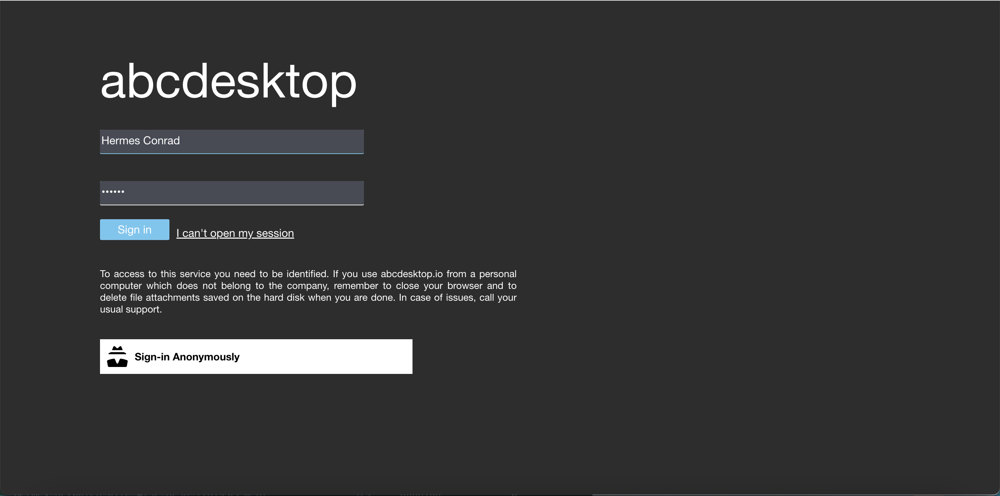
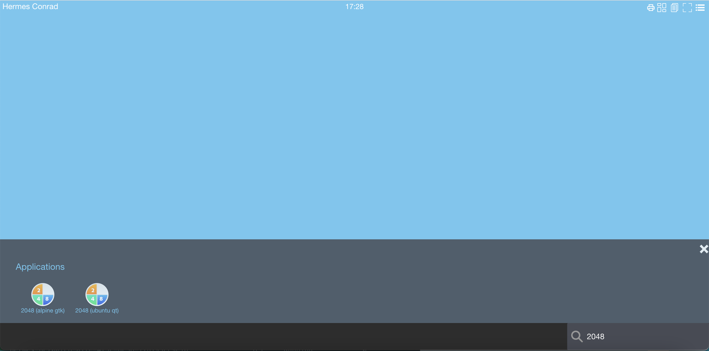
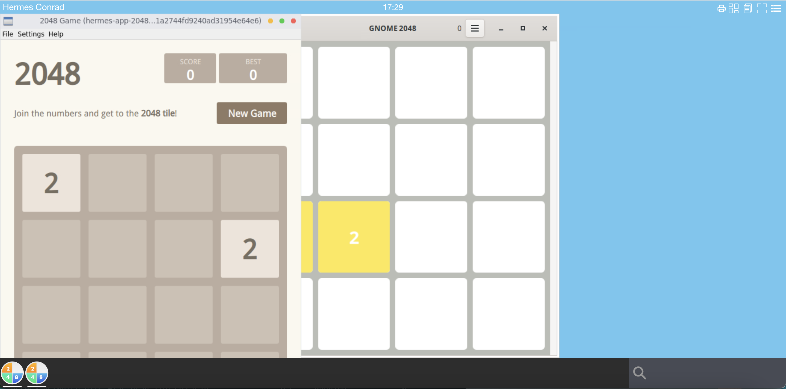
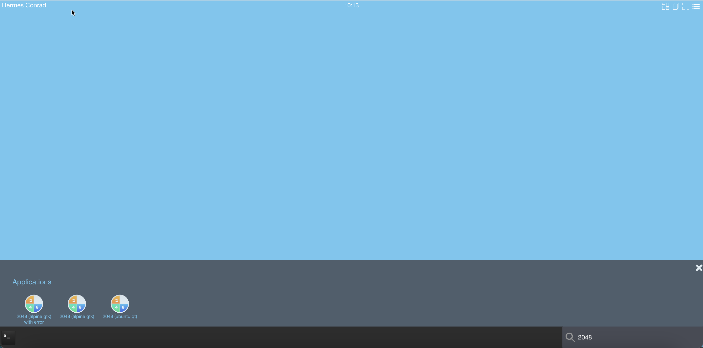
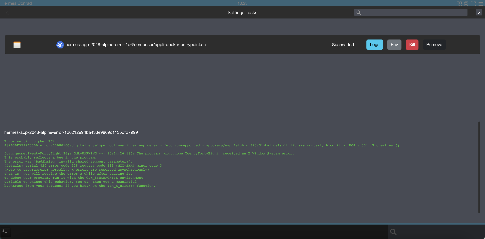
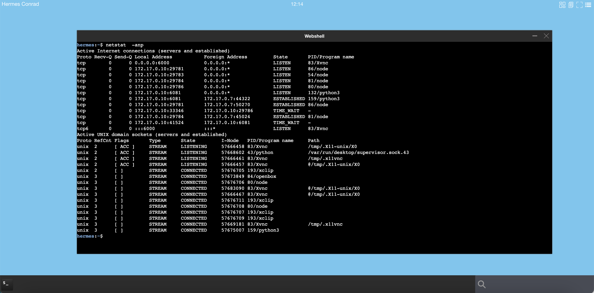
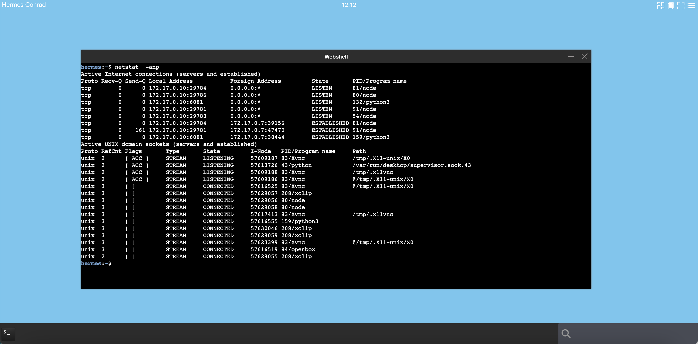

# application runtime `Ephemeral container` and `Pod`

An abcdesktop application can run as a kubernetes `ephemeral container` or as a `pod`.

An `ephemeral container` can access to share memory `shm` with the X11 server. An ephemeral container run always on the same node as the user pod, where the graphical container 'X11 server' is running. An `ephemeral container` does not prevent cpu and memory resource limits.

A `pod` can't access to share memory with the X11 server. An kubernetes pod can run on separated node from the user's pod node. For a `pod`, you can specify resource limits.


To describe the difference between `ephemeral-container` and `pod-application`, we use the game 2048, one instance come from alpine based on `gtk`, the second one come from ubuntu based on `qt`

- `2048-alpine` is a **GTK application**, and is defined to run as `ephemeral-container`
- `2048-ubuntu` is a **QT application**, and is defined to run as a kubernetes pod


## Requirements

* `jq` command preinstalled.

## Start a shell to your abcdesktop server

Get a shell to your abcdestkop server.


## Download `2048-alpine` and `2048-ubuntu` json files

Open a shell to your abcdesktop server

```sh
curl --output 2048-alpine.d.3.0.json https://raw.githubusercontent.com/abcdesktopio/oc.apps/main/2048-alpine.d.3.0.json
curl --output 2048-ubuntu.d.3.0.json https://raw.githubusercontent.com/abcdesktopio/oc.apps/main/2048-ubuntu.d.3.0.json
```

Check that the json files are downloaded

```sh
$ ls -la *.json
-rw-r--r-- 1 root root 29183 Dec 28 16:24 2048-alpine.d.3.0.json
-rw-r--r-- 1 root root 29099 Dec 28 16:24 2048-ubuntu.d.3.0.json
```

Look at the label oc.containerengine for each json file 


### Read the label oc.containerengine for 2048-alpine

```sh
cat 2048-alpine.d.3.0.json | jq -r '.[0].Config.Labels."oc.containerengine"'
```

The response is `ephemeral_container`

```
ephemeral_container
```

This application 2048-alpine will start as an `ephemeral_container`


### Read the label oc.containerengine for 2048-alpine

```sh
cat 2048-ubuntu.d.3.0.json | jq -r '.[0].Config.Labels."oc.containerengine"'
```

The response is `pod_application `

```
pod_application
```

This application 2048-ubuntu will start as a `pod_application`, it's a pod.


## PUT `2048-alpine` and `2048-ubuntu` applications to your abcdesktop service

```sh
curl -X PUT -H 'Content-Type: text/javascript' http://localhost:30443/API/manager/image -d @2048-alpine.d.3.0.json
curl -X PUT -H 'Content-Type: text/javascript' http://localhost:30443/API/manager/image -d @2048-ubuntu.d.3.0.json
```

Each curl command returns a complete json document.

Wait for the pull pod are `Ready`

```sh
kubectl wait --for=condition=Ready pods --selector=type=pod_application --timeout=-1s -n abcdesktop
```

Wait for condition met

```
pod/pull-2048-alpine-install-4280c633e777dceb3f529f208b442c0dff891 condition met
pod/pull-2048-ubuntu-install-ee652f4ff381655768bcc09d54a9b62ab7684 condition met
```

## Login to your abcdesktop service 

Using a web browser, open the abcdesktop service url. If your are running abcdesktop on your local device, the url should be : 

```
http://localhost:30443
```

### Choose to login as hermes 

Login in as the user `Hermes Conrad` 

- Login: `Hermes Conrad`
- Password: `hermes`




### Your desktop is created

Your desktop is created. By default your dock is empty.


### Look for 2048

In the search text area, write the keyword `2048`



The two applications appear in the search result applications area. 


### Start each 2048 application

Start `2048-ubuntu` and `2048-alpine` application



`2048-ubuntu` and `2048-alpine` applications start. The application `2048-alpine` can start quickly than the application `2048-ubuntu`. 

-  `2048-alpine` is an ephemeral container attached to the graphical container.
-  `2048-ubuntu` is a complete kubernetes pod.


## Let's have a look on your server side

### Get pod application

Get the running pod using `kubectl get pods -n abcdesktop`

```sh
kubectl get pods -n abcdesktop
NAME                            READY   STATUS    RESTARTS   AGE
hermes-app-2048-ubuntu-4dd6f    1/1     Running   0          8s
hermes-db906                    4/4     Running   0          100s
memcached-od-57c57c4f9d-92fs2   1/1     Running   0          38m
mongodb-od-f69ff6b5b-v6ztc      1/1     Running   0          38m
nginx-od-58f86c4dc8-8n9lf       1/1     Running   0          25m
openldap-od-d66d66bf4-84lg8     1/1     Running   0          38m
pyos-od-5586b88767-gsdl8        1/1     Running   0          14m
speedtest-od-6c59bdff75-n6s66   1/1     Running   0          38m
```

The application `2048-ubuntu` is listed as a pod. The application `2048-ubuntu` is a pod. The prefix is the `$userid-app` for example `hermes-app-2048-ubuntu-4dd6f`, followed by the application name `2048-ubuntu` and a uuid.


The application `2048-alpine` is not a pod.

The application `2048-alpine` is listed as an ephemeral container, inside the user pod `hermes-db906`

```bash
kubectl get pods hermes-db906  -o json -n abcdesktop | jq -r ".status.ephemeralContainerStatuses"
```

The application 2048-alpine.d is listed in the .status.ephemeralContainerStatuses 

```json
[
  {
    "containerID": "containerd://eb5c1c4c19e5581dfd6a7290f46b63ce073b318bc1f9980bd3e37153cb66e44b",
    "image": "docker.io/abcdesktopio/2048-alpine.d:3.0",
    "imageID": "docker.io/abcdesktopio/2048-alpine.d@sha256:2c3c46c22689b8f91cbd5ebd4d5f80c95bc5ba9b1e23f13aebb54121d2f6d590",
    "lastState": {},
    "name": "hermes-conrad-2048-alpine-1eef4",
    "ready": false,
    "restartCount": 0,
    "state": {
      "terminated": {
        "containerID": "containerd://eb5c1c4c19e5581dfd6a7290f46b63ce073b318bc1f9980bd3e37153cb66e44b",
        "exitCode": 0,
        "finishedAt": "2023-05-17T14:38:13Z",
        "reason": "Completed",
        "startedAt": "2023-05-17T14:37:00Z"
      }
    }
  }
]
```


## Ephemeral container versus Pod application

An `ephemeral container` can access to share memory `shm` with the X11 server. An ephemeral container run always on the same node as the X11 server. 

A `pod` can't access to share memory with the X11 server. An Kubernetes pod can run on a separated node from the X11 server.

If your application need to share memory with X11 server, when you have to set the `oc.containerengine` label to `ephemeral_container`. 


 

## Compare kubernetes ephemeral container and pod

### Kubernetes ephemeral container

Use an ephemeral container to start an application have some advantages and some disadvantages.

#### advantages

- Start quickly
- Less system resources than a pod
- Share Process Namespace is allowed `shareProcessNamespace: true`
- Share memory shm is allowed
- Share the network stack (IP Address) of the user pod

#### disadvantages

- resources is disallowed
- no `limits` and `requests` (cpu, memory)
- `nodeSelector` not supported

### Kubernetes Pod

Use a kubernetes pod to start an application have some advantages and some disadvantages.


#### advantages

- resources (cpu, memory) is allowed
- `limits` and `requests` are supported
- ports, livenessProbe, readinessProbe are allowed
- `nodeSelector` support an application can run on a dedicated node (for example with GPU)
- can use a dedicated network to route application data

#### disadvantages

- More system resources than an ephemeral container
- Need X11 tcp port enabled on the user pod `'X11LISTEN': 'tcp'`
- Increase network resource if application pod and user pod run a distinct host 


## Troubleshooting


### Troubleshooting `BadShmSeg` error

If you configure  2048-alpine with gtk to start as a pod and not as an ephemeral container, you will get the BadShmSeg error

#### Install the application 2048-alpine-with-error

```sh
curl --output 2048-alpine.d.3.0.json https://raw.githubusercontent.com/abcdesktopio/oc.apps/main/2048-alpine-with-error.d.3.0.json
2048-alpine-with-error.d.3.0.json
```


#### PUT `2048-alpine-with-error` applications to your abcdesktop service

```sh
curl -X PUT -H 'Content-Type: text/javascript' http://localhost:30443/API/manager/image -d @2048-alpine-with-error.d.3.0.json
```

Wait for the pulled pod are `Ready`

```sh
kubectl wait --for=condition=Ready pods --selector=type=pod_application_pull --timeout=-1s -n abcdesktop
```

Wait for condition met

```
pod/pull-2048-alpine-with-error-install-935509a58088531ae57756 condition met
```

Login to your abcdesktop service 

Using a web browser, open the abcdesktop service url. If your are running abcdesktop on your local device, the url should be : 

```
http://localhost:30443
```

#### Choose to login as hermes 

Login in as the user `Hermes Conrad` 

- Login: `Hermes Conrad`
- Password: `hermes`


#### Your desktop is created

Your desktop is created. By default your dock is empty.


### Look for 2048

In the search text area, write the keyword `2048`



The three applications appear in the search result applications area. 


Start the 2048 (alpine gtk with error) application.
It uses shared segment with X Window System, it must run as an ephemeral container, but as a pod it fails. The application starts but exit after few seconds, the content of the application does not appear.


In the abcdesktop menu, choose `Settings` | `Tasks`. 





Then select the `Logs` button. The error was 'BadShmSeg (invalid shared segment parameter)'.

```
(org.gnome.TwentyFortyEight:36): Gdk-WARNING **: 10:14:26.185: The program 'org.gnome.TwentyFortyEight' received an X Window System error.
This probably reflects a bug in the program.
The error was 'BadShmSeg (invalid shared segment parameter)'.
(Details: serial 820 error_code 128 request_code 131 (MIT-SHM) minor_code 3)
(Note to programmers: normally, X errors are reported asynchronously;
that is, you will receive the error a while after causing it.
To debug your program, run it with the GDK_SYNCHRONIZE environment
variable to change this behavior. You can then get a meaningful
backtrace from your debugger if you break on the gdk_x_error() function.)
```


If you are running QT application, you can disable the [X11 MIT Shared Memory Extension](https://www.x.org/releases/X11R7.7/doc/xextproto/shm.html) support. The MIT-SHM is an extension to the X server which allows faster transactions by using shared memory. Container isolation blocks it. Qt applications can be forced not to use the extension, by setting the variable `QT_X11_NO_MITSHM` value to `1`.

```
QT_X11_NO_MITSHM=1 
```


> Note your can also use `QT_XCB_NO_MITSHM` value to `1` 


### Troubleshooting `chromium` application

For `chromium` application disabled `shm-usage` with the parameters
`--disable-dev-shm-usage`

* `disable-dev-shm-usage` get more informations about the [ dev shm usage ](https://rstudio.github.io/chromote/reference/default_chrome_args.html#:~:text=%22%2D%2Ddisable%2Ddev%2Dshm,Chrome%20to%20fail%20or%20crash) and all [chromium parameters](https://peter.sh/experiments/chromium-command-line-switches/)

* `no-sandbox`: get more informations about the [no-sandbox](https://chromium.googlesource.com/chromium/src/+/refs/heads/main/docs/design/sandbox.md) parameters.


### Troubleshooting `cannot open display` or `could not connect to display` error


When you start an application the log file write `cannot open display` error

```
kubectl logs hermes-app-2048-ubuntu-c7360cd025d04813ad5e0af74b6df4ba  -n abcdesktop 
```

```
qt.qpa.xcb: could not connect to display 172.17.0.10:0
qt.qpa.plugin: Could not load the Qt platform plugin "xcb" in "" even though it was found.
This application failed to start because no Qt platform plugin could be initialized. Reinstalling the application may fix this problem.

Available platform plugins are: eglfs, linuxfb, minimal, minimalegl, offscreen, vnc, xcb.
```

Using the web shell inside an abcdesktop session, start `netstat -a` command line

The result should show that the process `Xvnc` is listening on tcp port number `6000`



```
hermes:~$ netstat  -anp
Active Internet connections (servers and established)
Proto Recv-Q Send-Q Local Address           Foreign Address         State       PID/Program name    
tcp        0      0 0.0.0.0:6000            0.0.0.0:*               LISTEN      82/Xvnc               
```


If `Xvnc` is not listening on tcp port number `6000`




Update od.config to make `Xvnc` listen on tcp port number `6000`

Open your od.config file, and look at the `desktop.envlocal` option.

Add `'X11LISTEN': 'tcp'` to the dictionary :

```
desktop.envlocal :  {   'DISPLAY'               : ':0.0',
                        'SET_DEFAULT_WALLPAPER' : 'welcometoabcdesktop.png',
                        'X11LISTEN'             : 'tcp' }
```
Save your local `od.config` file.

To apply changes, you can replace the `abcdesktop-config`

```
kubectl delete configmap abcdesktop-config -n abcdesktop
kubectl create configmap abcdesktop-config --from-file=od.config -n abcdesktop
```

Then restart pyos pod

```
kubectl delete pod -l run=pyos-od -n abcdesktop
```

You should read on stdout

```
pod "pyos-od-5586b88767-mrf28" deleted
```

