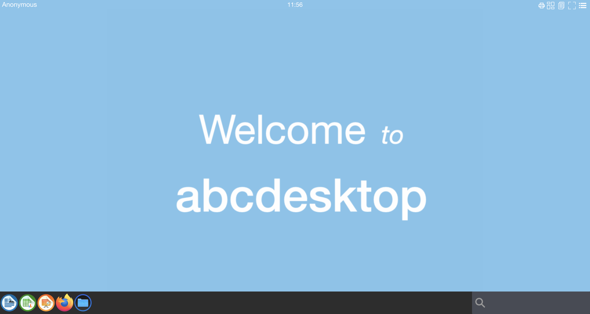
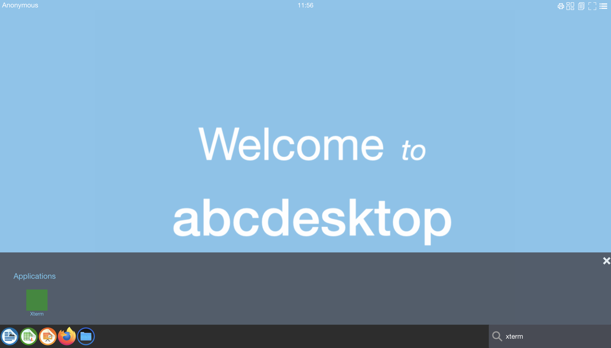
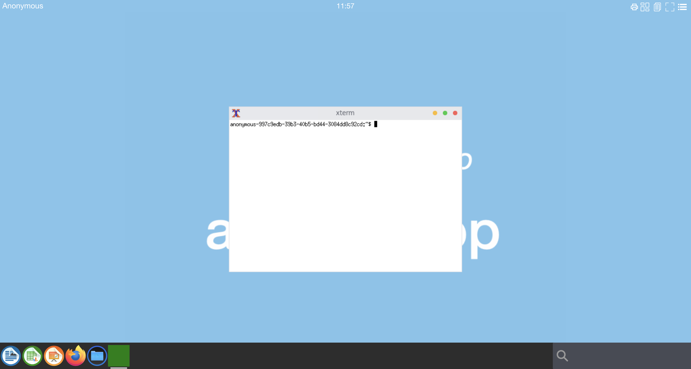

# Create a sample application in release 3.0

## Requirements

* `ctr` command preinstalled .
* `nodejs` and npm command preinstalled.
* `docker` command preinstalled.

## Goals

* Create a sample application `xterm`. [xterm](https://invisible-island.net/xterm/) program is a terminal emulator for the X Window System. 


## Clone application repository

```
git clone https://github.com/abcdesktopio/oc.apps.git
cd oc.apps
```

And install packages

```
npm install
```


## Create a sample.json file

abcdesktop uses a json file description to build an application.

Create a `sample.json` file

```json
{
  "tag": "3.0",
  "acl": { "permit": [ "all" ] },
  "cat": "development",
  "icon": "small.svg",
  "apkpackage": "xterm",
  "keyword": "xterm,shell,cmd",
  "launch": "xterm.XTerm",
  "name": "Xterm",
  "path": "/usr/bin/xterm",
  "rules": { "homedir": { "default": true } },
  "template": "abcdesktopio/oc.template.alpine.minimal"
}
```


## make a `Dockerfile` from the `sample.json` file

`make.js` is a command line for abcdesktop. `make.js` read a json file and create a `Dockerfile`

The `make.js` options are :

- `-r 3.0` : to build image in abcdesktop 3.0 format
- `-d True` : to create a `Dockerfile` as output
- `-f sample.json`: file to read as input

npm i argparse
npm notice created a lockfile as package-lock.json. You should commit this file.
+ argparse@2.0.1
added 1 package and audited 1 package in 0.837s
found 0 vulnerabilities


```
node make.js -r 3.0 -d True  -f sample.json
```

Your read on stdout.

```
Namespace(dockerfile='True', release='3.0', applicationfile='sample.json')
Building image for release=3.0
Read database json file=sample.json
Only one file option to force output to dockerfile=True
opening file sample.json
applist.json entries: 1
{ tag: '3.0',
  acl: { permit: [ 'all' ] },
  cat: 'development',
  icon: 'small.svg',
  apkpackage: 'xterm',
  keyword: 'xterm,shell,cmd',
  launch: 'xterm.XTerm',
  name: 'Xterm',
  path: '/usr/bin/xterm',
  rules: { homedir: { default: true } },
  template: 'abcdesktopio/oc.template.alpine.minimal' }
Building xterm.XTerm
```

Read the `Dockerfile`

```
cat Dockerfile
```

```
# Dynamic DockerFile application file for abcdesktopio generated by abcdesktopio/oc.apps/make.js
# DO NOT EDIT THIS FILE BY HAND -- YOUR CHANGES WILL BE OVERWRITTEN
ARG TAG=3.0
FROM abcdesktopio/oc.template.alpine.minimal:$TAG
USER root
RUN apk add --no-cache --update xterm
ENV BUSER balloon
LABEL oc.icon="small.svg"
LABEL oc.icondata="PHN2ZyB2ZXJzaW9uPSIxLjEiIHdpZHRoPSI2NCIgaGVpZ2h0PSI2NCIgeG1sbnM9Imh0dHA6Ly93d3cudzMub3JnLzIwMDAvc3ZnIj48cmVjdCB3aWR0aD0iMTAwJSIgaGVpZ2h0PSIxMDAlIiBmaWxsPSJncmVlbiIvPjwvc3ZnPgo="
LABEL oc.keyword="xterm,xterm,shell,cmd"
LABEL oc.cat="development"
LABEL oc.launch="xterm.XTerm"
LABEL oc.template="abcdesktopio/oc.template.alpine.minimal"
LABEL oc.name="Xterm"
LABEL oc.displayname="Xterm"
LABEL oc.path="/usr/bin/xterm"
LABEL oc.type=app
LABEL oc.rules="{\"homedir\":{\"default\":true}}"
LABEL oc.acl="{\"permit\":[\"all\"]}"
RUN  if [ -d /usr/share/icons ]   && [ -x /composer/safelinks.sh ] && [ -d /usr/share/icons   ];  then cd /usr/share/icons;    /composer/safelinks.sh; fi 
RUN  if [ -d /usr/share/pixmaps ] && [ -x /composer/safelinks.sh ] && [ -d /usr/share/pixmaps ];  then cd /usr/share/pixmaps;  /composer/safelinks.sh; fi 
ENV APPNAME "Xterm"
ENV APPBIN "/usr/bin/xterm"
ENV APP "/usr/bin/xterm"
USER root
RUN mkdir -p /var/secrets/abcdesktop/localaccount && cp /etc/passwd /etc/group /etc/shadow /var/secrets/abcdesktop/localaccount
RUN rm -f /etc/passwd && ln -s /var/secrets/abcdesktop/localaccount/passwd /etc/passwd
RUN rm -f /etc/group && ln -s /var/secrets/abcdesktop/localaccount/group  /etc/group
RUN rm -f /etc/shadow && ln -s /var/secrets/abcdesktop/localaccount/shadow /etc/shadow
USER balloon
CMD ["/composer/appli-docker-entrypoint.sh"]
WORKDIR /home/balloon
```


## build the ``abcsample:3.0`` from Dockerfile 

```
docker build -t abcsample:3.0 .
```

```
Sending build context to Docker daemon  44.21MB
Step 1/29 : ARG TAG=3.0
Step 2/29 : FROM abcdesktopio/oc.template.alpine.minimal:$TAG
 ---> 8528ff0674c7
Step 3/29 : USER root
 ---> Using cache
 ---> 10372fb6f76c
Step 4/29 : RUN apk add --no-cache --update xterm
 ---> Using cache
 ---> f222db3926f1
Step 5/29 : LABEL oc.icon="small.svg"
 ---> Running in 3303dde31f46
Removing intermediate container 3303dde31f46
 ---> 2cb2fac76cbd
Step 6/29 : LABEL oc.icondata="PHN2ZyB2ZXJzaW9uPSIxLjEiIHdpZHRoPSI2NCIgaGVpZ2h0PSI2NCIgeG1sbnM9Imh0dHA6Ly93d3cudzMub3JnLzIwMDAvc3ZnIj48cmVjdCB3aWR0aD0iMTAwJSIgaGVpZ2h0PSIxMDAlIiBmaWxsPSJncmVlbiIvPjwvc3ZnPgo="
 ---> Running in 65170013c043
Removing intermediate container 65170013c043
 ---> 52af61054ac3
Step 7/29 : LABEL oc.keyword="xterm,xterm,shell,cmd"
 ---> Running in ad13bedc4b0a
Removing intermediate container ad13bedc4b0a
 ---> 5bde38f46888
Step 8/29 : LABEL oc.cat="development"
 ---> Running in 238c24528439
Removing intermediate container 238c24528439
 ---> 886ede105940
Step 9/29 : LABEL oc.launch="xterm.XTerm"
 ---> Running in 1b2c45e68c29
Removing intermediate container 1b2c45e68c29
 ---> cf827822a393
Step 10/29 : LABEL oc.template="abcdesktopio/oc.template.alpine.minimal"
 ---> Running in 8adfa795a837
Removing intermediate container 8adfa795a837
 ---> 5e17811c5290
Step 11/29 : LABEL oc.name="Xterm"
 ---> Running in e2ed34859ca2
Removing intermediate container e2ed34859ca2
 ---> e3ed08726ea1
Step 12/29 : LABEL oc.displayname="Xterm"
 ---> Running in 636fa338c00f
Removing intermediate container 636fa338c00f
 ---> 0c756bf8c322
Step 13/29 : LABEL oc.path="/usr/bin/xterm"
 ---> Running in 2a7355d27588
Removing intermediate container 2a7355d27588
 ---> 06ae4c2fdaa7
Step 14/29 : LABEL oc.type=app
 ---> Running in 0c6f5f1c9d07
Removing intermediate container 0c6f5f1c9d07
 ---> 4bd3f1462669
Step 15/29 : LABEL oc.rules="{\"homedir\":{\"default\":true}}"
 ---> Running in 1d836f666a9e
Removing intermediate container 1d836f666a9e
 ---> 28ed74393046
Step 16/29 : LABEL oc.acl="{\"permit\":[\"all\"]}"
 ---> Running in 3489fb9b8571
Removing intermediate container 3489fb9b8571
 ---> 902caf61d44f
Step 17/29 : RUN  if [ -d /usr/share/icons ]   && [ -x /composer/safelinks.sh ] && [ -d /usr/share/icons   ];  then cd /usr/share/icons;    /composer/safelinks.sh; fi
 ---> Running in 0de74bad43c7
Removing intermediate container 0de74bad43c7
 ---> 720830424aeb
Step 18/29 : RUN  if [ -d /usr/share/pixmaps ] && [ -x /composer/safelinks.sh ] && [ -d /usr/share/pixmaps ];  then cd /usr/share/pixmaps;  /composer/safelinks.sh; fi
 ---> Running in 47b9a1b745e1
Removing intermediate container 47b9a1b745e1
 ---> 9f63628f1cb5
Step 19/29 : ENV APPNAME "Xterm"
 ---> Running in d175a1ece669
Removing intermediate container d175a1ece669
 ---> 150c4cfe4aa3
Step 20/29 : ENV APPBIN "/usr/bin/xterm"
 ---> Running in 997fee55d34e
Removing intermediate container 997fee55d34e
 ---> 425ac1a6e205
Step 21/29 : ENV APP "/usr/bin/xterm"
 ---> Running in 53dd44a513fd
Removing intermediate container 53dd44a513fd
 ---> 7df215f71bec
Step 22/29 : USER root
 ---> Running in 003691cdc4f2
Removing intermediate container 003691cdc4f2
 ---> 0af1892ae7ad
Step 23/29 : RUN mkdir -p /var/secrets/abcdesktop/localaccount && cp /etc/passwd /etc/group /etc/shadow /var/secrets/abcdesktop/localaccount
 ---> Running in 47d3dff0120d
Removing intermediate container 47d3dff0120d
 ---> bd4bc4ebf2cf
Step 24/29 : RUN rm -f /etc/passwd && ln -s /var/secrets/abcdesktop/localaccount/passwd /etc/passwd
 ---> Running in 91dfbff4d2d2
Removing intermediate container 91dfbff4d2d2
 ---> 230d75aceb20
Step 25/29 : RUN rm -f /etc/group && ln -s /var/secrets/abcdesktop/localaccount/group  /etc/group
 ---> Running in 4e0d720f0cfd
Removing intermediate container 4e0d720f0cfd
 ---> 2545327438db
Step 26/29 : RUN rm -f /etc/shadow && ln -s /var/secrets/abcdesktop/localaccount/shadow /etc/shadow
 ---> Running in 37770cba900b
Removing intermediate container 37770cba900b
 ---> 06ba8e872dfb
Step 27/29 : RUN rm -f /etc/gshadow && ln -s /var/secrets/abcdesktop/localaccount/gshadow /etc/gshadow
 ---> Running in 88f16a8cbe63
Removing intermediate container 88f16a8cbe63
 ---> 7464bca775cd
Step 28/29 : USER balloon
 ---> Running in b7ac37070372
Removing intermediate container b7ac37070372
 ---> e476af17dfbd
Step 29/29 : CMD [ "/composer/appli-docker-entrypoint.sh" ]
 ---> Running in 05b3b17a1c8c
Removing intermediate container 05b3b17a1c8c
 ---> e96d24e8088e
Successfully built e96d24e8088e
Successfully tagged abcsample:3.0
```


## export and import `abcsample:3.0`


abcdesktop is designed to use a private or public image registry. A registry is a mandatory service to manage kubernetes cluster with some nodes.

In this case, we suppose we don't have a registry, and we use the same host to build and run application. We need to offer the registry service manually, and copy container image.

Export the image to OCI image format
 
```
docker save abcsample:3.0 -o abcsample.tar
```

Import  abcsample into the namespace `k8s.io` using `ctr` 

```
ctr -n k8s.io images import abcsample.tar
```

```
unpacking docker.io/library/abcsample:3.0 (sha256:5ea681ec0e79928c15d9972f0ae3adfc197d55bfd27cd6cde8381a523c8ae8c0)...done
```


## put `abcsample:3.0` in to abcdesktop


Export the abcsample:3.0 image to OCI format

```
docker image inspect abcsample:3.0 > abcsample.json
```

Import the `abcsample.json` into abcdesktop endpoint `/API/manager/image`

```
curl -X PUT -H 'Content-Type: text/javascript' http://localhost:30443/API/manager/image -d @abcsample.json 
```

Return a json document

```
[
  {
    "home": null,
    "cmd": [
      "/composer/appli-docker-entrypoint.sh"
    ],
    "sha_id": "sha256:e96d24e8088ead49f0899498a377de88cf6b8b55f042bfe5dee4cfe385d71fe2",
    "id": "abcsample:3.0",
    "rules": {
      "homedir": {
        "default": true
      }
    },
    "acl": {
      "permit": [
        "all"
      ]
    },
    "launch": "xterm.XTerm",
    "name": "Xterm",
    "icon": "small.svg",
    "icondata": "PHN2ZyB2ZXJzaW9uPSIxLjEiIHdpZHRoPSI2NCIgaGVpZ2h0PSI2NCIgeG1sbnM9Imh0dHA6Ly93d3cudzMub3JnLzIwMDAvc3ZnIj48cmVjdCB3aWR0aD0iMTAwJSIgaGVpZ2h0PSIxMDAlIiBmaWxsPSJncmVlbiIvPjwvc3ZnPgo=",
    "keyword": "xterm,xterm,shell,cmd",
    "uniquerunkey": null,
    "cat": "development",
    "args": null,
    "execmode": null,
    "security_opt": null,
    "showinview": null,
    "displayname": "Xterm",
    "mimetype": [],
    "path": "/usr/bin/xterm",
    "desktopfile": null,
    "executablefilename": "xterm",
    "usedefaultapplication": null,
    "fileextensions": [],
    "legacyfileextensions": [],
    "host_config": {},
    "secrets_requirement": null,
    "run_inside_pod": false,
    "image_pull_policy": "IfNotPresent",
    "image_pull_secrets": null
  }
]
```


## Run the new application 

Open a web browser and go to abcdesktop service url.

Open a new abcdesktop session.



Look for your new application xterm




Start your new application xterm



The icon of then new application xterm is a green rect. It appears in the dock.

Logoff to free ressources.

You have created your own abcdesktop application, import the image, and start it. To get more details, look at the [`applist.json`](https://github.com/abcdesktopio/oc.apps/blob/main/applist.json) it describe all json applications for abcdesktop.


## Rebuild all images

To rebuild all application in `applist.json`, run 

```
node make.js -r 3.0
```

This command has create new '.d' files. 

```
$ ls *.d
ls *.d
alpine-2048.d            calculator.d    drawio.d               flare.d          hyper.d       kturtle.d       octave.d        remotedesktopmanager.d  terminal.d     winefile-wine.d  youtube.d
apachedirectorystudio.d  chess.d         edge.d                 frozen-bubble.d  impress.d     leocad.d        onlyoffice.d    rhythmbox.d             terminalpod.d  winemine-wine.d
astromenace.d            chrome.d        elementary.terminal.d  gcompris.d       inkscape.d    librecad.d      openshift.d     robots.d                tetravex.d     winhelp-wine.d
atom.d                   chromium.d      eog.d                  gedit.d          kalzium.d     mahjongg.d      pinta.d         shotcut.d               thunderbird.d  winscp-wine.d
base.d                   citrix.d        evince.d               gelemental.d     kdiamond.d    math.d          planner.d       stellarium.d            ubuntu-2048.d  wireshark.d
beekeeperstudio.d        cloudfoundry.d  evolution.d            geogebra.d       kgeography.d  mathwar.d       postman.d       step.d                  vice.d         writer.d
blender.d                cntlm.d         file-roller.d          gimagereader.d   kigo.d        minecraft.d     putty-unix.d    stress.d                vlc.d          xedit.d
bless.d                  corsix-th.d     filelight.d            gimp.d           klickety.d    mines.d         putty-wine.d    sublime-text.d          vmmacos.d      xeyes.d
blobby.d                 dia.d           filezilla.d            gnumeric.d       klotski.d     nautilus.d      qelectrotech.d  supertux2.d             vmrc.d         xman.d
brackets.d               doom.d          firefox-esr.d          golly.d          konsole.d     notepad-wine.d  remarkable.d    swell-foop.d            vmubuntu.d     xpad.d
calc.d                   draw.d          firefox.d              gretl.d          ksquares.d    notepadqq.d     remmina.d       teams.d                 vscode.d       xterm.d
```

Run `make` to build all applications (it can take more than 2 hours) 

```
make
```


 


