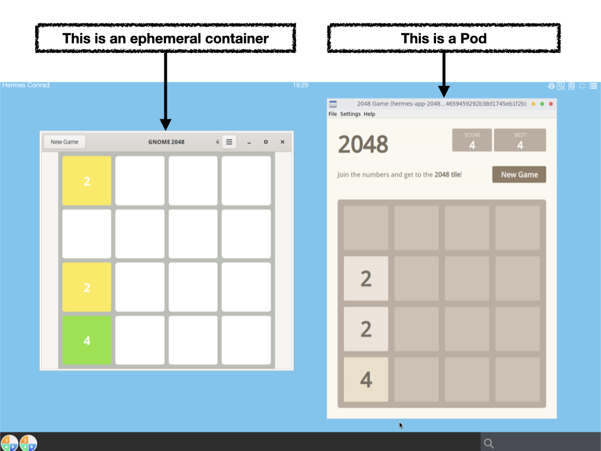

# `Ephemeral container` and `Pod` application

An abcdesktop application can run as a `kubernetes ephemeral container` or as a `kubernetes pod`.

An `ephemeral container` can access to share memory `shm` with the X11 server. An ephemeral container run always on the same node as the user pod, where the graphical container 'X11 server' is running. 

A `kubernetes pod` can't access to share memory with the X11 server. An Kubernetes pod can run on separated node from the X11 server. 





To describe the difference between `ephemeral-container` and `pod-application`, we use the game 2048, one instance come from alpine based on `gtk`, the second one come from ubuntu based on `qt`

- `2048-alpine` is a **GTK application**, and is defined to run as `ephemeral-container`
- `2048-ubuntu` is a **QT application**, and is defined to run as a kubernetes pod


## Requirements

* `jq` command preinstalled.


## Start a shell to your abcdesktop server

Get a shell to your abcdestkop server.


## Download `2048-alpine` and `2048-ubuntu` json files

Open a shell to your abcdesktop server

```sh
curl --output 2048-alpine.d.3.0.json https://raw.githubusercontent.com/abcdesktopio/oc.apps/main/2048-alpine.d.3.0.json
curl --output 2048-ubuntu.d.3.0.json https://raw.githubusercontent.com/abcdesktopio/oc.apps/main/2048-ubuntu.d.3.0.json
```

Check that the json files are downloaded

```sh
$ ls -la *.json
-rw-r--r-- 1 root root 29183 Dec 28 16:24 2048-alpine.d.3.0.json
-rw-r--r-- 1 root root 29099 Dec 28 16:24 2048-ubuntu.d.3.0.json
```

Look at the label oc.containerengine for each json file 


### Read the label oc.containerengine for 2048-alpine

```sh
cat 2048-alpine.d.3.0.json | jq -r '.[0].Config.Labels."oc.containerengine"'
```

The response is `ephemeral_container`

```
ephemeral_container
```

This application 2048-alpine will start as an `ephemeral_container`


### Read the label oc.containerengine for 2048-alpine

```sh
cat 2048-ubuntu.d.3.0.json | jq -r '.[0].Config.Labels."oc.containerengine"'
```

The response is `pod_application `

```
pod_application
```

This application 2048-ubuntu will start as a `pod_application`, it's a pod.


## PUT `2048-alpine` and `2048-ubuntu` applications to your abcdesktop service

```sh
curl -X PUT -H 'Content-Type: text/javascript' http://localhost:30443/API/manager/image -d @2048-alpine.d.3.0.json
curl -X PUT -H 'Content-Type: text/javascript' http://localhost:30443/API/manager/image -d @2048-ubuntu.d.3.0.json
```

Each curl command returns a complete json document.

Wait for the pull pod are Ready

```sh
kubectl wait --for=condition=Ready pods --selector=type=pod_application --timeout=-1s -n abcdesktop
```

Wait for condition met

```
pod/pull-2048-alpine-install-4280c633e777dceb3f529f208b442c0dff891 condition met
pod/pull-2048-ubuntu-install-ee652f4ff381655768bcc09d54a9b62ab7684 condition met
```

## Login to your abcdesktop service 

Using a web browser, open the abcdesktop service url. If your are running abcdesktop on your local device, the url should be : 

```
http://localhost:30443
```

### Choose to login as hermes 

Login in as the user `Hermes Conrad` 

- Login: `Hermes Conrad`
- Password: `hermes`


### Your desktop is created

Your desktop is created, and by default your dock is empty.


### Look for 2048

On the search text area, write the keyword `2048`


The two applications appear is the search result application area. 


### Start each 2048 application

Start `2048-ubuntu` and `2048-alpine` application


The `2048-ubuntu` and `2048-alpine` application start. `2048-alpine` can start quickly than `2048-ubuntu`.  `2048-alpine` is just a container, but `2048-ubuntu` is a complete kubernetes pod.


## Let's have a look on your server


### Get pod application

Get the running pod using `kubectl get pods -n abcdesktop`

```sh
$ kubectl get pods -n abcdesktop
NAME                                                      READY   STATUS    RESTARTS   AGE
daemonset-nginx-4wdkd                                     1/1     Running   0          11m
daemonset-pyos-5cxtw                                      1/1     Running   0          11m
hermes-7af63f49-0d25-4de8-9d28-5fa79cc83faa               4/4     Running   0          92s
hermes-app-2048-ubuntu-a5a8695d1a2744fd9240ad31954e64e6   1/1     Running   0          27s
memcached-od-bdcbbcb74-kwwb5                              1/1     Running   0          11m
mongodb-od-6484d8bc67-24w6v                               1/1     Running   0          11m
openldap-od-795c55f6db-mnqvb                              1/1     Running   0          11m
speedtest-od-5565dfdc67-6p67m                             1/1     Running   0          11m
```

The application `2048-ubuntu` is listed as a pod. The prefix is the `$userid-app` for example `hermes-app-2048-ubuntu-a5a8695d1a2744fd9240ad31954e64e6` 


The application `2048-alpine` is not a pod.

The application `2048-alpine` is listed as an ephemeral container, inside the user pod `hermes-7af63f49-0d25-4de8-9d28-5fa79cc83faa`

```
kubectl get pods hermes-7af63f49-0d25-4de8-9d28-5fa79cc83faa -o json -n abcdesktop | jq -r ".status.ephemeralContainerStatuses"
```

The application 2048-alpine.d is listed in the .status.ephemeralContainerStatuses 

```
[
  {
    "containerID": "containerd://3ae068cd70b251bb5da5d22d29247d0ffc3916fae742748bdf87f15d92d58e18",
    "image": "docker.io/abcdesktopio/2048-alpine.d:3.0",
    "imageID": "docker.io/abcdesktopio/2048-alpine.d@sha256:5ba5291dbf719ad70d70c763d899aeb012048a1e7f80e03b500ad050b436273c",
    "lastState": {},
    "name": "hermes-conrad-2048-alpine-7b6f7fae3fe84a81b28c578d6d48147e",
    "ready": false,
    "restartCount": 0,
    "state": {
      "running": {
        "startedAt": "2022-12-28T16:29:19Z"
      }
    }
  }
]
```


## Ephemeral container versus Pod application

An `ephemeral container` can access to share memory `shm` with the X11 server. An ephemeral container run always on the same node as the X11 server. 

A `kubernetes pod` can't access to share memory with the X11 server. An Kubernetes pod can run on a separated node from the X11 server.


If your application need to share memory with X11 server, when you have to set the `oc.containerengine` label to `ephemeral_container`. 


## Troubleshooting


### Start your application as a pod 

Start the 2048-alpine with gtk as a pod and not as an ephemeral container.

```
$ kubectl get pods -n abcdesktop
NAME                                                      READY   STATUS             RESTARTS           AGE
hermes-app-2048-alpine-4423b4b01ede48c5b58747e215acf362   0/1     Completed          0                  21s
```

> the pod's status for hermes-app-2048-alpine-4423b4b01ede48c5b58747e215acf362 is `Completed`

```
$ kubectl logs hermes-app-2048-alpine-4423b4b01ede48c5b58747e215acf362 -n abcdesktop
(org.gnome.TwentyFortyEight:36): Gdk-WARNING **: 09:56:40.497: The program 'org.gnome.TwentyFortyEight' received an X Window System error.
This probably reflects a bug in the program.
The error was 'BadShmSeg (invalid shared segment parameter)'.
  (Details: serial 816 error_code 128 request_code 131 (MIT-SHM) minor_code 3)
  (Note to programmers: normally, X errors are reported asynchronously;
   that is, you will receive the error a while after causing it.
   To debug your program, run it with the GDK_SYNCHRONIZE environment
   variable to change this behavior. You can then get a meaningful
   backtrace from your debugger if you break on the gdk_x_error() function.)
```


2048-alpine with gtk uses shared segment with X Window System, it must run as an ephemeral container.

If you are running QT application, you can disable the [X11 MIT Shared Memory Extension](https://www.x.org/releases/X11R7.7/doc/xextproto/shm.html) support, by setting the variable `QT_X11_NO_MITSHM` value to `1`

```
QT_X11_NO_MITSHM=1 
```

> Note your can also use `QT_XCB_NO_MITSHM` value to `1` 


 

## Compare kubernetes ephemeral container and pod

### kubernetes ephemeral container

Use an ephemeral container to start an application have some advantages and some disadvantages.

#### advantages

- Start quickly
- Less system resources than a pod
- Share Process Namespace is allowed `shareProcessNamespace: true`
- Share memory shm is allowed
- Share the network stack (IP Address) of the user pod

#### disadvantages

- resources is disallowed
- no `limits` and `requests` (cpu, memory)
- `nodeSelector` not supported

### kubernetes Pod

Use a kubernetes pod to start an application have some advantages and some disadvantages.


#### advantages

- resources (cpu, memory) is allowed
- `limits` and `requests` are supported
- ports, livenessProbe, readinessProbe are allowed
- `nodeSelector` support an application can run on a dedicated node (for example with GPU)
- can use a dedicated network to route application data

#### disadvantages

- More system resources than an ephemeral container
- Need X11 tcp port enabled on the user pod `'X11LISTEN': 'tcp'`
- Increase network resource if application pod and user pod run a distinct host 


### Troubleshooting


#### Check that your X11 server is listen on tcp port

Using the web shell inside an abcdesktop session, start `netstat -a` command line


The result should show that the process `Xvnc` is listening on tcp port number `6000`

```
hermes:~$ netstat  -anp
Active Internet connections (servers and established)
Proto Recv-Q Send-Q Local Address           Foreign Address         State       PID/Program name    
tcp        0      0 0.0.0.0:6000            0.0.0.0:*               LISTEN      82/Xvnc               
```


If `Xvnc` is not listening on tcp port number `6000`

##### update od.config to make `Xvnc` listen on tcp port number `6000`

Open your od.config file, and look at the `desktop.envlocal` option

```
desktop.envlocal :  {   'DISPLAY'               : ':0.0',
                        'SET_DEFAULT_WALLPAPER' : 'welcometoabcdesktop.png',
                        'X11LISTEN'             : 'tcp' }
```
Save your local `od.config` file.

To apply changes, you can replace the `abcdesktop-config`

```
kubectl delete configmap abcdesktop-config -n abcdesktop
kubectl create --from-file=od.config -n abcdesktop
```

Then restart pyos daemonset

```
kubectl rollout restart daemonset.apps/daemonset-pyos -n abcdesktop
```

You should read on stdout

```
daemonset.apps/daemonset-pyos restarted
```

