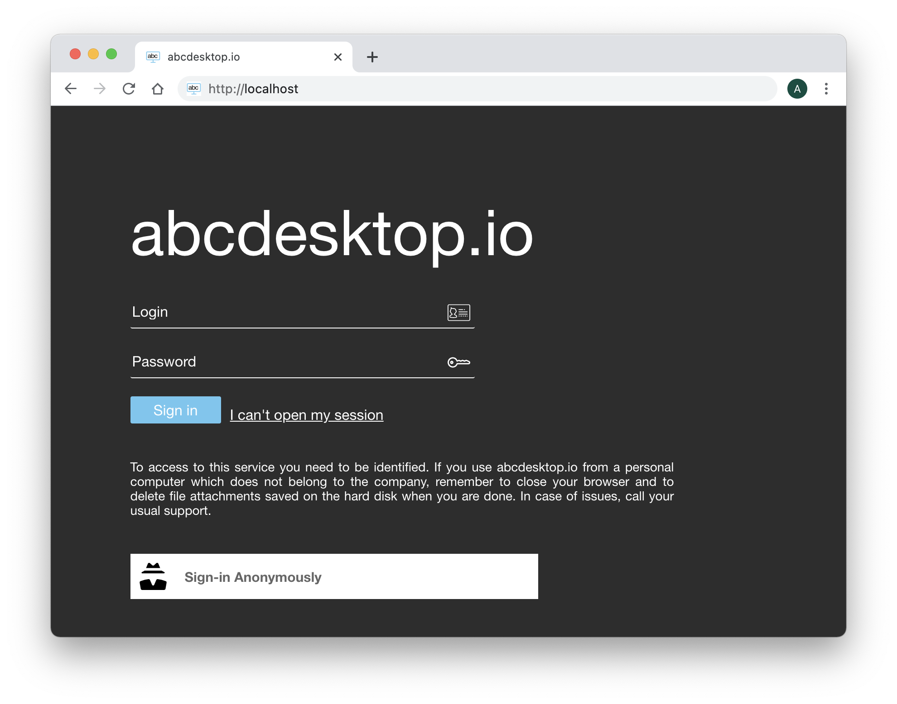

# Authentification ```explicit``` for LDAP Directory Services

## authmanagers ```explicit``` object

```explicit``` authentification use a directory service. The bind operation is used to authenticate clients to the directory server, to establish an authorization identity that will be used for subsequent operations processed on that connection.

The ```explicit``` authentification configuration is defined as a dictionnary object and contains an ```explicit``` provider. 


For example :

```
'explicit': {
    'show_domains': True,
    'providers': {
      'LDAP': { 
        'config_ref': 'ldapconfig', 
        'enabled': True
       }
}
```

In this example, ```ldapconfig``` dict must have a key ```LDAP```


| Variable name      | Type   | Description   |
|--------------------|--------- |-------------|
|  ```show_domains```   | boolean   | Permit the domain name to be listed in API getclientdata, the default value is False |
|  ```default_domain``` | string | not used by ldap, only used by Active Directory  | 
|  ```providers```      | dictionnary | ```{ 'LDAP': {  'config_ref': 'ldapconfig',  'enabled': True  }}```
|


### providers configuration

The ```provider``` authentification configuration is defined as a dictionnary object and must contain a key name.
The key name must be set with the same value in providers configuration and ```config_ref```.


Providers :

The provider is formated as a dictionnary 

 ```
 { 'planet': {  
 			'config_ref': 'ldapconfig',  
 			'enabled': True  
 		}
 }
 ```
 

| Variable name      | Type   | Description   |
|--------------------|--------- |-------------|
| config_ref         | string   |  For increased legibility, the ```USERDOMAIN``` configuration is defined in a dedicated dictionnary used the key:value ```'config_ref': 'adconfig'```, where ```key``` is ```config_ref``` and ```value``` is the dictionnay variable name.           |
| enable             | boolean  | enable or disable the domain entry            |


The ldapconfig is a dictionnary. 

For example :

```
ldapconfig : { 'planet': {    'default'       : True, 
                        'ldap_timeout'  : 15,
                        'ldap_basedn'   : 'ou=people,dc=planetexpress,dc=com',
                        'servers'       : [ 'ldap://192.168.8.195' ],
                        'serviceaccount': { 'login': 'cn=admin,dc=planetexpress,dc=com', 'password': 'GoodNewsEveryone' }
           }}

}
```

## ldap configuration reference 


| Variable name        | Type		       | Description                        | Example  |
|----------------------|----------------|------------------------------------|----------|
|  ```default```       | boolean        | Use this domain as default domain  | True     |
|  ```tls_require_cert```       | boolean        | The default value is False. ```tls_require_cert```  apply only if ldap server URI starts with ```ldaps```. Allow LDAPS connection if the ldaps server hostname does not match CommonName peer certificate. **In production, set this value to ```True```** This will disable the ldap option call : `ldap.set_option(ldap.OPT_X_TLS_REQUIRE_CERT, ldap.OPT_X_TLS_NEVER)` | False     |
|  ```basedn```   | string         | LDAP Base Distinguished Names    | ```ou=people,dc=planetexpress,dc=com``` |
|  ```servers```       | list of string | list of LDAP servers (IP Adress or FQDN), if entry does not respond, the next one is used.       | ```[ 'ldap://192.168.1.12', 'ldaps://myldap.domain.org' ]``` IP  Address or FQDN values |
|  ```scope```			| LDAP           | Perform an LDAP search operation, with base as the DN of the entry at which to start the search, ```scope``` being one of ```SCOPE_BASE``` (to search the object itself), ```SCOPE_ONELEVEL``` (to search the object’s immediate children), or ```SCOPE_SUBTREE``` (to search the object and all its descendants). | ```ldap.SCOPE_SUBTREE``` |
|  ```timeout```			| integer           | ldap time out in second  | 10 |
|  ```exec_timeout```  | integer         | execute time out in seconds, to obtain ntlm_auth credentials, or cntlm auth credentials, or kerberos auth credentials. the exec timeout is used to run external command line.  | 10 |
|  ```users_ou```			| string           | Users Organisation Unit | ```ou=people,dc=planetexpress,dc=com``` |
|  ```attrs ```			| list            | list of default attributs to read in user object. read the [Definition of the inetOrgPerson LDAP Object Class ](https://tools.ietf.org/html/rfc2798)|  |
|  ```filter```        | string         | LDAP filter to find user object | ```(&(objectClass=inetOrgPerson)(cn=%s))``` |
|  ```group_filter```  | string         | LDAP filter to find group object | ```(&(objectClass=Group)(cn=%s))``` |
|  ```group_attrs```  | string         | LDAP filter to find group object | ```(&(objectClass=Group)(cn=%s))``` |


## The LDAP structure of openldap for testing 

The authmanagers ```explicit``` is enabled. The Web home page insert the new input values ```Login``` and ```Password``` to authenticate this user.



### BaseDN
The ```basedn``` is ```dc=planetexpress,dc=com```

### admin account
The admin account is described as

| Admin            | Secret           |
| ---------------- | ---------------- |
| cn=admin,dc=planetexpress,dc=com | GoodNewsEveryone |

### OU Users
* The User Orgnanistation Unit is ```ou=people,dc=planetexpress,dc=com```

### Users

#### cn=Hubert J. Farnsworth,ou=people,dc=planetexpress,dc=com

| Attribute        | Value            |
| ---------------- | ---------------- |
| objectClass      | inetOrgPerson |
| cn               | Hubert J. Farnsworth |
| sn               | Farnsworth |
| description      | Human |
| displayName      | Professor Farnsworth |
| employeeType     | Owner |
| employeeType     | Founder |
| givenName        | Hubert |
| jpegPhoto        | JPEG-Photo (630x507 Pixel, 26780 Bytes) |
| mail             | professor@planetexpress.com |
| mail             | hubert@planetexpress.com |
| ou               | Office Management |
| title            | Professor |
| uid              | professor |
| userPassword     | professor |


#### cn=Philip J. Fry,ou=people,dc=planetexpress,dc=com

| Attribute        | Value            |
| ---------------- | ---------------- |
| objectClass      | inetOrgPerson |
| cn               | Philip J. Fry |
| sn               | Fry |
| description      | Human |
| displayName      | Fry |
| employeeType     | Delivery boy |
| givenName        | Philip |
| jpegPhoto        | JPEG-Photo (429x350 Pixel, 22132 Bytes) |
| mail             | fry@planetexpress.com |
| ou               | Delivering Crew |
| uid              | fry |
| userPassword     | fry |


#### cn=John A. Zoidberg,ou=people,dc=planetexpress,dc=com

| Attribute        | Value            |
| ---------------- | ---------------- |
| objectClass      | inetOrgPerson |
| cn               | John A. Zoidberg |
| sn               | Zoidberg |
| description      | Decapodian |
| displayName      | Zoidberg |
| employeeType     | Doctor |
| givenName        | John |
| jpegPhoto        | JPEG-Photo (343x280 Pixel, 26438 Bytes) |
| mail             | zoidberg@planetexpress.com |
| ou               | Staff |
| title            | Ph. D. |
| uid              | zoidberg |
| userPassword     | zoidberg |

#### cn=Hermes Conrad,ou=people,dc=planetexpress,dc=com

| Attribute        | Value            |
| ---------------- | ---------------- |
| objectClass      | inetOrgPerson |
| cn               | Hermes Conrad |
| sn               | Conrad |
| description      | Human |
| employeeType     | Bureaucrat |
| employeeType     | Accountant |
| givenName        | Hermes |
| mail             | hermes@planetexpress.com |
| ou               | Office Management |
| uid              | hermes |
| userPassword     | hermes |

#### cn=Turanga Leela,ou=people,dc=planetexpress,dc=com

| Attribute        | Value            |
| ---------------- | ---------------- |
| objectClass      | inetOrgPerson |
| cn               | Turanga Leela |
| sn               | Turanga |
| description      | Mutant |
| employeeType     | Captain |
| employeeType     | Pilot |
| givenName        | Leela |
| jpegPhoto        | JPEG-Photo (429x350 Pixel, 26526 Bytes) |
| mail             | leela@planetexpress.com |
| ou               | Delivering Crew |
| uid              | leela |
| userPassword     | leela |

### Groups

#### cn=admin_staff,ou=people,dc=planetexpress,dc=com

| Attribute        | Value            |
| ---------------- | ---------------- |
| objectClass      | Group |
| cn               | admin_staff |
| member           | cn=Hubert J. Farnsworth,ou=people,dc=planetexpress,dc=com |
| member           | cn=Hermes Conrad,ou=people,dc=planetexpress,dc=com |

#### cn=ship_crew,ou=people,dc=planetexpress,dc=com

| Attribute        | Value            |
| ---------------- | ---------------- |
| objectClass      | Group |
| cn               | ship_crew |
| member           | cn=Turanga Leela,ou=people,dc=planetexpress,dc=com |
| member           | cn=Philip J. Fry,ou=people,dc=planetexpress,dc=com |
| member           | cn=Bender Bending Rodríguez,ou=people,dc=planetexpress,dc=com |


## Insert the user credentials

Start your web browser and open the URL ```http://localhost```

The Web home page contains the new input values ```Login``` and ```Password``` to authenticate this user.

You can use for example on user of the list above.

| Credentials        | Value            |
| ---------------- | ---------------- |
| Login |  Turanga Leela | 
| Password |  leela | 


Insert the login credentials :

```Turanga Leela``` as login and ```leela``` as password, then click on the ```Sign in``` button.


Look at the top of the sreen. The user name is ```Turanga Leela```: 


## Applications remainted

Start LibreOffice Writer, and start a new file for your instructor. 
Type few words for example :

```
I like this amazing project abcdesktop.io
```

Do not save your file and just close your web browser.


Start your web browser again, and open the same URL ```http://localhost```, and log in with the same account: ```Turanga Leela``` as login and ```leela``` as password, then click on the ```Sign in``` button.

The application LibreOffice Writer is still running and the greeting message ```I like this amazing project abcdesktop.io```


> All applications are maintained. 

Great, you have check how the explicit Authentification configuration works, install an openldap directory service, and check that all sessions are maintained. 

