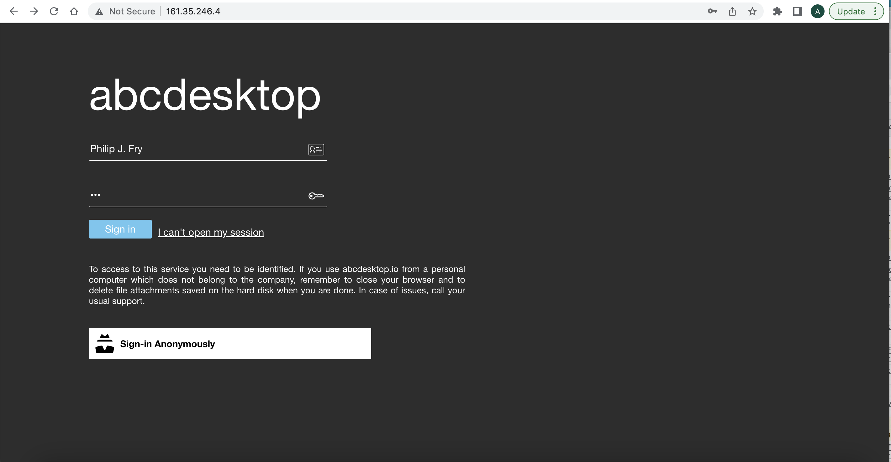
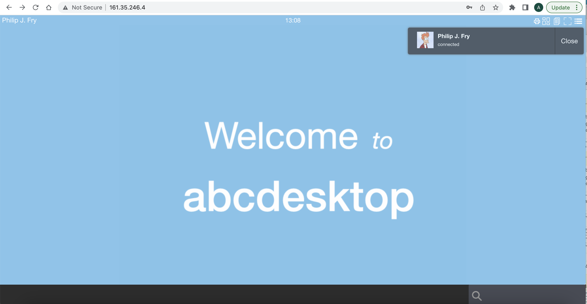
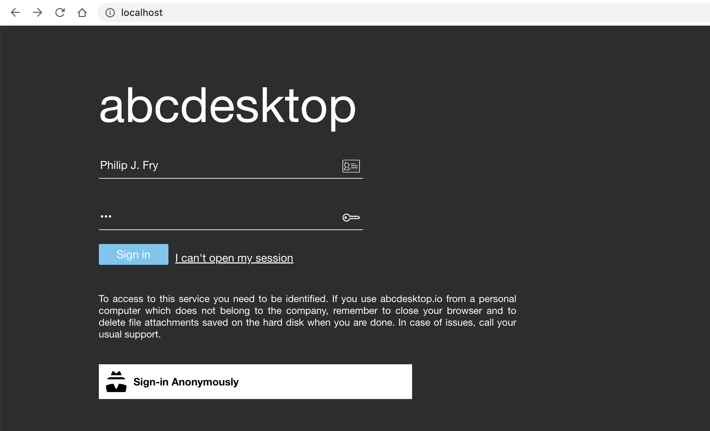
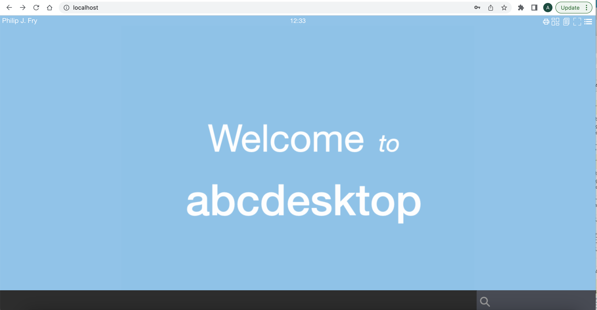

# Use http cloud provider LoadBalancer service 


## Goals
* Use cloud provider LoadBalancer service to provide a public ip address using http


## Requirements

- A kubernetes cloud 
- A cloud provider account


## Update nginx service to use http LoadBalancer

Replace `type: NodePort`by `type: LoadBalancer` into the nginx service

Save this yaml as `nginx.service.http.loadbalancer.yaml` file name

```yaml
kind: Service
apiVersion: v1
metadata:
  name: nginx
  namespace: abcdesktop
spec:
  type: LoadBalancer
  selector:
    run: nginx-od 
  ports:
  - protocol: TCP
    port: 80
    targetPort: 80
    name: http
```

```bash
# delete the previous nginx service
kubectl delete service nginx -n abcdektop
# create the new  nginx service
kubectl apply -f nginx.service.http.loadbalancer.yaml
```

Wait few minutes to obtain an ip address LoadBalancer <EXTERNAL-IP> from your cloud provider service


```bash
kubectl get services -n abcdesktop
NAME        TYPE           CLUSTER-IP       EXTERNAL-IP   PORT(S)           AGE
desktop     ClusterIP      None             <none>        <none>            57m
memcached   ClusterIP      10.245.247.50    <none>        11211/TCP         57m
mongodb     ClusterIP      10.245.198.243   <none>        27017/TCP         57m
nginx       LoadBalancer   10.245.172.53    <pending>     80:30443/TCP      57m
openldap    ClusterIP      10.245.109.131   <none>        389/TCP,636/TCP   57m
pyos        ClusterIP      10.245.94.15     <none>        8000/TCP          57m
speedtest   ClusterIP      10.245.67.168    <none>        80/TCP            57m
```

You get the `EXTERNAL-IP` for your `LoadBalancer` service

```bash
kubectl get services -n abcdesktop
NAME        TYPE           CLUSTER-IP       EXTERNAL-IP    PORT(S)           AGE
desktop     ClusterIP      None             <none>         <none>            61m
memcached   ClusterIP      10.245.247.50    <none>         11211/TCP         61m
mongodb     ClusterIP      10.245.198.243   <none>         27017/TCP         61m
nginx       LoadBalancer   10.245.172.53    161.35.246.4   80:30443/TCP      61m
openldap    ClusterIP      10.245.109.131   <none>         389/TCP,636/TCP   61m
pyos        ClusterIP      10.245.94.15     <none>         8000/TCP          61m
speedtest   ClusterIP      10.245.67.168    <none>         80/TCP            61m
```

Open your web browser to reach the abcdesktop service.
In this case, the loadbalancing service returns the ip address *161.35.246.4*


Login using `Philip J. Fry`




And you should get the `fry` desktop 




## Troubleshooting with `port-forward`

Use the kubectl `port-forward` command and a forwarded local port to help troubleshooting issues.

Get the pod name for nginx 

```bash
kubectl get pods -l run=nginx-od -n abcdesktop
NAME                        READY   STATUS    RESTARTS   AGE
nginx-od-69fb8fd8bb-qg4z2   1/1     Running   0          11h
```

Choose the nginx's pod, to forward local port 80 to nginx 80

```bash
kubectl port-forward nginx-od-69fb8fd8bb-qg4z2 --address 0.0.0.0 80:80 -n abcdesktop
Forwarding from 0.0.0.0:80 -> 80
```

> Your localhost is listening on 0.0.0.0:80 and forward to the nginx port 80

Then open your web browser `http://localhost`, you should get the home page, login using `LDAP auth` or `Anonymous auth`  should work.



Then login, and you get a pod user. 

> For the first time, you may get a time out error, if all container image can not be downloaded in less than 180 seconds on the worker node.

```bash
kubectl get pods -n abcdesktop                                                   
NAME                            READY   STATUS    RESTARTS   AGE
memcached-od-bdcbbcb74-nhd68    1/1     Running   0          11h
mongodb-od-d46d79476-fmbj5      1/1     Running   0          11h
nginx-od-69fb8fd8bb-qg4z2       1/1     Running   0          11h
openldap-od-795c55f6db-wz7l4    1/1     Running   0          11h
pyos-od-988887859-8kwdx         1/1     Running   0          11h
speedtest-od-6b5f8584f5-cs69t   1/1     Running   0          11h
fry-2cf3a                       4/4     Running   0          4m15s
```

The user `fry` gets the abcdesktop pod `fry-2cf3a`




## Update nginx service to use LoadBalancer service with https

This example works on digitalocean cloud provider.
You need first to create a `loadbalancer-certificate-id`, then define `annotations` on the abcdesktop nginx service like

```
  service.beta.kubernetes.io/do-loadbalancer-certificate-id: "3619b45a-714b-455c-a01a-e92fc8a29cbb"
  service.beta.kubernetes.io/do-loadbalancer-protocol: "https"
  service.beta.kubernetes.io/do-loadbalancer-disable-lets-encrypt-dns-records: "false"
```

Create a `loadbalancing.yaml` file, to update the default abcdestkop `service/nginx`

```
---         
kind: Service 
apiVersion: v1
metadata:   
  name: nginx 
  namespace: abcdesktop
  annotations:
    service.beta.kubernetes.io/do-loadbalancer-certificate-id: "3619b45a-714b-455c-a01a-e92fc8a29cbb"
    service.beta.kubernetes.io/do-loadbalancer-protocol: "https"
    service.beta.kubernetes.io/do-loadbalancer-disable-lets-encrypt-dns-records: "false"
  labels:
    abcdesktop/role: nginx
spec: 
  type: LoadBalancer
  selector:
    run: nginx-od
  ports:
  - protocol: TCP
    port: 443
    targetPort: 80
    name: https
---
```

Apply the new  `loadbalancing.yaml` file 

```bash
kubectl apply -f loadbalancing.yaml
```
You can read 

```
service/nginx configured
```

Check the nginx/services 

```
kubectl get service/nginx -n abcdesktop
```

```
NAME    TYPE           CLUSTER-IP       EXTERNAL-IP     PORT(S)         AGE
nginx   LoadBalancer   10.245.188.146   161.35.246.4    443:32086/TCP   28m
```

Now you can replace `http` by the secure protocol `https`


