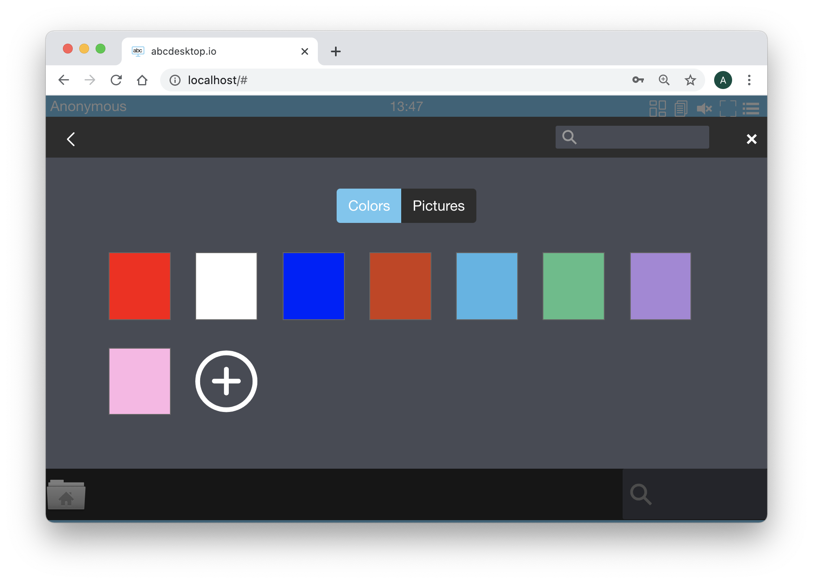

# desktop options in od.config

The od.config contains options to describe how the oc.user and applications containers have to be created. Options differ if abcdesktop.io is running in `docker mode` or in `kubernetes mode`.

## desktop.options

All desktop options are defined in od.config file.
Desktop options start with the prefix `desktop.`, then add the name of the option.

| Option name                           | Type           | Sample        |
|---------------------------------------|----------------|---------------|
| `desktop.defaultbackgroundcolors`     | list           | [ '#6EC6F0', '#333333',  '#666666', '#CD3C14', '#4BB4E6', '#50BE87', '#A885D8', '#FFB4E6' ] |
| `desktop.homedirectorytype`           | string         | 'hostPath'    |
| `desktop.remotehomedirectorytype`     | list           | []            |
| `desktop.persistentvolumeclaim`       | string         | None          |
| `desktop.envlocal`                    | dictionary     | `{ 'DISPLAY': ':0.0', 'USER': 'balloon', 'LIBOVERLAY_SCROLLBAR': '0', 'UBUNTU_MENUPROXY': '0', 'HOME': '/home/balloon', 'LOGNAME': 'balloon' }` |
| `desktop.nodeselector`                | dictionary     | `{}`          |
| `desktop.username`                    | string         | 'balloon'     |
| `desktop.userid`                      | integer        | 4096          |
| `desktop.groupid`                     | integer        | 4096          |
| `desktop.userhomedirectory`           | string         | `'/home/balloon'` |
| `desktop.useinternalfqdn`             | boolean        | False |
| `desktop.uselocaltime`                | boolean        | False |
| `desktop.host_config`                 | dictionary     | `{  'auto_remove'   : True, 'ipc_mode'      : 'shareable', 'network_mode'  : 'container', 'shm_size'      : '128M', 'mem_limit'     : '512M', 'cpu_period'    : 100000, 'cpu_quota'     : 150000, 'security_opt'  : [ 'seccomp=unconfined' ] }`  |
| `desktop.application_config`          | dictionary    | `{  'auto_remove'   : True, 'ipc_mode'      : 'shareable', 'pid_mode'      : True, 'network_mode'  : 'container', 'shm_size'      : '512M', 'mem_limit'     : '2G', 'cpu_period'    : 200000, 'cpu_quota'     : 150000, 'security_opt'  : [ 'seccomp=unconfined' ] }`  |
| `desktop.policies`    | dictionary    | `{ 'rules':{}, 'max_app_counter':5 }`  |
| `desktop.webhookdict` | dictionary    | `{ 'firewall': '192.168.7.1' }` |

## desktop.shareipcnamespace

The type of desktop.shareipcnamespace is a string. The default value is 'shareable'
This option permit user contain to share the ipc namespace with application

| Value         | Description                                           |
|---------------|-------------------------------------------------------|
| `''`          | Use daemon’s default.                                 |
| `'none'`      | Own private IPC namespace, with /dev/shm not mounted. |
| `'private'`   | Own private IPC namespace.                            |
| `'host'`      | Use the host system’s IPC namespace.                  |
| `'shareable'` | Own private IPC namespace, with a possibility to share it with other containers. |

If not specified, daemon default is used, which can either be `'private'` or `'shareable'`, depending on the daemon version and configuration. IPC (POSIX/SysV IPC) namespace provides separation of named shared memory segments, semaphores and message queues.

Shared memory segments are used to accelerate inter-process communication at memory speed, rather than through pipes or through the network stack. Shared memory is commonly used by databases and custom-built (typically C/OpenMPI, C++/using boost libraries) high performance applications for scientific computing and financial services industries. 

If these types of applications are broken into multiple containers, you might need to share the IPC mechanisms of the containers, using "shareable" mode for the main (i.e. “donor”) container, and containers can access `container:<donor-name-or-ID>`.

The default value is `desktop.shareipcnamespace : 'shareable'`

## desktop.homedirectory

This option describes how the default home directory for user user ballon should be created.
The value can be defined as :

* `'None'`: no dedicated volume is created, the oc.user container use an `emptyDir': { 'medium': 'Memory'}`. All user data will be removed at logout.

* `'hostPath'`: In release 3.0, ONLY `'hostPath'` is supported to set a dedicated volume, the oc.user container and applications share this volume. User home data are persistent.

## desktop.remotehomedirectorytype

desktop.remotehomedirectorytype is a list of string. Each string describe if the remount access to a directory is allowed.
example [ 'cifs', 'webdav' ]

For each entry in the desktop.remotehomedirectorytype list, abcdesktop.io try to mount the remote file system using data from the implicit auth provider.

If `desktop.remotehomedirectorytype` contains 'cifs' and if the authentification provider get `homeDrive` and `homeDirectory` attributs then abcdesktop request the kubernetes abcdesktop/CIFS Driver to mount the remote filesystem.
The user find a mount point named `homeDrive` value, and mounted to `homeDirectory`.

## desktop.defaultbackgroundcolors

The `desktop.defaultbackgroundcolors` allow you to change the default background color.

The default value is a list of string `[ '#6EC6F0', '#333333',  '#666666', '#CD3C14', '#4BB4E6', '#50BE87', '#A885D8', '#FFB4E6' ]`

The `desktop.defaultbackgroundcolors` length can contain up to 8 entries. To see the color 


Open the url http://localhost:30443, in your web browser, to start a simple abcdesktop.io container. 

``` url
http://localhost:30443
```

You should see the abcdesktop.io home page.

Press the `Connect with Anonymous access, have look`

At the right top corner, click on the menu and choose ```Settings```, then click on ```Screen Colors```

You should see the default background colors, for example :


## desktop.envlocal

`desktop.envlocal` is a dictionary. `desktop.envlocal` contains a (key,value) added as environment variables to oc.user.


The default value is :

``` json
{ 
  'DISPLAY': ':0.0', 
  'LIBOVERLAY_SCROLLBAR': '0',
  'UBUNTU_MENUPROXY': '0',
  'HOME': '/home/balloon',
  'X11LISTEN': 'tcp'
}
```

### Reserved variables


| Variable      | Values        | Description                                           |
|---------------|---------------|-------------------------------------------------------|
| `X11LISTEN`   | `tcp`         | permit X11 to listen on tcp port, default is `udp`    |
| `ABCDESKTOP_RUN_DIR`   | `/var/run/desktop`  | directory to write pid services   |
| `ABCDESKTOP_LOG_DIR`   | `/var/log/desktop`  | directory to write log files services   |
| `DISABLE_REMOTEIP_FILTERING` | `disabled`    | disabled remote ip filtering inside pod user, default is `disabled`, change to `enabled` to remove core ip filtering |
| `SET_DEFAULT_WALLPAPER` | `myfile.jpeg`    | name of file to set the user wallpaper, this file must exist in `~/.wallpapers` |
| `SET_DEFAULT_COLOR ` | `#6EC6F0`    | Value of default colour saved in file `~/.store/currentColor`      | 
| `SENDCUTTEXT` | `enabled` | Send clipboard changes to user. Set value to `disabled` to disable clipboard changes to user web browser. This value is overwrite by label `ABCDESKTOP_LABEL_sendcuttext` if exist `SENDCUTTEXT=${ABCDESKTOP_LABEL_sendcuttext:-$SENDCUTTEXT}`. The default value is `enabled` | 
| `ACCEPTCUTTEXT` | `enabled` | Accept clipboard updates from user. Set value to `disabled` to disable clipboard changes to user web browser.  This value is overwrite by label `ABCDESKTOP_LABEL_acceptcuttext` if exist `ACCEPTCUTTEXT=${ABCDESKTOP_LABEL_acceptcuttext:-$ACCEPTCUTTEXT}`. The default value is `enabled` | 


## desktop.nodeselector

`desktop.nodeselector` is a dictionary. This option permits to assign user pods to nodes.
It specifies a map of key-value pairs. For the pod to be eligible to run on a node, the node must have each of the indicated key-value pairs as labels (it can have additional labels as well). 
The most common usage is one key-value pair.

``` json
{ 'disktype': 'ssd' }
```

## desktop.username

```desktop.username``` describes the [balloon](balloon.md) user created inside the oc.user container.
The type of desktop.username is string. The default value is 'balloon'.

If you change this value, you have to rebuild your own oc.user file
The script oc.user in Dockerfile oc.user :

``` Dockerfile
ENV BUSER balloon
RUN groupadd --gid 4096 $BUSER
RUN useradd --create-home --shell /bin/bash --uid 4096 -g $BUSER --groups lpadmin,sudo $BUSER
```

Read the dedicated page on [balloon](balloon.md) to gaet more information about user balloon, uid, and gid.

## desktop.userid

```desktop.userid``` describes the ```uid``` of the user created inside the oc.user container.

The type of desktop.userid is integer. The default value is 4096.

If you change this value, you have to rebuild your own oc.user file
The script oc.user in Dockerfile oc.user :

``` Dockerfile
ENV BUSER balloon
RUN useradd --create-home --shell /bin/bash --uid 4096 -g $BUSER --groups lpadmin,sudo $BUSER
```

Read the dedicated page on [balloon](balloon.md) to gaet more information about user balloon, uid, and gid.

## desktop.groupid

`desktop.groupid` describes the `gid` of the user created inside the oc.user container. The type of desktop.userid is integer. The default value is 4096.

If you change this value, you have to rebuild your own oc.user file
The script oc.user in Dockerfile oc.user :

``` Dockerfile
RUN groupadd --gid 4096 $BUSER
```

Read the dedicated page on [balloon](balloon.md) to gaet more information about user balloon, uid, and gid.

## desktop.userhomedirectory

`desktop.userhomedirectory` describes the `homedirectory` of the user created inside the oc.user container. The type of `desktop.userhomedirectory` is string. The default value is `/home/balloon`.

If you change this value, you have to rebuild your own oc.user file
The script oc.user in Dockerfile oc.user :

``` Dockerfile
ENV BUSER balloon
RUN groupadd --gid 4096 $BUSER
RUN useradd --create-home --shell /bin/bash --uid 4096 -g $BUSER --groups lpadmin,sudo $BUSER
```

Read the dedicated page on [balloon](balloon.md) to gaet more information about user balloon, uid, and gid.

## desktop.uselocaltime

The `desktop.uselocaltime` is boolean, to use host value of `/etc/localtime`.
The default value is `False`.
If `desktop.uselocaltime` is True, this add a volume mapping from host file  `/etc/localtime` to container file `/etc/localtime`.

## desktop.policies

The `desktop.policies` is a dictionary.

| Entry       | Description | 
|-------------|------------------------------|
| `max_app_counter` | limit applications counter, without checking the docker container status |
| `rules`      |	rules dictionary `'rules': { 'volumes': { 'domainuser':  { 'type': 'cifs', 'name': 'homedirectory', 'volumename': 'homedir' } }` |
| `acl`	 | allow or denied desktop creation |

Example

``` json
desktop.policies: { 
  'rules': { 
    'volumes': { 
      'domainuser':   { 'type': 'cifs', 'name': 'homedirectory', 'volumename': 'homedir' },
      'Mygroupteam':  { 'type': 'cifs', 'name': 'toto', 'unc': '//192.168.7.101/team', 'volumename': 'team' } 
	  } 
  },
  'acls' : {},
  'max_app_counter' : 4  
}
```

## desktop.application_config

Default application host_config dictionary, maps the dictionary as arguments from docker API 
[create_host_config](https://docker-py.readthedocs.io/en/stable/api.html#docker.api.container.ContainerApiMixin.create_host_config)

Define how the application can be run, read [host_config](/config/host_config)  description page to get more informations

## desktop.host_config

Default desktop oc.user host_config dictionary, maps the dictionary as arguments from docker API 
[create_host_config](https://docker-py.readthedocs.io/en/stable/api.html#docker.api.container.ContainerApiMixin.create_host_config)

Define how the oc.user container can be run, read [host_config](config/host_config) description page to get more informations

## desktop.webhookdict

desktop.webhookdict is a dictionary to add key/value to the command `create` and `destroy` in rules objects.

## Experimental features

### desktop.desktopuseinternalfqdn

WARNING `desktop.desktopuseinternalfqdn` is an **experimental feature**, keep this value to False in production

`desktop.desktopuseinternalfqdn` describes the content of the payload data in the JWT Desktop Token.
The default value is `False`. 

Nginx front end act as a reverse proxy. This reverse proxy use the FQDN of the user's pod to route http request.
If this value is set to `False` the payload data in the JWT Desktop Token contains the **IP Address of the user Pod**.
If this value is set to `True` the payload data in the JWT Desktop Token contains the **FQDN of the user Pod**.

If you CAN NOT add `endpoint_pod_names` in the coredns configuration, you MUST set `desktop.desktopuseinternalfqdn` to `False`.
This choice is less secure.

To set `desktop.desktopuseinternalfqdn` to `True` value, you have to update the `coredns` ConfigMap.

``` yaml
kind: ConfigMap
apiVersion: v1
metadata:
  name: coredns
  namespace: kube-system
data:
  Corefile: |
    .:53 {
        log
        errors
        health
        ready
        kubernetes cluster.local in-addr.arpa ip6.arpa {
           endpoint_pod_names
           pods insecure
           fallthrough in-addr.arpa ip6.arpa
           transfer to * 
           ttl 30
        }
        prometheus :9153
        forward . /etc/resolv.conf
        cache 30
        loop
        reload
        loadbalance
    }
```
