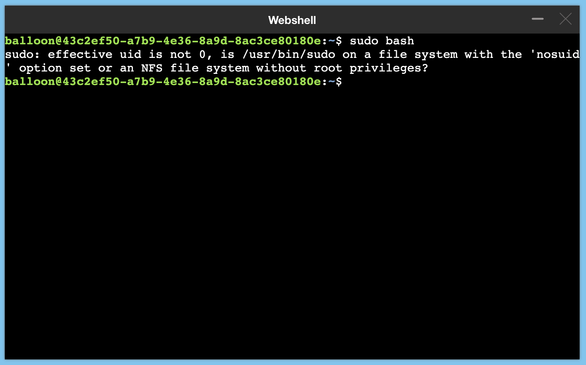

## How to get a root access inside a container running kubernetes abcdesktop ?


> run the sudo command inside the user kubernetes pods





```
balloon@43c2ef50-a7b9-4e36-8a9d-8ac3ce80180e:~$ sudo bash
sudo: effective uid is not 0, is /usr/bin/sudo on a file system with the 'nosuid' option set or an NFS file system without root privileges?
```


## Edit the od.config file

In the `securityContext` add the entry `'allowPrivilegeEscalation': True`

```
desktop.pod : {
  'spec'   : {
    'shareProcessMemorySize': '512Mi',
    'shareProcessMemory': True,
    'shareProcessNamespace': True,
    'securityContext': { 
      'supplementalGroups': [ '{{ supplementalGroups }}' ] ,
      'readOnlyRootFilesystem': False, 
      'allowPrivilegeEscalation': True, 
      'runAsUser': '{{ uidNumber }}',
      'runAsGroup': '{{ gidNumber }}',
      'capabilities': { 
        'add': [ "SYS_ADMIN", "CAP_SYS_ADMIN", "CAP_DAC_OVERRIDE"]
      }
    }
  }
...
```

## Update the kubernetes config with the new abcdesktop.yaml  

```
kubectl create -n abcdesktop configmap abcdesktop-config --from-file=od.config -o yaml --dry-run=client | kubectl replace -n abcdesktop -f -
```

## Restart the pyos pod 

Delete the pyos pod

```
kubectl delete pods -l run=pyos-od  -n abcdesktop
pod "pyos-od-5586b88767-gsdl8" deleted
```


6. Make sure that your user has done a logoff his pod, then login again and run terminal web shell 

The default balloon password is ```lmdpocpetit```

```
balloon@c182dc39-6a00-4869-8b01-2039f37c1eab:~$ sudo bash
[sudo] password for balloon: 
root@c182dc39-6a00-4869-8b01-2039f37c1eab:~# id
uid=0(root) gid=0(root) groups=0(root),105(lpadmin)
root@c182dc39-6a00-4869-8b01-2039f37c1eab:~#  
```

After the sudo command, you get a root level inside the shell of the users's pod


> In production this value should be set to False
