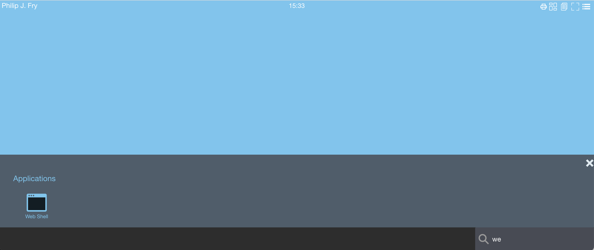

# Define volumes to retain user's home directory files


To retain user's home directory files, you can define 

- [PersistentVolume](https://kubernetes.io/docs/concepts/storage/persistent-volumes/) using `hostPath`. The `hostPath` can also be a mount point.
- [PersistentVolumeClaim](https://kubernetes.io/docs/concepts/storage/persistent-volumes/) using `storageClassName` parameter. Two examples are described one using `nfs`, the second one using `s3`.
 


## Define persistentVolume using `hostPath`

In your od.config file, define the new entries `desktop.homedirectorytype` `desktop.persistentvolumespec` `desktop.persistentvolumeclaimspec`


- `desktop.homedirectorytype`: 'persistentVolumeClaim'
- `desktop.persistentvolumespec`: create a new volume for the user's homeDir, for persistentVolume hostPath.
- `desktop.persistentvolumeclaimspec`: create a new volume claim for the user's homeDir


```json
# set to persistentVolumeClaim
desktop.homedirectorytype: 'persistentVolumeClaim'
# define how to create persistentvolume
desktop.persistentvolumespec: {
            'storageClassName': '',
            'capacity': { 'storage': '1Gi' },
            'accessModes': [ 'ReadWriteOnce' ], 
            'hostPath': { 'path': '/mnt/abcdesktop_volumes/{{ provider }}/{{ userid }}' } }
# define how to create persistentvolumeclaim
desktop.persistentvolumeclaimspec: {
            'storageClassName': '',
            'resources': { 
              'requests': { 
                'storage': '1Gi'
              } 
            },
            'accessModes': [ 'ReadWriteOnce' ] }
```


desktop.persistentvolumespec support template values. For example `'/mnt/abcdesktop_volumes/{{ provider }}/{{ userid }}'`. 

- `{{ provider }}` is the provider's name templated value. 
- `{{ userid }}` is the user's id templated value.


*The list of all template values can be read at the end of this chapter*

The user's home directory inside the pod is located on host to `/mnt/abcdesktop_volumes/{{ provider }}/{{ userid }}`. The directory is created automatically by kubernetes.

The `/mnt/abcdesktop_volumes/` content lists the provider name.

On the host, the new directory is created, where each home directory is located.

Read the new path for 'hostPath' persistent volumes

```bash
ls -la /mnt/abcdesktop_volumes/
total 20
drwxr-xr-x   5 root root 4096 mai   12 12:40 .
drwxr-xr-x 106 root root 4096 mai   11 11:34 ..
drwxr-xr-x   3 root root 4096 mai   12 12:40 anonymous
drwxr-xr-x   3 root root 4096 mai   12 12:39 github
drwxr-xr-x   5 root root 4096 mai   12 12:40 google
```

For provider `google`, all users are listed.

```bash
ls -la /mnt/abcdesktop_volumes/google/
total 20
drwxr-xr-x  5 root root 4096 mai   12 12:40 .
drwxr-xr-x  5 root root 4096 mai   12 12:40 ..
drwxr-x--- 16 2048 2048 4096 mai   12 12:39 103464335761332102620
drwxr-x--- 16 2048 2048 4096 mai   12 12:40 112026272437223559761
drwxr-x--- 16 2048 2048 4096 mai   12 12:39 114102844260599245242
```

For provider `google`, list the user home directory for the user `103464335761332102620`

```bash
ls -la /mnt/abcdesktop_volumes/google/103464335761332102620/
total 76
drwxr-x--- 16 2048 2048 4096 mai   12 12:39 .
drwxr-xr-x  5 root root 4096 mai   12 12:40 ..
-rw-------  1 2048 2048   71 mai   12 12:39 .Xauthority
-rw-rw-r--  1 2048 2048   12 janv. 27 18:36 .Xresources
drwxr-x---  3 2048 2048 4096 mai   12 12:39 .cache
drwxr-x---  6 2048 2048 4096 mai   12 12:39 .config
drwxrwxr-x  3 2048 2048 4096 janv. 27 18:36 .gconf
-rw-r-----  1 2048 2048    0 mai   12 12:39 .gtk-bookmarks
-rw-rw-r--  1 2048 2048  564 janv. 27 18:36 .gtkrc-2.0
drwxr-x---  3 2048 2048 4096 mai   12 12:39 .local
drwxr-x---  2 2048 2048 4096 mai   12 12:39 .store
drwxr-x---  2 2048 2048 4096 mai   12 12:39 .wallpapers
drwxr-x---  2 2048 2048 4096 mai   12 12:39 Desktop
drwxr-x---  2 2048 2048 4096 mai   12 12:39 Documents
drwxr-x---  2 2048 2048 4096 mai   12 12:39 Downloads
drwxr-x---  2 2048 2048 4096 mai   12 12:39 Music
drwxr-x---  2 2048 2048 4096 mai   12 12:39 Pictures
drwxr-x---  2 2048 2048 4096 mai   12 12:39 Public
drwxr-x---  2 2048 2048 4096 mai   12 12:39 Templates
drwxr-x---  2 2048 2048 4096 mai   12 12:39 Videos
```

### list of all template values

The template values can be one of them :

| var                 | description     |  
| -------------------:| ---------------:|
| cn                  | Common Name     |
| uid                 | user id         |
| gid                 | group id        |
| uidNumber           | user id number  |
| gidNumber           | group id number |
| homeDirectory       | homeDirectory   |
| loginShell          | loginShell      |
| description         | description     |
| groups              | groups          |
| gecos               | gecos           |
| provider            | provider        |
| protocol            | protocol        |
| providertype        | providertype    |
| name                | user name       |
| userid              | user id         |
| locale              | user's locale   |
| *template tag value*| tag value set by auth rules   |


> Note: `hostPath` supports file permissions and the pod's init commands `chown` or `chmod` can be used. The `hostPath` can also be a mount point, using nfs. 


## Define persistentVolumeClaim using `storageClassName`


To define a `persistentVolumeClaim`, update the od.config file and set

```json
desktop.homedirectorytype: 'persistentVolumeClaim'
desktop.persistentvolumespec: None
desktop.persistentvolumeclaimspec: <YOUR_PERSISTENT_VOLULME_CLAIM_SPEC>
```

`desktop.persistentvolumeclaimspec` is a dictionary. Get more information about [PersistentVolume and PersistentVolumeClaim.](https://kubernetes.io/docs/concepts/storage/persistent-volumes/)

For example

```json
# set to persistentVolumeClaim
desktop.homedirectorytype: 'persistentVolumeClaim'
desktop.persistentvolumespec: None
desktop.persistentvolumeclaimspec: {
            'storageClassName': 'mystorageclass',
            'resources': { 
              'requests': { 
                'storage': '1Gi'
              } 
            },
            'accessModes': [ 'ReadWriteOnce' ] }
```

Replace `mystorageclass` by storageclass of your cloud provider

```bash
kubectl get storageclass
```

The example output is as follows on the cloud provider [aws](https://aws.amazon.com/).

```
NAME            PROVISIONER             RECLAIMPOLICY   VOLUMEBINDINGMODE      ALLOWVOLUMEEXPANSION   AGE
gp2 (default)   kubernetes.io/aws-ebs   Delete          WaitForFirstConsumer   false 
```

The example output is as follows on the cloud provider [digitalocean](https://www.digitalocean.com/).

```
NAME                          PROVISIONER                    RECLAIMPOLICY          Immediate           false                  3h22m
do-block-storage (default)    dobs.csi.digitalocean.com      Delete          Immediate           true                   2d7h
do-block-storage-retain       dobs.csi.digitalocean.com      Retain          Immediate           true                   2d7h
do-block-storage-xfs          dobs.csi.digitalocean.com      Delete          Immediate           true                   2d7h
do-block-storage-xfs-retain   dobs.csi.digitalocean.com      Retain          Immediate           true                   2d7h
```


### For a self hosting kubernetes cluster

Two are described one using `nfs` with the `csi-driver-nfs`, the second one using `s3` with `k8s-csi-s3`.


#### example with `nfs` 

Use the `https://github.com/kubernetes-csi/csi-driver-nfs` as a `csi-driver-nfs` with a nfs server as backend. 

##### On the nfs server

On the nfs server, create an export with the `no_root_squash` option

For example export `/volume1/pods`

```
/volume1/pods        192.168.7.0/24(rw,async,no_wdelay,crossmnt,insecure,no_root_squash,insecure_locks,anonuid=1025,anongid=100)
```

##### Install the `csi-driver-nfs`

Run the install `install-driver.sh` command from [kubernetes-csi/csi-driver-nfs](https://github.com/kubernetes-csi/csi-driver-nfs) GitHub repository.

```
curl -skSL https://raw.githubusercontent.com/kubernetes-csi/csi-driver-nfs/v4.4.0/deploy/install-driver.sh | bash -s v4.4.0 --
```

Create a storage class file nfs-csi-sc-ds01.yaml,

- replace server: `192.168.7.101` by your own nfs server ip address
- replace share: `/volume1/pods` by your own share


Content of the default `nfs-csi-sc-ds01.yaml`

```yaml
apiVersion: storage.k8s.io/v1
kind: StorageClass
metadata:
  name: nfs-csi-sc-ds01
provisioner: nfs.csi.k8s.io
parameters:
  server: 192.168.7.101
  share: /volume1/pods
  mountPermissions: "0755"
  # csi.storage.k8s.io/provisioner-secret is only needed for providing mountOptions in DeleteVolume
  # csi.storage.k8s.io/provisioner-secret-name: "mount-options"
  # csi.storage.k8s.io/provisioner-secret-namespace: "default"
reclaimPolicy: Delete
volumeBindingMode: Immediate
mountOptions:
  - nfsvers=3
```

```bash
kubectl apply -f nfs-csi-sc-ds01.yaml
```

You read the response on stdout

```
storageclass.storage.k8s.io/nfs-csi-sc-ds01 created
```

Check the storage class `nfs-csi-sc-ds01`

```
kubectl get sc
NAME                 PROVISIONER      RECLAIMPOLICY   VOLUMEBINDINGMODE   ALLOWVOLUMEEXPANSION   AGE
nfs-csi-sc-ds01      nfs.csi.k8s.io   Delete          Immediate           false                  18m
```

##### Update `od.config`

In your od.config file, define the entry `desktop.persistentvolumeclaimspec`

- `desktop.homedirectorytype`: 'persistentVolumeClaim' to use the persistentVolumeClaim features.
- `desktop.persistentvolumespec`: None to skip the persistent volume provisioning.
- `desktop.persistentvolumeclaimspec` create a new volume claim for the user's homeDir, the storageClassName `nfs-csi-sc-ds01`

The PersistentVolume and PersistentVolumeClaim are created by abcdesktop. Abcdesktop defines a binding between that specific PV and PVC


```json
# set to persistentVolumeClaim
desktop.homedirectorytype: 'persistentVolumeClaim'
desktop.persistentvolumespec: None
desktop.persistentvolumeclaimspec: {
            'storageClassName': 'nfs-csi-sc-ds01',
            'resources': { 
              'requests': { 
                'storage': '500Mi'
              } 
            },
            'accessModes': [ 'ReadWriteOnce' ] }
```

Update the new config file and restart `pyos` pod

```bash
kubectl delete configmap abcdesktop-config -n abcdesktop
kubectl create configmap abcdesktop-config --from-file=od.config -n abcdesktop
kubectl delete pods -l run=pyos-od -n abcdesktop
```


##### Login to your abcdesktop service 

Login as user (`Philip J. Fry`, `fry`)


The new desktop for `Philip J. Fry` is created.

Start the web shell command using the search bar 



Using the web shell application start the df command 


The fry home dir is mounted on `192.168.7.101:/volume1/pods/pvc-b8317d7b-dc35-4fc3-88e9-ad894ab11d32`


##### On the kubernetes control plane, list the PersistentVolume and PersistentVolumeClaim


List the new PersistentVolume

```bash
kubectl get pv 
NAME                                       CAPACITY   ACCESS MODES   RECLAIM POLICY   STATUS   CLAIM                         STORAGECLASS      REASON   AGE
pvc-b8317d7b-dc35-4fc3-88e9-ad894ab11d32   25Mi       RWO            Delete           Bound    abcdesktop/planet-fry-9372f   nfs-csi-sc-ds01            3m
```

List the new PersistentVolumeClaim

```bash
kubectl get pvc -n abcdesktop 
NAME               STATUS   VOLUME                                     CAPACITY   ACCESS MODES   STORAGECLASS      AGE
planet-fry-9372f   Bound    pvc-b8317d7b-dc35-4fc3-88e9-ad894ab11d32   25Mi       RWO            nfs-csi-sc-ds01   5m7s
```


Get the PersistentVolumeClaim's description
 
```bash
kubectl describe pvc planet-fry-9372f -n abcdesktop 
Name:          planet-fry-9372f
Namespace:     abcdesktop
StorageClass:  nfs-csi-sc-ds01
Status:        Bound
Volume:        pvc-b8317d7b-dc35-4fc3-88e9-ad894ab11d32
Labels:        access_provider=planet
               access_providertype=ldap
               access_userid=fry
Annotations:   pv.kubernetes.io/bind-completed: yes
               pv.kubernetes.io/bound-by-controller: yes
               volume.beta.kubernetes.io/storage-provisioner: nfs.csi.k8s.io
               volume.kubernetes.io/storage-provisioner: nfs.csi.k8s.io
Finalizers:    [kubernetes.io/pvc-protection]
Capacity:      25Mi
Access Modes:  RWO
VolumeMode:    Filesystem
Used By:       fry-87066
Events:
  Type    Reason                 Age              From                                                        Message
  ----    ------                 ----             ----                                                        -------
  Normal  ExternalProvisioning   7m (x2 over 7m)  persistentvolume-controller                                 Waiting for a volume to be created either by the external provisioner 'nfs.csi.k8s.io' or manually by the system administrator. If volume creation is delayed, please verify that the provisioner is running and correctly registered.
  Normal  Provisioning           7m               nfs.csi.k8s.io_kadmin_1c28f3c9-91ee-4aa0-b991-8c17c46133d3  External provisioner is provisioning volume for claim "abcdesktop/planet-fry-9372f"
  Normal  ProvisioningSucceeded  7m               nfs.csi.k8s.io_kadmin_1c28f3c9-91ee-4aa0-b991-8c17c46133d3  Successfully provisioned volume pvc-b8317d7b-dc35-4fc3-88e9-ad894ab11d32
```


#### example with `s3`

Use the `https://github.com/yandex-cloud/k8s-csi-s3` as a `CSI for S3` with [minio](https://min.io/) as backend. 

Follow `https://github.com/yandex-cloud/k8s-csi-s3` setup guide and test with the sample pod to make sure that fuse mounts the S3 file system.  


##### Update storageclass.yaml file

```
---
kind: StorageClass
apiVersion: storage.k8s.io/v1
metadata:
  name: csi-s3
provisioner: ru.yandex.s3.csi
parameters:
  mounter: geesefs 
  # you can set mount options here, for example limit memory cache size (recommended)
  options: "--memory-limit 1000 --dir-mode 0777 --file-mode 0666 --setuid 0"
  # to use an existing bucket, specify it here:
  # bucket: abcdesktop
  csi.storage.k8s.io/provisioner-secret-name: csi-s3-secret
  csi.storage.k8s.io/provisioner-secret-namespace: kube-system
  csi.storage.k8s.io/controller-publish-secret-name: csi-s3-secret
  csi.storage.k8s.io/controller-publish-secret-namespace: kube-system
  csi.storage.k8s.io/node-stage-secret-name: csi-s3-secret
  csi.storage.k8s.io/node-stage-secret-namespace: kube-system
  csi.storage.k8s.io/node-publish-secret-name: csi-s3-secret
  csi.storage.k8s.io/node-publish-secret-namespace: kube-system
```

Update the `csi-s3` storage class to add `--setuid 0` as options

```bash
kubectl delete sc csi-s3
kubectl create -f storageclass.yaml
```


##### Update `od.config`


In your od.config file, define the entry `desktop.persistentvolumeclaimspec`

- `desktop.homedirectorytype`: 'persistentVolumeClaim' to use the persistentVolumeClaim features.
- `desktop.persistentvolumespec`: None to skip the persistent volume provisioning.
- `desktop.persistentvolumeclaimspec` create a new volume claim for the user's homeDir, the storageClassName `csi-s3`


```json
# set to persistentVolumeClaim
desktop.homedirectorytype: 'persistentVolumeClaim'
desktop.persistentvolumespec: None
desktop.persistentvolumeclaimspec: {
            'storageClassName': 'csi-s3',
            'resources': { 
              'requests': { 
                'storage': '1Gi'
              } 
            },
            'accessModes': [ 'ReadWriteOnce' ] }
```


##### The init command options with no file permissions support

By default the storageclass use `mounter: geesefs`. `geesefs` does not store file permissions and the init commands `chown` or `chmod` exit with no zero value, then the pod does not start.
All files belongs to `root`, but with correct permissions `options: "--memory-limit 1000 --dir-mode 0777 --file-mode 0666 --setuid 0"`. 

Update the 'init' in `desktop.pod` dict 

```json
'init': { 
    'image': 'busybox',
    'enable': True,
    'pullpolicy':  'IfNotPresent',
    'securityContext': {
        'runAsUser':   0,
        'runAsGroup':  0 
    },
    'acl':  { 'permit': [ 'all' ] },
    'command':  [ 'sh', '-c',  'chown {{ uidNumber }}:{{ gidNumber }} ~ || true && chmod 750 ~ || true' ] 
  }
```

Apply the new configuration file and restart pyos pods

```bash
kubectl delete configmap abcdesktop-config -n abcdesktop
kubectl create configmap abcdesktop-config --from-file=od.config -n abcdesktop
kubectl delete pods -l run=pyos-od -n abcdesktop
```

Login to abcdestkop service using your web browser.


List the persistent volumes

```
kubectl get pv
NAME                                       CAPACITY   ACCESS MODES   RECLAIM POLICY   STATUS   CLAIM                                             STORAGECLASS               REASON   AGE
pvc-81a65ed9-b98e-462c-86c6-36c89c3d4f1b   1Gi        RWO            Delete           Bound    abcdesktop/github-12896316-96cb5                  csi-s3                              2m46s
```


List the persistent volume claims 

```
# kubectl get pvc -n abcdesktop
NAME                                   STATUS   VOLUME                                     CAPACITY   ACCESS MODES   STORAGECLASS               AGE
github-12896316-96cb5                  Bound    pvc-81a65ed9-b98e-462c-86c6-36c89c3d4f1b   1Gi        RWO            csi-s3                     2m21s
```
