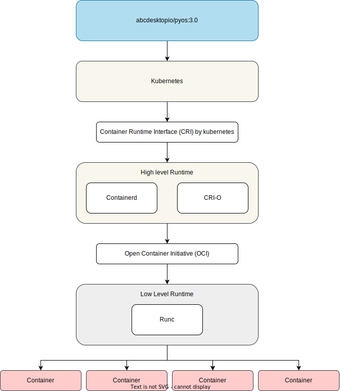

# abcdesktop release 3.0

The abcdesktop release 3.0 has started in May 2022

* Kubernetes release **greater or equal** to 1.24
* No depend to docker, an application runs as pod or as an [ephermeral container](https://kubernetes.io/docs/concepts/workloads/pods/ephemeral-containers/)
* All container-runtimes are supported. `containerd` is recommended by default
* abcdesktop release 3.x is unstable, API endpoints can change.

## Architecture abcdesktop 3.0

In release 3.0, the abcdesktop control plane uses only `Kubernetes` API. It doesn't depend to `dockerd`. 

## User pod

## Applications

Application can run as : 

  - `kubernetes pod`
  - `kubernetes ephemeral container`

### Volumes

`ephemeral container` doesn't support `subpath`. It means that abcdesktop desktop application based on `ephemeral container` doesn't support subpath. abcdesktop user home directory **MUST** be mounted as `hostPath` on each worker node.

In the release `persistentVolumeClaim` is not supported for user home directory, while `ephemeral container` doesn't support `subpath`.
