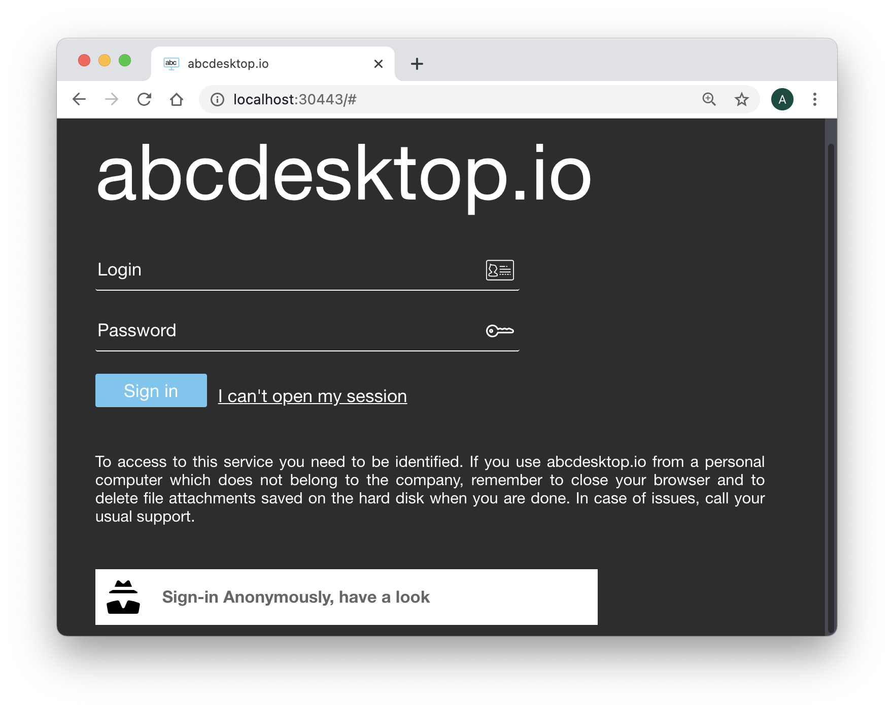
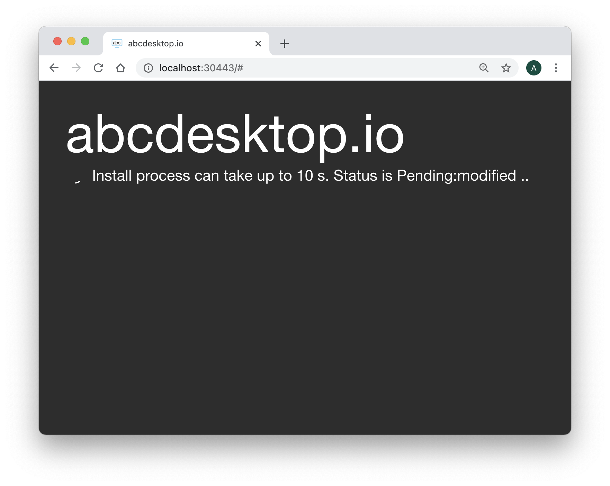
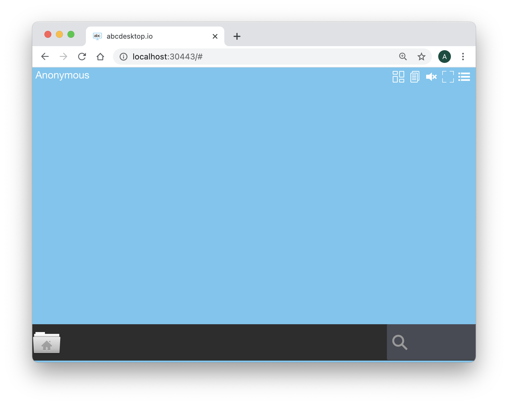

# abcdesktop in kubernetes mode

abcdesktop release 3.x support only kubernetes mode. All applications containers can be distributed on different hosts.

The abcdesktop infrastructure is using the contianers : 

| Container    | Role                     | Image                           | From         |
|--------------|--------------------------|---------------------------------|--------------|
| oc.pyos      | API Server               | abcdesktopio/oc.pyos:3.0        | abcdesktopio |
| oc.nginx     | web server proxy         | abcdesktopio/oc.nginx:3.0       | abcdesktopio |
| oc.speedtest | http benchmarch          | abcdesktopio/oc.speedtest       | [LibreSpeed](https://librespeed.org/) |
| oc.mongo     | json database server     | mongo                           | [MongoDB](https://www.mongodb.com/)   |
| memcached    | cache server             | memcached                       | [Memcached](https://memcached.org/)   |


## Requirements

You need to have a 

- kubernetes cluster ready to run
- `kubectl` or `microk8s` command-line tool must be configured to communicate with your cluster. 
- `openssl` and `curl` command line must be installed too.
- `ctr` should be install to download abcdesktopio images from `docker.io/abcdesktopio`


You can run the **Quick installation process** or choose the **Manually installation step by step**


## Quick installation (Linux or macOS)

> Quick installation can be run on Linux or macOS operation system. 


Download and extract the latest release automatically (Linux or macOS):

```
curl -sL https://raw.githubusercontent.com/abcdesktopio/conf/main/kubernetes/install-3.0.sh | bash
```

The command above downloads the latest release (numerically) of abcdesktop.io. 
The quick installation process runs the all commands step by step:

* create the `abcdesktop` namespace
* build all `rsa keys` pairs for jwt signing and payload encryption
* download the default configuration file `od.config`
* create all `services`, `pods`, `secrets` and `configmaps`
* download user's core images: `oc.user`, `oc.cupsd`, `oc.pulseaudio` ( if ctr command line exists )


## Manually installation step by step (Linux, macOS or Windows)

The following commands will let you prepare and build abcdesktop plateform on the master node. All applications run on a single server.  


### Install abcdesktop
#### Step 1: Create abcdesktop namespace

We will create abcdesktop namespace and set it as default :

```
# First create the abcdesktop namespace
kubectl create namespace abcdesktop
```

You should read on the standard output

```
namespace/abcdesktop created
```

> Option :
> To use the namespace ```abcdestkop``` as default namespace 
>```
>kubectl config set-context $(kubectl config current-context) --namespace=abcdesktop
>```
>
>All kubectl commands will be executed with abcdesktop namespace.  
>This will avoid to add "-n abcdesktop" to all commands.
>


####  Step 2: Secure abcdesktop JWT exchange


User JWT is signed. So we need to define a (private, public) RSA keys for signing.
 Desktop JWT is encrypted AND signed. So we need to define a (private, public) RSA keys for signing, and a (private, public) RSA keys to encrypt data.

* The JWT payload is encrypted with the abcdesktop jwt desktop payload private by pyos
* The JWT payload is decrypted with the abcdesktop jwt desktop payload public keys by nginx.

> Please use the payload private as private key, and the payload public as private key. 
> Do not publish the public key. This public key must stay private, this is a special case, this is not stupid, it's only a more secure option.

* The JSON Web Tokens payload is signed with the abcdesktop jwt desktop signing private keys
* The JSON Web Tokens payload is verified with the abcdesktop jwt desktop signing public keys.

* The JSON Web Tokens user is signed with the abcdesktop jwt user signing private keys by pyos.
* The JSON Web Tokens user is verified with the abcdesktop jwt user signing public keys by pyos
> As multiple pods of pyos can run simultaneously, the same private and public keys value are stored into kubernetes secret.

The abcdesktop jwt desktop payload public key is read by `nginx lua script`. The exported the public key need the `RSAPublicKey_out` option, to use the `RSAPublicKey` format. The `RSAPublicKey` format make key file format compatible between `python 3.x jwt module` and `lua jwt lib`.


The following commands will let you create all necessary keys :

```
# build rsa kay pairs for jwt payload 
# 1024 bits is a smallest value, change here if need but use more than 1024
openssl genrsa  -out abcdesktop_jwt_desktop_payload_private_key.pem 1024
openssl rsa     -in  abcdesktop_jwt_desktop_payload_private_key.pem -outform PEM -pubout -out  _abcdesktop_jwt_desktop_payload_public_key.pem
openssl rsa -pubin -in _abcdesktop_jwt_desktop_payload_public_key.pem -RSAPublicKey_out -out abcdesktop_jwt_desktop_payload_public_key.pem

# build rsa kay pairs for the desktop jwt signing 
openssl genrsa -out abcdesktop_jwt_desktop_signing_private_key.pem 1024
openssl rsa     -in abcdesktop_jwt_desktop_signing_private_key.pem -outform PEM -pubout -out abcdesktop_jwt_desktop_signing_public_key.pem

# build rsa kay pairs for the user jwt signing 
openssl genrsa -out abcdesktop_jwt_user_signing_private_key.pem 1024
openssl rsa     -in abcdesktop_jwt_user_signing_private_key.pem -outform PEM -pubout -out abcdesktop_jwt_user_signing_public_key.pem

```

Then, create the kubernetes secrets from the new key files:

```
# create the kubernetes rsa keys secret for abcdesktop
kubectl create secret generic abcdesktopjwtdesktoppayload --from-file=abcdesktop_jwt_desktop_payload_private_key.pem --from-file=abcdesktop_jwt_desktop_payload_public_key.pem --namespace=abcdesktop
kubectl create secret generic abcdesktopjwtdesktopsigning --from-file=abcdesktop_jwt_desktop_signing_private_key.pem --from-file=abcdesktop_jwt_desktop_signing_public_key.pem --namespace=abcdesktop
kubectl create secret generic abcdesktopjwtusersigning --from-file=abcdesktop_jwt_user_signing_private_key.pem --from-file=abcdesktop_jwt_user_signing_public_key.pem --namespace=abcdesktop
```

You should read on the standard output :

```
secret/abcdesktopjwtdesktoppayload created
secret/abcdesktopjwtdesktopsigning created
secret/abcdesktopjwtusersigning created
```


>
>Only if you use a private registry or if the abcdesktop registry is private
>Create Secret to allow kubernetes to download abcdesktop images from docker registry.  
>For this part you need to change docker-username and docker-password by credentials provided by project owner.
>If you don't have this values, you will have to build abcdesktop images by yourself.
>
>change docker.json path if need /root/.docker/config.json 
>`kubectl create secret generic abcdesktopregistrysecret --from-file=.dockerconfigjson=/root/.docker/config.json --type=kubernetes.io/dockerconfigjson -n abcdesktop`
>
>


##### Verify Secrets
You can verify secrets creation with the following command :

```
kubectl get secrets -n abcdesktop
```

You should read on the standard output :

```
NAME                           TYPE                                  DATA   AGE
default-token-5zknd            kubernetes.io/service-account-token   3      6m6s
abcdesktopjwtdesktoppayload   Opaque                                2      68s
abcdesktopjwtdesktopsigning   Opaque                                2      68s
abcdesktopjwtusersigning      Opaque                                2      67s
```


#### Step 3: Download user pod images

Create a pod user to make sure that Kubernetes will find the docker images at startup time. 
 
```
kubectl create -f https://raw.githubusercontent.com/abcdesktopio/conf/main/kubernetes/poduser.yaml
```

You should read on stdout

```
pod/anonymous-74bea267-8197-4b1d-acff-019b24e778c5 created
```

You can wait for user pod is `Ready`, this while take a while, for 
container images are downloading.

```
kubectl wait --for=condition=Ready pod/anonymous-74bea267-8197-4b1d-acff-019b24e778c5  -n abcdesktop --timeout=-1s
```

```
pod/anonymous-74bea267-8197-4b1d-acff-019b24e778c5 condition met
```

You can delete the user pod `anonymous-74bea267-8197-4b1d-acff-019b24e778c5`. This container images are downloaded.

```
kubectl delete -f https://raw.githubusercontent.com/abcdesktopio/conf/main/kubernetes/poduser.yaml
```


### Step 4: Download and create the abcdesktop config file 

Download the od.config file. This is the main file for `pyos` control plane.

```
curl https://raw.githubusercontent.com/abcdesktopio/conf/main/reference/od.config.3.0 --output od.config
```

Create the config map `abcdesktop-config` in the `abcdesktop` namespace

``` bash
kubectl create configmap abcdesktop-config --from-file=od.config -n abcdesktop
```

You should read on sdtout

```
configmap/abcdesktop-config created
```

### Step 5: Create the abcdesktop pods and services

abcdesktop.yaml file contains declarations for all roles, service account, pods, and services required for abcdesktop.

Run the command line

``` bash
kubectl create -f https://raw.githubusercontent.com/abcdesktopio/conf/main/kubernetes/abcdesktop-3.0.yaml
```

You should read on the standard output

``` bash
clusterrole.rbac.authorization.k8s.io/pyos-role created
clusterrolebinding.rbac.authorization.k8s.io/pyos-rbac created
serviceaccount/pyos-serviceaccount created
storageclass.storage.k8s.io/storage-local-abcdesktop created
configmap/nginx-config created
deployment.apps/memcached-od created
secret/mongodb-secret created
statefulset.apps/mongodb-od created
daemonset.apps/daemonset-nginx created
deployment.apps/speedtest-od created
daemonset.apps/daemonset-pyos created
endpoints/desktop created
service/desktop created
service/memcached created
service/mongodb created
service/speedtest created
service/nginx created
service/pyos created
```

##### Verify Pods

Once the pods are created, all pods should be in `Running` status.  
For the first time, please wait for downloading all container images. 
It can take a while.

``` bash
kubectl get pods -n abcdesktop
```

You should read on the standard output

``` bash
NAME                                   READY   STATUS    RESTARTS   AGE
daemonset-nginx-nfsbm                  1/1     Running   0          29s
daemonset-pyos-8kvfp                   1/1     Running   0          29s
memcached-od-5bf65bf745-j69lh          1/1     Running   0          29s
mongodb-od-6cbf8d74d-2rdmd             1/1     Running   0          29s
openldap-od-8dc9f56d8-wtlxl            1/1     Running   0          29s
speedtest-od-7cb7dd44f5-p947s          1/1     Running   0          29s
```

### Connect your local abcdesktop

Open your navigator to http://[your-ip-hostname]:30443/

abcdesktop homepage should be available :



Click on the **Connect with Anonymous** access button. abcdesktop service pyos is creating a new desktop using the user container image `abcdesktopio/oc.user.kubernetes.18.04:3.0`.



Few seconds later, processes are ready to run. You should see the abcdesktop main screen, with only one application **File Manager**.



Great you have installed abcdesktop.io in Kubernetes mode.
You just need a web browser to reach your web workspace. It' now time to add some container applications.
Read the chapter add kubernetes contain

### Troubleshoot
All kubernetes resources can be inspected to get more informations.

First list elements you want to verify, in the following case, we will inspect pods :

``` bash
    kubectl get pods -n abcdesktop

    NAME                            READY   STATUS             RESTARTS   AGE
    daemonset-nginx-qnd4n           1/1     Running            0          92s
    daemonset-pyos-6mgq4            1/1     Running            0          92s
    memcached-od-db69c45fb-mqt4n    1/1     Running            0          92s
    mongodb-od-ff874fcb5-sm6f7      1/1     Running            0          92s
    speedtest-od-55c58fdd69-5znpr   0/1     ImagePullBackOff   0          92s
```

As we can see, status is "ImagePullBackOff" for speedtest-od pod.  
We will then ask kubernetes to describe the pod with the following command :

`
kubectl describe pod speedtest-od-55c58fdd69-t99ck -n abcdesktop
`

In this case, the important information part is at the end (it's not always the case, you can also look at "Conditions:" section) :

``` bash
    Events:
      Type     Reason   Age                    From             Message
      ----     ------   ----                   ----             -------
      Warning  Failed   7m6s (x4837 over 18h)  kubelet, cube05  Error: ImagePullBackOff
      Normal   BackOff  2m9s (x4860 over 18h)  kubelet, cube05  Back-off pulling image "registry.mydomain.local:443/oc.speedtest"
```

As we can see, in this case, Kubernetes had a problem to pull oc.speedtest image from registry.

##### Verify Daemonsets

``` bash
kubectl get daemonsets -n abcdesktop
```

You should read on the standard output

``` bash
NAME              DESIRED   CURRENT   READY   UP-TO-DATE   AVAILABLE   NODE SELECTOR   AGE
daemonset-nginx   1         1         1       1            1           <none>          166m
daemonset-pyos    1         1         1       1            1           <none>          166m
```


##### Verify service ports
```
kubectl get services -n abcdesktop
```

You should read on the standard output

```
NAME        TYPE        CLUSTER-IP       EXTERNAL-IP   PORT(S)           AGE
desktop     ClusterIP   None             <none>        <none>            166m
memcached   ClusterIP   10.97.84.163     <none>        11211/TCP         166m
mongodb     ClusterIP   10.97.119.76     <none>        27017/TCP         166m
nginx       NodePort    10.108.80.216    <none>        80:30443/TCP      166m
openldap    ClusterIP   10.104.244.6     <none>        389/TCP,636/TCP   166m
pyos        ClusterIP   10.111.15.51     <none>        8000/TCP          166m
speedtest   ClusterIP   10.106.254.126   <none>        80/TCP            166m
```

##### Verify cluster roles

``` bash
kubectl describe ClusterRole pyos-role -n abcdesktop
```

You should read on the standard output

``` bash
Name:         pyos-role
Labels:       <none>
Annotations:  <none>
PolicyRule:
  Resources                 Non-Resource URLs  Resource Names  Verbs
  ---------                 -----------------  --------------  -----
  pods/ephemeralcontainers  []                 []              [create get list watch update patch delete]
  pods/exec                 []                 []              [create get list watch update patch delete]
  configmaps                []                 []              [get list watch create update patch delete]
  pods                      []                 []              [get list watch create update patch delete]
  secrets                   []                 []              [get list watch create update patch delete]
  events                    []                 []              [get list watch]
  pods/log                  []                 []              [get list watch]
  endpoints                 []                 []              [get list]
  nodes                     []                 []              [get watch list]
```  

##### Verify Cluster Role Bindind

``` bash
kubectl describe ClusterRoleBinding pyos-rbac -n abcdesktop
```

You should read on the standard output

``` bash
Labels:       <none>
Annotations:  <none>
Role:
  Kind:  ClusterRole
  Name:  pyos-role
Subjects:
  Kind            Name                 Namespace
  ----            ----                 ---------
  ServiceAccount  pyos-serviceaccount  abcdesktop
```


### Read pyos logs

```
kubectl logs daemonset-pyos-tklg8 --follow -n abcdesktop
```


### Rollout daemonset

To rollout restart the abcdesktop daemonset

```
kubectl rollout restart daemonset -n abcdesktop
```

You should read on the standard output 

```
daemonset.apps/daemonset-nginx restarted
daemonset.apps/daemonset-pyos restarted
```

Check the pods status  

```
kubectl get pods  -n abcdesktop
NAME                            READY   STATUS    RESTARTS   AGE
daemonset-nginx-dh2xd           1/1     Running   0          4m22s
daemonset-pyos-9xn26            1/1     Running   0          3m52s
memcached-od-5bf65bf745-xpvvr   1/1     Running   3          45h
mongodb-od-656d85c49f-242jh     1/1     Running   4          45h
openldap-od-5945946767-qf2hn    1/1     Running   0          45m
speedtest-od-d94b8cb5c-52wf5    1/1     Running   0          45m
```

