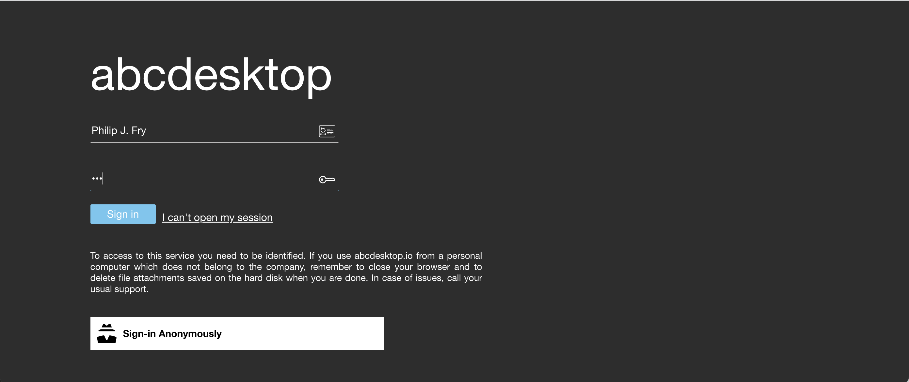

# Use PersistentVolume and PersistentVolumeClaim to retain user's home directory files


To retain user's home directory files, you can define 

- [PersistentVolume](https://kubernetes.io/docs/concepts/storage/persistent-volumes/)
- [PersistentVolumeClaim](https://kubernetes.io/docs/concepts/storage/persistent-volumes/) 

In most cases with managed providers, you do not need to create a `Persistent Volume`, just a `Persistent Volume Claim`. Even in a non-managed set up, the `Persistent Volume` is generally created by the cluster administrator while `Persistent Volume Claim` is used by the end-user. The `Persistent Volume Claim` is namespaced ressource.

- abcdestkop has a `Persistent Volume Claim` support.

> Optionally, if you need a cluster administrator role, then abcdestkop can create `Persistent Volume` and `Persistent Volume Claim`.

## Define `ClusterRole` only if you need to create `Persistent Volume`

 `Persistent Volume` is a non-namespaced resource, so you need to update the `pyos-role` to `ClusterRole` to allow methods `[ "get", "list", "create", "patch", "delete" ]`

```yaml
- apiGroups: [""]
  resources: ["persistentvolumes"]
  verbs: ["get", "list", "create", "patch", "delete"] 
```

Update the default pyos role to `ClusterRole`
 
```bash
kubectl delete -f https://raw.githubusercontent.com/abcdesktopio/conf/main/kubernetes/rbac-role.yaml
kubectl apply -f https://raw.githubusercontent.com/abcdesktopio/conf/main/kubernetes/rbac-cluster.yaml
```


## Define `persistent volume` and `persistent volume claim`

To define `Persistent Volume` or `Persistent Volume Claim`, update the od.config file and set

```
desktop.homedirectorytype: 'persistentVolumeClaim'
desktop.persistentvolume: { YOUR PERSISTENT VOLUME DICT CONFIGURATION TEMPLATE - THIS CAN BE NONE }
desktop.persistentvolumeclaim: 'NAME OF AN EXISTING PVC' OR { YOUR PERSISTENT VOLUME CLAIM DICT CONFIGURATION TEMPLATE } 
desktop.removepersistentvolume: False
desktop.removepersistentvolumeclaim: True
```

### desktop.homedirectorytype 

To use `desktop.persistentvolume` and `desktop.persistentvolumeclaim` values, the `desktop.homedirectorytype` must be set to `persistentVolumeClaim`

```
desktop.homedirectorytype: 'persistentVolumeClaim'
```


### Define `desktop.persistentvolume` is optional

`desktop.persistentvolume` is optional and can be set to `None`, else the type of `desktop.persistentvolume` parameter must be a dict (dictionary). 

If desktop.persistentvolume is `None` then abcdesktop does not create a persistent volume. The persistent volumes should already exist or created by another provisioning engine.

If desktop.persistentvolume is a `dict` then abcdesktop creates the persistent volume. 

If you set `desktop.persistentvolume` to `None`, or if you create the persistent volume manualy, then you don't need to update the pyos role.


### Define `desktop.persistentvolumeclaim`

The type of `desktop.persistentvolumeclaim` is dictionary or a string.

If desktop.homedirectorytype is set to 'persistentVolumeClaim', then `desktop.persistentvolumeclaim` must be defined as a `dict` or a `str`.

Kubernetes persistent volume is a namespaced resource, so you can keep the default `rbac-role` for `pyos-role`.

if `desktop.persistentvolume` option is defined then abcdesktop sets the persistent volume claim specification attribut `volumeName` value to the created persistent volume.

Get more information about [PersistentVolume and PersistentVolumeClaim.](https://kubernetes.io/docs/concepts/storage/persistent-volumes/)

#### Define `desktop.persistentvolumeclaim` as a string

All pods will share the same persistent volume claim, and the same persistent volume. The access mode must be `ReadWriteMany`, else only one pod (the first one) will bound the pvc.

Create a persistent volume

```
kubectl get pv -n abcdesktop
NAME     CAPACITY   ACCESS MODES   RECLAIM POLICY   STATUS   CLAIM                      STORAGECLASS   REASON   AGE
pv-nfs   10Gi       RWX            Retain           Bound    abcdesktop/homedir         nfs-csi                 3d22h
```

```
kubectl describe pv pv-nfs 
Name:            pv-nfs
Labels:          <none>
Annotations:     pv.kubernetes.io/bound-by-controller: yes
                 pv.kubernetes.io/provisioned-by: nfs.csi.k8s.io
Finalizers:      [kubernetes.io/pv-protection]
StorageClass:    nfs-csi
Status:          Bound
Claim:           abcdesktop/homedir
Reclaim Policy:  Retain
Access Modes:    RWX
VolumeMode:      Filesystem
Capacity:        10Gi
Node Affinity:   <none>
Message:         
Source:
    Type:              CSI (a Container Storage Interface (CSI) volume source)
    Driver:            nfs.csi.k8s.io
    FSType:            
    VolumeHandle:      nfs-server.default.svc.cluster.local/share##
    ReadOnly:          false
    VolumeAttributes:      server=192.168.7.101
                           share=/volume1/homedir
Events:                <none>
```

Create a persistent volume claim

```
kubectl get pvc -n abcdesktop
NAME      STATUS   VOLUME   CAPACITY   ACCESS MODES   STORAGECLASS   AGE
homedir   Bound    pv-nfs   10Gi       RWX            nfs-csi        3d22h
```

```
kubectl describe pvc homedir -n abcdesktop
Name:          homedir
Namespace:     abcdesktop
StorageClass:  nfs-csi
Status:        Bound
Volume:        pv-nfs
Annotations:   pv.kubernetes.io/bind-completed: yes
Finalizers:    [kubernetes.io/pvc-protection]
Capacity:      10Gi
Access Modes:  RWX
VolumeMode:    Filesystem
Used By:       fry-88a6e
               hermes-7d84b
Events:        <none>
```

In the od.config file, set the values

```
desktop.homedirectorytype: 'persistentVolumeClaim'
desktop.persistentvolume: None
desktop.persistentvolumeclaim: 'homedir'
desktop.removepersistentvolumeclaim: False
```

If you need to use subPath

```
desktop.persistentvolumeclaimforcesubpath: True
```

'subPath' is not supported for ephemeral container.

#### Define `desktop.persistentvolumeclaim` as a dictionary

in od.config file

```
# set to persistentVolumeClaim
desktop.homedirectorytype: 'persistentVolumeClaim'
desktop.persistentvolumespec: None
desktop.persistentvolumeclaim: {
    'metadata': {
        'name': '{{ provider }}-{{ userid }}',
    },
    'spec': {
      'storageClassName': 'mystorageclass',
      'resources': { 
        'requests': { 
          'storage': '1Gi'
        } 
    },
    'accessModes': [ 'ReadWriteMany' ] } }
```

Replace `mystorageclass` by storageclass of your cloud provider.

To list the storage classes

```bash
kubectl get storageclass
```

- The example output is as follows on the cloud provider [aws](https://aws.amazon.com/).

```
NAME            PROVISIONER             RECLAIMPOLICY   VOLUMEBINDINGMODE      ALLOWVOLUMEEXPANSION   AGE
gp2 (default)   kubernetes.io/aws-ebs   Delete          WaitForFirstConsumer   false 
```

- The example output is as follows on the cloud provider [digitalocean](https://www.digitalocean.com/).

```
NAME                          PROVISIONER                    RECLAIMPOLICY          Immediate           false                  3h22m
do-block-storage (default)    dobs.csi.digitalocean.com      Delete          Immediate           true                   2d7h
do-block-storage-retain       dobs.csi.digitalocean.com      Retain          Immediate           true                   2d7h
do-block-storage-xfs          dobs.csi.digitalocean.com      Delete          Immediate           true                   2d7h
do-block-storage-xfs-retain   dobs.csi.digitalocean.com      Retain          Immediate           true                   2d7h
```

### Template values for `desktop.persistentvolumespec` and `desktop.persistentvolumeclaim`

Value defines inside `{{ VALUE }}` is replaced by the templated value keys:

The template values can be one of them :

| var                 | description     |  
| -------------------:| ---------------:|
| cn                  | Common Name     |
| uid                 | user id         |
| gid                 | group id        |
| uidNumber           | user id number  |
| gidNumber           | group id number |
| homeDirectory       | homeDirectory   |
| loginShell          | loginShell      |
| description         | description     |
| groups              | groups          |
| gecos               | gecos           |
| provider            | provider        |
| protocol            | protocol        |
| providertype        | providertype    |
| name                | user name       |
| userid              | user id         |
| locale              | user's locale   |
| uuid                | a uniqu uuid    |
| *template tag value*| tag value set by auth rules   |


The `uuid` have the same value for the persistent volume and for the persistent volume claim. `uuid` can be use for naming the PVC or the PV, or on all string values.

```
desktop.persistentvolumeclaim: {
    'metadata': {
        'name': '{{ provider }}-{{ userid }}-{{ uuid }}',
    },
    'spec': {
      'volumeName': '{{ provider }}-{{ userid }}-{{ uuid }}',
      'storageClassName': 'nfs-csi',
      'resources': { 
        'requests': { 
          'storage': '1Gi'
        } 
    },
    'accessModes': [ 'ReadWriteOnce' ] } }

desktop.persistentvolume: {
    'metadata': { 'name': '{{ provider }}-{{ userid }}-{{ uuid }}' },
    'spec': {
    'storageClassName': 'nfs-csi',
    'mountOptions': [
      'nfsvers=3'
    ],
    'capacity': {
      'storage': '10Gi'
    },
    'accessModes': [ 'ReadWriteOnce' ],
    'csi': {
      'driver': 'nfs.csi.k8s.io',
      'readOnly': False,
      'volumeHandle': '192.168.7.101#volume1#homedir#{{ userid }}',
      'volumeAttributes': {
          'server': '192.168.7.101',
          'share': '/volume1/homedir/{{ userid }}'
      } } } }
```


The variables persistentvolumeclaim and persistentvolume become 

```
desktop.persistentvolumeclaim: {
	  'metadata': {'name': 'planet-fry-1841f'}, 
	  'spec': {
	    'volumeName': 'planet-fry-1841f', 
	    'storageClassName': 'nfs-csi', 
	    'resources': {
	      'requests': {'storage': '1Gi'}
	    }, 
	    'accessModes': ['ReadWriteOnce']
	  }
}
desktop.persistentvolume: {
	 'metadata': { 'name': 'planet-fry-1841f'}, 
	 'spec': {
	   'storageClassName': 'nfs-csi', 
	   'mountOptions': ['nfsvers=3'], 
	   'capacity': {'storage': '10Gi'}, 
	   'accessModes': ['ReadWriteOnce'], 
	   'csi': {
	     'driver': 'nfs.csi.k8s.io', 
	     'readOnly': False, 
	     'volumeHandle': '192.168.7.101#volume1#homedir#fry',
	     'volumeAttributes': {
	       'server': '192.168.7.101', 
	       'share': '/volume1/homedir/fry'
	     }
	   }
	  }
}
```


### desktop.removepersistentvolume

During the remove desktop process, delete or not the persistent volume. The persistent volume can be delete only if the `desktop.deletepersistentvolumeclaim` is True.

The default value for `desktop.removepersistentvolume` is `False`. 


### desktop.removepersistentvolumeclaim

During the remove desktop process, delete or not the persistent volume claim. 

The default value for `desktop.removepersistentvolumeclaim` is `False`.


## Define persistentVolume using `csi-driver-nfs` 


In this example, we use nfs protocol to share user home directory on each worker node

Use the `https://github.com/kubernetes-csi/csi-driver-nfs` as a `csi-driver-nfs` with a nfs server as backend. 

### On the nfs server

On the nfs server, create an export with the `no_root_squash` option

For example export `/volume1/pods`

```
/volume1/pods        192.168.7.0/24(rw,async,no_wdelay,crossmnt,insecure,no_root_squash,insecure_locks,anonuid=1025,anongid=100)
```

### Install the `csi-driver-nfs`

Run the install `install-driver.sh` command from [kubernetes-csi/csi-driver-nfs](https://github.com/kubernetes-csi/csi-driver-nfs) GitHub repository.

```
curl -skSL https://raw.githubusercontent.com/kubernetes-csi/csi-driver-nfs/v4.4.0/deploy/install-driver.sh | bash -s v4.4.0 --
```

Create a storage class file nfs-csi-sc-ds01.yaml,

- replace server: `192.168.7.101` by your own nfs server ip address
- replace share: `/volume1/pods` by your own share


Content of the default `nfs-csi-sc-ds01.yaml`

```yaml
apiVersion: storage.k8s.io/v1
kind: StorageClass
metadata:
  name: nfs-csi-sc-ds01
provisioner: nfs.csi.k8s.io
parameters:
  server: 192.168.7.101
  share: /volume1/pods
  mountPermissions: "0755"
  # csi.storage.k8s.io/provisioner-secret is only needed for providing mountOptions in DeleteVolume
  # csi.storage.k8s.io/provisioner-secret-name: "mount-options"
  # csi.storage.k8s.io/provisioner-secret-namespace: "default"
reclaimPolicy: Delete
volumeBindingMode: Immediate
mountOptions:
  - nfsvers=3
```

```bash
kubectl apply -f nfs-csi-sc-ds01.yaml
```

You read the response on stdout

```
storageclass.storage.k8s.io/nfs-csi-sc-ds01 created
```

Check the storage class `nfs-csi-sc-ds01`

```
kubectl get sc
NAME                 PROVISIONER      RECLAIMPOLICY   VOLUMEBINDINGMODE   ALLOWVOLUMEEXPANSION   AGE
nfs-csi-sc-ds01      nfs.csi.k8s.io   Delete          Immediate           false                  18m
```

### Update the `od.config` file

In your od.config file, define the entry `desktop.persistentvolumeclaim`

- `desktop.homedirectorytype`: 'persistentVolumeClaim' to use the persistent volume claim features.
- `desktop.persistentvolume`: create a new persistent volume.
- `desktop.persistentvolumeclaim` create a new persistent volume claim for the user's homeDir, the storageClassName `nfs-csi-sc-ds01`
 
The Persistent Volume and Persistent Volume Claim are created by abcdesktop. Abcdesktop defines a binding between that specific PV and PVC


```
# set to persistentVolumeClaim
desktop.homedirectorytype: 'persistentVolumeClaim'
desktop.deletepersistentvolume: False
desktop.deletepersistentvolumeclaim: True
desktop.persistentvolume: {
            'metadata': { 'name': '{{ provider }}-{{ userid }}' },
            'spec': {
            'storageClassName': 'nfs-csi',
            'mountOptions': [
              'nfsvers=3'
            ],
            'capacity': {
              'storage': '10Gi'
            },
            'accessModes': [ 'ReadWriteOnce' ],
            'csi': {
              'driver': 'nfs.csi.k8s.io',
              'readOnly': False,
              'volumeHandle': '192.168.7.101#volume1#homedir#{{ userid }}',
              'volumeAttributes': {
                  'server': '192.168.7.101',
                  'share': '/volume1/homedir/{{ userid }}'
              } } } }
                         
desktop.persistentvolumeclaim: {
            'metadata': {
                'name': '{{ provider }}-{{ userid }}',
            },
            'spec': {
              'storageClassName': 'nfs-csi',
              'volumeName': '{{ provider }}-{{ userid }}',
              'resources': { 
                'requests': { 
                  'storage': '1Gi'
                } 
            },
            'accessModes': [ 'ReadWriteMany' ] } }
```

Update the new config file and restart `pyos` pods.
Update the pyos role to allow 

```bash
kubectl delete -f https://raw.githubusercontent.com/abcdesktopio/conf/main/kubernetes/rbac-role.yaml
kubectl apply -f https://raw.githubusercontent.com/abcdesktopio/conf/main/kubernetes/rbac-cluster.yaml
```

```bash
kubectl delete configmap abcdesktop-config -n abcdesktop
kubectl create configmap abcdesktop-config --from-file=od.config -n abcdesktop
kubectl delete pods -l run=pyos-od -n abcdesktop
```

abcdesktop creates PV and PVC for you.


### Login to your abcdesktop service 

Login as user (`Philip J. Fry`, `fry`)



The new desktop for `Philip J. Fry` is created.

Start the web shell command using the search bar 


Using the web shell application start the df command 


The fry home dir is mounted on `192.168.7.101:/volume1/pods/pvc-b8317d7b-dc35-4fc3-88e9-ad894ab11d32`


### List the PersistentVolume and PersistentVolumeClaim

List the new PersistentVolume

```bash
kubectl get pv 
NAME                                       CAPACITY   ACCESS MODES   RECLAIM POLICY   STATUS   CLAIM                         STORAGECLASS      REASON   AGE
planet-fry                                 10Gi       RWO            Retain           Bound    abcdesktop/planet-fry         nfs-csi                    2m58s
```

List the new PersistentVolumeClaim

```bash
kubectl get pvc -n abcdesktop 
NAME               STATUS   VOLUME                                     CAPACITY   ACCESS MODES   STORAGECLASS      AGE
planet-fry         Bound    planet-fry                                 10Gi       RWO            nfs-csi        107s
```


Get the persistent volume claim's description
 
```bash
kubectl describe pvc planet-fry  -n abcdesktop
Name:          planet-fry
Namespace:     abcdesktop
StorageClass:  nfs-csi
Status:        Bound
Volume:        planet-fry
Labels:        access_provider=planet
               access_providertype=ldap
               access_userid=fry
Annotations:   pv.kubernetes.io/bind-completed: yes
Finalizers:    [kubernetes.io/pvc-protection]
Capacity:      10Gi
Access Modes:  RWO
VolumeMode:    Filesystem
Used By:       fry-055f6
Events:        <none>
```

Get the persistent volume description

```
kubectl describe pv planet-fry
Name:            planet-fry
Labels:          access_provider=planet
                 access_providertype=ldap
                 access_userid=fry
Annotations:     pv.kubernetes.io/bound-by-controller: yes
Finalizers:      [kubernetes.io/pv-protection]
StorageClass:    nfs-csi
Status:          Bound
Claim:           abcdesktop/planet-fry
Reclaim Policy:  Retain
Access Modes:    RWO
VolumeMode:      Filesystem
Capacity:        10Gi
Node Affinity:   <none>
Message:         
Source:
    Type:              CSI (a Container Storage Interface (CSI) volume source)
    Driver:            nfs.csi.k8s.io
    FSType:            
    VolumeHandle:      192.168.7.101#volume1#homedir#fry
    ReadOnly:          false
    VolumeAttributes:      server=192.168.7.101
                           share=/volume1/homedir/fry
Events:                <none>
```

## Define persistentVolume using storage class `do-block-storage` on digitalocean


### Update od.config file 

Update od.config file with the options

```
desktop.homedirectorytype: 'persistentVolumeClaim'
desktop.persistentvolume: None
desktop.persistentvolumeclaim: {
            'metadata': {
                'name': '{{ provider }}-{{ userid }}',
            },
            'spec': {
              'storageClassName': 'do-block-storage',
              'resources': {
                'requests': {
                  'storage': '1Gi'
                }
            },
            'accessModes': [ 'ReadWriteOnce' ] } }
```

Update the configmap

```
kubectl create -n abcdesktop configmap abcdesktop-config --from-file=od.config -o yaml --dry-run=client | kubectl replace -n abcdesktop -f -
```     

Restart pyos pod

```   
kubectl delete pods -l run=pyos-od -n abcdesktop
```   

Login to your abcdesktop service, you should read on the html page, the status

```
b.Reading your persistent volume claim planet-fry, status is Pending, using storage class do-block-storage ....
b.Creating your desktop
b.Successfully assigned abcdesktop/fry-0d805 to pool-g8u8ddr44-yhh3i.................
b.Your pod gets event SuccessfulAttachVolume AttachVolume.Attach succeeded for volume "pvc-38899590-c94a-4849-a111-31ae7de624e1" ..
b.Started container i-planet-fry
b.pending: x-planet-fry is starting
b.Created container x-planet-fry
b.Your pod fry-0d805 is Pending..
c.Waiting for desktop graphical service 1/42........
c.Waiting for desktop spawner service 1/42
c.Waiting for desktop graphical service 2/42
Rock and roll
```

Read the new pod for fry the user `fry`

```
kubectl get pods  -n abcdesktop
NAME                            READY   STATUS    RESTARTS   AGE
fry-0d805                       4/4     Running   0          17m
memcached-od-5ff8844d56-lcn7p   1/1     Running   0          106m
mongodb-od-77c945467d-97g8w     1/1     Running   0          106m
nginx-od-7445969696-lpfhh       1/1     Running   0          106m
openldap-od-5bbdd75864-dprvl    1/1     Running   0          106m
pyos-od-7584db6787-chtdc        1/1     Running   0          19m
speedtest-od-7f5484966f-5pl6k   1/1     Running   0          106m
```

Read the pvc for fry

```
kubectl get pvc  -n abcdesktop
NAME         STATUS   VOLUME                                     CAPACITY   ACCESS MODES   STORAGECLASS       AGE
planet-fry   Bound    pvc-38899590-c94a-4849-a111-31ae7de624e1   1Gi        RWO            do-block-storage   17m
```

Read the pv for fry

```
kubectl get pv                
NAME                                       CAPACITY   ACCESS MODES   RECLAIM POLICY   STATUS   CLAIM                   STORAGECLASS       REASON   AGE
pvc-38899590-c94a-4849-a111-31ae7de624e1   1Gi        RWO            Delete           Bound    abcdesktop/planet-fry   do-block-storage            17m
```

## known issues


### Bound a volume if `desktop.deletepersistentvolumeclaim` is `False`

When `desktop.deletepersistentvolumeclaim` is `True` and `desktop.deletepersistentvolume` is `False`, if you create manually the persistent volumes, you may have to patch the `claimRef` of the persistent volumes to make it `Available` again.

```
kubectl get pv 
NAME        CAPACITY   ACCESS MODES   RECLAIM POLICY   STATUS     CLAIM                   STORAGECLASS   REASON   AGE
planet-fry  10Gi       RWO            Retain           Released   abcdesktop/planet-fry   nfs-csi                 4m1                           
```

```bash
kubectl patch pv planet-fry -p '{"spec":{"claimRef": null}}' 
persistentvolume/planet-fry patched
```

```
kubectl get pv 
NAME          CAPACITY   ACCESS MODES   RECLAIM POLICY   STATUS      CLAIM      STORAGECLASS   REASON   AGE
planet-fry    10Gi       RWO            Retain           Available              nfs-csi                 8m
```

