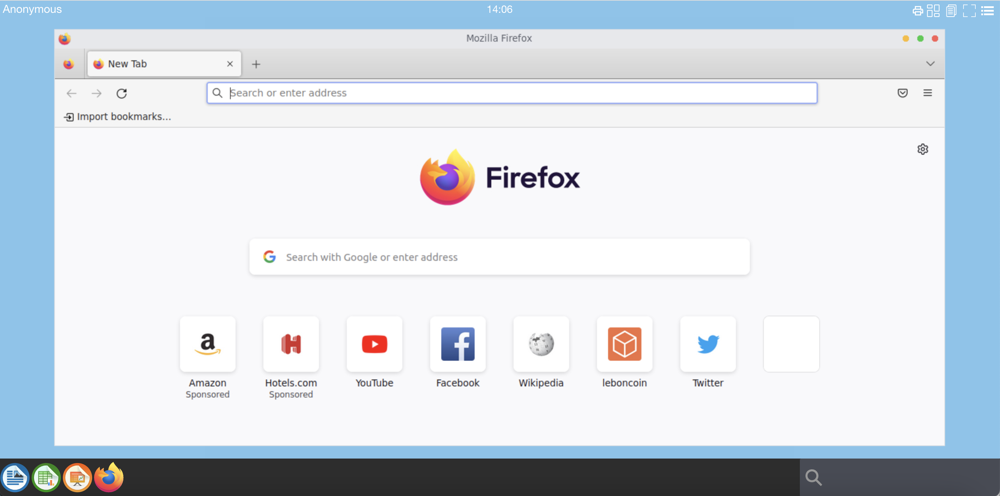
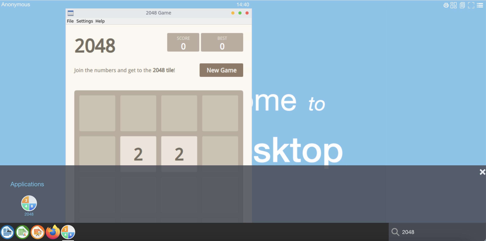

# Setup applications for abcdesktop

## Quick application install

> Quick installation can be run on Linux or macOS operation system. 

Download and execute the `pullapps-3.1.sh` script :

```
curl -sL https://raw.githubusercontent.com/abcdesktopio/conf/main/kubernetes/pullapps-3.1.sh | bash
```

This script starts abcdesktop application on an empty desktop. Pod is created to ask Kubernetes for pulling containers image.


```
NAME                                                             READY   STATUS              RESTARTS   AGE
daemonset-nginx-dqxzx                                            1/1     Running             0          100m
daemonset-pyos-rdwws                                             1/1     Running             0          100m
memcached-od-bdcbbcb74-xbg8x                                     1/1     Running             0          100m
mongodb-od-6484d8bc67-9xsgm                                      1/1     Running             0          100m
openldap-od-795c55f6db-pb68k                                     1/1     Running             0          100m
pull-2048-abcinst-9fd80f22ad6b0750cb3d248bda04de25444bab2cf274   1/1     Running             0          5s
pull-calc-abcinst-57622131ac1ce4b37d5cec51ee7f0071c460293158a4   1/1     Running             0          3s
pull-firefox-abcinst-d2872d0d272a3a02606b4877c12e832755ba1a378   0/1     ContainerCreating   0          1s
pull-gimp-abcinst-051fefa55d97338653a58e86ccdd5f1a3e66f7f05017   0/1     ContainerCreating   0          0s
pull-impress-abcinst-f74fed932051c2760b3fd69f4ef475e34ad1a8a49   0/1     ContainerCreating   0          2s
pull-writer-abcinst-cfe1a4f74d19fbe49d86d211f99d005532b6cf7c87   1/1     Running             0          3s
pull-xterm-abcinst-0e802cfa8addb4648f843869325f3413d544bb9eae8   1/1     Running             0          4s
speedtest-od-5565dfdc67-vdwcl                                    1/1     Running             0          100m
```

list of created pods for pulling is pull-2048-abcinst-9fd80f22ad6b0750cb3d248bda04de25444bab2cf274

```
pull-calc-abcinst-57622131ac1ce4b37d5cec51ee7f0071c460293158a4
pull-firefox-abcinst-d2872d0d272a3a02606b4877c12e832755ba1a378
pull-gimp-abcinst-051fefa55d97338653a58e86ccdd5f1a3e66f7f05017
pull-impress-abcinst-f74fed932051c2760b3fd69f4ef475e34ad1a8a49
pull-writer-abcinst-cfe1a4f74d19fbe49d86d211f99d005532b6cf7c87
pull-xterm-abcinst-0e802cfa8addb4648f843869325f3413d544bb9eae8
pod/pull-2048-abcinst-9fd80f22ad6b0750cb3d248bda04de25444bab2cf274 condition met
pod/pull-calc-abcinst-57622131ac1ce4b37d5cec51ee7f0071c460293158a4 condition met
pod/pull-firefox-abcinst-d2872d0d272a3a02606b4877c12e832755ba1a378 condition met
pod/pull-gimp-abcinst-051fefa55d97338653a58e86ccdd5f1a3e66f7f05017 condition met
pod/pull-impress-abcinst-f74fed932051c2760b3fd69f4ef475e34ad1a8a49 condition met
pod/pull-writer-abcinst-cfe1a4f74d19fbe49d86d211f99d005532b6cf7c87 condition met
pod/pull-xterm-abcinst-0e802cfa8addb4648f843869325f3413d544bb9eae8 condition met
```

### Connect to your abcdesktop

The API server receives a new image event from docker daemon. To run the new applications just refresh you web browser page.

Now reconnect to your abcdesktop. 

Open your navigator to http://[your-ip-hostname]:30443/

```	
http://localhost:30443/
```

The new applications are installed, and ready to run.




## Mannualy install application


Add new application, require to send an application json document to the control-plane `pyos`.


### Download a json application document format


In this example, we install the application `2048` game, but you can choose another one from [https://github.com/abcdesktopio/conf/tree/main/apps](https://github.com/abcdesktopio/conf/tree/main/apps)


```
curl https://raw.githubusercontent.com/abcdesktopio/conf/main/apps/2048.d.3.0.json --output 2048.json
```

To inspect image json you can also run crictl `inspecti` or `docker inspect` command.

- `crictl inspecti abcdesktopio/2048.d:3.0 > 2048.json`
- `docker inspect abcdesktopio/2048.d:3.0 > 2048.json`

The image manager endpoint REST API is `http://[your-ip-hostname]:30443/API/manager/image`

Replace `[your-ip-hostname]` by your own server ip, by default with localhost, the url become `http://localhost:30443/API/manager/image`


Send the 2048.json file to the images REST API

```
curl -X PUT -H 'Content-Type: text/javascript' http://localhost:30443/API/manager/image -d @2048.json
```
The response is the json document.


```
[{"home": null, "cmd": ["/composer/appli-docker-entrypoint.sh"], "workingdir": "/home/balloon", "user": "balloon", "sha_id": "sha256:1897dd8f22453ae01c72d4975d43e5505b6faae3f4a41611108c2e3beb2ab4bd", "id": "abcdesktopio/2048.d:3.0", "rules": {"homedir": {"default": true}}, "acl": {"permit": ["all"]}, "launch": "2048-qt.2048-qt", "name": "2048", "icon": "circle_2048.svg", "icondata": "PHN2ZyBpZD0ic3ZnMzIiIHdpZHRoPSI2NCIgaGVpZ2h0PSI2NCIgdmVyc2lvbj0iMS4xIiB4bWxucz0iaHR0cDovL3d3dy53My5vcmcvMjAwMC9zdmciIHhtbG5zOnhsaW5rPSJodHRwOi8vd3d3LnczLm9yZy8xOTk5L3hsaW5rIj4KIDxkZWZzIGlkPSJkZWZzMTgiPgogIDxsaW5lYXJHcmFkaWVudCBpZD0iYiIgeDE9IjQwOC4yNSIgeDI9IjQwNy45NCIgeTE9IjU0Ny42IiB5Mj0iNDk4Ljg5IiBncmFkaWVudFRyYW5zZm9ybT0ibWF0cml4KDEuMzI3NiAwIDAgMS4zMjc2IC01MTAuNjQgLTY2My41MikiIGdyYWRpZW50VW5pdHM9InVzZXJTcGFjZU9uVXNlIj4KICAgPHN0b3AgaWQ9InN0b3AyIiBzdG9wLWNvbG9yPSIjZmZmIiBvZmZzZXQ9IjAiLz4KICAgPHN0b3AgaWQ9InN0b3A0IiBzdG9wLWNvbG9yPSIjZTZlNmU2IiBvZmZzZXQ9IjEiLz4KICA8L2xpbmVhckdyYWRpZW50PgogIDxmaWx0ZXIgaWQ9ImQiIHg9Ii0uMDU4ODgzIiB5PSItLjA2MTE2MSIgd2lkdGg9IjEuMTE3OCIgaGVpZ2h0PSIxLjEyMjMiIGNvbG9yLWludGVycG9sYXRpb24tZmlsdGVycz0ic1JHQiI+CiAgIDxmZUdhdXNzaWFuQmx1ciBpZD0iZmVHYXVzc2lhbkJsdXIxMiIgc3RkRGV2aWF0aW9uPSIxMC41NjIzNzkiLz4KICA8L2ZpbHRlcj4KICA8ZmlsdGVyIGlkPSJjIiB4PSItLjAzNiIgeT0iLS4wMzYiIHdpZHRoPSIxLjA3MiIgaGVpZ2h0PSIxLjA3MiIgY29sb3ItaW50ZXJwb2xhdGlvbi1maWx0ZXJzPSJzUkdCIj4KICAgPGZlR2F1c3NpYW5CbHVyIGlkPSJmZUdhdXNzaWFuQmx1cjE1IiBzdGREZXZpYXRpb249IjAuODg5NzI0NDkiLz4KICA8L2ZpbHRlcj4KICA8bGluZWFyR3JhZGllbnQgaWQ9ImxpbmVhckdyYWRpZW50OTA1IiB4MT0iMjUuMDkzIiB4Mj0iMjUuMDM0IiB5MT0iNTkuMjMzIiB5Mj0iMi44MjYzIiBncmFkaWVudFVuaXRzPSJ1c2VyU3BhY2VPblVzZSI+CiAgIDxzdG9wIGlkPSJzdG9wODk5IiBzdG9wLWNvbG9yPSIjZmY1NDAwIiBvZmZzZXQ9IjAiLz4KICAgPHN0b3AgaWQ9InN0b3A5MDEiIHN0b3AtY29sb3I9IiNmYjAiIG9mZnNldD0iMSIvPgogIDwvbGluZWFyR3JhZGllbnQ+CiAgPGxpbmVhckdyYWRpZW50IGlkPSJsaW5lYXJHcmFkaWVudDkxMyIgeDE9IjI2LjUwMiIgeDI9IjI2LjU5IiB5MT0iNTkuNjAyIiB5Mj0iMTguOTQ5IiBncmFkaWVudFVuaXRzPSJ1c2VyU3BhY2VPblVzZSI+CiAgIDxzdG9wIGlkPSJzdG9wOTA3IiBzdG9wLWNvbG9yPSIjMzVlODcyIiBvZmZzZXQ9IjAiLz4KICAgPHN0b3AgaWQ9InN0b3A5MDkiIHN0b3AtY29sb3I9IiMzNGU5ZDgiIG9mZnNldD0iMSIvPgogIDwvbGluZWFyR3JhZGllbnQ+CiAgPGxpbmVhckdyYWRpZW50IGlkPSJsaW5lYXJHcmFkaWVudDkyMSIgeDE9IjQzLjA2NyIgeDI9IjQyLjU3OSIgeTE9IjU5LjQxIiB5Mj0iMjguMzQ2IiBncmFkaWVudFVuaXRzPSJ1c2VyU3BhY2VPblVzZSI+CiAgIDxzdG9wIGlkPSJzdG9wOTE1IiBzdG9wLWNvbG9yPSIjMzU1M2U0IiBvZmZzZXQ9IjAiLz4KICAgPHN0b3AgaWQ9InN0b3A5MTciIHN0b3AtY29sb3I9IiM1NmNlZjMiIG9mZnNldD0iMSIvPgogIDwvbGluZWFyR3JhZGllbnQ+CiAgPGZpbHRlciBpZD0iZmlsdGVyMTAyNSIgeD0iLS4xMjQ2MiIgeT0iLS4xMjQ2MiIgd2lkdGg9IjEuMjQ5MiIgaGVpZ2h0PSIxLjI0OTIiIGNvbG9yLWludGVycG9sYXRpb24tZmlsdGVycz0ic1JHQiI+CiAgIDxmZUdhdXNzaWFuQmx1ciBpZD0iZmVHYXVzc2lhbkJsdXIxMDI3IiBzdGREZXZpYXRpb249IjEuMzQ4NzMwNSIvPgogIDwvZmlsdGVyPgogIDxmaWx0ZXIgaWQ9ImZpbHRlcjEwMjkiIHg9Ii0uMTI0NjIiIHk9Ii0uMTI0NjIiIHdpZHRoPSIxLjI0OTIiIGhlaWdodD0iMS4yNDkyIiBjb2xvci1pbnRlcnBvbGF0aW9uLWZpbHRlcnM9InNSR0IiPgogICA8ZmVHYXVzc2lhbkJsdXIgaWQ9ImZlR2F1c3NpYW5CbHVyMTAzMSIgc3RkRGV2aWF0aW9uPSIxLjM0ODczMDUiLz4KICA8L2ZpbHRlcj4KICA8ZmlsdGVyIGlkPSJmaWx0ZXIxMDMzIiB4PSItLjEyNDYyIiB5PSItLjEyNDYyIiB3aWR0aD0iMS4yNDkyIiBoZWlnaHQ9IjEuMjQ5MiIgY29sb3ItaW50ZXJwb2xhdGlvbi1maWx0ZXJzPSJzUkdCIj4KICAgPGZlR2F1c3NpYW5CbHVyIGlkPSJmZUdhdXNzaWFuQmx1cjEwMzUiIHN0ZERldmlhdGlvbj0iMS4zNDg3MzA1Ii8+CiAgPC9maWx0ZXI+CiAgPGZpbHRlciBpZD0iZmlsdGVyMTEzOSIgeD0iLS4yNDk0IiB5PSItLjE4NjM0IiB3aWR0aD0iMS40OTg4IiBoZWlnaHQ9IjEuMzcyNyIgY29sb3ItaW50ZXJwb2xhdGlvbi1maWx0ZXJzPSJzUkdCIj4KICAgPGZlR2F1c3NpYW5CbHVyIGlkPSJmZUdhdXNzaWFuQmx1cjExNDEiIHN0ZERldmlhdGlvbj0iMC43NzY0MjE3NiIvPgogIDwvZmlsdGVyPgogIDxmaWx0ZXIgaWQ9ImZpbHRlcjExNDMiIHg9Ii0uMjM5NzIiIHk9Ii0uMTg2MzQiIHdpZHRoPSIxLjQ3OTQiIGhlaWdodD0iMS4zNzI3IiBjb2xvci1pbnRlcnBvbGF0aW9uLWZpbHRlcnM9InNSR0IiPgogICA8ZmVHYXVzc2lhbkJsdXIgaWQ9ImZlR2F1c3NpYW5CbHVyMTE0NSIgc3RkRGV2aWF0aW9uPSIwLjc3NjQyMTc2Ii8+CiAgPC9maWx0ZXI+CiAgPGZpbHRlciBpZD0iZmlsdGVyMTE0NyIgeD0iLS4yMjM0MiIgeT0iLS4xODYzNCIgd2lkdGg9IjEuNDQ2OCIgaGVpZ2h0PSIxLjM3MjciIGNvbG9yLWludGVycG9sYXRpb24tZmlsdGVycz0ic1JHQiI+CiAgIDxmZUdhdXNzaWFuQmx1ciBpZD0iZmVHYXVzc2lhbkJsdXIxMTQ5IiBzdGREZXZpYXRpb249IjAuNzc2NDIxNzYiLz4KICA8L2ZpbHRlcj4KIDwvZGVmcz4KIDxyZWN0IGlkPSJyZWN0MjAiIHRyYW5zZm9ybT0ibWF0cml4KDEuMDExNSAwIDAgMS4wMTE1IC0zODkuMzIgLTQ4OS45MikiIHg9IjM4Ni44NSIgeT0iNDg2LjMxIiB3aWR0aD0iNTkuMzE1IiBoZWlnaHQ9IjU5LjMxNSIgcnk9IjI5LjY1NyIgZmlsdGVyPSJ1cmwoI2MpIiBvcGFjaXR5PSIuMjUiLz4KIDxyZWN0IGlkPSJyZWN0MjIiIHg9IjEuOTgyNiIgeT0iMS45Nzg0IiB3aWR0aD0iNTkuOTk3IiBoZWlnaHQ9IjU5Ljk5NyIgcnk9IjI5Ljk5OCIgZmlsbD0idXJsKCNiKSIgc3Ryb2tlLXdpZHRoPSIxLjAxMTUiLz4KIDxnIHN0cm9rZS13aWR0aD0iLjUzMDcyIj4KICA8cGF0aCBpZD0icGF0aDkyMyIgZD0ibTMxIDUuMDI1NGMtMTQuMTU4IDAuNTExMTMtMjUuNDYzIDExLjgxNi0yNS45NzUgMjUuOTc1aDI1Ljk3NXoiIGVuYWJsZS1iYWNrZ3JvdW5kPSJuZXciIGZpbHRlcj0idXJsKCNmaWx0ZXIxMDI1KSIgb3BhY2l0eT0iLjE1Ii8+CiAgPHBhdGggaWQ9InBhdGgzODY3MyIgZD0ibTMxIDUuMDI1NGMtMTQuMTU4IDAuNTExMTMtMjUuNDYzIDExLjgxNi0yNS45NzUgMjUuOTc1aDI1Ljk3NXoiIGVuYWJsZS1iYWNrZ3JvdW5kPSJuZXciIGZpbGw9InVybCgjbGluZWFyR3JhZGllbnQ5MDUpIi8+CiAgPHBhdGggaWQ9InBhdGg5MjUiIGQ9Im0zMyAzM3YyNS45NzVjMTQuMTU4LTAuNTExMTIgMjUuNDYzLTExLjgxNiAyNS45NzUtMjUuOTc1eiIgZW5hYmxlLWJhY2tncm91bmQ9Im5ldyIgZmlsdGVyPSJ1cmwoI2ZpbHRlcjEwMjkpIiBvcGFjaXR5PSIuMTUiLz4KICA8cGF0aCBpZD0icGF0aDM4NjcxIiBkPSJtMzMgMzN2MjUuOTc1YzE0LjE1OC0wLjUxMTEyIDI1LjQ2My0xMS44MTYgMjUuOTc1LTI1Ljk3NXoiIGVuYWJsZS1iYWNrZ3JvdW5kPSJuZXciIGZpbGw9InVybCgjbGluZWFyR3JhZGllbnQ5MjEpIi8+CiAgPHBhdGggaWQ9InBhdGg5MjciIGQ9Im01LjAyNTQgMzNjMC41MTExMyAxNC4xNTggMTEuODE2IDI1LjQ2MyAyNS45NzUgMjUuOTc1di0yNS45NzV6IiBlbmFibGUtYmFja2dyb3VuZD0ibmV3IiBmaWx0ZXI9InVybCgjZmlsdGVyMTAzMykiIG9wYWNpdHk9Ii4xNSIvPgogIDxwYXRoIGlkPSJyZWN0MzgxMTUiIGQ9Im01LjAyNTQgMzNjMC41MTExMyAxNC4xNTggMTEuODE2IDI1LjQ2MyAyNS45NzUgMjUuOTc1di0yNS45NzV6IiBlbmFibGUtYmFja2dyb3VuZD0ibmV3IiBmaWxsPSJ1cmwoI2xpbmVhckdyYWRpZW50OTEzKSIvPgogPC9nPgogPHBhdGggaWQ9InBhdGgxMDM3IiBkPSJtMjEuNjkgMjMuODY5YzEuOTMxOS0xLjM3NzkgMy4wMzk4LTIuOTY4OCAzLjAzOTgtNC43MDE2IDAtMS45ODg3LTEuNDIwNS0zLjE2NzctMy44MDY4LTMuMTY3Ny0xLjIwNzQgMC0yLjM3MjIgMC4yOTgzLTMuMzk1IDAuODUyMjlsMC41NTM5OCAxLjg2MDhjMC45Mzc1MS0wLjQyNjE0IDEuNjQ3OC0wLjYxMDgyIDIuMzI5Ni0wLjYxMDgyIDEuMTIyMiAwIDEuNzYxNCAwLjQ5NzE4IDEuNzYxNCAxLjM5MjEgMCAxLjEzNjQtMC45OTQzNSAyLjQwMDYtNC4yNzU1IDQuOTU3M3YxLjU0ODNoNy4xMDIzdi0yLjEzMDd6IiBlbmFibGUtYmFja2dyb3VuZD0ibmV3IiBmaWx0ZXI9InVybCgjZmlsdGVyMTEzOSkiIG9wYWNpdHk9Ii4xNSIgc3Ryb2tlLXdpZHRoPSIuMzgwNDVweCIgc3R5bGU9ImZvbnQtZmVhdHVyZS1zZXR0aW5nczpub3JtYWw7Zm9udC12YXJpYW50LWNhcHM6bm9ybWFsO2ZvbnQtdmFyaWFudC1saWdhdHVyZXM6bm9ybWFsO2ZvbnQtdmFyaWFudC1udW1lcmljOm5vcm1hbCIvPgogPHBhdGggaWQ9InBhdGgzODcwOCIgZD0ibTIxLjY5IDIzLjg2OWMxLjkzMTktMS4zNzc5IDMuMDM5OC0yLjk2ODggMy4wMzk4LTQuNzAxNiAwLTEuOTg4Ny0xLjQyMDUtMy4xNjc3LTMuODA2OC0zLjE2NzctMS4yMDc0IDAtMi4zNzIyIDAuMjk4My0zLjM5NSAwLjg1MjI5bDAuNTUzOTggMS44NjA4YzAuOTM3NTEtMC40MjYxNCAxLjY0NzgtMC42MTA4MiAyLjMyOTYtMC42MTA4MiAxLjEyMjIgMCAxLjc2MTQgMC40OTcxOCAxLjc2MTQgMS4zOTIxIDAgMS4xMzY0LTAuOTk0MzUgMi40MDA2LTQuMjc1NSA0Ljk1NzN2MS41NDgzaDcuMTAyM3YtMi4xMzA3eiIgZW5hYmxlLWJhY2tncm91bmQ9Im5ldyIgZmlsbD0iI2ZmZiIgc3Ryb2tlLXdpZHRoPSIuMzgwNDVweCIgc3R5bGU9ImZvbnQtZmVhdHVyZS1zZXR0aW5nczpub3JtYWw7Zm9udC12YXJpYW50LWNhcHM6bm9ybWFsO2ZvbnQtdmFyaWFudC1saWdhdHVyZXM6bm9ybWFsO2ZvbnQtdmFyaWFudC1udW1lcmljOm5vcm1hbCIvPgogPHBhdGggaWQ9InBhdGgxMDM5IiBkPSJtNDQuOTM4IDQyLjYwOGMwLjk4MDQtMC41MDQxOSAxLjUxMjYtMS4yNjA1IDEuNTEyNi0yLjE1NjggMC0xLjQ3MDYtMS40MTQ2LTIuNDUxLTMuNTAxNC0yLjQ1MS0yLjIxMjkgMC0zLjY4MzUgMS4xOTA1LTMuNjgzNSAyLjk2OTIgMCAxLjA3ODQgMC41NDYyMSAxLjcyMjcgMS4yODg1IDIuMTcwOS0wLjk5NDQgMC40MjAxNy0xLjU1NDYgMS4xNzY1LTEuNTU0NiAyLjEyODkgMCAxLjYzODcgMS41NDA2IDIuNzMxMSAzLjg1MTcgMi43MzExIDIuMzUzIDAgMy45MjE1LTEuMjA0NSAzLjkyMTUtMy4wMjUyIDAtMS4yNzQ1LTAuODQwMzQtMS45MzI4LTEuODM0Ny0yLjM2Njl6bS0yLjA3MjgtMi41MzVjMC42NTgyNSAwIDEuMDkyNSAwLjMyMjEzIDEuMDkyNSAwLjgyNjM0IDAgMC41MDQxOS0wLjM2NDE0IDAuOTEwMzctMC45MjQzNiAxLjA1MDQtMC43MjgyOS0wLjI2NjEtMS4yNzQ1LTAuNTQ2MjEtMS4yNzQ1LTEuMDY0NCAwLTAuNDkwMiAwLjQzNDE2LTAuODEyMzEgMS4xMDY0LTAuODEyMzF6bTAuMTEyMDQgNS44NTQ0Yy0wLjg5NjM0IDAtMS40ODQ2LTAuNDM0MTYtMS40ODQ2LTEuMDc4NCAwLTAuNDYyMTggMC4yOTQxMi0wLjgyNjM0IDAuNzk4MzItMC45OTQ0IDEuMDUwNCAwLjMzNjEzIDEuOTg4OCAwLjU4ODIyIDEuOTg4OCAxLjI0NjUgMCAwLjQ5MDItMC41MzIyMSAwLjgyNjM0LTEuMzAyNSAwLjgyNjM0eiIgZW5hYmxlLWJhY2tncm91bmQ9Im5ldyIgZmlsdGVyPSJ1cmwoI2ZpbHRlcjExNDMpIiBvcGFjaXR5PSIuMTUiIHN0cm9rZS13aWR0aD0iLjM3NTEycHgiIHN0eWxlPSJmb250LWZlYXR1cmUtc2V0dGluZ3M6bm9ybWFsO2ZvbnQtdmFyaWFudC1jYXBzOm5vcm1hbDtmb250LXZhcmlhbnQtbGlnYXR1cmVzOm5vcm1hbDtmb250LXZhcmlhbnQtbnVtZXJpYzpub3JtYWwiLz4KIDxwYXRoIGlkPSJwYXRoMzg3MTEiIGQ9Im00NC45MzggNDIuNjA4YzAuOTgwNC0wLjUwNDE5IDEuNTEyNi0xLjI2MDUgMS41MTI2LTIuMTU2OCAwLTEuNDcwNi0xLjQxNDYtMi40NTEtMy41MDE0LTIuNDUxLTIuMjEyOSAwLTMuNjgzNSAxLjE5MDUtMy42ODM1IDIuOTY5MiAwIDEuMDc4NCAwLjU0NjIxIDEuNzIyNyAxLjI4ODUgMi4xNzA5LTAuOTk0NCAwLjQyMDE3LTEuNTU0NiAxLjE3NjUtMS41NTQ2IDIuMTI4OSAwIDEuNjM4NyAxLjU0MDYgMi43MzExIDMuODUxNyAyLjczMTEgMi4zNTMgMCAzLjkyMTUtMS4yMDQ1IDMuOTIxNS0zLjAyNTIgMC0xLjI3NDUtMC44NDAzNC0xLjkzMjgtMS44MzQ3LTIuMzY2OXptLTIuMDcyOC0yLjUzNWMwLjY1ODI1IDAgMS4wOTI1IDAuMzIyMTMgMS4wOTI1IDAuODI2MzQgMCAwLjUwNDE5LTAuMzY0MTQgMC45MTAzNy0wLjkyNDM2IDEuMDUwNC0wLjcyODI5LTAuMjY2MS0xLjI3NDUtMC41NDYyMS0xLjI3NDUtMS4wNjQ0IDAtMC40OTAyIDAuNDM0MTYtMC44MTIzMSAxLjEwNjQtMC44MTIzMXptMC4xMTIwNCA1Ljg1NDRjLTAuODk2MzQgMC0xLjQ4NDYtMC40MzQxNi0xLjQ4NDYtMS4wNzg0IDAtMC40NjIxOCAwLjI5NDEyLTAuODI2MzQgMC43OTgzMi0wLjk5NDQgMS4wNTA0IDAuMzM2MTMgMS45ODg4IDAuNTg4MjIgMS45ODg4IDEuMjQ2NSAwIDAuNDkwMi0wLjUzMjIxIDAuODI2MzQtMS4zMDI1IDAuODI2MzR6IiBlbmFibGUtYmFja2dyb3VuZD0ibmV3IiBmaWxsPSIjZmZmIiBzdHJva2Utd2lkdGg9Ii4zNzUxMnB4IiBzdHlsZT0iZm9udC1mZWF0dXJlLXNldHRpbmdzOm5vcm1hbDtmb250LXZhcmlhbnQtY2Fwczpub3JtYWw7Zm9udC12YXJpYW50LWxpZ2F0dXJlczpub3JtYWw7Zm9udC12YXJpYW50LW51bWVyaWM6bm9ybWFsIi8+CiA8cGF0aCBpZD0icGF0aDEwNDEiIGQ9Im0yNSA0My45MDhoLTEuMzQ0OHYtNS45MDg0aC0yLjM3NDhsLTQuNjIxIDUuOTA4NHYyLjE0NTloNC41MDY0djEuOTQ1NmgyLjQ4OTN2LTEuOTQ1NmgxLjM0NDh6bS02LjA4MDEtMC4wMjg2MiAyLjI0NjEtMi45MzI4djIuOTQ3MXoiIGVuYWJsZS1iYWNrZ3JvdW5kPSJuZXciIGZpbHRlcj0idXJsKCNmaWx0ZXIxMTQ3KSIgb3BhY2l0eT0iLjE1IiBzdHJva2Utd2lkdGg9Ii4zODMxN3B4IiBzdHlsZT0iZm9udC1mZWF0dXJlLXNldHRpbmdzOm5vcm1hbDtmb250LXZhcmlhbnQtY2Fwczpub3JtYWw7Zm9udC12YXJpYW50LWxpZ2F0dXJlczpub3JtYWw7Zm9udC12YXJpYW50LW51bWVyaWM6bm9ybWFsIi8+CiA8cGF0aCBpZD0icGF0aDM4NzE0IiBkPSJtMjUgNDMuOTA4aC0xLjM0NDh2LTUuOTA4NGgtMi4zNzQ4bC00LjYyMSA1LjkwODR2Mi4xNDU5aDQuNTA2NHYxLjk0NTZoMi40ODkzdi0xLjk0NTZoMS4zNDQ4em0tNi4wODAxLTAuMDI4NjIgMi4yNDYxLTIuOTMyOHYyLjk0NzF6IiBlbmFibGUtYmFja2dyb3VuZD0ibmV3IiBmaWxsPSIjZmZmIiBzdHJva2Utd2lkdGg9Ii4zODMxN3B4IiBzdHlsZT0iZm9udC1mZWF0dXJlLXNldHRpbmdzOm5vcm1hbDtmb250LXZhcmlhbnQtY2Fwczpub3JtYWw7Zm9udC12YXJpYW50LWxpZ2F0dXJlczpub3JtYWw7Zm9udC12YXJpYW50LW51bWVyaWM6bm9ybWFsIi8+Cjwvc3ZnPgo=", "keyword": "2048,2048", "uniquerunkey": null, "cat": "games", "args": null, "execmode": null, "security_opt": null, "showinview": null, "displayname": "2048", "mimetype": [], "path": "/usr/games/2048-qt", "desktopfile": "2048-qt.desktop", "executablefilename": "2048-qt", "usedefaultapplication": null, "fileextensions": [], "legacyfileextensions": [], "host_config": {"mem_limit": "256M", "shm_size": "64M", "pid_mode": false, "network_mode": "none"}, "secrets_requirement": null, "run_inside_pod": false, "image_pull_policy": "IfNotPresent", "image_pull_secrets": null
```

#### REST API `methods` description for `/API/manager/image`

| Method   | Type  |                     
|----------|----------|
| `GET`    | http request list images in mongo db `image` collection  |
| `PUT`    | http request update or insert images in mongo db `image` collection, then create a pull pod to fetch images | 
| `POST`   | http request update or insert images in mongo db `image` collection. This method does not pull images.   | 
| `DELETE` | http request delete images in mongo db `image` collection    |

| Method   | Sample | 
|----------|--------|
| `GET`    | `curl -X GET -H 'Content-Type: text/javascript' http://localhost:30443/API/manager/image`                                                      |
| `PUT`    | `curl -X PUT -H 'Content-Type: text/javascript' http://localhost:30443/API/manager/image -d@xterm.d.json`  |
| `POST`   | `curl -X POST -H 'Content-Type: text/javascript' http://localhost:30443/API/manager/image -d@xterm.d.json`      |
| `DELETE` | `curl -X DELETE -H 'Content-Type: text/javascript' http://localhost:30443/API/manager/image/efbb56e0c579d1945fd8f4a4d955e08d7801208c953e03fe6d4d274edd1904c9`                                                    |

 
The `PUT` method create a pull pod to fetch application images. Check that a new `pull-2048-*-UUID` pod exists

```
kubectl get pods -n abcdesktop
```

The pod `pull-2048-abcinst-9fd80f22ad6b0750cb3d248bda04de25444bab2cf274` is `ContainerCreating`. 

```
NAME                                                             READY   STATUS    RESTARTS   AGE
daemonset-nginx-dqxzx                                            1/1     Running   0          32m
daemonset-pyos-rdwws                                             1/1     Running   0          32m
memcached-od-bdcbbcb74-xbg8x                                     1/1     Running   0          32m
mongodb-od-6484d8bc67-9xsgm                                      1/1     Running   0          32m
openldap-od-795c55f6db-pb68k                                     1/1     Running   0          32m
pull-2048-abcinst-9fd80f22ad6b0750cb3d248bda04de25444bab2cf274   0/1     ContainerCreating   0          2s
speedtest-od-5565dfdc67-vdwcl                                    1/1     Running   0          32m
```


Then the pod `STATUS` become `Running` during `42 seconds`.

```
NAME                                                             READY   STATUS    RESTARTS   AGE
daemonset-nginx-dqxzx                                            1/1     Running   0          32m
daemonset-pyos-rdwws                                             1/1     Running   0          32m
memcached-od-bdcbbcb74-xbg8x                                     1/1     Running   0          32m
mongodb-od-6484d8bc67-9xsgm                                      1/1     Running   0          32m
openldap-od-795c55f6db-pb68k                                     1/1     Running   0          32m
pull-2048-abcinst-9fd80f22ad6b0750cb3d248bda04de25444bab2cf274   1/1     Running   0          80s
speedtest-od-5565dfdc67-vdwcl                                    1/1     Running   0          32m
```

This pod is created to ask Kubernetes for pulling the container image.


### Connect to your abcdesktop

The API server receives a new image event from docker daemon. To run the new applications just refresh you web browser page.

Now reconnect to your abcdesktop. 

Open your navigator to http://[your-ip-hostname]:30443/

```	
http://localhost:30443/
```

The new applications are installed, and ready to run.


 

