# Configure abcdesktop to use WebRTC


Play sound from a container to web browser using WebRTC


# WebRTC overview

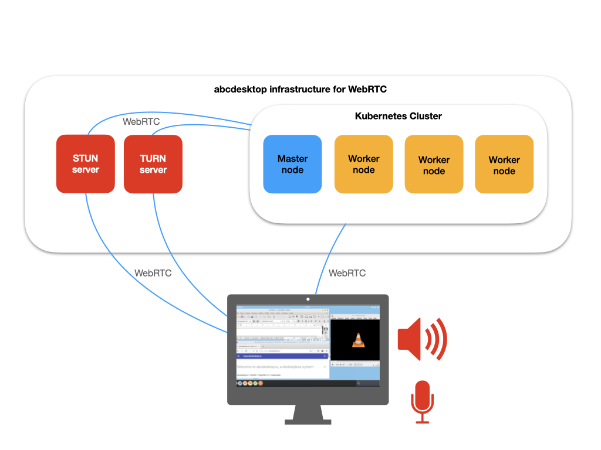


### Requirements


- Read the [introduction to WebRTC protocols](https://developer.mozilla.org/en-US/docs/Web/API/WebRTC_API/Protocols)

- You need **a STUN server**. You can use any STUN server like stun.l.google.com:19302. Session Traversal Utilities for NAT (STUN) is a protocol to discover your public address and determine any restrictions in your router that would prevent a direct connection with a peer.

- You need your **own TURN server**. We use COTURN server as describe in this chapter. Traversal Using Relays around NAT (TURN) is meant to bypass the Symmetric NAT restriction by opening a connection with a TURN server and relaying all information through that server.


## WebRTC design


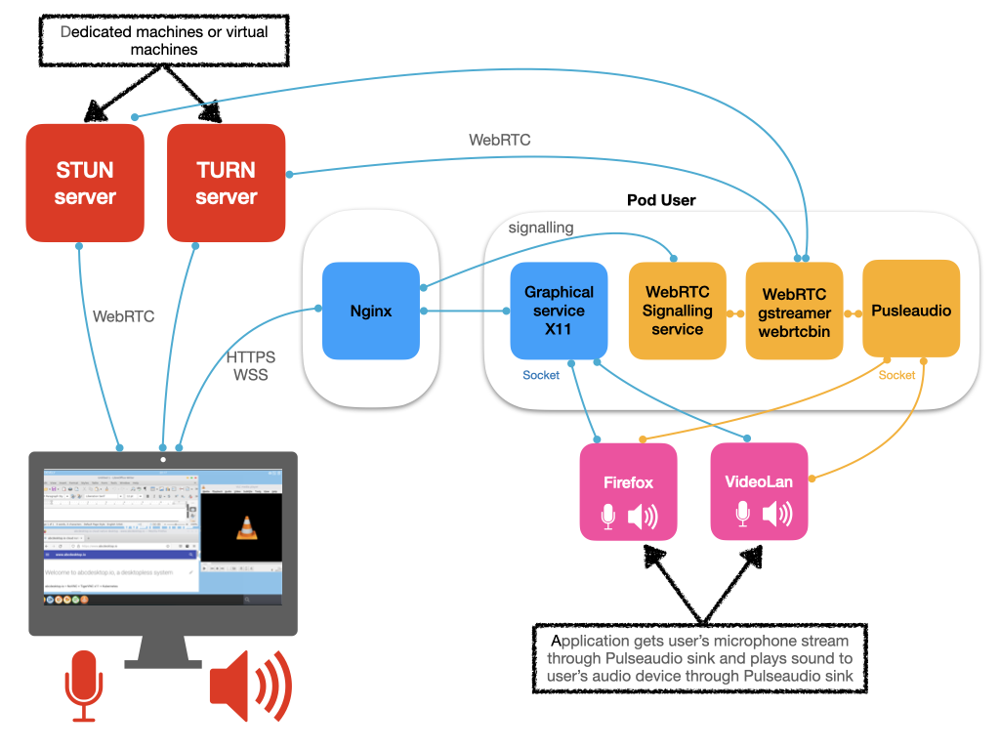

`abcdesktop/pulseaudio:3.2` container executes the following services 

- WebRTC Signalling service
- WebRTC gstreamer webrtcbin
- Pulseaudio service


### STUN server
 
STUN servers are used by both client and abcdesktop WebRTC to determine their IP address as visible by the global Internet.

The STUN server can to hosted on a dedicated droplets and on an external network. For a public Internet usage, the Google-hosted STUN servers is a good 

```
{ 'urls': 'stun:stun.l.google.com:19302' }
```

### TURN server 

The TURN server can to hosted on a dedicated droplets and on an external network. To reduce latency you should host your TURN server near your kubernetes network.  


You can run [coturn](https://github.com/coturn/coturn) service on dedicated machines or virtual machines, to avoid any scenario where the port range is being restricted or set arbitrarily by the infrastructure or orchestration tools.


#### COTURN server 

[coturn](https://github.com/coturn/coturn) is a free open source implementation of TURN and STUN Server. The TURN Server is a VoIP media traffic NAT traversal server and gateway.

- Coturn installation 

```bash
apt-get install coturn 
```

- use SSL certificates

You need a X509 certificates to use TURN over TLS. 
[Let's Encrypt](https://letsencrypt.org/) provides X.509 certificates for Transport Layer Security (TLS) encryption at no charge.


- Minimal COTURN configuration file 

Default minimal configuration file `/etc/turnserver.conf` for abcdesktop. 


```
listening-port=3478
tls-listening-port=5349
lt-cred-mech
use-auth-secret
static-auth-secret=CHANGEME
server-name=turn.domain.local
realm=turn.domain.local
cert=/usr/local/etc/turn.domain.local.pem
pkey=/usr/local/etc/turn.domain.local.pem
```

Update the following configuration file with you own values 

- `static-auth-secret`
- `server-name`
- `realm`
- `cert`
- `pkey`

Then start your turn service.


## Update configmap `od.config` file


Add new webrtc's entries

- Set `webrtc.enable` to `True`
- define `webrtc.rtc_configuration` dictionary for the [web browser webrtc stack](https://udn.realityripple.com/docs/Web/API/RTCConfiguration)
- define `webrtc.coturn` dictionnay entries for the web browser webrtc stack
  - `coturn_static_auth_secret` is the `static-auth-secret` value define in `turnserver.conf` file
  - `ttl` define the time to live for the auth value 
  -  `protocol` define the [Traversal Using Relays around NAT](https://en.wikipedia.org/wiki/Traversal_Using_Relays_around_NAT)  protocol, value can be `turn` or `turns`
  -  `url` url for the [coturn](https://github.com/coturn/coturn/) service

 
```
webrtc.enable:True
webrtc.rtc_configuration:{ 'iceServers':[ {'urls':'stun:stun.l.google.com:19302'} ] }
webrtc.coturn: { 
  'coturn_static_auth_secret': 'CHANGEME', 
  'ttl':3600,
  'protocol': 'turns',
  'url': 'turn.domain.local:3478' }
```


pyos merges a new `rtc_configuration` json document from the `webrtc.coturn` and from `webrtc.coturn` values. 

pyos adds `username` and `credential` entries. For example, a new `rtc_configuration` json document is send to the web browser 
 

```
{
  "iceServers": [
    { "urls": "stun:stun.l.google.com:19302" },
    { "urls": "turns:nturns.domain.local:3478",
      "username": "1703086872",
      "credential": "+BuFkb0hFf8pAoFwpp0A0UbO+1k=" } 
  ]
}
```


- Update the default environment variable `desktop.envlocal` to add `STUN_SERVER`

STUN_SERVER value is used by the `gstreamer webrtcbin`

```
desktop.envlocal :  { 
  'STUN_SERVER': 'stun://stun.l.google.com:19302',
}
```


- Update the `sound` entry in `desktop.pod` to enable `pulseaudio` service 

Update the value `'enable': False` to  `'enable': True`

```
desktop.pod : 
    
    ...[CUT HERE ]...
    
'sound': { 
    'image': 'abcdesktopio/oc.pulseaudio:3.2',
    'pullpolicy': 'IfNotPresent',
    'enable': True,
    'tcpport': 4714,
    'acl':  { 'permit': [ 'all' ] },
    'resources': { 
        'requests': { 'memory': "8Mi", 'cpu': "50m"  },  
        'limits'  : { 'memory': "2Gi", 'cpu': "2000m" } 
    } },
    
    ...[CUT HERE ]...
    
```

- Apply the new configmap `abcdesktop-config` for the `od.config` file

```
kubectl create -n abcdesktop configmap abcdesktop-config --from-file=od.config -o yaml --dry-run=client | kubectl replace -n abcdesktop -f -
```

- Restart pyos pod instance 
 
```
kubectl delete pods -l run=pyos-od -n abcdesktop
```


## connect to your desktop 

Open your web browser, and go to your abcdesktop web site. 

Make sure to use secured https protocol, else WebRTC is disabled.

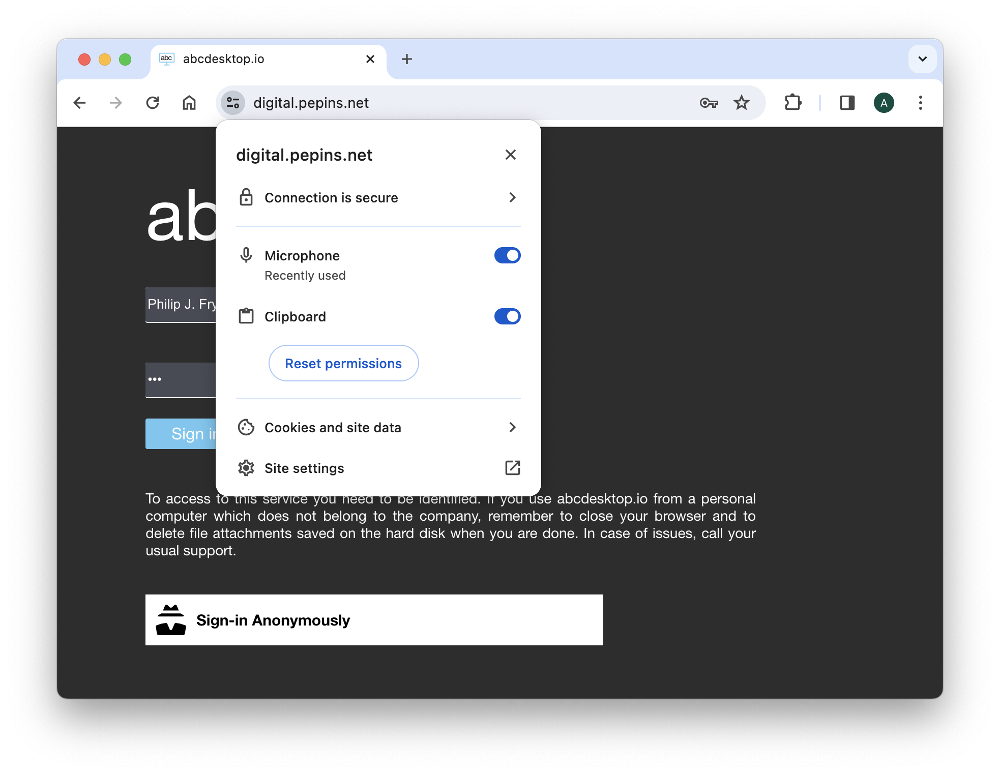


### Step 1, login using credentials

Login using credentials, for example 

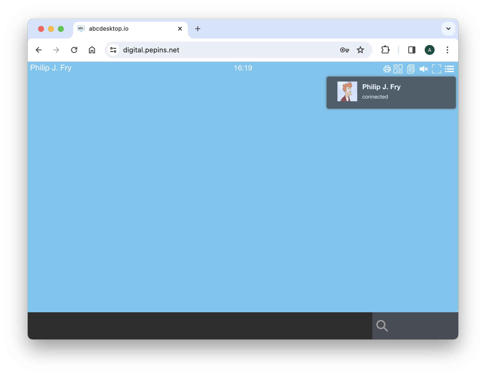

The sound is not yet available

### Step 2, sound becomes available

Few seconds later, sound become available.

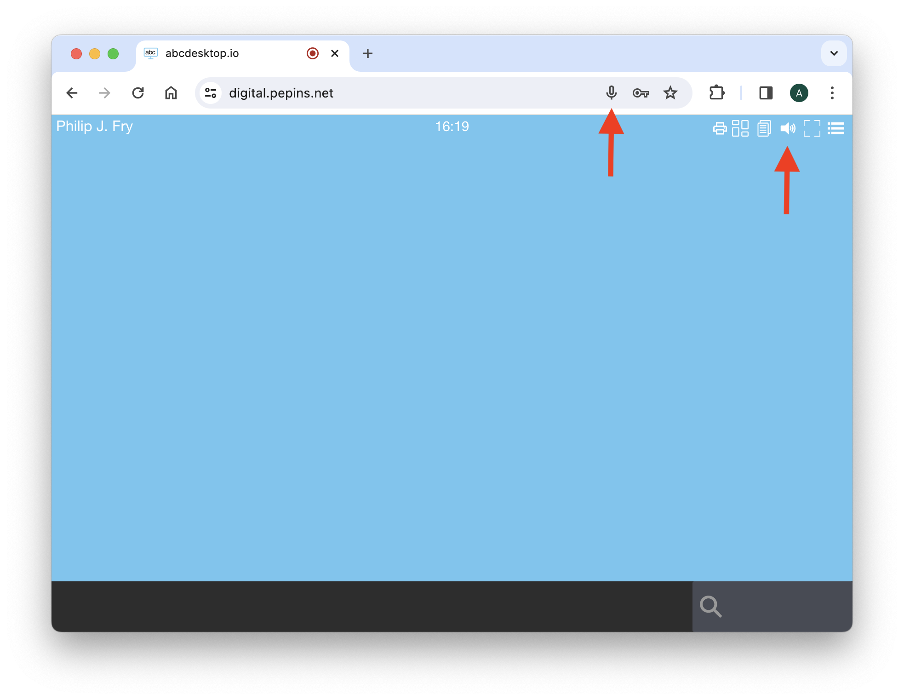

The sound is available. The web browser has an access to the microphone.


#### Play sound with paplay

Open a `Terminal Web Shell` application and run the command inside the web shell

```
paplay /usr/share/sounds/alsa/Rear_Center.wav 
```

You should heard `Rear Center` on your local sound device 

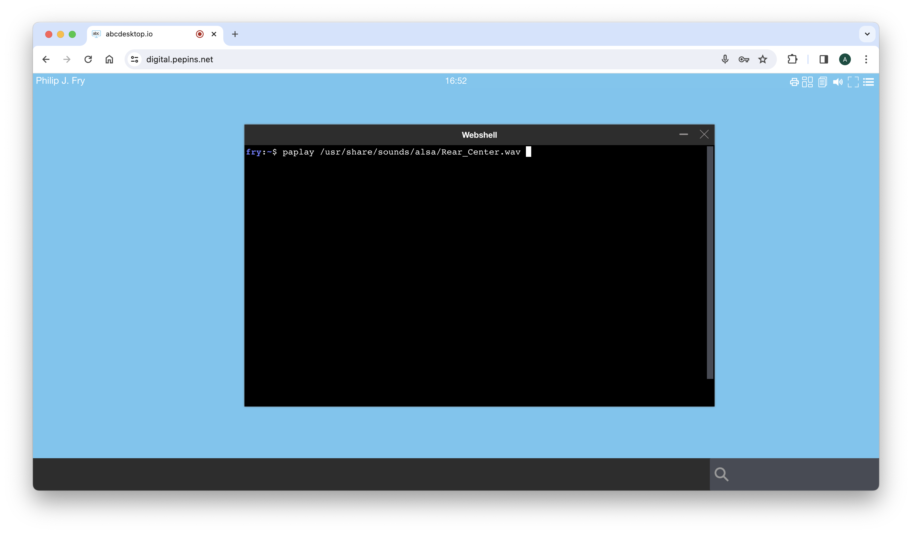

#### Test microphone access

Open a `Terminal Web Shell` application and run the command inside the web shell


```
pavumeter --record
```

You should see cursor changes if you talk with your abcdesktop

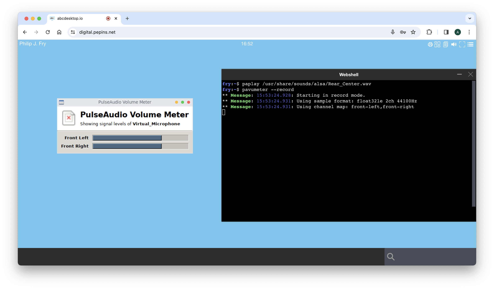


 
### Step 3, look at the web browser's console log 

Open the web browser's console log to read the WebRTC messages

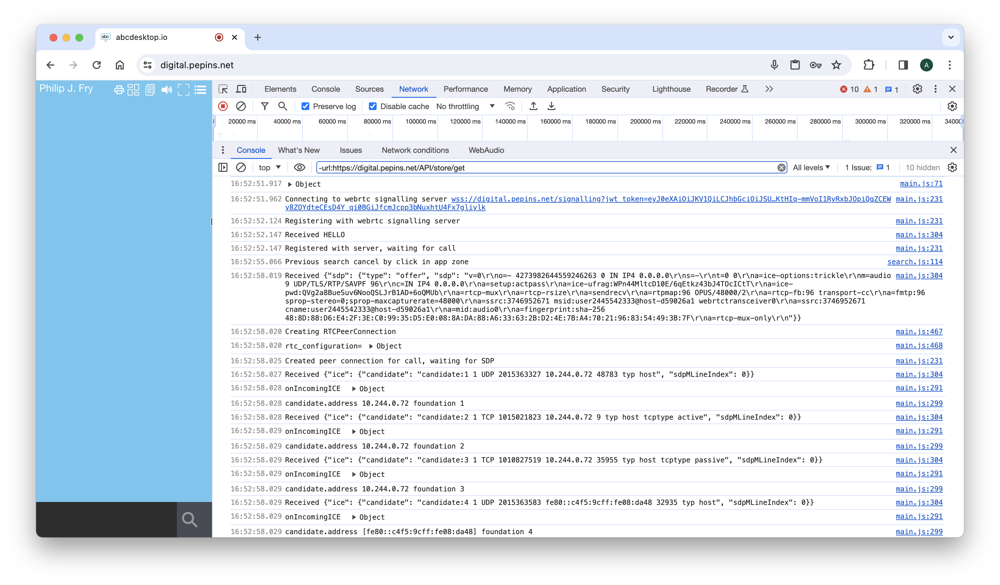

Read the json rtc_configuration document created by pyos pod

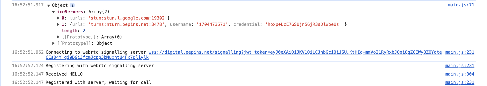

Read the step `Created peer connection for call and creating SDP` and step `Exchange from foundation` for 1 to 6

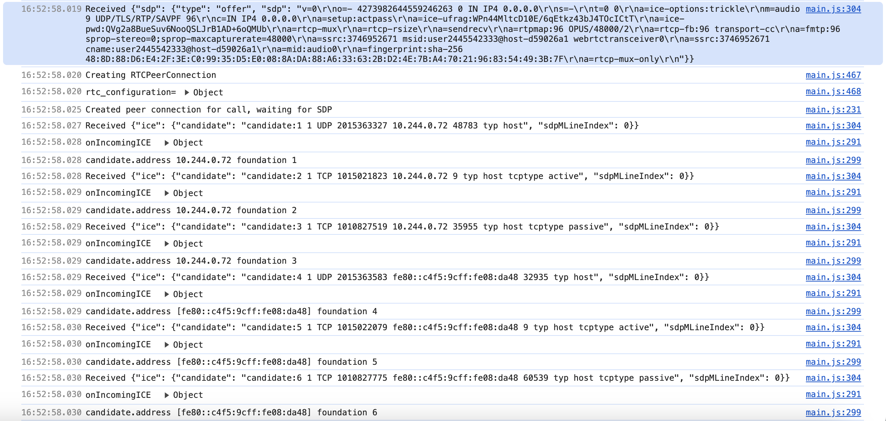

Read the step `Exchange from foundation` from 6 to 9

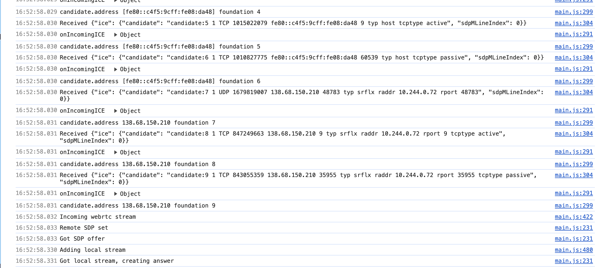

Read the step `Local stream answer`

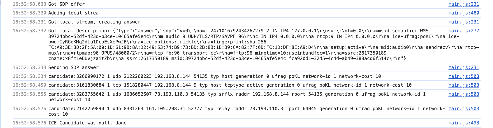


The last line is `ICE Candidate was null, done`

> The sound is now enabled

