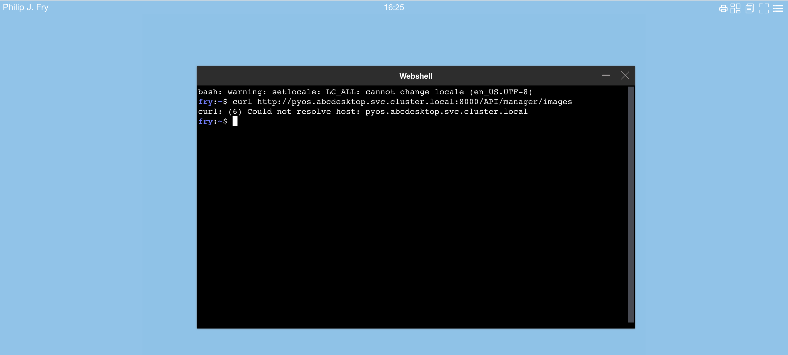
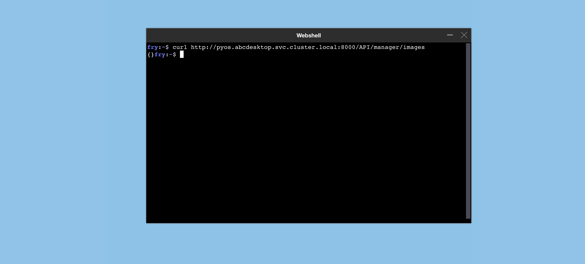

# NetworkPolicy 


## Goals
* Apply network policies to control traffic flow at the IP address or port level of abcdesktop pods, **this includes user's pods**.


## Authors


[jpxavier-oio](https://github.com/jpxavier-oio) has designed the network policy for abcdesktop.io


## Requirements

- You need to have a Kubernetes cluster, and the kubectl command-line tool must be configured to communicate with your cluster. It is recommended to run this tutorial on a cluster with at least two nodes.
- Network policies are implemented by the network plugin. To use network policies, you must be using a networking solution which supports NetworkPolicy. 


## NetworkPolicy description


There are two sorts of isolation defined in abcdesktop : the NetworkPolicy  `rights` and the NetworkPolicy `permits`.


- The NetworkPolicy `rights` contains `egress` and `ingress` for pod selected by tag. `rights` means access (ingress) to this pod and access (egress) from this pod. To define ip filter for user's pod, you need to set egress NetworkPolicy.


- The NetworkPolicy `permits` contains `egress` to a pod selected by tag. The NetworkPolicy `permits` means permit access to this pod.


## Apply the default `netpol-default-3.3.yaml` file

To apply the network policies run the command :

```bash
kubectl apply -f https://raw.githubusercontent.com/abcdesktopio/conf/main/kubernetes/netpol-default-3.3.yaml
```

The command returns 

```
networkpolicy.networking.k8s.io/abcdesktop-rights created
networkpolicy.networking.k8s.io/memcached-rights created
networkpolicy.networking.k8s.io/memcached-permits created
networkpolicy.networking.k8s.io/mongodb-rights created
networkpolicy.networking.k8s.io/mongodb-permits created
networkpolicy.networking.k8s.io/speedtest-rights created
networkpolicy.networking.k8s.io/speedtest-permits created
networkpolicy.networking.k8s.io/pyos-rights created
networkpolicy.networking.k8s.io/pyos-permits created
networkpolicy.networking.k8s.io/router-rights created
networkpolicy.networking.k8s.io/router-permits created
networkpolicy.networking.k8s.io/nginx-rights created
networkpolicy.networking.k8s.io/nginx-permits created
networkpolicy.networking.k8s.io/ocuser-rights created
networkpolicy.networking.k8s.io/ocuser-permits created
networkpolicy.networking.k8s.io/authentication-permits created
networkpolicy.networking.k8s.io/ldap-permits created
networkpolicy.networking.k8s.io/ldap-rights created
networkpolicy.networking.k8s.io/smtp-permits created
networkpolicy.networking.k8s.io/https-permits created
networkpolicy.networking.k8s.io/storage-permits created
networkpolicy.networking.k8s.io/coredns-permits created
networkpolicy.networking.k8s.io/apiserver-permits created
networkpolicy.networking.k8s.io/graylog-permits created
```


### Test the network policies

- Login to your abcdesktop 
- Open a webshell and run a curl command. 

```bash
curl http://pyos.abcdesktop.svc.cluster.local:8000/API/manager/images
```

This **http request is denied by the network policy** and you should get an error message




You should get an error message, the user's pod can't reach `https://pyos.abcdesktop.svc.cluster.local:8000/API`.


### Disable the network policies  

To disable the network policies, run the kubectl delete command :

```bash
kubectl delete -f https://raw.githubusercontent.com/abcdesktopio/conf/main/kubernetes/netpol-default-3.3.yaml
```

- Login to your abcdesktop 
- Open the web shell to run the same curl command

```bash
curl http://pyos.abcdesktop.svc.cluster.local:8000/API/manager/images
```

You should get a json document as http response

```json
{}
```



You may need to update the [netpol-default.yaml](https://raw.githubusercontent.com/abcdesktopio/conf/main/kubernetes/netpol-default-3.3.yaml) file with your own values.


