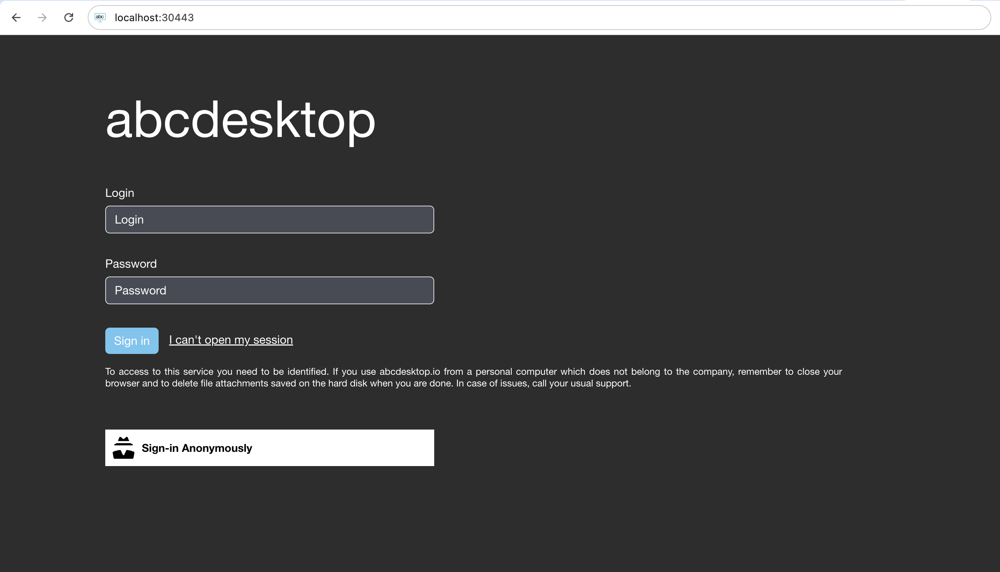
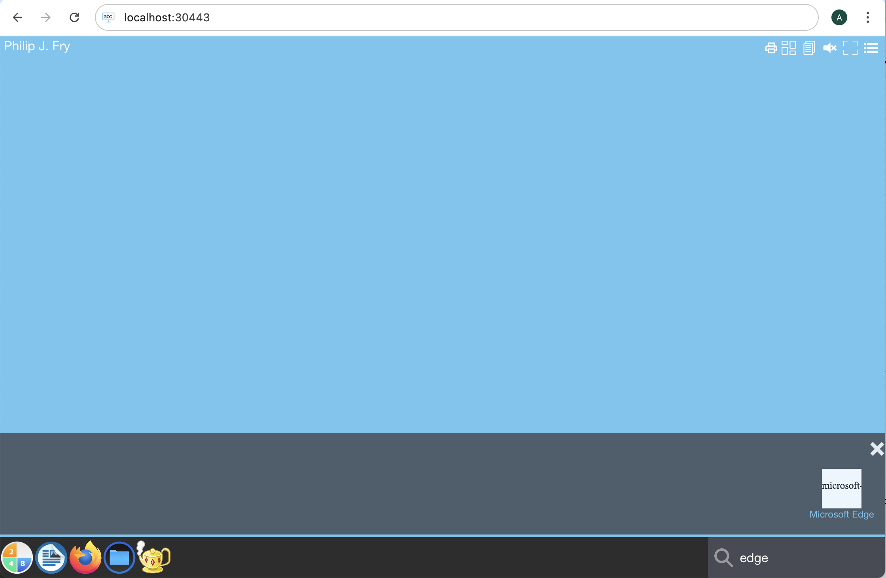
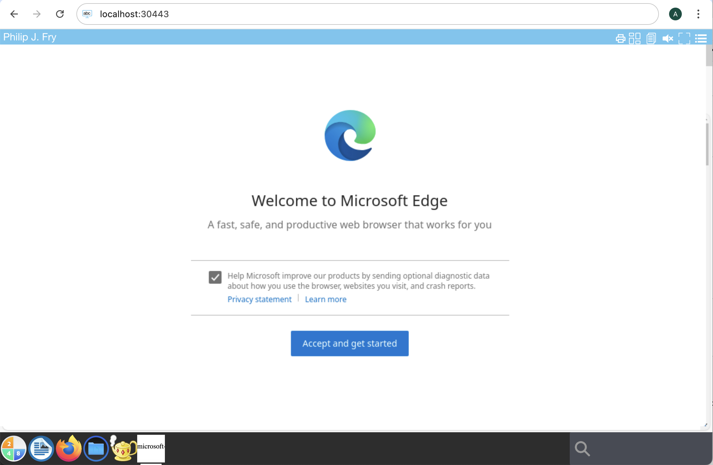
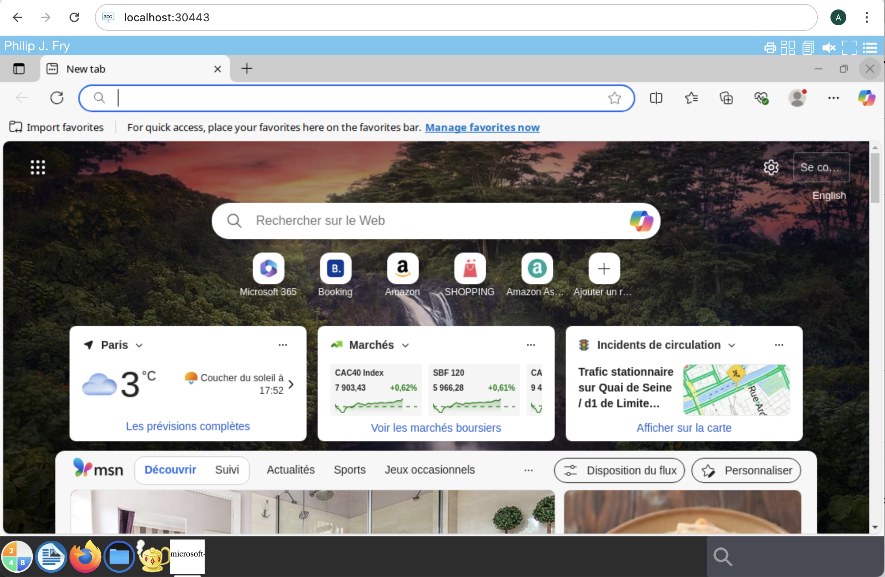

# abcdesktop a simple application `microsoft edge`

## Release 3.4

Release `3.4` add a simple application support 

## Requirements

You need to have

- kubernetes cluster ready to run whith abcdesktop.io installed
- `kubectl` or `microk8s` command-line tool must be configured to communicate with your cluster. 
- `docker` command line must be installed to build the image.
- `crictl` command line must be installed too.
- your own registry


## Create a simple application `Microsoft Edge`


To illustrate a simple application, we will install `Microsoft Edge` inside a container. 

* Create a Dockerfile to install `Microsoft Edge` application from `microsoft-edge` package

```Dockerfile
FROM ubuntu

# install curl ca-certificates gnupg
RUN apt-get update && apt-get install -y --no-install-recommends curl ca-certificates gnupg && apt-get clean &&  rm -rf /var/lib/apt/lists/*

# add microsoft key
RUN curl https://packages.microsoft.com/keys/microsoft.asc  | apt-key add -

# add repository packages.microsoft.com/repos/edge
RUN echo "deb [arch=$(dpkg --print-architecture)] https://packages.microsoft.com/repos/edge stable main" > /etc/apt/sources.list.d/edge.list

# install microsoft-edge-stable
RUN apt-get update && apt-get install -y --no-install-recommends microsoft-edge-stable && apt-get clean && rm -rf /var/lib/apt/lists/* 

# Install package fonts 
RUN apt-get update && apt-get install -y --no-install-recommends fonts-ubuntu fonts-noto fonts-freefont-ttf xfonts-base xfonts-encodings xfonts-scalable fonts-dejavu-core fonts-deva fonts-droid-fallback ttf-mscorefonts-installer && apt-get clean && rm -rf /var/lib/apt/lists/*

# put some labels
LABEL oc.keyword="microsoft,edge,web,browser,internet"
LABEL oc.cat="office"
LABEL oc.desktopfile="microsoft-edge.desktop"
LABEL oc.launch="microsoft-edge.Microsoft-edge"
LABEL oc.displayname="Microsoft Edge"
LABEL oc.mimetype="application/pdf;application/rdf+xml;application/rss+xml;application/xhtml+xml;application/xhtml_xml;application/xml;image/gif;image/jpeg;image/png;image/webp;text/html;text/xml;x-scheme-handler/http;x-scheme-handler/https;"
LABEL oc.fileextensions="html;xml;gif"
LABEL oc.legacyfileextensions="html;xml"
# LABEL image_pull_policy="Always"

# update execute runtime adds the generated files
RUN mkdir -p /etc/localaccount 
RUN for f in passwd shadow group gshadow ; do if [ -f /etc/$f ] ; then  cp /etc/$f /etc/localaccount; rm -f /etc/$f; ln -s /etc/localaccount/$f /etc/$f; fi; done

ENTRYPOINT [ "/usr/bin/microsoft-edge-stable" ]
```

Dockerfile description 

This image is based on ubuntu, and install the `microsoft-edge-stable` package from the repository https://packages.microsoft.com/repos/edge 
Then we define `/usr/bin/microsoft-edge-stable` as the ENTRYPOINT.

* `oc.keyword` label defines keyworks for the search engine
* `oc.cat` label defines category of the application
* `oc.desktopfile` label defines the name of the `.desktop` file `microsoft-edge.desktop` in `/usr/share/applications` directory
* `oc.launch` label is the name of the X11 window's `WM_CLASS`. The value is `microsoft-edge.Microsoft-edge` 
* `oc.displayname` defines the string to display the name of the application
* `oc.mimetype` defines the MimeType support by this application
* `oc.fileextensions` defines the file extension support by this application
* `oc.legacyfileextensions` defines the legacy file extension support by this application


The last RUN command creates a directory `/etc/localaccount`, and the execute runtime adds the generated files [ `passwd`, `shadow`, `group`, `gshadow` ] to the current container in `/etc/localaccount`


* Build the image for microsoft-edge application

```bash
REGISTRY=abcdesktopio
docker build -t $REGISTRY/sampleedge .
```

> You should replace the value of `REGISTRY=abcdesktopio` by your own registry's name.
If you don't have one, you can use the `abcdesktopio/sampleedge` as a readonly dockerhub registry.


* Push the image to your registry *(only if you have your own registry)*

```bash
REGISTRY=abcdesktopio
docker push $REGISTRY/sampleedge
```

* Inspect the image to create a json file

```bash
REGISTRY=abcdesktopio
crictl inspecti $REGISTRY/sampleedge:latest > sampleedge.json
```

* Send the image to abcdesktop pyos instance

The commands read the `PYOS_POD` name, then copy the `sampleedge.json` file to `/tmp` of PYOS_POD,
then send the `/tmp/samplexeyes.json` to REST API server

```bash
NAMESPACE=abcdesktop
PYOS_POD_NAME=$(kubectl get pods -l run=pyos-od -o jsonpath={.items..metadata.name} -n "$NAMESPACE" | awk '{print $1}')
kubectl cp sampleedge.json $PYOS_POD_NAME:/tmp -n $NAMESPACE
kubectl exec -i $PYOS_POD_NAME -n abcdesktop -- curl -X POST -H 'Content-Type: text/javascript' http://localhost:8000/API/manager/image -d @/tmp/sampleedge.json
```

The endpoint image returns a json documment 

```json
{
  "cmd": [
    "/usr/bin/microsoft-edge-stable"
  ],
  "path": null,
  "sha_id": "sha256:3539a48d03e32fcca330bc8997f7bc9d1042ee6da23c659bb86c6a654530ff59",
  "id": "docker.io/abcdesktopio/sampleedge:latest",
  "architecture": null,
  "os": null,
  "rules": {},
  "acl": {
    "permit": [
      "all"
    ]
  },
  "launch": "microsoft-edge.Microsoft-edge",
  "name": "microsoft-edge-stable",
  "icon": "microsoft-edge-stable",
  "icondata": "PHN2ZyB2ZXJzaW9uPSIxLjEiIHZpZXdCb3g9IjAgMCA2NCA2NCIgeG1sbnM9Imh0dHA6Ly93d3cudzMub3JnLzIwMDAvc3ZnIiB4bWxuczp4bGluaz0iaHR0cDovL3d3dy53My5vcmcvMTk5OS94bGluayI+PHJlY3Qgd2lkdGg9IjEwMCUiIGhlaWdodD0iMTAwJSIgZmlsbD0id2hpdGUiLz48dGV4dCB4PSIwIiB5PSIzMiIgZmlsbD0iYmxhY2siPm1pY3Jvc29mdC1lZGdlLXN0YWJsZTwvdGV4dD48L3N2Zz4=",
  "keyword": "microsoft,edge,web,browser,internet",
  "uniquerunkey": null,
  "cat": "office",
  "args": null,
  "execmode": null,
  "showinview": null,
  "displayname": "Microsoft Edge",
  "desktopfile": "microsoft-edge.desktop",
  "executeclassname": null,
  "executablefilename": "microsoft-edge-stable",
  "usedefaultapplication": false,
  "mimetype": [
    "application/pdf",
    "application/rdf+xml",
    "application/rss+xml",
    "application/xhtml+xml",
    "application/xhtml_xml",
    "application/xml",
    "image/gif",
    "image/jpeg",
    "image/png",
    "image/webp",
    "text/html",
    "text/xml",
    "x-scheme-handler/http",
    "x-scheme-handler/https"
  ],
  "fileextensions": [
    "html",
    "xml",
    "gif"
  ],
  "legacyfileextensions": [
    "html",
    "xml"
  ],
  "secrets_requirement": null,
  "image_pull_policy": "IfNotPresent",
  "image_pull_secrets": null,
  "containerengine": "ephemeral_container",
  "securitycontext": {},
  "created": null
}
```


## Execute the new application `microsoft-edge`

* Open your web browser, and to go your own abcdesktop url, and do a login to create a desktop 



* Look for the new application `microsoft-edge` pushed



* Start the new application `microsoft-edge`




* `microsoft-edge` is running


