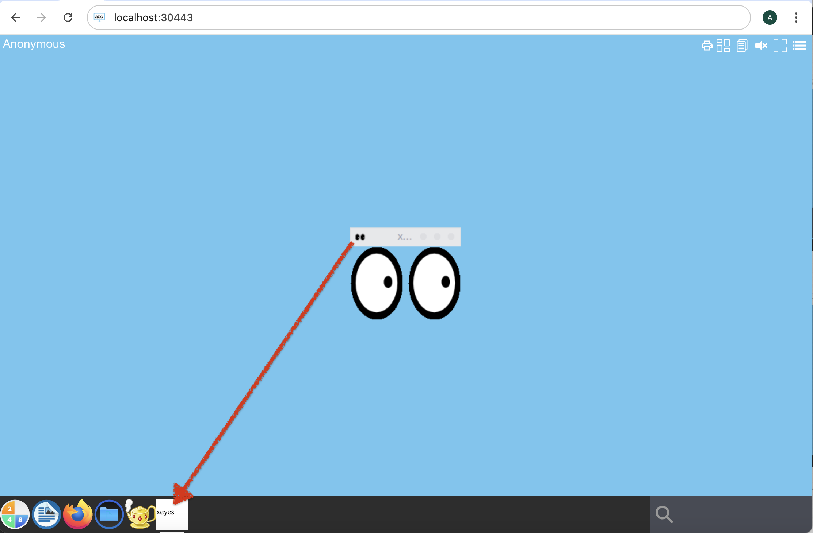

# abcdesktop a simple application `xeyes`

## Release 3.4

Release `3.4`add a simple application support 

## Requirements

You need to have a 

- kubernetes cluster ready to run whith abcdesktop.io installed
- `kubectl` or `microk8s` command-line tool must be configured to communicate with your cluster. 
- `docker` command line must be installed too.
- your own registry


## Create a simple application `xeyes`


To illustrate a simple application, we will install `X11/xedit` inside a container. 

* Create a Dockerfile to install `xeyes ` application from `x11-apps` package

```Dockerfile
FROM ubuntu
RUN apt-get update && apt-get install -y --no-install-recommends x11-apps && apt-get clean
CMD ["/usr/bin/xeyes"]
```

This image is based on ubuntu, and install the `x11-apps` package. Then we define `/usr/bin/xeyes` as the CMD.
> ENTRYPOINT is also supported 

* Build the image for xedit application

```bash
REGISTRY=abcdesktopio
docker build -t $REGISTRY/samplexeyes .
```

> You should replace the value of `REGISTRY=abcdesktopio` by your own registry's name.
If you don't have one, you can use the `abcdesktopio/samplexeyes ` as a readonly dockerhub registry.


* Push the image to your registry *(only if you have one registry)*

```bash
REGISTRY=abcdesktopio
docker push $REGISTRY/samplexeyes
```

* Inspect the image to create a json file

```bash
REGISTRY=abcdesktopio
docker inspect $REGISTRY/samplexeyes:latest > samplexeyes.json
```

* Send the image to abcdesktop pyos instance

The commands read the `PYOS_POD` name, then copy the `samplexeyes.json` file to `/tmp` of PYOS_POD,
then send the `/tmp/samplexeyes.json` to REST API server

```bash
NAMESPACE=abcdesktop
PYOS_POD_NAME=$(kubectl get pods -l run=pyos-od -o jsonpath={.items..metadata.name} -n "$NAMESPACE" | awk '{print $1}')
kubectl cp samplexeyes.json $PYOS_POD_NAME:/tmp -n $NAMESPACE
kubectl exec -i $PYOS_POD_NAME -n abcdesktop -- curl -X POST -H 'Content-Type: text/javascript' http://localhost:8000/API/manager/image -d @/tmp/samplexeyes.json
```

The endpoint image returns a json documment 

```
[{"cmd": ["/usr/bin/xeyes"], "path": null, "sha_id": "sha256:f13075e3caceccf5818f9d3b0bdd231b2d800850eb9c81d2906704ec633372c7", "id": "abcdesktopio/samplexeyes:latest", "architecture": "amd64", "os": "linux", "rules": {}, "acl": {"permit": ["all"]}, "launch": "xeyes", "name": "xeyes", "icon": "xeyes", "icondata": "PHN2ZyB2ZXJzaW9uPSIxLjEiIHZpZXdCb3g9IjAgMCA2NCA2NCIgeG1sbnM9Imh0dHA6Ly93d3cudzMub3JnLzIwMDAvc3ZnIiB4bWxuczp4bGluaz0iaHR0cDovL3d3dy53My5vcmcvMTk5OS94bGluayI+PHJlY3Qgd2lkdGg9IjEwMCUiIGhlaWdodD0iMTAwJSIgZmlsbD0id2hpdGUiLz48dGV4dCB4PSIwIiB5PSIzMiIgZmlsbD0iYmxhY2siPnhleWVzPC90ZXh0Pjwvc3ZnPg==", "keyword": null, "uniquerunkey": null, "cat": null, "args": null, "execmode": null, "showinview": null, "displayname": "xeyes", "desktopfile": null, "executeclassname": null, "executablefilename": "xeyes", "usedefaultapplication": false, "mimetype": [], "fileextensions": [], "legacyfileextensions": [], "secrets_requirement": null, "i100  4670  100  1115  100  3555  41296   128k --:--:-- --:--:-- --:--:--  168ke": "ephemeral_container", "securitycontext": {}, "created": "2025-02-03T15:45:36.493950688Z"}]
```


## Execute the new application `xeyes`

* Open your web browser, and to go your own abcdesktop url, and do a login to create a desktop 


* Look for the new application `xeyes` pushed


* Start the new application `xeyes`


> As you can check the xeyes icon doesn't appear in the dock 


## Read the `WM_CLASS` attribut for `xeyes` application

* In the search text area write `webshell`, to get a `bash` shell


* Run the `webshell` 


* Inside the new webshell window run the command line `wmctrl -lx` to query the `WM_CLASS` attribut values


```
wmctrl -lx
0x0060000a  0 xeyes.XEyes           anonymous-d363a xeyes
```


The `WM_CLASS` is `xeyes.XEyes`

 
## Rebuild the `xeyes` images with the `WM_CLASS`

* Update the Dockerfile to add the label `oc.launch`


```Dockerfile
FROM ubuntu
RUN apt-get update && apt-get install -y --no-install-recommends x11-apps && apt-get clean
LABEL oc.launch=xeyes.XEyes
CMD ["/usr/bin/xeyes"]
```

* Rebuild the image for xedit application

```bash
REGISTRY=abcdesktopio
docker build -t $REGISTRY/samplexeyeswmclass .
```

> You should replace the value of `REGISTRY=abcdesktopio` by your own registry's name.
If you don't have one, you can use the `abcdesktopio/samplexeyeswmclass ` as a readonly dockerhub registry.


* Push the image to your registry *(only if you have one registry)*

```bash
REGISTRY=abcdesktopio
docker push $REGISTRY/samplexeyeswmclass
```

* Inspect the image to create a json file

```bash
REGISTRY=abcdesktopio
docker inspect $REGISTRY/samplexeyeswmclass:latest > samplexeyeswmclass.json
```


* you can delete the previous image, using a curl command line or if you prefer using the console service. The name of the image must be urlencoded `abcdesktopio/samplexeyes:latest` become the string `abcdesktopio%2Fsamplexeyes%3Alatest`  

```
NAMESPACE=abcdesktop
PYOS_POD_NAME=$(kubectl get pods -l run=pyos-od -o jsonpath={.items..metadata.name} -n "$NAMESPACE" | awk '{print $1}')
kubectl cp samplexeyes.json $PYOS_POD_NAME:/tmp -n $NAMESPACE
kubectl exec -i $PYOS_POD_NAME -n abcdesktop -- curl -X DELETE  http://localhost:8000/API/manager/image/abcdesktopio%2Fsamplexeyes%3Alatest
```


* Add the new `xeyes`images

```bash
NAMESPACE=abcdesktop
PYOS_POD_NAME=$(kubectl get pods -l run=pyos-od -o jsonpath={.items..metadata.name} -n "$NAMESPACE" | awk '{print $1}')
kubectl cp samplexeyeswmclass.json $PYOS_POD_NAME:/tmp -n $NAMESPACE
kubectl exec -i $PYOS_POD_NAME -n abcdesktop -- curl -X POST -H 'Content-Type: text/javascript' http://localhost:8000/API/manager/image -d @/tmp/samplexeyeswmclass.json 
```

The endpoint return a json document 

```
[{"cmd": ["/usr/bin/xeyes"], "path": null, "sha_id": "sha256:d11bb1d5c5b452efe763a92dca0749bb8e919f29c81a3aeccb9971f232391210", "id": "abcdesktopio/samplexeyeswmclass:latest", "architecture": "amd64", "os": "linux", "rules": {}, "acl": {"permit": ["all"]}, "launch": "xeyes.XEyes", "name": "xeyes", "icon": "xeyes", "icondata": "PHN2ZyB2ZXJzaW9uPSIxLjEiIHZpZXdCb3g9IjAgMCA2NCA2NCIgeG1sbnM9Imh0dHA6Ly93d3cudzMub3JnLzIwMDAvc3ZnIiB4bWxuczp4bGluaz0iaHR0cDovL3d3dy53My5vcmcvMTk5OS94bGluayI+PHJlY3Qgd2lkdGg9IjEwMCUiIGhlaWdodD0iMTAwJSIgZmlsbD0id2hpdGUiLz48dGV4dCB4PSIwIiB5PSIzMiIgZmlsbD0iYmxhY2siPnhleWVzPC90ZXh0Pjwvc3ZnPg==", "keyword": null, "uniquerunkey": null, "cat": null, "args": null, "execmode": null, "showinview": null, "displayname": "xeyes", "desktopfile": null, "executeclassname": null, "executablefilename": "xeyes", "usedefaultapplication": false, "mimetype": [], "fileextensions": [], "legacyfileextensions": [], "secrets_requirement": null, "image_pull_policy": "IfNotPresent", "image_pull_secrets": null, "containerengine": "ephemeral_container", "securitycontext": {}, "created": "2025-02-03T16:11:43.151188552Z"}]
```


## Execute the new application `xeyes`

* Open your web browser, and to go your own abcdesktop url, and do a login to create a desktop 


* Look for the new application `xeyes` pushed


* Start the new application `xeyes`


> As you can check the xeyes icon doesn't appear in the dock 


