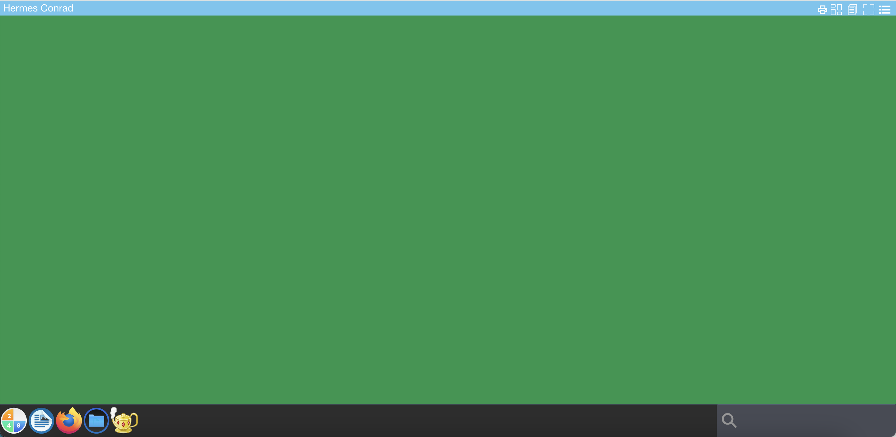
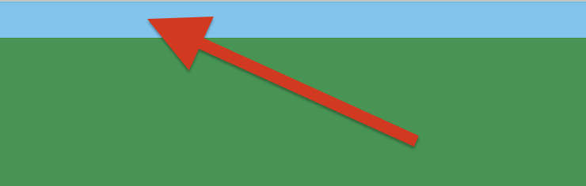
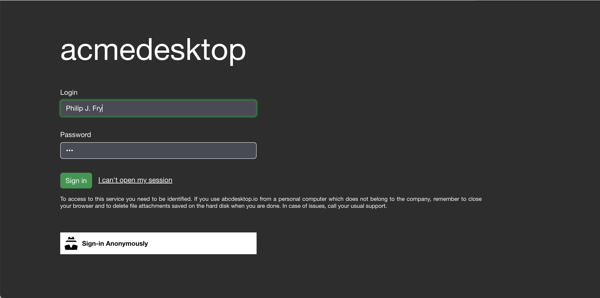
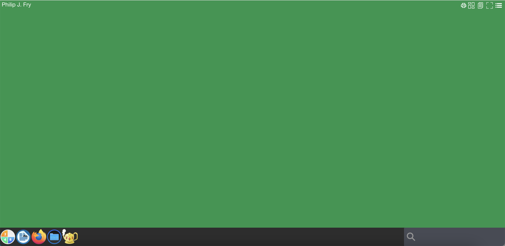
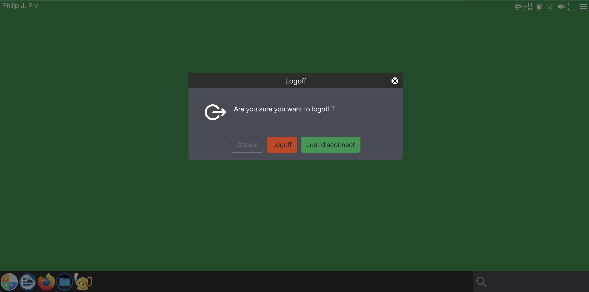

# Update and custom frontend web page

abcdesktop uses a front HTML web site and X11 Linux application. So, to get a new graphic design, you have to define it twice in HTML (CSS) files and in X11 config.

## Requirements 

* `docker` package installed 


## Goals

* Update abcdesktop default frontend web page to use your own.
* Create new image for abcdesktop oc.nginx

## Configure od.config to use the new color

In the od.config, add the env var `ABCDESKTOP_BG_COLOR`

```json
desktop.envlocal :  {
  'X11LISTEN':'tcp', 
  'WEBSOCKIFY_HEARTBEAT':'30',
  'TURN_PROTOCOL': 'tcp',
  'ABCDESKTOP_BG_COLOR': ‘#18974c’ }
```

Then update the config map `abcdesktop-config` and restart deployment `pyos-od` 

```bash
kubectl create -n abcdesktop configmap abcdesktop-config --from-file=od.config -o yaml --dry-run=client | kubectl replace -n abcdesktop -f -
kubectl rollout restart deployment pyos-od -n abcdesktop
```

You should read on stdout

```
configmap/abcdesktop-config replaced
deployment.apps/pyos-od restarted
```

The new desktop is defined with the default background color



We need to change the top color with the same new default value `#18974c`



Update the `oc.nginx` container image to add `#18974c` inside the new graphic chart.

## Create new image for abcdesktop oc.nginx

### Clone default webmodules  

```bash
BRANCH=3.4
git clone -b $BRANCH https://github.com/abcdesktopio/webModules.git
```

### Locate project and ui files 

#### Update ui.json file

Update your `ui.json` file.  `ui.json` is located in `transpile/config` directory.


```bash
ls -la  webModules/transpile/config
total 204
drwxr-xr-x   5 alexandredevely  staff   160 Nov 29 14:54 .
drwxr-xr-x  11 alexandredevely  staff   352 Nov 29 14:54 ..
-rw-r--r--   1 alexandredevely  staff    34 Nov 29 14:54 .cache.json
-rw-r--r--   1 alexandredevely  staff  1924 Nov 29 14:54 modules.json
-rw-r--r--   1 alexandredevely  staff  1548 Nov 29 14:54 ui.json
```

`ui.json` is a json dictionary file

The main entry is `name`, name is the project name:


| entry          | default value       | example          |
|----------------|---------------------|------------------|
| name           | abcdesktop.io       | acmedesktop.io   |


```json
{
  "name": "abcdesktop.io",
  "projectNameSplitedHTML": "<span id='projectNameSplitedStagea'>a</span><span id='projectNameSplitedStageb'>b</span><span id='projectNameSplitedStagec'>c</span><span id='p
rojectNameSplitedStaged'>desktop</span>",
  "colors": [
    {
      "name": "@x11bgcolor",
      "value": "#6EC6F0"
    },
    {
      "name": "@primary",
      "value": "#474B55"
    },
    {
      "name": "@secondary",
      "value": "#2D2D2D"
    },
    {
      "name": "@tertiary",
      "value": "#6EC6F0"
    },
    {
      "name": "@quaternary",
      "value": "#1E1E1E"
    },
    {
      "name": "@svgColor",
      "value": "#FFFFFF"
    },
    {
      "name": "@danger",
      "value": "#CD3C14"
    },
    {
      "name": "@success",
      "value": "#32C832"
    },
    {
      "name": "@info",
      "value": "#527EDB"
    },
    {
      "name": "@warning",
      "value": "#FFCC00"
    },
    {
      "name": "@light",
      "value": "#FFFFFF"
    },
    {
      "name": "@dark",
      "value": "#666666"
    },
    {
      "name": "@blue",
      "value": "#4BB4E6"
    },
    {
      "name": "@green",
      "value": "#50BE87"
    },
    {
      "name": "@purple",
      "value": "#A885D8"
    },
    {
      "name": "@pink",
      "value": "#FFB4E6"
    },
    {
      "name": "@yellow",
      "value": "#FFD200"
    }
  ],
  "urlcannotopensession": "/identification/site/",
  "urlusermanual":  "https://www.abcdesktop.io/",
  "urlusersupport": "https://www.abcdesktop.io/",
  "urlopensourceproject": "https://www.abcdesktop.io/"
}
```

##### Login progress

Login progress is embedded in `span` HTML tags. 
Each `projectNameSplitedStage` describes a step during the user's authentification then pod's creation process.


- projectNameSplitedStagea: `step 1`
- projectNameSplitedStageb: `step 2`
- projectNameSplitedStagec: `step 3`
- projectNameSplitedStaged: `step 4` 


```html
<span id='projectNameSplitedStagea'>a</span>
<span id='projectNameSplitedStageb'>b</span>
<span id='projectNameSplitedStagec'>c</span>
<span id='projectNameSplitedStaged'>desktop</span>
```


#### Colors dictionary entries

| entry          | default value  | example   |
|----------------|----------------|-----------|
| @primary       | #474B55        | #474B55   |
| @secondatry    | #2D2D2D        | #2D2D2D   |
| @tertiary      | #6EC6F0        | #6EC6F0   |


#### Update the ui.json with your own values

Change for example the name `abcdesktop` to `acmedesktop`

```json
"name": "acmedesktop.io"
```

Update the `projectNameSplitedHTML` values, the `@tertiary` and `@x11bgcolor` colors

```json
    {
      "name": "@x11bgcolor",
      "value": "#18974c"
    },
    {
      "name": "@tertiary",
      "value": "#18974c"
    },
```

Example with new `acmedesktop`

```json
{
  "name": "acmedesktop.io",
  "projectNameSplitedHTML": "<span id='projectNameSplitedStagea'>a</span><span id='projectNameSplitedStageb'>c</span><span id='projectNameSplitedStagec'>me</span><span id='projectNameSplitedStaged'>desktop</span>",
  "colors": [
    {
      "name": "@x11bgcolor",
      "value": "#18974c"
    },
    {
      "name": "@primary",
      "value": "#474B55"
    },
    {
      "name": "@secondary",
      "value": "#2D2D2D"
    },
    {
      "name": "@tertiary",
      "value": "#18974c"
    },
    {
      "name": "@quaternary",
      "value": "#1E1E1E"
    },
    {
      "name": "@svgColor",
      "value": "#FFFFFF"
    },
    {
      "name": "@danger",
      "value": "#CD3C14"
    },
    {
      "name": "@success",
      "value": "#32C832"
    },
    {
      "name": "@info",
      "value": "#527EDB"
    },
    {
      "name": "@warning",
      "value": "#FFCC00"
    },
    {
      "name": "@light",
      "value": "#FFFFFF"
    },
    {
      "name": "@dark",
      "value": "#666666"
    },
    {
      "name": "@blue",
      "value": "#4BB4E6"
    },
    {
      "name": "@green",
      "value": "#50BE87"
    },
    {
      "name": "@purple",
      "value": "#A885D8"
    },
    {
      "name": "@pink",
      "value": "#FFB4E6"
    },
    {
      "name": "@yellow",
      "value": "#FFD200"
    }
  ],
  "urlcannotopensession": "/identification/site/",
  "urlusermanual":  "https://www.abcdesktop.io/",
  "urlusersupport": "https://www.abcdesktop.io/",
  "urlopensourceproject": "https://www.abcdesktop.io/"
}
```


#### build your new image

Run the docker build command to build the new `oc.nginx:acme` image

The target image is `abcdesktopio/oc.nginx:acme` you should change it with your own for example `myacme/oc.nginx:acme`

```bash
docker build --build-arg NODE_MAJOR=20 --build-arg BASE_IMAGE=abcdesktopio/oc.nginx.builder --build-arg BASE_IMAGE_RELEASE=3.4 --build-arg TARGET=dev  -t abcdesktopio/oc.nginx:acme -f Dockerfile .
```

```bash
[+] Building 16.5s (19/19) FINISHED                                                                                                                          docker:default
 => [internal] load build definition from Dockerfile                                                                                                                   0.0s
 => => transferring dockerfile: 962B                                                                                                                                   0.0s
 => [internal] load metadata for docker.io/library/nginx:latest                                                                                                        0.0s
 => [internal] load metadata for docker.io/abcdesktopio/oc.nginx.builder:3.4                                                                                           0.0s
 => [internal] load .dockerignore                                                                                                                                      0.0s
 => => transferring context: 2B                                                                                                                                        0.0s
 => CACHED [stage-1 1/2] FROM docker.io/library/nginx:latest                                                                                                           0.0s
 => CACHED [builder  1/11] FROM docker.io/abcdesktopio/oc.nginx.builder:3.4                                                                                            0.0s
 => [internal] load build context                                                                                                                                      0.1s
 => => transferring context: 265.27kB                                                                                                                                  0.1s
 => [builder  2/11] RUN echo current branch is                                                                                                                         0.2s
 => [builder  3/11] RUN echo NODE release is 20                                                                                                                        0.2s
 => [builder  4/11] RUN echo current target is prod it can be 'dev' or 'prod'                                                                                          0.2s
 => [builder  5/11] COPY . /var/webModules                                                                                                                             0.4s
 => [builder  6/11] WORKDIR /var/webModules                                                                                                                            0.1s
 => [builder  7/11] RUN make clean                                                                                                                                     0.7s
 => [builder  8/11] RUN make prod                                                                                                                                      9.7s
 => [builder  9/11] RUN ./mkversion.sh && cat version.json                                                                                                             0.2s
 => [builder 10/11] RUN /myenv/bin/html5validator index.html                                                                                                           2.0s 
 => [builder 11/11] RUN make removebuildtools                                                                                                                          0.8s 
 => [stage-1 2/2] COPY --from=builder /var/webModules /usr/share/nginx/html                                                                                            0.7s 
 => exporting to image                                                                                                                                                 0.7s 
 => => exporting layers                                                                                                                                                0.7s 
 => => writing image sha256:d7bdbc9f7fafe3282161551e84c5997bb12051bded6405190267863dd73a1698                                                                           0.0s
 => => naming to docker.io/abcdesktopio/oc.nginx:acme  
```

#### update the `abcdesktop.yaml`

To update the `abcdesktop.yaml` to replace `abcdesktopio/oc.nginx:3.4` by your own image `myacme/oc.nginx.acme:3.4`


- edit your own `abcdesktop.yaml` file

```
      [...]
      - name: nginx
        imagePullPolicy: Always
        image: abcdesktopio/oc.nginx:3.4
        ports:
          - containerPort: 80
            name: http
      [...]
```


Update the `deployement` with your new image name `abcdesktopio/oc.nginx:acme`

```
      [...]
      - name: nginx
        imagePullPolicy: Always
        image: abcdesktopio/oc.nginx.acme:3.4
        ports:
          - containerPort: 80
            name: http
      [...]
```

apply your abcdesktop.yaml file

```
kubectl apply -f abcdesktop.yaml
```

```
role.rbac.authorization.k8s.io/pyos-role unchanged
rolebinding.rbac.authorization.k8s.io/pyos-rbac unchanged
serviceaccount/pyos-serviceaccount unchanged
configmap/configmap-mongodb-scripts unchanged
secret/secret-mongodb configured
deployment.apps/mongodb-od configured
deployment.apps/memcached-od configured
deployment.apps/router-od configured
deployment.apps/nginx-od configured
deployment.apps/speedtest-od configured
deployment.apps/pyos-od configured
deployment.apps/console-od configured
deployment.apps/openldap-od configured
endpoints/desktop unchanged
service/desktop unchanged
service/memcached unchanged
service/mongodb unchanged
service/speedtest unchanged
service/pyos unchanged
service/console unchanged
service/http-router unchanged
service/website unchanged
service/openldap unchanged
```

### Connect to your new website 

Open your web browser to your abcdesktop website

- the acmedesktop login page



- the acmedesktop login process 


- `acmedesktop` colors are updated




- the acmedesktop logout process 




