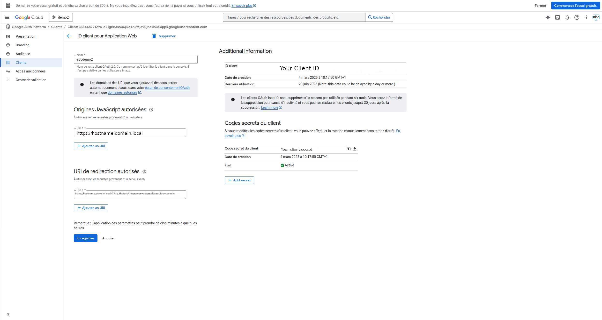

# Add external provider to abcdesktop

## Release 4.1

Release `4.1` add external provider to abcdesktop

## Requirements

- kubernetes cluster ready to run whith abcdesktop.io installed
- `kubectl` or `microk8s` command-line tool must be configured to communicate with your cluster. 
- your own internet FQDN and secured web site with https.

## Create oauth2.0 application 

To illustrate the process of adding an external provider to abcdesktop, we will take Google as an example but keep in mind that the process is nearly the same.

Go to [https://developers.google.com/identity/protocols/oauth2?hl=en]() and follow the steps of the Google documentation in order to create your app using oauth2.0 protocol.

At the end of the app setup, you should have something like this : 


## Edit od.config

Edit the AUTH section of `od.config` file. `external` authentification use OAuth 2.0 authenticaton.

The `external` authentification configuration is defined as a dictionary object and contains a list of `external` provider. 

Sample providers entry using the Google OAuth 2.0 authentification service. 

```json
'external': {
    'providers': {
    'google': { 
    'google': { 
        'displayname': 'Google', 
        'textcolor': 'white',
        'backgroundcolor': '#cd3c14',
        'icon': 'img/auth/google_icon.svg',
        'enabled': True,
        'client_id': 'xxxx', 
        'client_secret': 'xxxx',
        'userinfo_auth': True,
        'scope': [ 'https://www.googleapis.com/auth/userinfo.email',  'openid' ],
        'userinfo_url': 'https://www.googleapis.com/oauth2/v1/userinfo',
        'redirect_uri_prefix' : 'https://hostname.domain.local/API/auth/oauth',
        'redirect_uri_querystring': 'manager=external&provider=google',
        'authorization_base_url': 'https://accounts.google.com/o/oauth2/v2/auth',
        'token_url': 'https://oauth2.googleapis.com/token',
        'policies': { 'acl'  : { 'permit': [ 'all' ] } }
      }   
   }
}
```

The variable values `client_id` and `client_secret` have been set to obfuscate value 'xxxx'. The FQDN `hostname.domain.local` is referred to your public server FQDN. 


| Variable name        | Type		       | Description                        | Sample  |
|----------------------|----------------|------------------------------------|----------|
|  `displayname`       | string         | Display Name show in Web front     | `Google`  |
|  `textcolor`       | string         | Button text color in web front     | `white`  |
|  `backgroundcolor`       | string         | Button background color in web front     | `#cd3c14`  |
|  `icon`       | string         | path of the provider icon to display in Web front    | `img/auth/google_icon.svg`  |
|  `enabled`   	      | boolean        | LDAP Base Distinguished Names      | `True`     |
|  `client_id`        | string         | client id                          | `XXX-YYY.apps.googleusercontent.com` |
|  `client_secret` | string         | client secret                      | `XXX` |
|  `scope`         | list of string         | scope                              | `[ 'https://www.googleapis.com/auth/userinfo.email',  'openid' ]` |
|  `userinfo_url`    | string         | dialog URL                         | `https://www.googleapis.com/oauth2/v1/userinfo` |
|  `redirect_uri_prefix`      | string         | redirect URL               | `https://hostname.domain.local/API/auth/oauth` |
|  `redirect_uri_querystring`  | string | URL query string | `manager=external&provider=google` |
|  `authorization_base_url`    | string | callback URL   | `https://accounts.google.com/o/oauth2/v2/auth` |
|  `token_url`  					 | string | token URL | `https://oauth2.googleapis.com/token` |

The complete redirect url concats the two values `redirect_uri_prefix` and `redirect_uri_querystring`.

### Apply new config

Once saved, you need to apply the new abcdesktop configuration by running the following commands :
```
kubectl create -n abcdesktop configmap abcdesktop-config --from-file=od.config -o yaml --dry-run=client | kubectl replace -n abcdesktop -f -
```
This will delete the previous configmap and create a new one with the updated `od.config` file. Then restart pyos in order to apply the new config
```
kubectl rollout restart deploy pyos-od -n abcdesktop
```

## Add provider icon (optional)

As mentionned earlier, there are a lot of external providers that you can add and you may want to add one that has not its icon pre installed in abcdesktop.  
The ones that are already present are : 
- Google
- Facebook
- Github
- Orange
- LinkedIn
- Spotify
- Discord

Let's assume that you want to add X as an external authentification provider.  

### 1. Download icon

Go to the internet and download the x SVG icon, save it as `x_icon.svg`

### 2. Create configmap

Then create a new kubernetes configmap from your SVG file. Go to the icon folder and run the following command : 
```
kubectl create configmap x-icon --from-file=x_icon.svg -n abcdesktop
```

### 3. Edit abcdesktop.yaml

Open the `abcdesktop.yaml` file and find the pyos deployment section. This section starts with :
```yaml
apiVersion: apps/v1
kind: Deployment
metadata:
  name: pyos-od
```

Find the `volumeMounts` entry and add a new volumeMount as below :
```yaml
- name: volume-abcdesktop-x-icon
  mountPath: /var/pyos/img/auth/x_icon.svg # path to the icon inside pyos pod
  subPath: img/auth/x_icon.svg
  readOnly: true
```

Then find the `volume` entry and add a new volume as below :
```yaml
- name: volume-abcdesktop-x-icon
  configMap:
    name: x-icon # name of the configmap you created earlier
```

### 4. Apply config

Once saved, you need to apply the new config by running 
```
kubectl apply -f abcdesktop.yaml -n abcdesktop
```