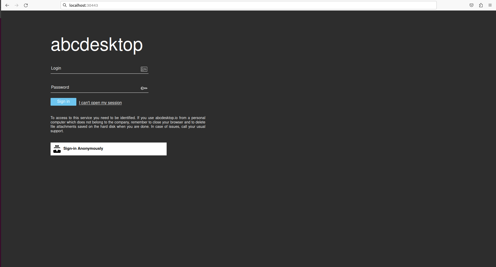
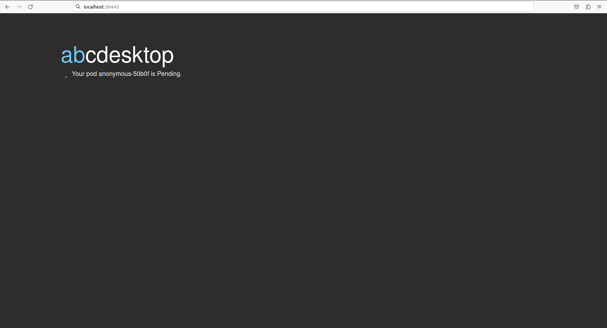
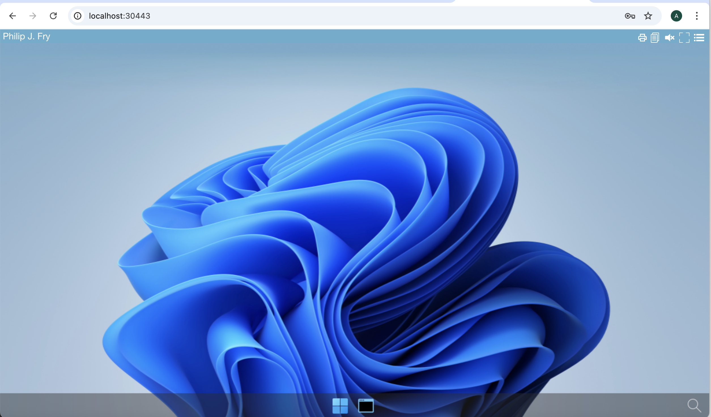

# abcdesktop installation 

## Requirements

- kubernetes cluster `READY` to run
- `kubectl` or `minikube` command-line tool must be configured to communicate with your cluster. 
- `openssl` and `curl` command line must be installed too (only for install using kubectl). 

You can run the **Quick installation process** or choose the **Manually installation step by step**

> Linux operating system is recommanded to run abcdesktop.io.

## Quick installation (Linux or macOS)

> Quick installation can be run on Linux or macOS operation system, using `kubectl` command

### Install using kubectl on Linux or macOS operation system

Download and extract the latest release automatically

```
curl -sL https://raw.githubusercontent.com/abcdesktopio/conf/main/kubernetes/install-4.1.sh | bash
```

### Install using helm on Linux or macOS operation system

> Quick installation can be run using helm (version > 3)

``` bash
helm repo add abcdesktop https://abcdesktopio.github.io/helm/
helm repo update abcdesktop
helm install my-abcdesktop abcdesktop/abcdesktop --version 4.1.1 --create-namespace -n abcdesktop
```

``` bash
% helm repo add abcdesktop https://abcdesktopio.github.io/helm/
"abcdesktop" has been added to your repositories
% helm repo update abcdesktop                                  
Hang tight while we grab the latest from your chart repositories...
...Successfully got an update from the "abcdesktop" chart repository
Update Complete. ⎈Happy Helming!⎈
% helm install my-abcdesktop abcdesktop/abcdesktop --version 4.1.1 --create-namespace -n abcdesktop
NAME: my-abcdesktop
LAST DEPLOYED: Sat Jun 21 12:32:09 2025
NAMESPACE: abcdesktop
STATUS: deployed
REVISION: 1
TEST SUITE: None
```

> To get more details about the helm installation process and options, please read the documentation on [helm repository](https://github.com/abcdesktopio/helm)

When install your helm installation process is ready, you need to forward the pod's router tcp port 80 to your localhost port `30443` (for example)

``` bash
LOCAL_PORT=30443
NAMESPACE=abcdesktop
kubectl port-forward $(kubectl get pods -l run=router-od -o jsonpath={.items..metadata.name} -n ${NAMESPACE} ) --address 0.0.0.0 "${LOCAL_PORT}:80" -n ${NAMESPACE} 
```

### installation with `kubectl`

> Download and extract the latest release automatically

```
curl -sL https://raw.githubusercontent.com/abcdesktopio/conf/main/kubernetes/install-4.1.sh | bash
```

You can read on stdout 

```
[INFO] abcdesktop install script namespace=abcdesktop
[OK] kubectl version
[OK] openssl version
[OK] kubectl create namespace abcdesktop
writing RSA key
writing RSA key
[OK] abcdesktop_jwt_desktop_payload keys created
writing RSA key
[OK] abcdesktop_jwt_desktop_signing keys create
writing RSA key
[OK] abcdesktop_jwt_user_signing keys create
[OK] create secret generic abcdesktopjwtdesktoppayload
[OK] create secret generic abcdesktopjwtdesktopsigning
[OK] create secret generic abcdesktopjwtusersigning
[OK] label secret abcdesktopjwtdesktoppayload
[OK] label secret abcdesktopjwtdesktopsigning
[OK] label secret abcdesktopjwtusersigning
[OK] downloaded source https://raw.githubusercontent.com/abcdesktopio/conf/main/kubernetes/abcdesktop-4.1.yaml
[OK] downloaded source https://raw.githubusercontent.com/abcdesktopio/conf/main/reference/od.config.4.1
[OK] kubectl create configmap abcdesktop-config --from-file=od.config -n abcdesktop
[OK] label configmap abcdesktop-config abcdesktop/role=pyos.config
role.rbac.authorization.k8s.io/pyos-role created
rolebinding.rbac.authorization.k8s.io/pyos-rbac created
serviceaccount/pyos-serviceaccount created
configmap/configmap-mongodb-scripts created
secret/secret-mongodb created
deployment.apps/mongodb-od created
deployment.apps/memcached-od created
deployment.apps/router-od created
deployment.apps/nginx-od created
deployment.apps/speedtest-od created
deployment.apps/pyos-od created
deployment.apps/console-od created
deployment.apps/openldap-od created
endpoints/desktop created
service/desktop created
service/memcached created
service/mongodb created
service/speedtest created
service/pyos created
service/console created
service/http-router created
service/website created
service/openldap created
[INFO] waiting for deployment/console-od available
[OK] deployment.apps/console-od condition met
[INFO] waiting for deployment/memcached-od available
[OK] deployment.apps/memcached-od condition met
[INFO] waiting for deployment/mongodb-od available
[OK] deployment.apps/mongodb-od condition met
[INFO] waiting for deployment/nginx-od available
[OK] deployment.apps/nginx-od condition met
[INFO] waiting for deployment/openldap-od available
[OK] deployment.apps/openldap-od condition met
[INFO] waiting for deployment/pyos-od available
[OK] deployment.apps/pyos-od condition met
[INFO] waiting for deployment/router-od available
[OK] deployment.apps/router-od condition met
[INFO] waiting for deployment/speedtest-od available
[OK] deployment.apps/speedtest-od condition met
[INFO] list all pods in namespace abcdesktop
NAME                            READY   STATUS    RESTARTS   AGE
console-od-844c749f85-vbbb7     1/1     Running   0          32s
memcached-od-d4b6b6867-tbfgf    1/1     Running   0          33s
mongodb-od-5d996fd57b-tcn45     1/1     Running   0          33s
nginx-od-796c7d7d6b-lgnjb       1/1     Running   0          33s
openldap-od-567dcf7bf6-h2nq9    1/1     Running   0          32s
pyos-od-8d4988b56-vcd7z         1/1     Running   0          32s
router-od-f5458658-b52hj        1/1     Running   0          33s
speedtest-od-7fcc9649b4-qllr7   1/1     Running   0          32s
[INFO] Setup done
[INFO] Checking the service url on http://localhost:30443
[INFO] service status is down
[INFO] Looking for a free TCP port from 30443
[OK] Get a free TCP port from 30443

[INFO] If you're using a cloud provider
[INFO] Forwarding abcdesktop service for you on port=30443
[INFO] For you setup is running the command 'kubectl port-forward nginx-od-796c7d7d6b-lgnjb --address 0.0.0.0 30443:80 -n abcdesktop'
[OK] Port-Forward successful
[OK] Please open your web browser and connect to

[INFO] http://localhost:30443/
```

The command above downloads the latest release (numerically) of abcdesktop.io. 
The quick installation process runs the commands step by step :

* create the `abcdesktop` namespace
* build all `rsa` keys for jwt signing and payload encryption, using openssl command line
* create all `service account`, `services`, `deployments`, `secrets` and `configmaps` from the [abcdesktop.yaml](https://raw.githubusercontent.com/abcdesktopio/conf/refs/heads/main/kubernetes/abcdesktop-4.1.yaml)
* download and create the default configuration file [od.config](https://raw.githubusercontent.com/abcdesktopio/conf/refs/heads/main/reference/od.config.4.1)

> This install process doesn't install applications for your desktop, you get a desktop with few applications in your dock

## Change the default namespace

You may need to replace the default namespace `abcdesktop` by your own during the install process. The `install-4.1.sh` bash script allow you to set the new namespace as an option.

```bash
wget https://raw.githubusercontent.com/abcdesktopio/conf/main/kubernetes/install-4.1.sh
chmod 755 install-4.1.sh 
```

Run `install-4.1.sh`

```bash
./install-4.1.sh --namespace superdesktop
```

```
[INFO] abcdesktop install script namespace=superdesktop
[OK] kubectl version
[OK] openssl version
[OK] kubectl create namespace superdesktop
[OK] create secret generic abcdesktopjwtdesktoppayload
[OK] create secret generic abcdesktopjwtdesktopsigning
[OK] create secret generic abcdesktopjwtusersigning
[OK] label secret abcdesktopjwtdesktoppayload
[OK] label secret abcdesktopjwtdesktopsigning
[OK] label secret abcdesktopjwtusersigning
[OK] use local file abcdesktop.yaml
[OK] use local file od.config
[OK] updated abcdesktop.yaml file with new namespace superdesktop
[OK] updated abcdesktop.yaml file with new fqdn superdesktop.svc.cluster.local
[OK] updated od.config file with new namespace superdesktop
[OK] updated od.config file with new fqdn superdesktop.svc.cluster.local
[OK] kubectl create configmap abcdesktop-config --from-file=od.config -n superdesktop
[OK] label configmap abcdesktop-config abcdesktop/role=pyos.config
[OK] default account is created
[OK] role.rbac.authorization.k8s.io/pyos-role created
rolebinding.rbac.authorization.k8s.io/pyos-rbac created
serviceaccount/pyos-serviceaccount created
configmap/configmap-mongodb-scripts created
secret/secret-mongodb created
deployment.apps/mongodb-od created
deployment.apps/memcached-od created
deployment.apps/router-od created
deployment.apps/nginx-od created
deployment.apps/speedtest-od created
deployment.apps/pyos-od created
deployment.apps/console-od created
deployment.apps/openldap-od created
endpoints/desktop created
service/desktop created
service/memcached created
service/mongodb created
service/speedtest created
service/pyos created
service/console created
service/http-router created
service/website created
service/openldap created
[OK] pyos-serviceaccount account is created
[INFO] waiting for deployment/console-od available
[OK] deployment.apps/console-od condition met
[INFO] waiting for deployment/memcached-od available
[OK] deployment.apps/memcached-od condition met
[INFO] waiting for deployment/mongodb-od available
[OK] deployment.apps/mongodb-od condition met
[INFO] waiting for deployment/nginx-od available
[OK] deployment.apps/nginx-od condition met
[INFO] waiting for deployment/openldap-od available
[OK] deployment.apps/openldap-od condition met
[INFO] waiting for deployment/pyos-od available
[OK] deployment.apps/pyos-od condition met
[INFO] waiting for deployment/router-od available
[OK] deployment.apps/router-od condition met
[INFO] waiting for deployment/speedtest-od available
[OK] deployment.apps/speedtest-od condition met
[INFO] waiting for pod/console-od-79bf9bf475-gbb62 Ready
[OK] pod/console-od-79bf9bf475-gbb62 condition met
[INFO] waiting for pod/memcached-od-d4b6b6867-c8b4p Ready
[OK] pod/memcached-od-d4b6b6867-c8b4p condition met
[INFO] waiting for pod/mongodb-od-5d996fd57b-z2pjl Ready
[OK] pod/mongodb-od-5d996fd57b-z2pjl condition met
[INFO] waiting for pod/nginx-od-57dccb8cf9-txgzc Ready
[OK] pod/nginx-od-57dccb8cf9-txgzc condition met
[INFO] waiting for pod/openldap-od-6955699d5-qhjzr Ready
[OK] pod/openldap-od-6955699d5-qhjzr condition met
[INFO] waiting for pod/pyos-od-777747f64b-r87x5 Ready
[OK] pod/pyos-od-777747f64b-r87x5 condition met
[INFO] waiting for pod/router-od-59d67d664f-f56m8 Ready
[OK] pod/router-od-59d67d664f-f56m8 condition met
[INFO] waiting for pod/speedtest-od-67db77f86f-wqkb7 Ready
[OK] pod/speedtest-od-67db77f86f-wqkb7 condition met
[INFO] list all pods in namespace superdesktop
NAME                            READY   STATUS    RESTARTS   AGE
console-od-79bf9bf475-gbb62     1/1     Running   0          12s
memcached-od-d4b6b6867-c8b4p    1/1     Running   0          13s
mongodb-od-5d996fd57b-z2pjl     1/1     Running   0          13s
nginx-od-57dccb8cf9-txgzc       1/1     Running   0          13s
openldap-od-6955699d5-qhjzr     1/1     Running   0          12s
pyos-od-777747f64b-r87x5        1/1     Running   0          13s
router-od-59d67d664f-f56m8      1/1     Running   0          13s
speedtest-od-67db77f86f-wqkb7   1/1     Running   0          13s
[INFO] Setup done
[INFO] Checking the service url on http://localhost:30443

[OK] Please open your web browser and connect to http://localhost:30443/
```

## Requirements for minikube 

To fix this issue

```
FailedScheduling 0/1 nodes are available: 1 Insufficient cpu. preemption: 0/1 nodes are available: 1 No preemption victims found for incoming pod
```

Start minikube with enough cpu and memory resources to start all abcdesktop's pods and the user's desktop

```
minikube start --cpus 4 --memory 4096
```

## Manually installation step by step (Linux, macOS or Windows)

The following commands will let you deploy an abcdesktop on the master node. All applications run on a single server.  


### Install abcdesktop
#### Step 1: Create abcdesktop namespace

We will create the abcdesktop namespace and set it as default :

```
kubectl create namespace abcdesktop
```

You should read on the standard output

```
namespace/abcdesktop created
```


####  Step 2: Secure abcdesktop JWT exchange


User JWT is signed. So we need to define a (private, public) RSA keys for signing.
 Desktop JWT is encrypted AND signed. So we need to define a (private, public) RSA keys for signing, and a (private, public) RSA keys to encrypt data.

* The JWT payload is encrypted with the abcdesktop jwt desktop payload private by pyos
* The JWT payload is decrypted with the abcdesktop jwt desktop payload public keys by nginx.

> Please use the payload private as private key, and the payload public as private key. 
> Do not publish the public key. This public key must stay private, this is a special case, this is not stupid, it's only a more secure option.

* The JSON Web Tokens payload is signed with the abcdesktop jwt desktop signing private keys
* The JSON Web Tokens payload is verified with the abcdesktop jwt desktop signing public keys.

* The JSON Web Tokens user is signed with the abcdesktop jwt user signing private keys by pyos.
* The JSON Web Tokens user is verified with the abcdesktop jwt user signing public keys by pyos
> As multiple pods of pyos can run simultaneously, the same private and public keys value are stored into kubernetes secret.

The abcdesktop jwt desktop payload public key is read by `nginx lua script`. The exported the public key need the `RSAPublicKey_out` option, to use the `RSAPublicKey` format. The `RSAPublicKey` format make key file format compatible between `python 3.x jwt module` and `lua jwt lib`.


The following commands will let you create all necessary keys :

```
openssl genrsa -out abcdesktop_jwt_desktop_payload_private_key.pem 1024
openssl rsa -in abcdesktop_jwt_desktop_payload_private_key.pem -outform PEM -pubout -out  _abcdesktop_jwt_desktop_payload_public_key.pem
openssl rsa -pubin -in _abcdesktop_jwt_desktop_payload_public_key.pem -RSAPublicKey_out -out abcdesktop_jwt_desktop_payload_public_key.pem
openssl genrsa -out abcdesktop_jwt_desktop_signing_private_key.pem 1024
openssl rsa -in abcdesktop_jwt_desktop_signing_private_key.pem -outform PEM -pubout -out abcdesktop_jwt_desktop_signing_public_key.pem
openssl genrsa -out abcdesktop_jwt_user_signing_private_key.pem 1024
openssl rsa -in abcdesktop_jwt_user_signing_private_key.pem -outform PEM -pubout -out abcdesktop_jwt_user_signing_public_key.pem
```

Then, create the kubernetes secrets from the new key files:

```
kubectl create secret generic abcdesktopjwtdesktoppayload --from-file=abcdesktop_jwt_desktop_payload_private_key.pem --from-file=abcdesktop_jwt_desktop_payload_public_key.pem --namespace=abcdesktop
kubectl create secret generic abcdesktopjwtdesktopsigning --from-file=abcdesktop_jwt_desktop_signing_private_key.pem --from-file=abcdesktop_jwt_desktop_signing_public_key.pem --namespace=abcdesktop
kubectl create secret generic abcdesktopjwtusersigning --from-file=abcdesktop_jwt_user_signing_private_key.pem --from-file=abcdesktop_jwt_user_signing_public_key.pem --namespace=abcdesktop
```

You should read on the standard output :

```
secret/abcdesktopjwtdesktoppayload created
secret/abcdesktopjwtdesktopsigning created
secret/abcdesktopjwtusersigning created
```

##### Verify Secrets
You can verify secrets creation with the following command :

```
kubectl get secrets -n abcdesktop
```

You should read on the standard output :

```
NAME                          TYPE                                  DATA   AGE
abcdesktopjwtdesktoppayload   Opaque                                2      68s
abcdesktopjwtdesktopsigning   Opaque                                2      68s
abcdesktopjwtusersigning      Opaque                                2      67s
```


### Step 3: Download and create the abcdesktop config file 

Download the od.config file. This is the main configuration file for `pyos` control plane.

```
curl https://raw.githubusercontent.com/abcdesktopio/conf/main/reference/od.config.4.1 --output od.config
```

Create the config map `abcdesktop-config` in the `abcdesktop` namespace

``` bash
kubectl create configmap abcdesktop-config --from-file=od.config -n abcdesktop
```

You should read on sdtout

```
configmap/abcdesktop-config created
```

### Step 4: Create the abcdesktop pods and services

abcdesktop.yaml file contains declarations for all roles, service account, pods, and services required for abcdesktop.

Run the command line

``` bash
kubectl create -n abcdesktop -f https://raw.githubusercontent.com/abcdesktopio/conf/main/kubernetes/abcdesktop-4.1.yaml
```

You should read on the standard output

``` bash
role.rbac.authorization.k8s.io/pyos-role created
rolebinding.rbac.authorization.k8s.io/pyos-rbac created
serviceaccount/pyos-serviceaccount created
configmap/configmap-mongodb-scripts created
secret/secret-mongodb created
deployment.apps/mongodb-od created
deployment.apps/memcached-od created
deployment.apps/router-od created
deployment.apps/nginx-od created
deployment.apps/speedtest-od created
deployment.apps/pyos-od created
deployment.apps/console-od created
deployment.apps/openldap-od created
endpoints/desktop created
service/desktop created
service/memcached created
service/mongodb created
service/speedtest created
service/pyos created
service/console created
service/http-router created
service/website created
service/openldap created
```

##### Verify Pods

Once the pods are created, all pods should be in `Running` status.  
For the first time, please wait for downloading all container images. 
It can take a while.

``` bash
kubectl get pods -n abcdesktop
```

You should read on the standard output

``` bash
NAME                            READY   STATUS    RESTARTS   AGE
console-od-79bf9bf475-cqtj5     1/1     Running   0          2m18s
memcached-od-d4b6b6867-djzr6    1/1     Running   0          2m19s
mongodb-od-5d996fd57b-gn4hv     1/1     Running   0          2m19s
nginx-od-796c7d7d6b-rk2d5       1/1     Running   0          2m19s
openldap-od-567dcf7bf6-krhpw    1/1     Running   0          2m18s
pyos-od-65bdd9d479-5228d        1/1     Running   0          2m18s
router-od-7b6dff8dd4-pn587      1/1     Running   0          2m19s
speedtest-od-7fcc9649b4-n2ldl   1/1     Running   0          2m18s
```

### Connect your local abcdesktop

Open your navigator to http://[your-ip-hostname]:30443/

abcdesktop homepage should be available :



Click on the **Connect with Anonymous** access button. abcdesktop service pyos is creating a new pod.



Few seconds later, processes are ready to run. You should see the abcdesktop main screen, with no application in the dock.



Also, you can run again the command 

``` bash
kubectl get pods -l type=x11server -n abcdesktop
```

You should see that the `anonymous-XXXXX` pod have been created and is `Running`

``` bash
NAME              READY   STATUS    RESTARTS   AGE
anonymous-c44fc   5/5     Running   0          116s
```

Great you have installed abcdesktop.io.
You just need a web browser to reach your web workspace. It' now time to add some container applications.
Read the next chapter to add applications


