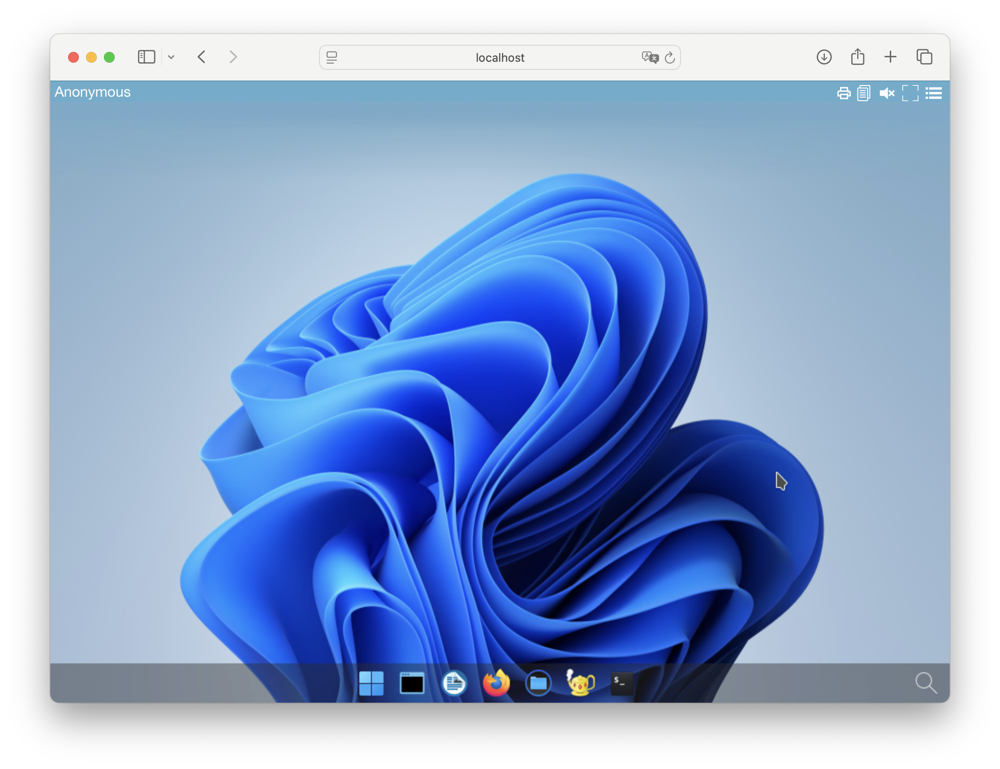
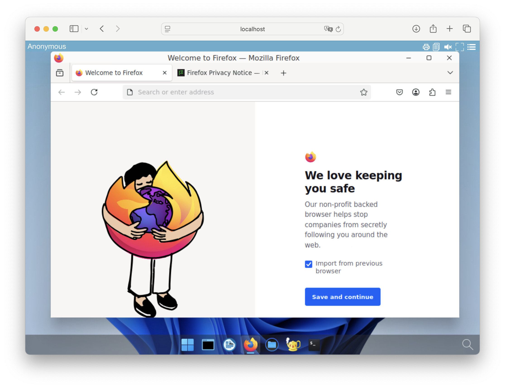

# Setup applications for abcdesktop

## Quick application install

> Quick installation can be run on Linux or macOS operation system. 

Download and execute the `pullapps-4.1.sh` script :

```
curl -sL https://raw.githubusercontent.com/abcdesktopio/conf/main/kubernetes/pullapps-4.1.sh | bash
```

You can watch the youtube video sample. This video describes the application installation process on a fresh kubernetes cluster.

<div style="display: flex; justify-content: center;"><iframe width="640" height="480" src="https://www.youtube.com/embed/JSIjnNA6kNE" allow="accelerometer; autoplay; encrypted-media; gyroscope; picture-in-picture" allowfullscreen> </iframe></div>


This script starts abcdesktop application on an empty desktop. Pod is created to ask Kubernetes for pulling containers image.


```
NAME                                                             READY   STATUS              RESTARTS   AGE
daemonset-nginx-dqxzx                                            1/1     Running             0          100m
daemonset-pyos-rdwws                                             1/1     Running             0          100m
memcached-od-bdcbbcb74-xbg8x                                     1/1     Running             0          100m
mongodb-od-6484d8bc67-9xsgm                                      1/1     Running             0          100m
openldap-od-795c55f6db-pb68k                                     1/1     Running             0          100m
pull-2048-abcinst-9fd80f22ad6b0750cb3d248bda04de25444bab2cf274   1/1     Running             0          5s
pull-calc-abcinst-57622131ac1ce4b37d5cec51ee7f0071c460293158a4   1/1     Running             0          3s
pull-firefox-abcinst-d2872d0d272a3a02606b4877c12e832755ba1a378   0/1     ContainerCreating   0          1s
pull-gimp-abcinst-051fefa55d97338653a58e86ccdd5f1a3e66f7f05017   0/1     ContainerCreating   0          0s
pull-impress-abcinst-f74fed932051c2760b3fd69f4ef475e34ad1a8a49   0/1     ContainerCreating   0          2s
pull-writer-abcinst-cfe1a4f74d19fbe49d86d211f99d005532b6cf7c87   1/1     Running             0          3s
pull-xterm-abcinst-0e802cfa8addb4648f843869325f3413d544bb9eae8   1/1     Running             0          4s
speedtest-od-5565dfdc67-vdwcl                                    1/1     Running             0          100m
```

list of created pods for pulling is pull-2048-abcinst-9fd80f22ad6b0750cb3d248bda04de25444bab2cf274

```
pull-calc-abcinst-57622131ac1ce4b37d5cec51ee7f0071c460293158a4
pull-firefox-abcinst-d2872d0d272a3a02606b4877c12e832755ba1a378
pull-gimp-abcinst-051fefa55d97338653a58e86ccdd5f1a3e66f7f05017
pull-impress-abcinst-f74fed932051c2760b3fd69f4ef475e34ad1a8a49
pull-writer-abcinst-cfe1a4f74d19fbe49d86d211f99d005532b6cf7c87
pull-xterm-abcinst-0e802cfa8addb4648f843869325f3413d544bb9eae8
pod/pull-2048-abcinst-9fd80f22ad6b0750cb3d248bda04de25444bab2cf274 condition met
pod/pull-calc-abcinst-57622131ac1ce4b37d5cec51ee7f0071c460293158a4 condition met
pod/pull-firefox-abcinst-d2872d0d272a3a02606b4877c12e832755ba1a378 condition met
pod/pull-gimp-abcinst-051fefa55d97338653a58e86ccdd5f1a3e66f7f05017 condition met
pod/pull-impress-abcinst-f74fed932051c2760b3fd69f4ef475e34ad1a8a49 condition met
pod/pull-writer-abcinst-cfe1a4f74d19fbe49d86d211f99d005532b6cf7c87 condition met
pod/pull-xterm-abcinst-0e802cfa8addb4648f843869325f3413d544bb9eae8 condition met
```

### Connect to your abcdesktop

The API server receives a new image event from docker daemon. To run the new applications just refresh you web browser page.

Now reconnect to your abcdesktop. 

Open your navigator to http://[your-ip-hostname]:30443/

```	
http://localhost:30443/
```

The new applications are installed, and ready to run.



And then you can start new applications like `Firefox`



Another example with console admin interface usage

<div style="display: flex; justify-content: center;"><iframe width="640" height="480" src="https://www.youtube.com/embed/Dah78eAJykw" allow="accelerometer; autoplay; encrypted-media; gyroscope; picture-in-picture" allowfullscreen> </iframe></div>


