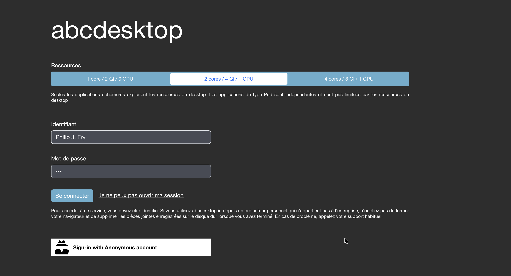

# Troubleshooting to share nvidia gpu between pod and ephemeral containers


## Requirements


To run this troubleshooting guide, you need a ubuntu/debian linux host with a nvidia device.

- kubernetes is installed 
- nvidia driver is installed and nvidia-smi command works
- gpu-operator namespace is created and 
- abcdesktop is installed 


This install is from the nvidia container-toolkit install web page 
[https://docs.nvidia.com/datacenter/cloud-native/container-toolkit/latest/install-guide.html](https://docs.nvidia.com/datacenter/cloud-native/container-toolkit/latest/install-guide.html)


## Install `NVIDIA_CONTAINER_TOOLKIT=1.17.8-1`

Install the `NVIDIA_CONTAINER_TOOLKIT=1.17.8-1`

```
export NVIDIA_CONTAINER_TOOLKIT_VERSION=1.17.8-1
apt-get install -y \
      nvidia-container-toolkit=${NVIDIA_CONTAINER_TOOLKIT_VERSION} \
      nvidia-container-toolkit-base=${NVIDIA_CONTAINER_TOOLKIT_VERSION} \
      libnvidia-container-tools=${NVIDIA_CONTAINER_TOOLKIT_VERSION} \
      libnvidia-container1=${NVIDIA_CONTAINER_TOOLKIT_VERSION} \
      --allow-downgrades
```

## Configuring nvidia container toolkit for containerd (for Kubernetes)


[Option] Reset the running containerd config file `config.toml`
[Option] `containerd config dump > /etc/containerd/config.toml`

Configure the container runtime by using the nvidia-ctk command:

```
nvidia-ctk runtime configure --runtime=containerd
```

```
INFO[0000] Using config version 3                       
INFO[0000] Using CRI runtime plugin name "io.containerd.cri.v1.runtime" 
INFO[0000] Wrote updated config to /etc/containerd/config.toml 
INFO[0000] It is recommended that containerd daemon be restarted.
```

Check if `enable_cdi` option is set to `true` in the new generated file `/etc/containerd/config.toml`

```
grep enable_cdi /etc/containerd/config.toml
    enable_cdi = true
```


### Restart containerd:

```
systemctl restart containerd
```


### [option] Simple check, run a sample pod `cuda-vectoradd`


Create a `cuda-vectoradd.yaml` pod 

```
apiVersion: v1
kind: Pod
metadata:
  name: cuda-vectoradd
spec:
  restartPolicy: OnFailure
  containers:
  - name: cuda-vectoradd
    image: "nvcr.io/nvidia/k8s/cuda-sample:vectoradd-cuda11.7.1-ubuntu20.04"
    resources:
      limits:
        nvidia.com/gpu: 1
```

Create `pod/cuda-vectoradd`

```
kubectl create -f cuda-vectoradd.yaml
```

You should read

```
pod/cuda-vectoradd created
```

Get pod status and read logs of `cuda-vectoradd`

```
kubectl get pods cuda-vectoradd
NAME             READY   STATUS      RESTARTS   AGE
cuda-vectoradd   0/1     Completed   0          2m12s
```

```
kubectl  logs cuda-vectoradd  
[Vector addition of 50000 elements]
Copy input data from the host memory to the CUDA device
CUDA kernel launch with 196 blocks of 256 threads
Copy output data from the CUDA device to the host memory
Test PASSED
Done
```


## Enabling or check the default cluster-policy CDI 

Use the following procedure to enable CDI 

```
kubectl patch clusterpolicies.nvidia.com/cluster-policy --type='json' \
    -p='[{"op": "replace", "path": "/spec/cdi/enabled", "value":true}]'
```


## abcdesktop.io config file


Get the `od.config` file

If you don't already have the config file `od.config`, run the command line 

```
kubectl -n abcdesktop get configmap abcdesktop-config -o jsonpath='{.data.od\.config}' > od.config
```

Edit `od.config` and update the dictionary `executeclasses` resources limits to add gpu `'nvidia.com/gpu':'1'` and change `the desktop.features_permissions`.

```
executeclasses : {
  'default':{
    'description': '1 CPU cores and 2Gi',
    'nodeSelector':None,
    'resources':{
      'requests':{'memory':"512Mi",'cpu':"100m"},       
      'limits':  {'memory':"2Gi",'cpu':"1000m" }
    }
  },
  'bronze':{
    'description': '1 core / 2 Gi / 0 GPU',
    'nodeSelector':None,
    'resources':{
      'requests':{'memory':"64Mi",'cpu':"100m"},       
      'limits':  {'memory':"2Gi",'cpu':"1000m"}
    }
  },
  'silver':{
    'description': '2 cores / 4 Gi / 1 GPU',
    'nodeSelector':None,
    'resources':{
      'requests':{'memory':"64Mi",'cpu':"100m"},       
      'limits':  {'memory':"4Gi",'cpu':"2000m", 'nvidia.com/gpu':'1' }
    }
  },
  'gold':{
    'description': '4 cores / 8 Gi / 1 GPU',
    'nodeSelector':None,
    'resources':{
      'requests':{'memory':"128Mi",'cpu':"100m"},       
      'limits':{'memory':"8Gi",'cpu':"4000m", 'nvidia.com/gpu':'1' } } } }

# features_permissions
# read executeclasses and permit a user to set a dedicated class name as desktop features
# 'read' features_permissions is exposed to the frontend
# 'submit' features_permissions can be set to create a desktop
# 
desktop.features_permissions : [ 'read', 'submit' ]
```

Apply the new `od.config` file and restart the deployment `pyos-od` 

```
kubectl create -n abcdesktop configmap abcdesktop-config --from-file=od.config -o yaml --dry-run=client | kubectl replace -n abcdesktop -f -
kubectl rollout restart deployment pyos-od -n abcdesktop
```

Now you are able to create abcdesktop pod with gpu support `nvidia.com/gpu':'1'`

## Troubleshoot to check if GPU can be shared or not 

### Create a desktop 

Open a web browser to reach your abcdesktop web site.

1. Choose 'silver' and create a user desktop with GPU support ( for example login as fry user, the pod's name is defined with the `fry` prefix )



Your desktop is created


2. Check that your pod is running and get the pod's name 

```
kubectl get pods -l type=x11server -n abcdesktop
NAME        READY   STATUS    RESTARTS   AGE
fry-f550c   3/3     Running   0          100s
```

The pod's name is `fry-f550c`


3. Get the GPU UUID

Run `nvidia-smi -L` command line to read the `GPU UUID`. We need it to create ephemaral container as abcdesktop does. 
 
```
kubectl exec -it fry-f550c -c x-graphical -n abcdesktop  -- nvidia-smi -L 
```

You should read the GPU UUID 

```
GPU 0: Quadro M620 (UUID: GPU-b5aebea9-8a25-fb21-631b-7e5da5a60ccb)
```

> In this case, the GPU UUID is `GPU-b5aebea9-8a25-fb21-631b-7e5da5a60ccb`
> Copy your own value, we need it to set an environment variable


### Create an ephemeral container


Create a yaml file `custom-profile-nvidia-gpu.yaml` and replace `GPU-b5aebea9-8a25-fb21-631b-7e5da5a60ccb` by your own gpu uuid 

```
env:
- name: NVIDIA_VISIBLE_DEVICES
  value: GPU-b5aebea9-8a25-fb21-631b-7e5da5a60ccb
- name: NVIDIA_DRIVER_CAPABILITIES
  value: all
``` 

Run a debug ephemeral container linked to your pod 

```
kubectl debug -it fry-f550c --image=ubuntu --target=x-graphical --profile=general -n abcdesktop --custom=custom-profile-nvidia-gpu.yaml -- nvidia-smi -L
```

```
Targeting container "x-graphical". If you don't see processes from this container it may be because the container runtime doesn't support this feature.
Defaulting debug container name to debugger-d67sn.
GPU 0: Quadro M620 (UUID: GPU-b5aebea9-8a25-fb21-631b-7e5da5a60ccb) 
```

Check that the GPU UUID is the same as define

```
(UUID: GPU-b5aebea9-8a25-fb21-631b-7e5da5a60ccb) 
```

If you read the same GPU uuid, this is good !


