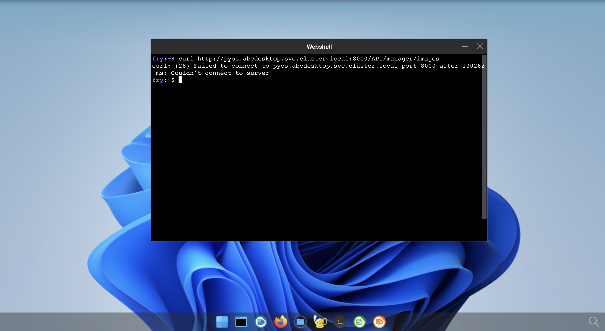
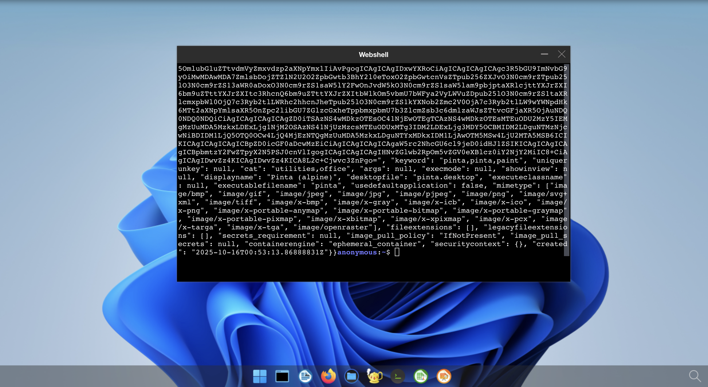

# NetworkPolicy 


## Goals

* Apply network policies to control traffic flow at the IP address or port level of abcdesktop pods, **this includes user's pods**.


## Authors


[jpxavier-oio](https://github.com/jpxavier-oio) has designed the network policy for abcdesktop.io


## Requirements

- You need to have a Kubernetes cluster, and the kubectl command-line tool must be configured to communicate with your cluster. It is recommended to run this tutorial on a cluster with at least two nodes.

- Network policies are implemented by the network plugin. To use network policies, you must be using a networking solution which supports NetworkPolicy. 


## NetworkPolicy description


There are two sorts of isolation defined in abcdesktop : the NetworkPolicy  `rights` and the NetworkPolicy `permits`.


- The NetworkPolicy `rights` contains `egress` and `ingress` for pod selected by tag. `rights` means access (ingress) to this pod and access (egress) from this pod. To define ip filter for user's pod, you need to set egress NetworkPolicy.


- The NetworkPolicy `permits` contains `egress` to a pod selected by tag. The NetworkPolicy `permits` means permit access to this pod.


## NetworkPolicy example

The NetworkPolicy examples describe the network policies for the internal memcached pod and the user's pods.

### NetworkPolicy `rights` and `permits` for the `memcached`.

The `memcached` service is listening on TCP port 11211.
The NetworkPolicy for memcached service `rights`, named `memcached-rights`, allows pods with label `run: memcached-od` to expose the TCP port 11211.


```yaml
apiVersion: networking.k8s.io/v1
kind: NetworkPolicy
metadata:
  name: memcached-rights
  namespace: abcdesktop
spec:
  podSelector:
    matchLabels:
      run: memcached-od
  policyTypes:
  - Ingress
  ingress:
  - ports:
    - protocol: TCP
      port: 11211
    from:
    - podSelector:
        matchLabels:
          netpol/memcached: 'true'
    - namespaceSelector:
        matchLabels:
          name: kube-monitor
      podSelector:
        matchLabels:
          netpol/metrics: 'true'
```


The NetworkPolicy for memcached service `permits`, named `memcached-permits`, allows all pods with label `netpol/memcached: 'true'` to reach the TCP port 11211 to pods with label `run: memcached-od`.

```yaml
apiVersion: networking.k8s.io/v1
kind: NetworkPolicy
metadata:
  name: memcached-permits
  namespace: abcdesktop
spec:
  podSelector:
    matchLabels:
      netpol/memcached: 'true'
  policyTypes:
  - Egress
  egress:
  - ports:
    - protocol: TCP
      port: 11211
    to:
    - podSelector:
        matchLabels:
          run: memcached-od
---
```


### NetworkPolicy `rights` and `permits` for the user's pods.


The `ocuser` pod is listening on TCP ports :

  - 4714
  - 6081
  - 29780
  - 29781
  - 29782
  - 29783
  - 29784
  - 29785
  - 29786

The network policy for ocuser's pods `rights` is named `ocuser-rights`. It allows pods with label `type: 'x11server'` to expose the previous TCP ports.

The `egress` network policy allows : 

- dns queries to kube-dns
- http to any web site
- https to any web site
- kerberos auth to any kdc


```yaml
apiVersion: networking.k8s.io/v1
kind: NetworkPolicy
metadata:
  name: ocuser-rights
  namespace: abcdesktop
spec:
  podSelector:
    matchLabels:
      type: 'x11server'
  policyTypes:
  - Ingress
  - Egress
  ingress:
  - from:
    - podSelector:
        matchLabels:
          netpol/ocuser: 'true'
    ports:
    - protocol: TCP
      port: 4714
    - protocol: TCP
      port: 6081
    - protocol: TCP
      port: 8000
    - protocol: TCP
      port: 29780
    - protocol: TCP
      port: 29781
    - protocol: TCP
      port: 29782
    - protocol: TCP
      port: 29783
    - protocol: TCP
      port: 29784
    - protocol: TCP
      port: 29785
    # spawner_service_tcp_port
    - protocol: TCP
      port: 29786
  egress:
  # pod user can run dns query to all kube-system
  - ports:
    - protocol: TCP
      port: 53
    - protocol: UDP
      port: 53
    to:
    - namespaceSelector:
        matchLabels:
          name: kube-system
      podSelector:
        matchLabels:
          k8s-app: kube-dns
# permit www website from pod user 
  - ports:
    - protocol: TCP
      port: 443
    - protocol: TCP
      port: 80
# permit kerberos auth kinit
  - ports:
    - protocol: UDP
      port: 88
    - protocol: TCP
      port: 88
```      


The network policy for ocuser's pods `permits ` is named `ocuser-permits`. It allows pods with label `netpol/ocuser: 'true'` to reach the user's pods services.

```yaml
apiVersion: networking.k8s.io/v1
kind: NetworkPolicy
metadata:
  name: ocuser-permits
  namespace: abcdesktop
spec:
  podSelector:
    matchLabels:
      netpol/ocuser: 'true'
  policyTypes:
  - Egress
  egress:
  - to:
    - podSelector:
        matchLabels:
          type: 'x11server'
    ports:
    # default pulseaudio websocket audio without webrtc gateway
    - protocol: TCP
      port: 4714
    # vnc websockify
    - protocol: TCP
      port: 6081
    # reserved
    - protocol: TCP
      port: 29780
    # xterm_tcp_port
    - protocol: TCP
      port: 29781
    # printerfile_service_tcp_port
    - protocol: TCP
      port: 29782
    # file_service_tcp_port
    - protocol: TCP
      port: 29783
    # broadcast_tcp_port 
    - protocol: TCP
      port: 29784
    # reserved
    - protocol: TCP
      port: 29785
    # spawner_service_tcp_port
    - protocol: TCP
      port: 29786
```


## Apply the default `netpol-default-4.2.yaml` file


To apply the network policies run the command :

```bash
kubectl apply -f https://raw.githubusercontent.com/abcdesktopio/conf/main/kubernetes/netpol-default-4.2.yaml -n abcdesktop
```

The command returns 

```
networkpolicy.networking.k8s.io/abcdesktop-rights created
networkpolicy.networking.k8s.io/memcached-rights created
networkpolicy.networking.k8s.io/memcached-permits created
networkpolicy.networking.k8s.io/mongodb-rights created
networkpolicy.networking.k8s.io/mongodb-permits created
networkpolicy.networking.k8s.io/console-rights created
networkpolicy.networking.k8s.io/console-permits created
networkpolicy.networking.k8s.io/speedtest-rights created
networkpolicy.networking.k8s.io/speedtest-permits created
networkpolicy.networking.k8s.io/pyos-rights created
networkpolicy.networking.k8s.io/pyos-permits created
networkpolicy.networking.k8s.io/router-rights created
networkpolicy.networking.k8s.io/router-permits created
networkpolicy.networking.k8s.io/nginx-rights created
networkpolicy.networking.k8s.io/nginx-permits created
networkpolicy.networking.k8s.io/ocapplications-permits created
networkpolicy.networking.k8s.io/ocuser-rights created
networkpolicy.networking.k8s.io/ocuser-permits created
networkpolicy.networking.k8s.io/authentication-permits created
networkpolicy.networking.k8s.io/ldap-permits created
networkpolicy.networking.k8s.io/ldap-rights created
networkpolicy.networking.k8s.io/smtp-permits created
networkpolicy.networking.k8s.io/https-permits created
networkpolicy.networking.k8s.io/storage-permits created
networkpolicy.networking.k8s.io/coredns-permits created
networkpolicy.networking.k8s.io/apiserver-permits created
networkpolicy.networking.k8s.io/graylog-permits created
```


### Test the network policies

- Login to your abcdesktop 
- Open a webshell and run a curl command. 

```bash
curl http://pyos.abcdesktop.svc.cluster.local:8000/API/manager/images
```

This http request is denied by the network policy and you should get an error message 

```
curl: (28) Failed to connect to pyos.abcdesktop.svc.cluster.local port 8000 after 130290 ms: Couldn't connect to server
```




You should get an error message, the user's pod can't reach `https://pyos.abcdesktop.svc.cluster.local:8000/API`.


### Disable the network policies  

To disable the network policies, run the kubectl delete command :

```bash
kubectl delete -f https://raw.githubusercontent.com/abcdesktopio/conf/main/kubernetes/netpol-default-4.2.yaml
```

- Login to your abcdesktop 
- Open the web shell to run the same curl command

```bash
curl http://pyos.abcdesktop.svc.cluster.local:8000/API/manager/images
```

You should get a json document as http response




You may need to update the [netpol-default.yaml](https://raw.githubusercontent.com/abcdesktopio/conf/main/kubernetes/netpol-default-4.2.yaml) file with your own values.


