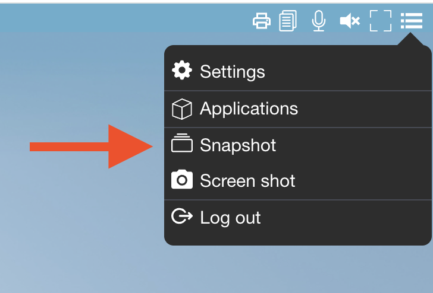

# Snapshot feature

The snapshot feature is a new point of view of how to manage desktop in abcdesktop.
The user get a desktop, he can customize, install and remove applications inside his desktop.

The user does a `commit` of his running desktop.
The commit is pushed to a private docker registry with a dedicated tag.
The user does a `logoff`, his pod is deleted.

When the user `login again`, pyos service looks for the dedicated user's image with the lastest timestamp in the private registry.
If a image is found for this user, pyos updates the image description with the lastest timestamp.


## Requirement 

- a private registry
- an account to read/write images inside the private registry 
- `kubectl` command line
- `nerdctl`command line 


## Create your kubernetes secret to access to your private registry

Create a `docker-registry` secret. 

```
kubectl create secret docker-registry regcred --docker-server=<your-registry-server> --docker-username=<your-name> --docker-password=<your-pword> --docker-email=<your-email>
```

- <your-registry-server> is your Private Docker Registry FQDN. Use https://index.docker.io/v1/ for DockerHub.
- <your-name> is your Docker username.
- <your-pword> is your Docker password.
- <your-email> is your Docker email.

> Only secret type `kubernetes.io/dockerconfigjson` is supported. The type of the secret must be `kubernetes.io/dockerconfigjson`

Example

```
kubectl create secret docker-registry snapregistry --docker-server=myregistry.domain.com --docker-username=snapreguser --docker-password=22qFaWfjaZeSa --docker-email='user@myregistry.domain.com' -n abcdesktop
```

```
secret/snapregistry created
```


## Update `od.config` file

Update file  `od.config`


- Add new entry

```
desktop.snapshotregistrysecretname : 'NAME_OF_YOUR_KUBERNETES_DOCKER-REGISTRY_SECRET'
desktop.snapshotregistryprotocol : 'https'
```

For example

```
desktop.snapshotregistrysecretname : 'snapregistry'
desktop.snapshotregistryprotocol : 'https'
```


- Update the `desktop.pod` dictionary to add a new entry 

```

 'snapshot': { 
    'image': 'ghcr.io/abcdesktopio/oc.snapshot:main',
    'imagePullPolicy': 'Always',
    'enable': True,
    'tcpport': 29785,
    'securityContext': { 'runAsUser': 0, 'runAsGroup': 0 },
    'acl':  { 'permit': [ 'all' ] },
    'resources': { 
      'requests': { 'memory': "32Mi",  'cpu': "50m"  },  
      'limits'  : { 'memory': "256Mi", 'cpu': "500m" } 
    }
  },
  
```

A example with the entries before and after the 'snapshot' container

```
 'sound': { 
    'image': 'ghcr.io/abcdesktopio/oc.pulseaudio:4.1',
    'imagePullPolicy': 'IfNotPresent',
    'enable': True,
    'tcpport': 29788,
    'acl':  { 'permit': [ 'all' ] },
    'resources': { 
      'requests': { 'memory': "32Mi",  'cpu': "50m"  },  
      'limits'  : { 'memory': "256Mi", 'cpu': "500m" } 
    }
  },
  'snapshot': { 
    'image': 'ghcr.io/abcdesktopio/oc.snapshot:main',
    'imagePullPolicy': 'Always',
    'enable': True,
    'tcpport': 29785,
    'securityContext': { 'runAsUser': 0, 'runAsGroup': 0 },
    'acl':  { 'permit': [ 'all' ] },
    'resources': { 
      'requests': { 'memory': "32Mi",  'cpu': "50m"  },  
      'limits'  : { 'memory': "256Mi", 'cpu': "500m" } 
    }
  },
  # container init
  # a simple busybox to chowner and chmod of homedir
  # by defaul homedir belongs to root
  'init': { 
    'image': 'busybox',
    'enable': True,
    'imagePullPolicy': 'IfNotPresent',
    'securityContext': { 'runAsUser': 0 },
    'acl':  { 'permit': [ 'all' ] },
    'resources': { 
      'requests': { 'memory': "8Mi",  'cpu': "5m"  },  
      'limits'  : { 'memory': "32Mi", 'cpu': "100m" } 
    }, 
    'command':  [ 'sh', '-c',  'chmod 750 ~ && chown {{ uidNumber }}:{{ gidNumber }} ~' ] 
  },
```

By settings ```'enable': True``` in the ```snapshot``` container, this will add a new entry in the front menu.





## Login to you abcdesktop


## Check the pods

List your pods with a `kubectl` command line

```
kubectl  get pods -l type=x11server  -n abcdesktop
NAME                          READY   STATUS    RESTARTS   AGE
12896316-a4dbc                6/6     Running   0          32m
```

Get the description of your pod

```
kubectl describe pods 12896316-a4dbc -n abcdesktop
Events:
  Type    Reason     Age   From               Message
  ----    ------     ----  ----               -------
  Normal  Scheduled  33m   default-scheduler  Successfully assigned abcdesktop/12896316-a4dbc to koumoula
  Normal  Pulled     33m   kubelet            Container image "busybox" already present on machine
  Normal  Created    33m   kubelet            Created container: i-init
  Normal  Started    33m   kubelet            Started container i-init
  Normal  Pulling    33m   kubelet            Pulling image "registry.pepins.net/abcdesktopio/oc.user.ubuntu.sudo.24.04:12896316-111111"
  Normal  Pulled     33m   kubelet            Successfully pulled image "registry.pepins.net/abcdesktopio/oc.user.ubuntu.sudo.24.04:12896316-111111" in 146ms (146ms including waiting). Image size: 788037450 bytes.
  Normal  Created    33m   kubelet            Created container: x-graphical
  Normal  Started    33m   kubelet            Started container x-graphical
  Normal  Pulled     33m   kubelet            Container image "ghcr.io/abcdesktopio/oc.cupsd:4.1" already present on machine
  Normal  Created    33m   kubelet            Created container: c-printer
  Normal  Started    33m   kubelet            Started container c-printer
  Normal  Pulled     33m   kubelet            Container image "ghcr.io/abcdesktopio/oc.pulseaudio:4.1" already present on machine
  Normal  Created    33m   kubelet            Created container: s-sound
  Normal  Started    33m   kubelet            Started container s-sound
  Normal  Pulled     33m   kubelet            Container image "ghcr.io/abcdesktopio/oc.filer:4.0" already present on machine
  Normal  Created    33m   kubelet            Created container: f-filer
  Normal  Started    33m   kubelet            Started container f-filer
  Normal  Pulled     33m   kubelet            Container image "k8s.gcr.io/pause:3.8" already present on machine
  Normal  Created    33m   kubelet            Created container: o-storage
  Normal  Started    33m   kubelet            Started container o-storage
  Normal  Pulling    33m   kubelet            Pulling image "ghcr.io/abcdesktopio/oc.snapshot:main"
  Normal  Pulled     33m   kubelet            Successfully pulled image "ghcr.io/abcdesktopio/oc.snapshot:main" in 538ms (538ms including waiting). Image size: 2354837 bytes.
  Normal  Created    33m   kubelet            Created container: t-snapshot
  Normal  Started    33m   kubelet            Started container t-snapshot
```

A new container is present `t-snapshot`


## take a snapshot

To take a `snapshot`, in fact it's more a `commit`, but we keep the snapshot word to make it more simple like the virtual machine feature

- What the snapshot container does ?

It runs `nerdctl` command list to execute a `nerdctl commit` of the running `grahical` container
When `snapshot` tag the image with the current userid and a timestamp. The tag is formated as `$USERID-$TIMESTAMP`. When the commit is done, the `snapshot` container put the image to the regsitry using the kubernetes secret `kubernetes.io/dockerconfigjson` credentials.
 
You can read the `snapshot` log with the command 


## Troubleshooting

Check your credentials on your registry with `nerdctl login` command line

For example

```
nerdctl login myregistry.domain.com --username snapreguser --password 22qFaWfjaZeSa
```

You should get 

```
WARN[0000] WARNING! Using --password via the CLI is insecure. Use --password-stdin. 
Login Succeeded
```


