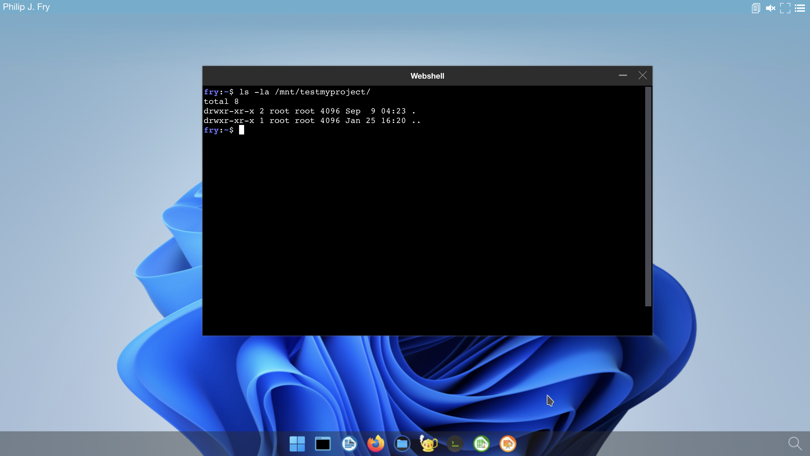

# Add hostPath volume using rules


Users may need to access shared files. If you can't create `persistent volumes` on your cluster, this page describe how to access a shared '/mnt/myproject' hostPath using `rules`


## Check your rules in `authmanagers` `ldapconfig`


The `ldapconfig` for demo ldap server add few default rules. To get more information about the ldap server read the [docker-test-openldap](https://github.com/abcdesktopio/docker-test-openldap) web page.

The user `Philip J. Fry` is member of the group `ship_crew`.


Detail of `ship_crew` group `cn=ship_crew,ou=people,dc=planetexpress,dc=com`

| Attribute        | Value            |
| ---------------- | ---------------- |
| objectClass      | Group |
| cn               | ship_crew |
| member           | cn=Turanga Leela,ou=people,dc=planetexpress,dc=com |
| member           | cn=Philip J. Fry,ou=people,dc=planetexpress,dc=com |
| member           | cn=Bender Bending Rodríguez,ou=people,dc=planetexpress,dc=com |


```
ldapconfig : {
        'planet': {
                'default'       : True,
                'ldap_timeout'  : 15,
                'ldap_protocol' : 'ldap',
                'ldap_basedn'   : 'ou=people,dc=planetexpress,dc=com',
                'servers'       : [ 'openldap' ],
                'secure'        : False,
                'serviceaccount': { 'login': 'cn=admin,dc=planetexpress,dc=com', 'password': 'GoodNewsEveryone' },
                'policies': {
                    'acls': None,
                    'rules' : {
                        'rule-dummy' : {
                            'conditions' : [ {'boolean':True, 'expected':True } ], 
                            'expected' : True,
                            'label':'labeltrue'
                        },
                        'rule-ship': {
                            'conditions' : [ { 'memberOf': 'cn=ship_crew,ou=people,dc=planetexpress,dc=com',   'expected' : True  } ],
                            'expected' : True,
                            'label':'shipcrew'
                        },
                        'rule-test': {
                            'conditions' : [ { 'memberOf': 'cn=admin_staff,ou=people,dc=planetexpress,dc=com', 'expected' : True  } ],
                            'expected' : True,
                            'label': 'adminstaff'
                        }
                    }
	            } } }
```

This provider defines 3 rules :

- `labeltrue` always for all users
- `shipcrew` if the user is member of `cn=ship_crew,ou=people,dc=planetexpress,dc=com` group
- `adminstaff` if the user is memberof `cn=admin_staff,ou=people,dc=planetexpress,dc=com` group


Start your web brower and login in as `Philip J. Fry` to you abcdesktop web service.

- Open the `Menu` |  `User` tab


When `Philip J. Fry` is logged in, `Philip J. Fry` gets the labels `labeltrue` and `shipcrew`.


## Define a volume policy when a label is set


To define a policy, we need to update the `desktop.policies` dictionary.


### Extract the `abcdesktop-config` configmap description to a local file

```
kubectl -n abcdesktop get configmap abcdesktop-config -o jsonpath='{.data.od\.config}' > od.config
```

You get a the new local file `od.config`


### Update `od.config` file


Add `rules` to the `desktop.policies` dictionary

```
desktop.policies: { 
  'rules': { 
    'volumes': { 
      'shipcrew': { 
        'type': 'hostPath', 
        'name': 'mntmyproject', 
        'path': '/mnt',
        'mountPath': '/mnt/testmyproject'
      }
    },
    'network': {}                                
  },
  'acls' : {} }
```

In this case, the `type` is set to `hostPath`. Others types are supported like [ `cifs`, `nfs`, `pvc` ]

> On your worker node, make sure that the `/mnt` directory exists.

This policy adds a new volume `mntmyproject` defined as a `hostPath` to the users's pod and mount it as `/mnt/testmyproject`.


Save your `od.config` file

### Apply the new config file 

Replace the previous configmap

```
kubectl create -n abcdesktop configmap abcdesktop-config --from-file=od.config -o yaml --dry-run=client | kubectl replace -n abcdesktop -f -
```

Expected output 

```
configmap/abcdesktop-config replaced
```

Restart pyos to apply the new config map

```
kubectl rollout restart deployment pyos-od -n abcdesktop
```

Expected output 

```
deployment.apps/pyos-od restarted
```

Your new config is ready to use 


## Restart a new desktop as `Philip J. Fry`
 

- Create a new desktop for `Philip J. Fry`
- Get the name of the `Philip J. Fry` pod


```
kubectl get pods -l type=x11server -n abcdesktop
NAME        READY   STATUS    RESTARTS   AGE
fry-06c5f   4/4     Running   0          3m24s
```

- Describe the `Philip J. Fry` pod, and look for the `Mounts` and `Volumes` entries

```
kubectl desribe pods fry-06c5f -n abcdesktop
```

The mount for `hostpath-mntmyproject-fry` is defined to `/mnt/testmyproject`

```
    Mounts:
      /etc/sudoers.d from sudoers (rw)
      /home/fry from home (rw)
      /home/fry/.cache from cache (rw)
      /mnt/testmyproject from hostpath-mntmyproject-fry (rw)
      /run/user/ from runuser (rw)
      /tmp from tmp (rw)
      /tmp/.X11-unix from x11socket (rw)
      /tmp/.cupsd from cupsdsocket (rw)
      /var/lib/extrausers from extrausers (rw)
      /var/log/desktop from log (rw)
      /var/run/dbus from rundbus (rw)
      /var/run/desktop from run (rw)
      /var/secrets/abcdesktop/vnc from auth-vnc-fry (rw)
```

The volume `hostpath-mntmyproject-fry` is defined as

```
  hostpath-mntmyproject-fry:
    Type:          HostPath (bare host directory volume)
    Path:          /mnt
    HostPathType:  DirectoryOrCreate
```


A new `Mount` is defined as `/mnt/testmyproject from hostpath-mntmyproject-fry (rw)` and a new volume hostpath-mntmyproject-fry is defined as `HostPath` to the `Path` `/mnt`

> Check that your file system's permissions are set to your users

The volume `hostpath-mntmyproject-fry` is also mounted for applications ephemeral containers and pods.

- Start the `webshell` application in the web interface to list files in `/mnt/testmyproject`.

Inside the webshell terminal, run the command `ls -la /mnt/testmyproject`




> You added a new volume to your pods and your application.
