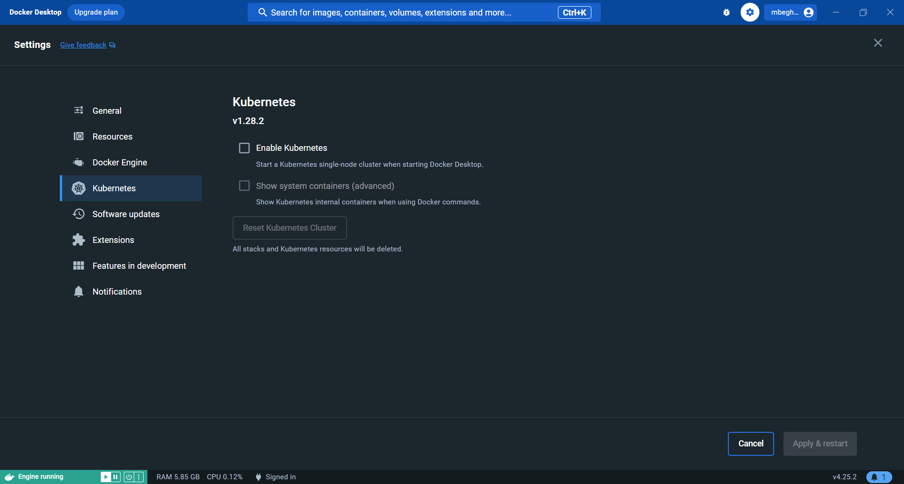

## Quick installation (Windows)

> Quick installation can be run on Windows operation system.

### Prerequisites

#### Install and configure Docker Desktop

To run abcdesktop on Microsoft Windows plateform you need to use [docker desktop](https://www.docker.com/products/docker-desktop/)

Start `Docker Desktop` and wait for the docker engine to start.


Once started go to the `Settings | Kubernetes` and click on `Enable Kubernetes`, starting your cluster may take a while.



Now your cluster should be correctly initialized, you can check it by opening a new PowerShell and run the command `kubectl version`

```
kubectl version
client version: V1.40.4
Kustomise Version: V9-0-4-0.202506011699445602001590025
Server Version: v1.28.2
```


#### Install OpenSSL

abcdesktop install process creates RSA keys using openssl, you need to install `openssl` command line.

Download the [OpenSSL v3.2.0 Light](https://www.openssl.org/source/) executable file.


Then follow the install process.


Make sure to keep in mind the path where OpenSSL will be installed.


Once installed, go to "Edit the system environement variables", and click on "Environement variables".


Go to the system variables section and search for `Path` 


Click on `Edit` and add a new `Path`, you have to paste the absolute path to the bin folder of OpenSSL.


Now `OpenSSL` should be correctly installed, you can check it by opening a new PowerShell and run the command 

```
openssl version
```


### Run the install script

Download and extract the latest release automatically (Windows):

```PowerShell
$script = curl https://raw.githubusercontent.com/abcdesktopio/conf/main/kubernetes/install-4.4.ps1

Invoke-Expression $($script.Content)
```

You should read on stdout

```
[INFO] abcdesktop install script namespace=abcdesktop
[OK] kubectl version
[OK] openssl version
[OK] kubectl create namespace abcdesktop
writing RSA key
writing RSA key
[OK] abcdesktop_jwt_desktop_payload keys created
writing RSA key
[OK] abcdesktop_jwt_desktop_signing keys create
writing RSA key
[OK] abcdesktop_jwt_user_signing keys create
[OK] create secret generic abcdesktopjwtdesktoppayload
[OK] create secret generic abcdesktopjwtdesktopsigning
[OK] create secret generic abcdesktopjwtusersigning
[OK] label secret abcdesktopjwtdesktoppayload
[OK] label secret abcdesktopjwtdesktopsigning
[OK] label secret abcdesktopjwtusersigning
[OK] downloaded source https://raw.githubusercontent.com/abcdesktopio/conf/main/kubernetes/abcdesktop-4.4.yaml
[OK] downloaded source https://raw.githubusercontent.com/abcdesktopio/conf/main/reference/od.config.4.4
[OK] kubectl create configmap abcdesktop-config --from-file=od.config -n abcdesktop
[OK] label configmap abcdesktop-config abcdesktop/role=pyos.config
role.rbac.authorization.k8s.io/pyos-role created
rolebinding.rbac.authorization.k8s.io/pyos-rbac created
serviceaccount/pyos-serviceaccount created
configmap/configmap-mongodb-scripts created
secret/secret-mongodb created                                                                                           deployment.apps/mongodb-od created                                                                                      deployment.apps/memcached-od created                                                                                    deployment.apps/router-od created                                                                                       deployment.apps/nginx-od created
deployment.apps/speedtest-od created
deployment.apps/pyos-od created
deployment.apps/console-od created
deployment.apps/openldap-od created
endpoints/desktop created
service/desktop created
service/memcached created
service/mongodb created
service/speedtest created
service/pyos created
service/console created
service/http-router created
service/website created
service/openldap created
[INFO] waiting for deployment/console-od available
[OK] deployment.apps/console-od condition met
[INFO] waiting for deployment/memcached-od available
[OK] deployment.apps/memcached-od condition met
[INFO] waiting for deployment/mongodb-od available
[OK] deployment.apps/mongodb-od condition met
[INFO] waiting for deployment/nginx-od available
[OK] deployment.apps/nginx-od condition met
[INFO] waiting for deployment/openldap-od available
[OK] deployment.apps/openldap-od condition met
[INFO] waiting for deployment/pyos-od available
[OK] deployment.apps/pyos-od condition met
[INFO] waiting for deployment/router-od available
[OK] deployment.apps/router-od condition met
[INFO] waiting for deployment/speedtest-od available
[OK] deployment.apps/speedtest-od condition met
[INFO] list all pods in namespace abcdesktop
NAME                            READY   STATUS    RESTARTS   AGE
console-od-844c749f85-pghrs     1/1     Running   0          12s
memcached-od-d4b6b6867-wjvmz    1/1     Running   0          12s
mongodb-od-5d996fd57b-2ncll     1/1     Running   0          12s
nginx-od-796c7d7d6b-cxlzt       1/1     Running   0          12s
openldap-od-567dcf7bf6-77zv7    1/1     Running   0          12s
pyos-od-8d4988b56-7bg5z         1/1     Running   0          12s
router-od-f5458658-znwcg        1/1     Running   0          12s
speedtest-od-7fcc9649b4-kxnsn   1/1     Running   0          12s
[INFO] Setup done
[INFO] Checking the service url on http://localhost:30443
[INFO] service status is down
[INFO] Looking for a free TCP port from 30443
[OK] Get a free TCP port from 30443

[INFO] If you're using a cloud provider
[INFO] Forwarding abcdesktop service for you on port=30443
[INFO] For you setup is running the command 'kubectl port-forward nginx-od-796c7d7d6b-cxlzt --address 0.0.0.0 30443:80 -n abcdesktop'
[OK] Port-Forward successful
[OK] Please open your web browser and connect to

[INFO] http://localhost:30443/
```

You can open a web browser and go to the http://localhost:30443/ 

## Change the default namespace

You may need to replace the default namespace `abcdesktop` by your own. The `install-4.4.ps1` PowerShell script allows you to set the new namespace as an option.

```PowerShell
curl https://raw.githubusercontent.com/abcdesktopio/conf/main/kubernetes/install-4.4.ps1 -OutFile install-4.4.ps1
```

Run `install-4.4.ps1`

```PowerShell
.\install-4.3.ps1 --namespace superdesktop
```

You should read on stdout

```
[INFO] abcdesktop install script namespace=superdesktop
[OK] kubectl version
[OK] openssl version
[OK] kubectl create namespace superdesktop
writing RSA key
writing RSA key
[OK] abcdesktop_jwt_desktop_payload keys created
writing RSA key
[OK] abcdesktop_jwt_desktop_signing keys create
writing RSA key
[OK] abcdesktop_jwt_user_signing keys create
[OK] create secret generic abcdesktopjwtdesktoppayload
[OK] create secret generic abcdesktopjwtdesktopsigning
[OK] create secret generic abcdesktopjwtusersigning
[OK] label secret abcdesktopjwtdesktoppayload
[OK] label secret abcdesktopjwtdesktopsigning
[OK] label secret abcdesktopjwtusersigning
[OK] downloaded source https://raw.githubusercontent.com/abcdesktopio/conf/main/kubernetes/abcdesktop-4.4.yaml
[OK] downloaded source https://raw.githubusercontent.com/abcdesktopio/conf/main/reference/od.config.4.4
[OK] updated abcdesktop.yaml file with new namespace superdesktop
[OK] updated abcdesktop.yaml file with new fqdn superdesktop.svc.cluster.local
[OK] updated od.config file with new namespace superdesktop
[OK] updated od.config file with new fqdn superdesktop.svc.cluster.local
[OK] kubectl create configmap abcdesktop-config --from-file=od.config -n superdesktop
[OK] label configmap abcdesktop-config abcdesktop/role=pyos.config
role.rbac.authorization.k8s.io/pyos-role created
rolebinding.rbac.authorization.k8s.io/pyos-rbac created
serviceaccount/pyos-serviceaccount created
configmap/configmap-mongodb-scripts created
secret/secret-mongodb created                                                                                           deployment.apps/mongodb-od created                                                                                      deployment.apps/memcached-od created                                                                                    deployment.apps/router-od created                                                                                       deployment.apps/nginx-od created
deployment.apps/speedtest-od created
deployment.apps/pyos-od created
deployment.apps/console-od created
deployment.apps/openldap-od created
endpoints/desktop created
service/desktop created
service/memcached created
service/mongodb created
service/speedtest created
service/pyos created
service/console created
service/http-router created
service/website created
service/openldap created
[INFO] waiting for deployment/console-od available
[OK] deployment.apps/console-od condition met
[INFO] waiting for deployment/memcached-od available
[OK] deployment.apps/memcached-od condition met
[INFO] waiting for deployment/mongodb-od available
[OK] deployment.apps/mongodb-od condition met
[INFO] waiting for deployment/nginx-od available
[OK] deployment.apps/nginx-od condition met
[INFO] waiting for deployment/openldap-od available
[OK] deployment.apps/openldap-od condition met
[INFO] waiting for deployment/pyos-od available
[OK] deployment.apps/pyos-od condition met
[INFO] waiting for deployment/router-od available
[OK] deployment.apps/router-od condition met
[INFO] waiting for deployment/speedtest-od available
[OK] deployment.apps/speedtest-od condition met
[INFO] list all pods in namespace superdesktop
NAME                            READY   STATUS    RESTARTS   AGE
console-od-844c749f85-zqbdq     1/1     Running   0          22s
memcached-od-d4b6b6867-wn7r4    1/1     Running   0          22s
mongodb-od-5d996fd57b-xsnkf     1/1     Running   0          22s
nginx-od-57dccb8cf9-z68q9       1/1     Running   0          22s
openldap-od-6955699d5-rl8rd     1/1     Running   0          21s
pyos-od-7f5f8d66b5-q686l        1/1     Running   0          22s
router-od-c9fd4c987-xvcbq       1/1     Running   0          22s
speedtest-od-67db77f86f-6fftb   1/1     Running   0          22s
[INFO] Setup done
[INFO] Checking the service url on http://localhost:30443
[INFO] service status is down
[INFO] Looking for a free TCP port from 30443
[OK] Get a free TCP port from 30443

[INFO] If you're using a cloud provider
[INFO] Forwarding abcdesktop service for you on port=30443
[INFO] For you setup is running the command 'kubectl port-forward nginx-od-57dccb8cf9-z68q9 --address 0.0.0.0 30443:80 -n superdesktop'
[OK] Port-Forward successful
[OK] Please open your web browser and connect to

[INFO] http://localhost:30443/
```

You can open a web browser and go to the http://localhost:30443/
