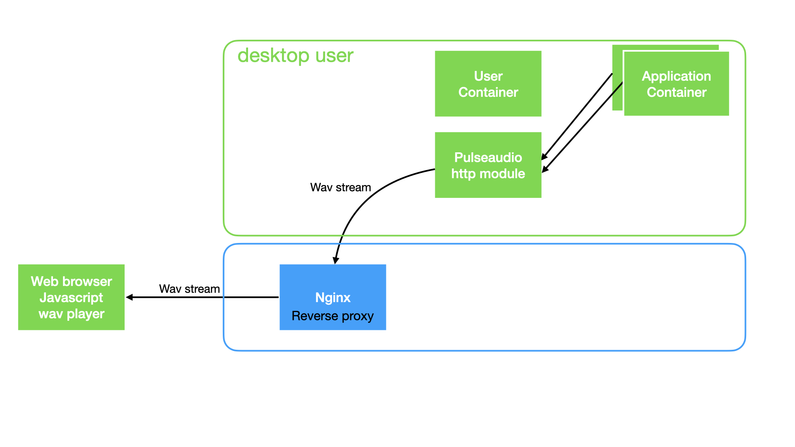
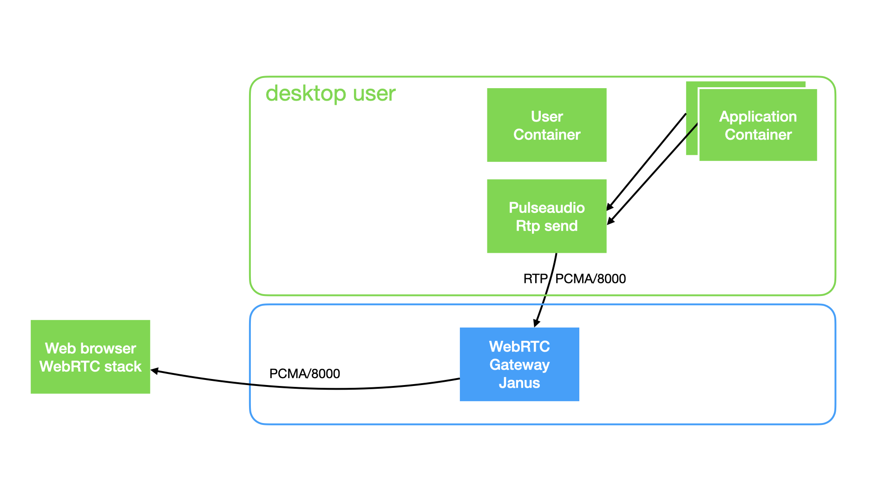

# Play sound inside a docker to a web browser


## Sound in docker is the big challenge

As VNC does not support sound, we have to forward a ```Pulseaudio null-sink``` output to the user browser, with no latency. 

* Release 1.0 : use the pulseaudio http stream and play wave data (poor sound quality but works in https only)



* Release 2.0 : use janus webrtc gateway, send pulseaudio rtp stream to janus, and play sound using the web browser webrtc stack (good sound quality)



## Release 1.0: Pulseaudio with a simple module-http-protocol-tcp and a javascript no latency wav stream player

* [webaudio-wav-stream-player](https://github.com/revolunet/webaudio-wav-stream-player) No latency wav stream player using browser fetch streaming API and WebAudio

* Pulseaudio with [module-http-protocol-tcp](https://www.freedesktop.org/wiki/Software/PulseAudio/Documentation/User/Modules/) A proof-of-concept HTTP module, which can be used to introspect the current status of the PulseAudio daemon using HTTP. Just load this module and point your browser to http://localhost:4714/. This module takes the same arguments as module-cli-protocol-tcp.


* Create Pulseaudio null-sink

```
# defined with desktop 1.0
load-module module-null-sink sink_name=u8_1_11025 format=u8 channels=1 rate=11025 sink_properties="device.description='default format=u8 c=1 ra
te=11025'"
```

Then use 

```
load-module module-http-protocol-tcp
```

Read the http stream data, using fetch call :

* ```$target``` is the container Ip Address
* ```$pulseaudio_http_port``` is the pulseaudio http port ( by default, the http port vallue is 

```
http://$target:$pulseaudio_http_port/listen/source/u8_1_11025.monitor;
```

Pulseaudio module-http-protocol-tcp does not send wav formated header. We need to build a new wav header for each receved fragment. This is done in ```wavify.js``` file :

```
//
// Write a proper WAVE header for the given buffer.
// format ULAW or ALAW 
// Offset is hardcoded 
function wavify_law(data, numberOfChannels, sampleRate, bitsPerSample, format ) {

    // // total header : 4 + 26 + 12 + 8 = 50 
    // // and the data and size: 50 + 8 ( data + 32 bits for the size )
    var header_length = 58; // 4 + 26 + 12 + 8 + 8 = 58 
    var total_length =  header_length + data.byteLength;

    // bitsPerSample MUST BE  8 bits

    // The default byte ordering assumed for WAVE data files is little-endian.
    var header = new ArrayBuffer(header_length); 
    var d = new DataView(header);

    d.setUint8(0, "R".charCodeAt(0)); 
    d.setUint8(1, "I".charCodeAt(0));
    d.setUint8(2, "F".charCodeAt(0));
    d.setUint8(3, "F".charCodeAt(0));

    // All integers MUST be set in bigEndian format
    // Wave chunks containing format information and sampled data
    // cksize	4	Chunk size: 4+n  
    // 4: for sizeof( 'WAVE' ) + n 
    // n: Wave chunks containing format information and sampled data
    //var data_length = d.setUint32(4, data.byteLength / 2 + 44, true);
//bitsPerSample data.byteLength + 8+16+12
    d.setUint32(4, total_length, true); 

    // write 4 bytes
    d.setUint8(8,  "W".charCodeAt(0)); 
    d.setUint8(9,  "A".charCodeAt(0)); 
    d.setUint8(10, "V".charCodeAt(0)); 
    d.setUint8(11, "E".charCodeAt(0)); 


    // write 4 bytes
    d.setUint8(12, "f".charCodeAt(0));
    d.setUint8(13, "m".charCodeAt(0));
    d.setUint8(14, "t".charCodeAt(0));
    d.setUint8(15, " ".charCodeAt(0));

 
    // All integers MUST be set in bigEndian format


    // Subchunk1Size 16 for PCM.  
    // Offset 16	
    // Size 4
    // This is the size of the rest of the Subchunk which follows this number.
    // The size of the rest of this subchunk.
    // All integers MUST be set in bigEndian format
    // d.setUint32(16, 16, true);
    // cksize	4	Chunk size: 16, 18 or 40 
    var chunksize = 18;
    d.setUint32(16, chunksize, true);
 
    // The format of the wave data, which will be 1 for uncompressed PCM data.
    // All integers MUST be set in bigEndian format
    // FORMAT must be WAVE_FORMAT_ULAW or WAVE_FORMAT_ALAW
    d.setUint16(20, format, true);
    
    // Indicates if the data is mono, stereo, or something else.
    // NumChannels Mono = 1, Stereo = 2, etc.
    // All integers MUST be set in bigEndian format
    d.setUint16(22, numberOfChannels, true);

    // The sample rate per second.
    // SampleRate 8000, 44100, etc.
    // All integers MUST be set in bigEndian format
    d.setUint32(24, sampleRate, true);

    // byteRate == SampleRate * NumChannels * BitsPerSample/8
    // All integers MUST be set in bigEndian format
    var byteRate = sampleRate * numberOfChannels * bitsPerSample/8;
    d.setUint32(28, byteRate, true ); 

    // blockAlign       == NumChannels * BitsPerSample/8
    // The number of bytes for one sample including all channels.
    var blockAlign = numberOfChannels * bitsPerSample / 8; 
     // All integers MUST be set in bigEndian format
    d.setUint16(32, blockAlign, true ); 

    // BitsPerSample    8 bits = 8, 16 bits = 16, etc.
    d.setUint16(34, bitsPerSample, true);

    // Wave files may include an additional field, usually reserved for non-PCM formats:
    // bits per Sample 
    // Size of the extension 
    // 2 bytes
    // Offset 
    var cbSize = 0;
    d.setUint16(36, cbSize, true);

    d.setUint8(38, "f".charCodeAt(0));
    d.setUint8(39, "a".charCodeAt(0));
    d.setUint8(40, "c".charCodeAt(0));
    d.setUint8(41, "t".charCodeAt(0));
    var cksize = 4;
    d.setUint32(42, cksize, true);
    var dwSampleLength = data.byteLength; // Number of samples ( per channel )
    d.setUint32(46, dwSampleLength, true);

// 50
    d.setUint8(50, "d".charCodeAt(0));
    d.setUint8(51, "a".charCodeAt(0));
    d.setUint8(52, "t".charCodeAt(0));
    d.setUint8(53, "a".charCodeAt(0));
    
    d.setUint32(54, data.byteLength, true);

//58
    // data must pad byte 0 or 1 if n is odd
    return concat(header, data);
}
```

Then use the ```WavPlayer.js``` from Julien Bouquillon [https://github.com/revolunet/webaudio-wav-stream-player](https://github.com/revolunet/webaudio-wav-stream-player]) to read data and send to javascript ```AudioContext()```

This Release is getting glitchy audio. In Chrome, the stream plays with a slight crackle. Read the issue [https://github.com/revolunet/webaudio-wav-stream-player/issues/10](https://github.com/revolunet/webaudio-wav-stream-player/issues/10)

## Release 2.0: Pulseaudio with a WebRTC gateway

### Architecture


* [Janus WebRTC Gateway](https://janus.conf.meetecho.com/) with ICE server. Janus act as WebRTC gateway, listen for udp RTP stream from Pulseaudio and forward it to user web browser.

* Pulseaudio with [module-rtp-send](https://www.freedesktop.org/wiki/Software/PulseAudio/Documentation/User/Modules/) Create a null-sink formated alaw and send it to the WebRTC gateway udp port on localhost.

```
### Load the RTP sender module (also configured via paprefs, see above)
load-module module-null-sink sink_name=rtp_alaw format=alaw channels=1 rate=8000 sink_properties="device.description='RTP Multicast Sink alaw'"
load-module module-rtp-send source=rtp_alaw.monitor destination_ip=127.0.0.1 port=5000 channels=1 format=alaw
``` 

Add a RTP stream to Janus WebRTC gateway

```
[pulseaudio-rtp-pcma-8000]
type = rtp
id = 1
description = pcam/8000 live stream coming from pulseaudio
audio = yes
video = no
audioport = 5000
audiopt = 8
audiortpmap = PCMA/8000
```

Read the dedicated [webrtc chapter](/config/webrtc/) to configure and get more informations about the janus WebRTC
