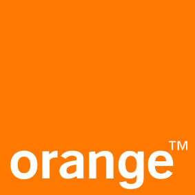

# Adopters

Here are some of the organizations we know are using abcdesktop.io.

 Adopters | Name     | Description | Public applications repository |
| -------- | -------- | ----------- | ----------------------- |
|  | [Embl](https://www.embl.org/) | The European Molecular Biology Laboratory is an intergovernmental organization dedicated to molecular biology research and is supported by 28 member states, one prospect state, and one associate member state | [https://git.embl.de/ysun/abcdesktop-apps/](https://git.embl.de/ysun/abcdesktop-apps/)|
|  | [Orange](https://www.orange.com/) | Telecommunications operator and digital service provider. Orange serves 287 million customers, individuals, professionals, and large companies | Orange uses common public and private business applications |

If you’re using abcdesktop.io and aren’t on this list, please submit a pull request to add entry in this list.
