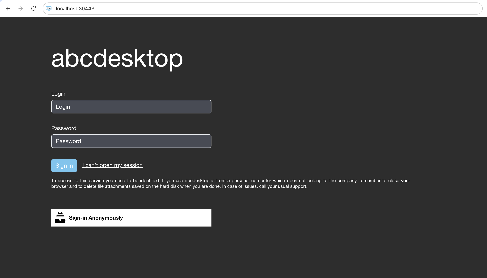
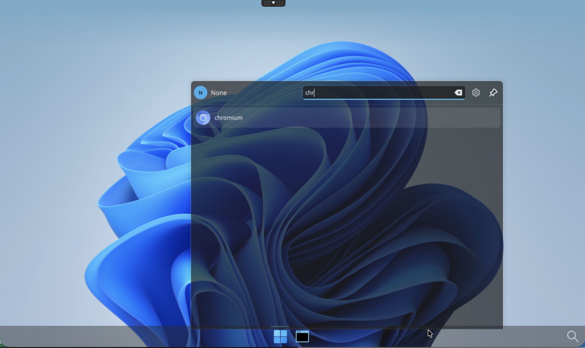
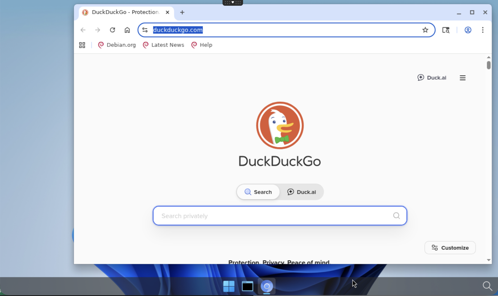

---
tags:
  - application
  - chromium 
---

# Build a simple application `chromium` from scratch

Goal: Add an application `chromium`.

## Requirements

You need to have:

- kubernetes cluster ready to run whith abcdesktop.io installed.
- `kubectl` command-line tool must be configured to communicate with your cluster.
- `docker` command line must be installed to build the image.
- your own public or private container registry.


## Create a simple application `chromium`

To illustrate a simple application, we will install `chromium` inside a container.

* Create a Dockerfile to install `chromium` application from `debian` container image

```Dockerfile
FROM debian
RUN echo 'debconf debconf/frontend select Noninteractive' | debconf-set-selections
ENV DEBIAN_FRONTEND=noninteractive
RUN apt-get update && apt-get install -y chromium && apt-get clean && rm -rf /var/lib/apt/lists/*
# End of install package
LABEL oc.icon="circle_chromium.svg"
LABEL oc.icondata="PHN2ZyB3aWR0aD0iNjQiIGhlaWdodD0iNjQiIHZlcnNpb249IjEuMSIgeG1sbnM9Imh0dHA6Ly93d3cudzMub3JnLzIwMDAvc3ZnIiB4bWxuczp4bGluaz0iaHR0cDovL3d3dy53My5vcmcvMTk5OS94bGluayI+CiA8ZGVmcz4KICA8bGluZWF
yR3JhZGllbnQgaWQ9ImQiIHgxPSI5NS45NyIgeDI9Ijk1Ljk3IiB5MT0iMi4yOTIyIiB5Mj0iMTk4LjQ0IiBncmFkaWVudFRyYW5zZm9ybT0ibWF0cml4KDEuNzE5MSAwIDAgMS43MTkxIDM0MC4wOSAzNjguNDUpIiBncmFkaWVudFVuaXRzPSJ1c2VyU3BhY2VPblVzZ
SI+CiAgIDxzdG9wIHN0b3AtY29sb3I9IiM4ZGI2ZmYiIG9mZnNldD0iMCIvPgogICA8c3RvcCBzdG9wLWNvbG9yPSIjNTlmIiBvZmZzZXQ9IjEiLz4KICA8L2xpbmVhckdyYWRpZW50PgogIDxsaW5lYXJHcmFkaWVudCBpZD0iYyIgeDE9IjExNC43NSIgeDI9IjExNC4
3NSIgeTE9IjU2LjY4MSIgeTI9IjE4OC45MyIgZ3JhZGllbnRUcmFuc2Zvcm09Im1hdHJpeCg1LjEgMCAwIDUuMSAyIDIpIiBncmFkaWVudFVuaXRzPSJ1c2VyU3BhY2VPblVzZSI+CiAgIDxzdG9wIHN0b3AtY29sb3I9IiM3NmE3ZjYiIG9mZnNldD0iMCIvPgogICA8c
3RvcCBzdG9wLWNvbG9yPSIjYTJjMmY4IiBvZmZzZXQ9IjEiLz4KICA8L2xpbmVhckdyYWRpZW50PgogIDxsaW5lYXJHcmFkaWVudCBpZD0iYiIgeDE9IjEwMy42NyIgeDI9IjEwMy42NyIgeTE9Ii00LjY2MjMiIHkyPSIyMDYuNSIgZ3JhZGllbnRUcmFuc2Zvcm09Im1
hdHJpeCgyLjE2OTkgMCAwIDIuMTY5OSAyOTUuMDEgMzIzLjM3KSIgZ3JhZGllbnRVbml0cz0idXNlclNwYWNlT25Vc2UiPgogICA8c3RvcCBzdG9wLWNvbG9yPSIjZmZmIiBvZmZzZXQ9IjAiLz4KICAgPHN0b3Agc3RvcC1jb2xvcj0iI2Q3ZDdkNyIgb2Zmc2V0PSIxI
i8+CiAgPC9saW5lYXJHcmFkaWVudD4KICA8ZmlsdGVyIGlkPSJnIiB4PSItLjAzNiIgeT0iLS4wMzYiIHdpZHRoPSIxLjA3MiIgaGVpZ2h0PSIxLjA3MiIgY29sb3ItaW50ZXJwb2xhdGlvbi1maWx0ZXJzPSJzUkdCIj4KICAgPGZlR2F1c3NpYW5CbHVyIHN0ZERldml
hdGlvbj0iNi41MDk3Nzg5Ii8+CiAgPC9maWx0ZXI+CiAgPGZpbHRlciBpZD0iZiIgeD0iLS4wMzYiIHk9Ii0uMDM2IiB3aWR0aD0iMS4wNzIiIGhlaWdodD0iMS4wNzIiIGNvbG9yLWludGVycG9sYXRpb24tZmlsdGVycz0ic1JHQiI+CiAgIDxmZUdhdXNzaWFuQmx1c
iBzdGREZXZpYXRpb249IjE0LjExNSIvPgogIDwvZmlsdGVyPgogIDxsaW5lYXJHcmFkaWVudCBpZD0iZSIgeDE9IjQxIiB4Mj0iOTgyIiB5MT0iNTQwLjg2IiB5Mj0iNTQwLjg2IiBncmFkaWVudFVuaXRzPSJ1c2VyU3BhY2VPblVzZSI+CiAgIDxzdG9wIHN0b3AtY29
sb3I9IiM2NDlhZjUiIG9mZnNldD0iMCIvPgogICA8c3RvcCBzdG9wLWNvbG9yPSIjNGI4YWY1IiBvZmZzZXQ9IjEiLz4KICA8L2xpbmVhckdyYWRpZW50PgogIDxsaW5lYXJHcmFkaWVudCBpZD0iYSIgeDE9IjExNy4wNSIgeDI9IjkyNi45NSIgeTE9IjMyNi4zMyIge
TI9IjMyNi4zMyIgZ3JhZGllbnRVbml0cz0idXNlclNwYWNlT25Vc2UiPgogICA8c3RvcCBzdG9wLWNvbG9yPSIjM2I2YmQ0IiBvZmZzZXQ9IjAiLz4KICAgPHN0b3Agc3RvcC1jb2xvcj0iIzY2OGJkZSIgb2Zmc2V0PSIxIi8+CiAgPC9saW5lYXJHcmFkaWVudD4KIDw
vZGVmcz4KIDxnIHRyYW5zZm9ybT0idHJhbnNsYXRlKDAgLTk4OC4zNikiPgogIDxnIHRyYW5zZm9ybT0ibWF0cml4KC4wNjM3NjIgMCAwIC4wNjM3NjIgLS42MTQyNCA5ODUuODgpIiBzdHJva2Utd2lkdGg9IjE1LjY4MyI+CiAgIDxjaXJjbGUgY3g9IjUxMS41IiBje
T0iNTQwLjg2IiByPSI0NzAuNSIgY29sb3I9IiMwMDAwMDAiIGZpbHRlcj0idXJsKCNmKSIgb3BhY2l0eT0iLjI1Ii8+CiAgIDxjaXJjbGUgY3g9IjUxMS41IiBjeT0iNTQwLjg2IiByPSI0NzAuNSIgY29sb3I9IiMwMDAwMDAiIGZpbGw9InVybCgjZSkiLz4KICAgPHB
hdGggdHJhbnNmb3JtPSJ0cmFuc2xhdGUoMCAyOC4zNjIpIiBkPSJtODEzLjQxIDE1MS43NGMtOTYuNzI2IDIzLjAzMi01NTQuMTcgMTM2LjQ1LTMwMC4xNCAxNjMuOTEgMjgzLjA1IDMwLjYgMTc1LjMxIDMxNy40NyAxNzUuMzEgMzE3LjQ3bC0yMDcuMjYgMzQ4LjM3Y
TQ3MC41IDQ3MC41IDAgMCAwIDMwLjE2OCAxLjUwOTggNDcwLjUgNDcwLjUgMCAwIDAgNDcwLjUtNDcwLjUgNDcwLjUgNDcwLjUgMCAwIDAtMTY4LjU5LTM2MC43NnoiIGZpbGw9InVybCgjYykiLz4KICAgPHBhdGggdHJhbnNmb3JtPSJ0cmFuc2xhdGUoMCAyOC4zNjI
pIiBkPSJtNTExLjUgNDJhNDcwLjUgNDcwLjUgMCAwIDAtMzk0LjQ1IDIxNC44MmwyMTAuMzUgMzUzLjg0cy01LjYzMzgtMTcwLjQ1IDguNDUzMS0xODcuMzZjMTQuMDg3LTE2LjkwNCA4My4xMTMtODEuNzAzIDgzLjExMy04MS43MDNsOTQuMzgxLTI4LjE3NC01LjEwN
TUtMTguMzEyIDQxOC43MS0yLjc1MzlhNDcwLjUgNDcwLjUgMCAwIDAtNDE1LjQ2LTI1MC4zNnoiIGNvbG9yPSIjMDAwMDAwIiBmaWxsPSJ1cmwoI2EpIi8+CiAgIDxjaXJjbGUgY3g9IjUxMiIgY3k9IjU1MC4zNiIgcj0iMjE2Ljk5IiBjb2xvcj0iIzAwMDAwMCIgZml
sbD0iIzExMSIgZmlsdGVyPSJ1cmwoI2cpIiBvcGFjaXR5PSIuMiIvPgogICA8Y2lyY2xlIGN4PSI1MTIiIGN5PSI1NDAuMzYiIHI9IjIxNi45OSIgY29sb3I9IiMwMDAwMDAiIGZpbGw9InVybCgjYikiLz4KICAgPGNpcmNsZSBjeD0iNTEyIiBjeT0iNTQwLjM2IiByP
SIxNzEuOTEiIGNvbG9yPSIjMDAwMDAwIiBmaWxsPSJ1cmwoI2QpIi8+CiAgPC9nPgogPC9nPgo8L3N2Zz4K"
LABEL oc.keyword="chromium,web,browser,internet"
LABEL oc.cat="office"
LABEL oc.desktopfile="chromium-browser.desktop"
LABEL oc.launch="chromium.Chromium"
LABEL oc.name="chromium"
LABEL oc.displayname="chromium"
LABEL oc.type=app
LABEL oc.mimetype="text/html;text/xml;application/xhtml+xml;application/xml;application/rss+xml;application/rdf+xml;video/webm;"
LABEL oc.fileextensions="html;xml;gif"
LABEL oc.legacyfileextensions="html;xml"

CMD [ "/usr/bin/chromium" ]
```

**Dockerfile description**

This image is based on debian, and install the `chromium` package.

Then we define `/usr/bin/chromium` as the CMD.

* `oc.keyword` label defines keyworks for the search engine
* `oc.cat` label defines category of the application
* `oc.desktopfile` label defines the name of the `.desktop` file chromium-browser.desktop` in `/usr/share/applications` directory
* `oc.launch` label is the name of the X11 window's `WM_CLASS`. The value is `chromium.Chromium`
* `oc.icon` is the name of the icon file
* `oc.icondata` is a base64 encoded content of the chromium.svg
* `oc.displayname` defines the string to display the name of the application
* `oc.mimetype` defines the MimeType support by this application
* `oc.fileextensions` defines the file extension support by this application
* `oc.legacyfileextensions` defines the legacy file extension support by this application


* Build the image for chromium application

```bash
REGISTRY=abcdesktopio
docker build -t $REGISTRY/chromium .
```

> You should replace the value of `REGISTRY=abcdesktopio` by your own registry's name.
If you don't have one, you can use the `abcdesktopio/chromium` as a readonly dockerhub registry.


* Push the image to your registry *(only if you have your own registry)*

```bash
REGISTRY=abcdesktopio
docker push $REGISTRY/chromium
```

* Inspect the image to create a json file

```bash
REGISTRY=abcdesktopio
docker inspect $REGISTRY/chromium > chromium.json
```

* Send the image to abcdesktop pyos instance

The commands read the `PYOS_POD` name, then copy the `chromium.json` file to `/tmp` of PYOS_POD,
then send the `/tmp/chromium.json` to REST API server

```bash
NAMESPACE=abcdesktop
PYOS_POD_NAME=$(kubectl get pods -l run=pyos-od -o jsonpath={.items..metadata.name} -n "$NAMESPACE" | awk '{print $1}')
kubectl cp chromium.json $PYOS_POD_NAME:/tmp -n $NAMESPACE
kubectl exec -i $PYOS_POD_NAME -n abcdesktop -- curl -X POST -H 'Content-Type: text/javascript' http://localhost:8000/API/manager/image -d @/tmp/chromium.json
```

The endpoint image returns a json documment

```json
[
  {
    "cmd": [
      "/usr/bin/chromium"
    ],
    "path": null,
    "sha_id": "sha256:c903fbb2b4d66dc6eb5d2554a302fdab18dba6e1994bd4367fd5029e0ae474b6",
    "id": "abcdesktopio/chromium:latest",
    "architecture": "amd64",
    "os": "linux",
    "rules": {},
    "acl": {
      "permit": [
        "all"
      ]
    },
    "launch": "chromium.Chromium",
    "wm_class": null,
    "name": "chromium",
    "icon": "circle_chromium.svg",
    "icondata": "PHN2ZyB3aWR0aD0iNjQiIGhlaWdodD0iNjQiIHZlcnNpb249IjEuMSIgeG1sbnM9Imh0dHA6Ly93d3cudzMub3JnLzIwMDAvc3ZnIiB4bWxuczp4bGluaz0iaHR0cDovL3d3dy53My5vcmcvMTk5OS94bGluayI+CiA8ZGVmcz4KICA8bGluZWFyR3JhZGllbnQgaWQ9ImQiIHgxPSI5NS45NyIgeDI9Ijk1Ljk3IiB5MT0iMi4yOTIyIiB5Mj0iMTk4LjQ0IiBncmFkaWVudFRyYW5zZm9ybT0ibWF0cml4KDEuNzE5MSAwIDAgMS43MTkxIDM0MC4wOSAzNjguNDUpIiBncmFkaWVudFVuaXRzPSJ1c2VyU3BhY2VPblVzZSI+CiAgIDxzdG9wIHN0b3AtY29sb3I9IiM4ZGI2ZmYiIG9mZnNldD0iMCIvPgogICA8c3RvcCBzdG9wLWNvbG9yPSIjNTlmIiBvZmZzZXQ9IjEiLz4KICA8L2xpbmVhckdyYWRpZW50PgogIDxsaW5lYXJHcmFkaWVudCBpZD0iYyIgeDE9IjExNC43NSIgeDI9IjExNC43NSIgeTE9IjU2LjY4MSIgeTI9IjE4OC45MyIgZ3JhZGllbnRUcmFuc2Zvcm09Im1hdHJpeCg1LjEgMCAwIDUuMSAyIDIpIiBncmFkaWVudFVuaXRzPSJ1c2VyU3BhY2VPblVzZSI+CiAgIDxzdG9wIHN0b3AtY29sb3I9IiM3NmE3ZjYiIG9mZnNldD0iMCIvPgogICA8c3RvcCBzdG9wLWNvbG9yPSIjYTJjMmY4IiBvZmZzZXQ9IjEiLz4KICA8L2xpbmVhckdyYWRpZW50PgogIDxsaW5lYXJHcmFkaWVudCBpZD0iYiIgeDE9IjEwMy42NyIgeDI9IjEwMy42NyIgeTE9Ii00LjY2MjMiIHkyPSIyMDYuNSIgZ3JhZGllbnRUcmFuc2Zvcm09Im1hdHJpeCgyLjE2OTkgMCAwIDIuMTY5OSAyOTUuMDEgMzIzLjM3KSIgZ3JhZGllbnRVbml0cz0idXNlclNwYWNlT25Vc2UiPgogICA8c3RvcCBzdG9wLWNvbG9yPSIjZmZmIiBvZmZzZXQ9IjAiLz4KICAgPHN0b3Agc3RvcC1jb2xvcj0iI2Q3ZDdkNyIgb2Zmc2V0PSIxIi8+CiAgPC9saW5lYXJHcmFkaWVudD4KICA8ZmlsdGVyIGlkPSJnIiB4PSItLjAzNiIgeT0iLS4wMzYiIHdpZHRoPSIxLjA3MiIgaGVpZ2h0PSIxLjA3MiIgY29sb3ItaW50ZXJwb2xhdGlvbi1maWx0ZXJzPSJzUkdCIj4KICAgPGZlR2F1c3NpYW5CbHVyIHN0ZERldmlhdGlvbj0iNi41MDk3Nzg5Ii8+CiAgPC9maWx0ZXI+CiAgPGZpbHRlciBpZD0iZiIgeD0iLS4wMzYiIHk9Ii0uMDM2IiB3aWR0aD0iMS4wNzIiIGhlaWdodD0iMS4wNzIiIGNvbG9yLWludGVycG9sYXRpb24tZmlsdGVycz0ic1JHQiI+CiAgIDxmZUdhdXNzaWFuQmx1ciBzdGREZXZpYXRpb249IjE0LjExNSIvPgogIDwvZmlsdGVyPgogIDxsaW5lYXJHcmFkaWVudCBpZD0iZSIgeDE9IjQxIiB4Mj0iOTgyIiB5MT0iNTQwLjg2IiB5Mj0iNTQwLjg2IiBncmFkaWVudFVuaXRzPSJ1c2VyU3BhY2VPblVzZSI+CiAgIDxzdG9wIHN0b3AtY29sb3I9IiM2NDlhZjUiIG9mZnNldD0iMCIvPgogICA8c3RvcCBzdG9wLWNvbG9yPSIjNGI4YWY1IiBvZmZzZXQ9IjEiLz4KICA8L2xpbmVhckdyYWRpZW50PgogIDxsaW5lYXJHcmFkaWVudCBpZD0iYSIgeDE9IjExNy4wNSIgeDI9IjkyNi45NSIgeTE9IjMyNi4zMyIgeTI9IjMyNi4zMyIgZ3JhZGllbnRVbml0cz0idXNlclNwYWNlT25Vc2UiPgogICA8c3RvcCBzdG9wLWNvbG9yPSIjM2I2YmQ0IiBvZmZzZXQ9IjAiLz4KICAgPHN0b3Agc3RvcC1jb2xvcj0iIzY2OGJkZSIgb2Zmc2V0PSIxIi8+CiAgPC9saW5lYXJHcmFkaWVudD4KIDwvZGVmcz4KIDxnIHRyYW5zZm9ybT0idHJhbnNsYXRlKDAgLTk4OC4zNikiPgogIDxnIHRyYW5zZm9ybT0ibWF0cml4KC4wNjM3NjIgMCAwIC4wNjM3NjIgLS42MTQyNCA5ODUuODgpIiBzdHJva2Utd2lkdGg9IjE1LjY4MyI+CiAgIDxjaXJjbGUgY3g9IjUxMS41IiBjeT0iNTQwLjg2IiByPSI0NzAuNSIgY29sb3I9IiMwMDAwMDAiIGZpbHRlcj0idXJsKCNmKSIgb3BhY2l0eT0iLjI1Ii8+CiAgIDxjaXJjbGUgY3g9IjUxMS41IiBjeT0iNTQwLjg2IiByPSI0NzAuNSIgY29sb3I9IiMwMDAwMDAiIGZpbGw9InVybCgjZSkiLz4KICAgPHBhdGggdHJhbnNmb3JtPSJ0cmFuc2xhdGUoMCAyOC4zNjIpIiBkPSJtODEzLjQxIDE1MS43NGMtOTYuNzI2IDIzLjAzMi01NTQuMTcgMTM2LjQ1LTMwMC4xNCAxNjMuOTEgMjgzLjA1IDMwLjYgMTc1LjMxIDMxNy40NyAxNzUuMzEgMzE3LjQ3bC0yMDcuMjYgMzQ4LjM3YTQ3MC41IDQ3MC41IDAgMCAwIDMwLjE2OCAxLjUwOTggNDcwLjUgNDcwLjUgMCAwIDAgNDcwLjUtNDcwLjUgNDcwLjUgNDcwLjUgMCAwIDAtMTY4LjU5LTM2MC43NnoiIGZpbGw9InVybCgjYykiLz4KICAgPHBhdGggdHJhbnNmb3JtPSJ0cmFuc2xhdGUoMCAyOC4zNjIpIiBkPSJtNTExLjUgNDJhNDcwLjUgNDcwLjUgMCAwIDAtMzk0LjQ1IDIxNC44MmwyMTAuMzUgMzUzLjg0cy01LjYzMzgtMTcwLjQ1IDguNDUzMS0xODcuMzZjMTQuMDg3LTE2LjkwNCA4My4xMTMtODEuNzAzIDgzLjExMy04MS43MDNsOTQuMzgxLTI4LjE3NC01LjEwNTUtMTguMzEyIDQxOC43MS0yLjc1MzlhNDcwLjUgNDcwLjUgMCAwIDAtNDE1LjQ2LTI1MC4zNnoiIGNvbG9yPSIjMDAwMDAwIiBmaWxsPSJ1cmwoI2EpIi8+CiAgIDxjaXJjbGUgY3g9IjUxMiIgY3k9IjU1MC4zNiIgcj0iMjE2Ljk5IiBjb2xvcj0iIzAwMDAwMCIgZmlsbD0iIzExMSIgZmlsdGVyPSJ1cmwoI2cpIiBvcGFjaXR5PSIuMiIvPgogICA8Y2lyY2xlIGN4PSI1MTIiIGN5PSI1NDAuMzYiIHI9IjIxNi45OSIgY29sb3I9IiMwMDAwMDAiIGZpbGw9InVybCgjYikiLz4KICAgPGNpcmNsZSBjeD0iNTEyIiBjeT0iNTQwLjM2IiByPSIxNzEuOTEiIGNvbG9yPSIjMDAwMDAwIiBmaWxsPSJ1cmwoI2QpIi8+CiAgPC9nPgogPC9nPgo8L3N2Zz4K",
    "keyword": "chromium,web,browser,internet",
    "uniquerunkey": null,
    "cat": "office",
    "args": null,
    "execmode": null,
    "showinview": null,
    "displayname": "chromium",
    "desktopfile": "chromium-browser.desktop",
    "executeclassname": null,
    "runtimeClassName": null,
    "executablefilename": "chromium",
    "usedefaultapplication": false,
    "mimetype": [
      "text/html",
      "text/xml",
      "application/xhtml+xml",
      "application/xml",
      "application/rss+xml",
      "application/rdf+xml",
      "video/webm"
    ],
    "fileextensions": [
      "html",
      "xml",
      "gif"
    ],
    "legacyfileextensions": [
      "html",
      "xml"
    ],
    "secrets_requirement": null,
    "containerengine": "ephemeral_container",
    "securitycontext": {},
    "created": "2026-04-06T17:34:04.099233325+02:00"
  }
]
```


## Execute the new application `chromium`

* Open your web browser, and to go your own abcdesktop url, and do a login to create a desktop



* Look for the new application `chromium ` pushed



* Wait for the pulling process



* `chromium ` is running
