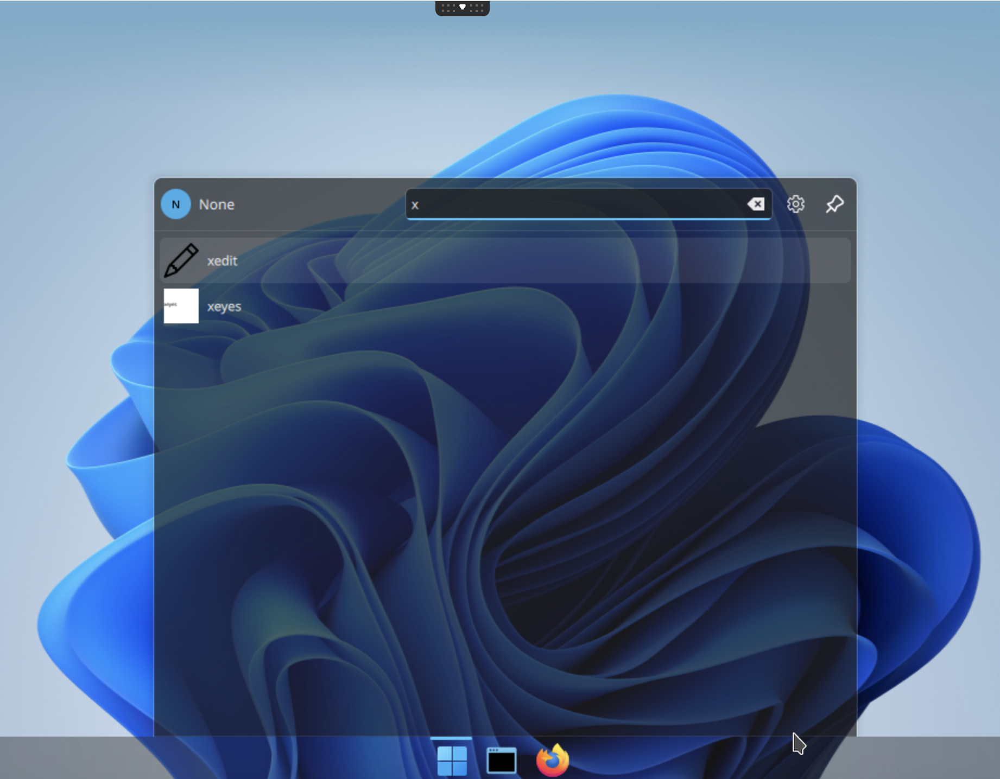
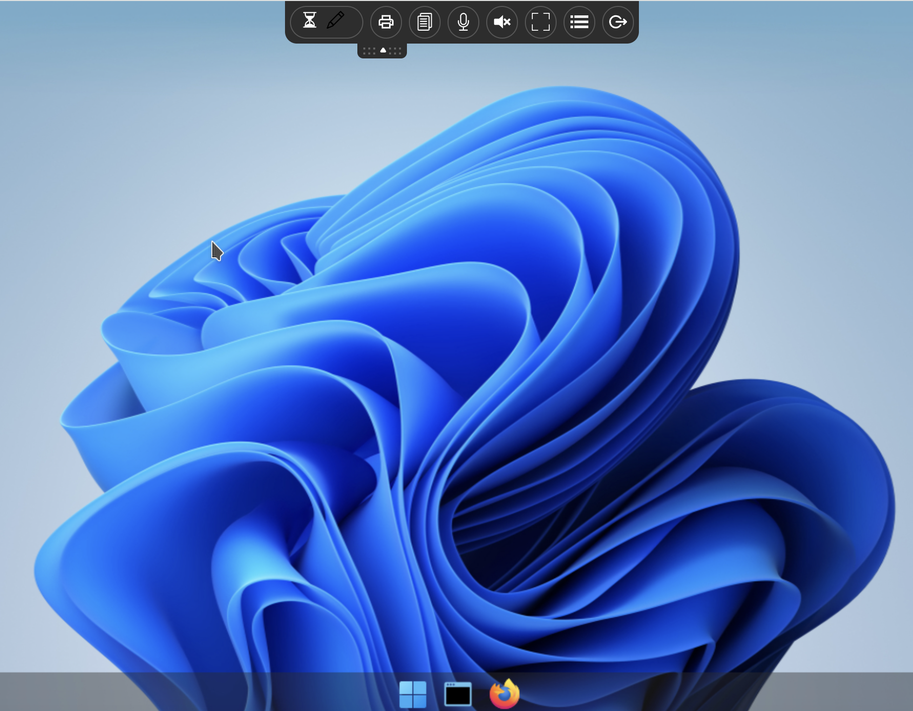
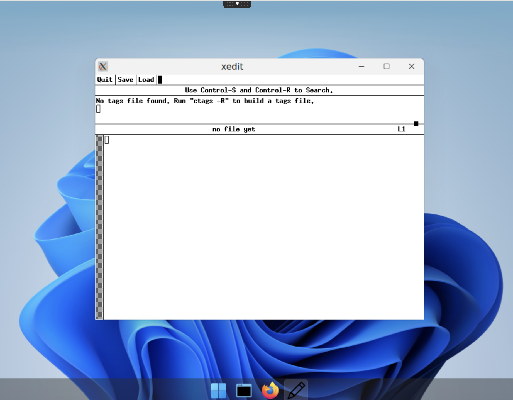

# Add an application `xedit`


## Requirements

You need to have a 

- kubernetes cluster ready to run whith abcdesktop.io installed
- `kubectl` or `microk8s` command-line tool must be configured to communicate with your cluster. 
- `docker` command line must be installed too.
- your own public or private container registry


## Create a simple application `xedit`


To illustrate a simple application, we will install `X11/xedit` inside a container. 

* Create a Dockerfile to install `xedit` application from `x11-apps` package

```Dockerfile
FROM ubuntu
RUN apt-get update && apt-get install -y --no-install-recommends x11-apps && apt-get clean
LABEL oc.launch=xedit.Xedit
LABEL oc.icon=pencil.svg
LABEL oc.icondata="PHN2ZyB4bWxucz0iaHR0cDovL3d3dy53My5vcmcvMjAwMC9zdmciIHdpZHRoPSIxNiIgaGVpZ2h0PSIxNiIgZmlsbD0iY3VycmVudENvbG9yIiBjbGFzcz0iYmkgYmktcGVuY2lsIiB2aWV3Qm94PSIwIDAgMTYgMTYiPgogIDxwYXRoIGQ9Ik0
xMi4xNDYuMTQ2YS41LjUgMCAwIDEgLjcwOCAwbDMgM2EuNS41IDAgMCAxIDAgLjcwOGwtMTAgMTBhLjUuNSAwIDAgMS0uMTY4LjExbC01IDJhLjUuNSAwIDAgMS0uNjUtLjY1bDItNWEuNS41IDAgMCAxIC4xMS0uMTY4ek0xMS4yMDcgMi41IDEzLjUgNC43OTMgMTQuN
zkzIDMuNSAxMi41IDEuMjA3em0xLjU4NiAzTDEwLjUgMy4yMDcgNCA5LjcwN1YxMGguNWEuNS41IDAgMCAxIC41LjV2LjVoLjVhLjUuNSAwIDAgMSAuNS41di41aC4yOTN6bS05Ljc2MSA1LjE3NS0uMTA2LjEwNi0xLjUyOCAzLjgyMSAzLjgyMS0xLjUyOC4xMDYtLjE
wNkEuNS41IDAgMCAxIDUgMTIuNVYxMmgtLjVhLjUuNSAwIDAgMS0uNS0uNVYxMWgtLjVhLjUuNSAwIDAgMS0uNDY4LS4zMjUiLz4KPC9zdmc+"
CMD ["/usr/bin/xedit"]
```

> oc.icondata is a base64 encoded content of the file `pencil.svg`
 
> to get it  
>```
wget https://icons.getbootstrap.com/assets/icons/pencil.svg && base64 -w0 pencil.svg
```    

Dockerfile description 

This image is based on ubuntu, and install the `x11-apps` package. Then we define `/usr/bin/xedit` as the CMD, ENTRYPOINT is also supported.

* `oc.launch` label is the name of the X11 window's `WM_CLASS`
* `oc.icon` is the name of the icon file
* `oc.icondata` is a base64 encoded content of the file `pencil.svg`
 to get it  
`wget https://icons.getbootstrap.com/assets/icons/pencil.svg && base64 -w0 pencil.svg`   

* Build the image for xedit application

```bash
REGISTRY=abcdesktopio
docker build -t $REGISTRY/samplexedit .
```

> You should replace the value of `REGISTRY=abcdesktopio` by your own registry's name.
If you don't have one, you can use the `abcdesktopio/samplexedit` as a readonly dockerhub registry.


* Push the image to your registry *(only if you have your own registry)*

```bash
REGISTRY=abcdesktopio
docker push $REGISTRY/samplexedit
```

* Inspect the image to create a json file

```bash
REGISTRY=abcdesktopio
docker inspect $REGISTRY/samplexedit > samplexedit.json
```

* Send the image to abcdesktop pyos instance

The command read the `PYOS_POD` name, then copy the `samplexeyes.json` file to `/tmp` of PYOS_POD,
then send the `/tmp/samplexeyes.json` to REST API server

```bash
NAMESPACE=abcdesktop
PYOS_POD_NAME=$(kubectl get pods -l run=pyos-od -o jsonpath={.items..metadata.name} -n "$NAMESPACE" | awk '{print $1}')
kubectl cp samplexeyes.json $PYOS_POD_NAME:/tmp -n $NAMESPACE
kubectl exec -i $PYOS_POD_NAME -n abcdesktop -- curl -X POST -H 'Content-Type: text/javascript' http://localhost:8000/API/manager/image -d @/tmp/samplexedit.json
```

The endpoint image returns a json documment 

```json
[
  {
    "cmd": [
      "/usr/bin/xedit"
    ],
    "path": null,
    "sha_id": "sha256:bf33c7ad1e6b7205f5b8117f2b8f00455a4b9aa1575ec67064a9d96820df71ba",
    "id": "abcdesktopio/samplexedit:latest",
    "architecture": "amd64",
    "os": "linux",
    "rules": {},
    "acl": {
      "permit": [
        "all"
      ]
    },
    "launch": "xedit.Xedit",
    "wm_class": null,
    "name": "xedit",
    "icon": "pencil.svg",
    "icondata": "PHN2ZyB4bWxucz0iaHR0cDovL3d3dy53My5vcmcvMjAwMC9zdmciIHdpZHRoPSIxNiIgaGVpZ2h0PSIxNiIgZmlsbD0iY3VycmVudENvbG9yIiBjbGFzcz0iYmkgYmktcGVuY2lsIiB2aWV3Qm94PSIwIDAgMTYgMTYiPgogIDxwYXRoIGQ9Ik0xMi4xNDYuMTQ2YS41LjUgMCAwIDEgLjcwOCAwbDMgM2EuNS41IDAgMCAxIDAgLjcwOGwtMTAgMTBhLjUuNSAwIDAgMS0uMTY4LjExbC01IDJhLjUuNSAwIDAgMS0uNjUtLjY1bDItNWEuNS41IDAgMCAxIC4xMS0uMTY4ek0xMS4yMDcgMi41IDEzLjUgNC43OTMgMTQuNzkzIDMuNSAxMi41IDEuMjA3em0xLjU4NiAzTDEwLjUgMy4yMDcgNCA5LjcwN1YxMGguNWEuNS41IDAgMCAxIC41LjV2LjVoLjVhLjUuNSAwIDAgMSAuNS41di41aC4yOTN6bS05Ljc2MSA1LjE3NS0uMTA2LjEwNi0xLjUyOCAzLjgyMSAzLjgyMS0xLjUyOC4xMDYtLjEwNkEuNS41IDAgMCAxIDUgMTIuNVYxMmgtLjVhLjUuNSAwIDAgMS0uNS0uNVYxMWgtLjVhLjUuNSAwIDAgMS0uNDY4LS4zMjUiLz4KPC9zdmc+",
    "keyword": null,
    "uniquerunkey": null,
    "cat": null,
    "args": null,
    "execmode": null,
    "showinview": null,
    "displayname": "xedit",
    "desktopfile": null,
    "executeclassname": null,
    "runtimeClassName": null,
    "executablefilename": "xedit",
    "usedefaultapplication": false,
    "mimetype": [],
    "fileextensions": [],
    "legacyfileextensions": [],
    "secrets_requirement": null,
    "containerengine": "ephemeral_container",
    "securitycontext": {},
    "created": "2026-04-06T14:40:03.26147483+02:00"
  }
]
```


## Execute the new application `xedit`

* Open your web browser, and to go your own abcdesktop url, and do a login to create a desktop 


* Look for the new application `xedit` pushed



* Start the new application `xedit`


`xedit` image is pulling

 

`xedit` image is starting



`xedit` image is started


Great, you have installed a new application `xedit` as a container with a dedicated icon.

