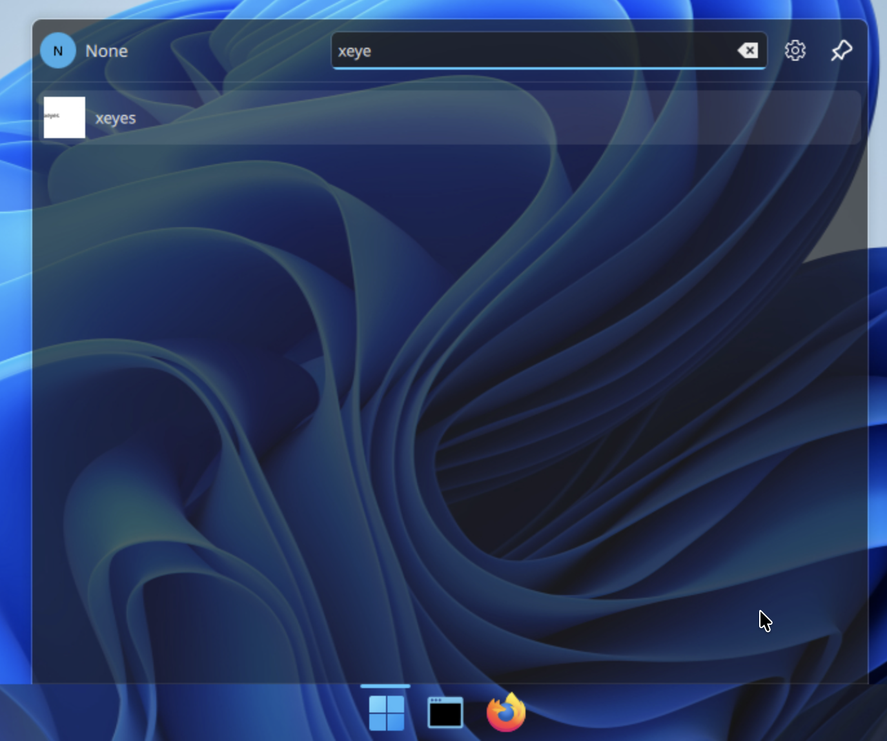
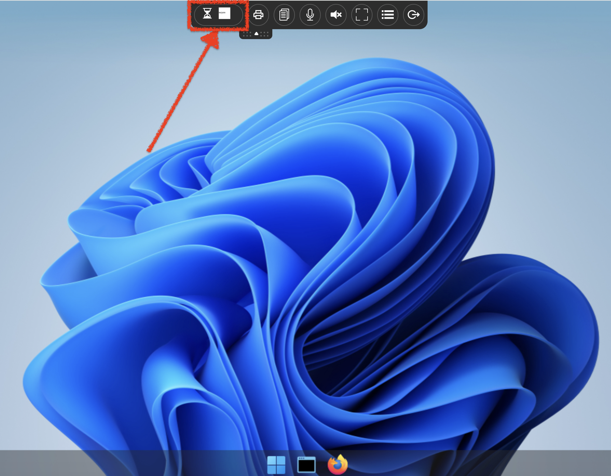
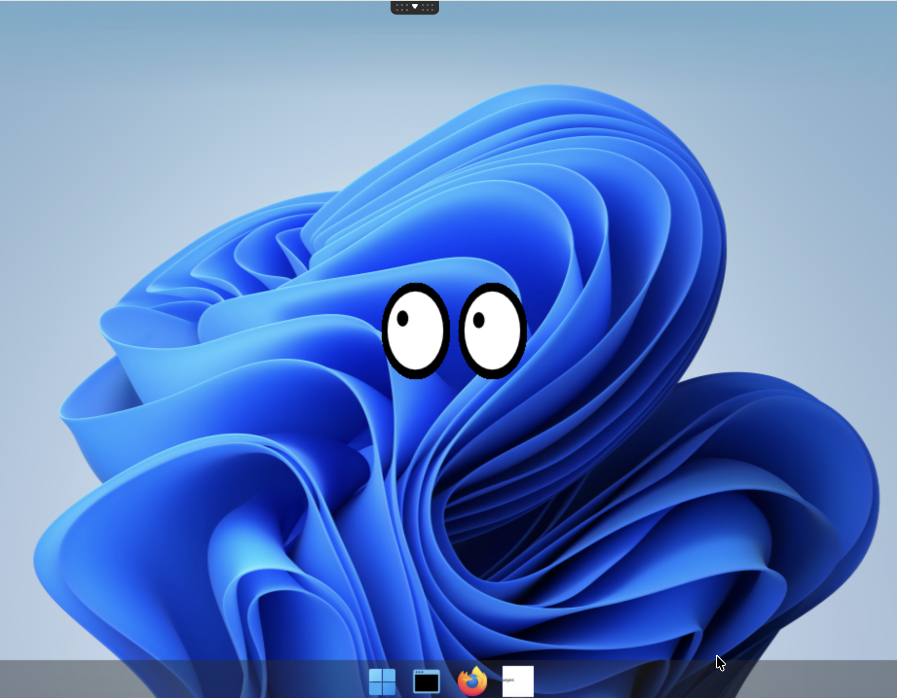

---
tags:
  - Read by JFV
  - Read by MB
---

# Build a sample xeyes from scratch

Goal: Add an application from scratch.

## Requirements

You need to have:

- kubernetes cluster ready to run whith abcdesktop.io installed.
- `kubectl` must be configured to communicate with your cluster.
- `docker` command line must be installed too.
- your own public or private container registry.

## Create a simple application `xeyes`

To illustrate a simple application, we will install `X11/xedit` inside a container.

* Create a Dockerfile to install `xeyes ` application from `x11-apps` package

```Dockerfile
FROM ubuntu
RUN apt-get update && apt-get install -y --no-install-recommends x11-apps && apt-get clean
CMD ["/usr/bin/xeyes"]
```

This image is based on ubuntu, and install the `x11-apps` package. Then we define `/usr/bin/xeyes` as the CMD.
> ENTRYPOINT is also supported

* Build the image for xedit application

```bash
REGISTRY=abcdesktopio
docker build -t $REGISTRY/samplexeyes .
```

> You should replace the value of `REGISTRY=abcdesktopio` by your own registry's name.
If you don't have one, you can use the `abcdesktopio/samplexeyes ` as a readonly dockerhub registry.


* Push the image to your registry *(only if you have one registry)*

```bash
REGISTRY=abcdesktopio
docker push $REGISTRY/samplexeyes
```

* Inspect the image to create a json file

```bash
REGISTRY=abcdesktopio
docker inspect $REGISTRY/samplexeyes:latest > samplexeyes.json
```

* Send the image to abcdesktop pyos instance

The commands read the `PYOS_POD` name, then copy the `samplexeyes.json` file to `/tmp` of PYOS_POD,
then send the `/tmp/samplexeyes.json` to REST API server

```bash
NAMESPACE=abcdesktop
PYOS_POD_NAME=$(kubectl get pods -l run=pyos-od -o jsonpath={.items..metadata.name} -n "$NAMESPACE" | awk '{print $1}')
kubectl cp samplexeyes.json $PYOS_POD_NAME:/tmp -n $NAMESPACE
kubectl exec -i $PYOS_POD_NAME -n abcdesktop -- curl -X POST -H 'Content-Type: text/javascript' http://localhost:8000/API/manager/image -d @/tmp/samplexeyes.json
```

The endpoint image returns a json documment

```
[{"cmd": ["/usr/bin/xeyes"], "path": null, "sha_id": "sha256:f13075e3caceccf5818f9d3b0bdd231b2d800850eb9c81d2906704ec633372c7", "id": "abcdesktopio/samplexeyes:latest", "architecture": "amd64", "os": "linux", "rules": {}, "acl": {"permit": ["all"]}, "launch": "xeyes", "name": "xeyes", "icon": "xeyes", "icondata": "PHN2ZyB2ZXJzaW9uPSIxLjEiIHZpZXdCb3g9IjAgMCA2NCA2NCIgeG1sbnM9Imh0dHA6Ly93d3cudzMub3JnLzIwMDAvc3ZnIiB4bWxuczp4bGluaz0iaHR0cDovL3d3dy53My5vcmcvMTk5OS94bGluayI+PHJlY3Qgd2lkdGg9IjEwMCUiIGhlaWdodD0iMTAwJSIgZmlsbD0id2hpdGUiLz48dGV4dCB4PSIwIiB5PSIzMiIgZmlsbD0iYmxhY2siPnhleWVzPC90ZXh0Pjwvc3ZnPg==", "keyword": null, "uniquerunkey": null, "cat": null, "args": null, "execmode": null, "showinview": null, "displayname": "xeyes", "desktopfile": null, "executeclassname": null, "executablefilename": "xeyes", "usedefaultapplication": false, "mimetype": [], "fileextensions": [], "legacyfileextensions": [], "secrets_requirement": null, "i100  4670  100  1115  100  3555  41296   128k --:--:-- --:--:-- --:--:--  168ke": "ephemeral_container", "securitycontext": {}, "created": "2025-02-03T15:45:36.493950688Z"}]
```


## Execute the new application `xeyes`

* Open your web browser, and to go your own abcdesktop url, and do a login to create a desktop


* Look for the new application `xeyes` pushed



* Start the new application `xeyes`, the hourglass appears



Please wait for the end of the pulling process



> The xeyes application is started as a container

## Read the pod's description

Get the name of fry's pod

```
kubectl get pods -l type=x11server -n abcdesktop
NAME        READY   STATUS    RESTARTS   AGE
fry-3f4d7   4/4     Running   0          104s
```

Get the fry's pod description

```
kubectl describe pods fry-3f4d7 -n abcdesktop
```

The `Ephemeral Containers` contains the `xeyes` application

```
Ephemeral Containers:
  philip-j--fry-xeyes-7a308:
    Container ID:  containerd://13df5fd38966a9cc10d1c2c1a4dc4b4e816100cfa17b1062b5ecf09f6a69e5b0
    Image:         abcdesktopio/samplexeyes:latest
    Image ID:      docker.io/abcdesktopio/samplexeyes@sha256:54315f9a28fb47e89ec15a9017872e1b2ccc83a1d9d4ac5efd814f86f5877276
    Port:          <none>
    Host Port:     <none>
    Command:
      /usr/bin/xeyes
    State:          Running
      Started:      Mon, 06 Apr 2026 15:21:22 +0200
    Ready:          False
    Restart Count:  0
    Environment:
      X11LISTEN:                                 tcp
      WEBSOCKIFY_HEARTBEAT:                      30
      DISABLE_REMOTEIP_FILTERING:                enabled
      ABCDESKTOP_DESKTOPTHEME:                   ubuntu
      XDG_RUNTIME_DIR:                           /tmp/runtime
      ABCDESKTOP_FORCE_OVERWRITE_PLASMA_CONFIG:  true
      DISABLE_RTKIT:                             y
      DISPLAY:                                   :0.0
      CONTAINER_IP_ADDR:                         10.244.0.172
      XAUTH_KEY:                                 6a458e2b822a6697058af776fa7f54
      BROADCAST_COOKIE:                          febdcd691855e0374e56a54872b422fc0ef3d97daaefb836
      PULSEAUDIO_COOKIE:                         328b1dd95e7675f80276eb36f43a4629
      PULSE_SERVER:                              /tmp/.pulse.sock
      CUPS_SERVER:                               10.244.0.172:631
      UNIQUERUNKEY:                              None
      HOME:                                      /home/fry
      LOGNAME:                                   fry
      USER:                                      fry
      LANGUAGE:                                  en_US
      LANG:                                      en_US.UTF-8
      LC_ALL:                                    en_US.UTF-8
      PARENT_ID:                                 fry-3f4d7
      PARENT_HOSTNAME:                           koumoula
      APP:                                       None
      TZ:                                        Europe/Paris
      SAMPLEENV:                                 samplevalue
      NODE_NAME:                                  (v1:spec.nodeName)
      POD_NAME:                                  fry-3f4d7 (v1:metadata.name)
      POD_NAMESPACE:                             abcdesktop (v1:metadata.namespace)
      POD_IP:                                     (v1:status.podIP)
      ABCDESKTOP_EXECUTE_RUNTIME:                ephemeral_container
      ABCDESKTOP_EXECUTE_RESOURCES:              {"claims": null, "limits": null, "requests": null}
    Mounts:
      /etc/sudoers.d from sudoers (rw)
      /home/fry from home (rw)
      /home/fry/.cache from cache (rw)
      /home/fry/.config from config (rw)
      /home/fry/.local from local (rw)
      /mnt/testmyproject from hostpath-mntmyproject-fry (rw)
      /run/user/ from runuser (rw)
      /tmp from tmp (rw)
      /tmp/.X11-unix from x11socket (rw)
      /var/lib/extrausers from auth-localaccount-fry (rw)
      /var/log/desktop from log (rw)
      /var/run/dbus from rundbus (rw)
      /var/run/desktop from run (rw)
```

Great you've installed and started a new application for abcdesktop
