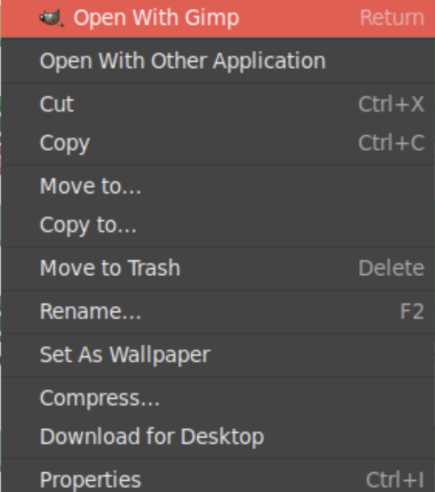
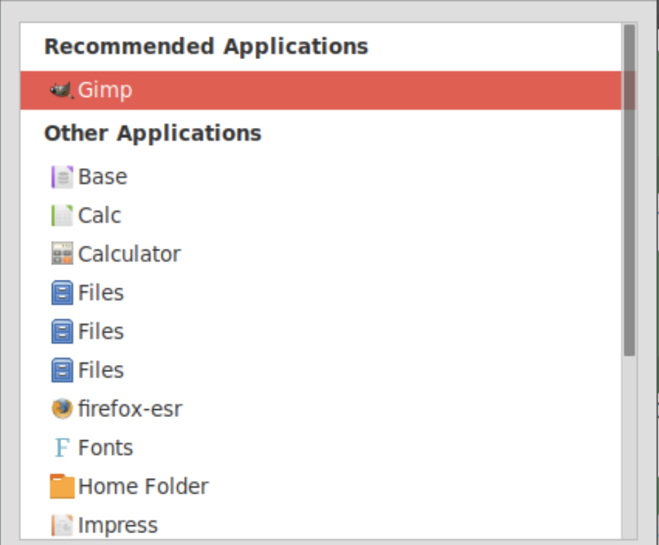
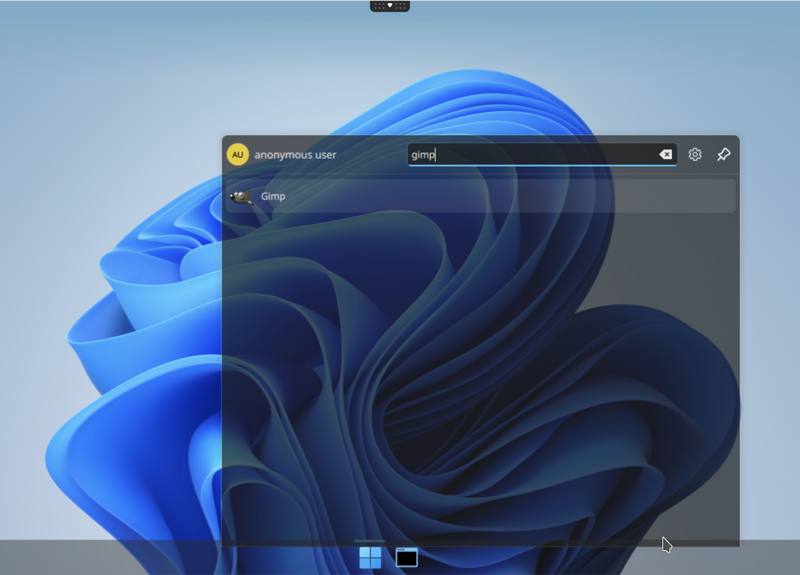
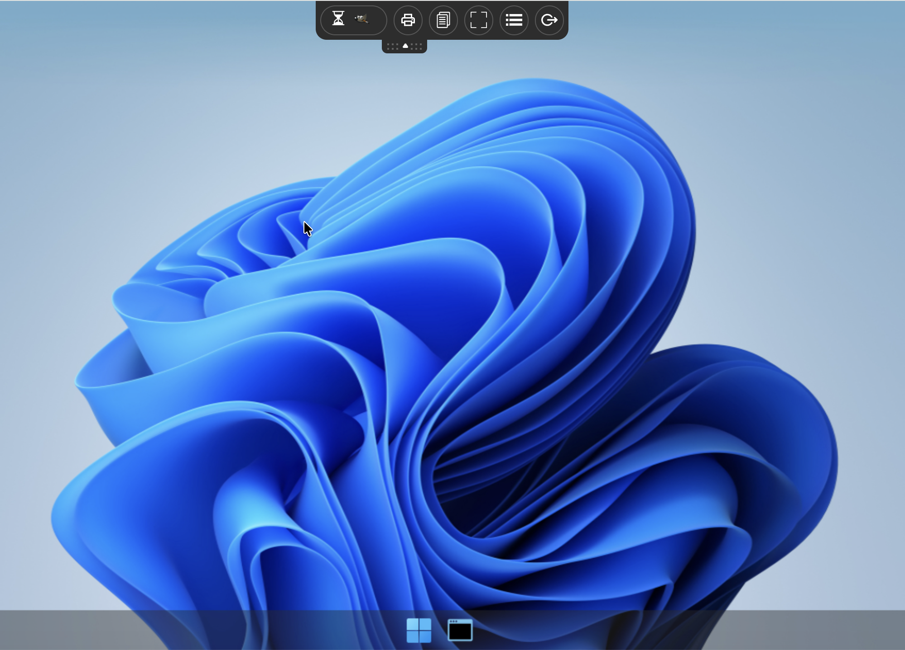
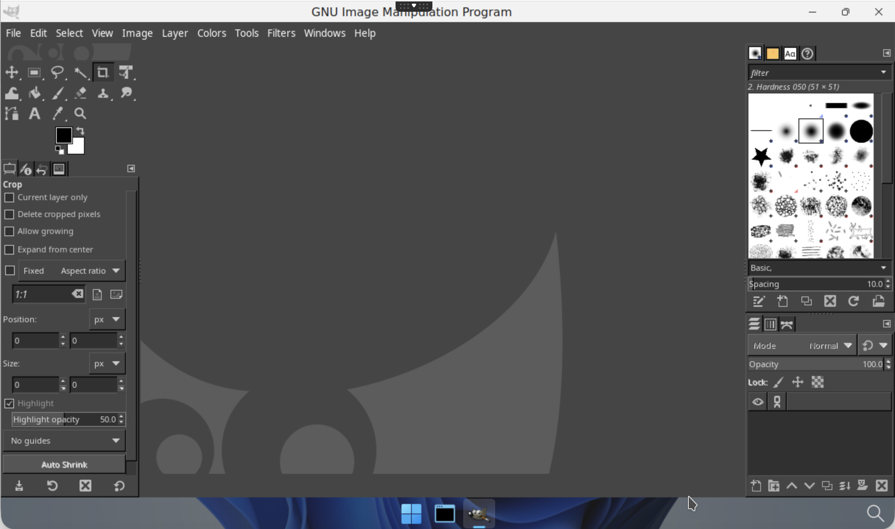

# Build another application from a template

Goal: Build a second custom abcdesktop.io application image (GIMP) by extending the `applist.json` from the previous chapter.

abcdesktop.io uses the container image format with metadata labels to describe each application.

## Requirements

- Access to a public or private container registry.
- `nodejs` installed on your host.
- Completion of the previous chapter: [template applications](templateapplication.md).
- `docker` command-line tool installed to build container images.
- `wget` command-line tool installed to download files.

## Build your own application image for `GIMP`

Navigate to the `build` directory created in the previous chapter: [template applications](templateapplication.md).

The `applist.json` file is an array of application descriptor objects. Add a new entry to the array and populate the required fields for the `gimp` application.

Updated `applist.json` content for building the GIMP abcdesktop.io application:


```
[
  {
    "cat": "games",
    "debpackage": "2048-qt",
    "icon": "2048_logo.svg",
    "keyword": "2048",
    "launch": "2048-qt.2048-qt",
    "name": "2048",
    "displayname": "2048",
    "path": "/usr/games/2048-qt",
    "template": "ghcr.io/abcdesktopio/oc.template.ubuntu.gtk.26.04"
  },
  {
    "cat": "graphics",
    "installrecommends" : true,
    "rules": { "homedir": { "default": true } },
    "debpackage": "gimp dbus-x11",
    "icon": "gimp.svg",
    "keyword": "gimp,image,gif,tiff,png,jpeg,bmp,tga,pcx,bitmap,jpg,pixmap",
    "launch": "gimp.Gimp",
    "name": "Gimp",
    "path": "/usr/bin/gimp",
    "template": "ghcr.io/abcdesktopio/oc.template.ubuntu.gtk.24.04",
    "mimetype": "image/bmp;image/g3fax;image/gif;image/x-fits;image/x-pcx;image/x-portable-anymap;image/x-portable-bitmap;image/x-portable-graymap;image/x-portable-pixmap;image/x-psd;image/x-sgi;image/x-tga;image/x-xbitmap;image/x-xwindowdump;image/x-xcf;image/x-compressed-xcf;image/x-gimp-gbr;image/x-gimp-pat;image/x-gimp-gih;image/jpeg;image/x-psp;image/png;image/x-icon;image/x-xpixmap;image/x-wmf;image/jp2;image/jpeg2000;image/jpx;image/x-xcursor;",
    "fileextensions": "dds",
    "legacyfileextensions":"dds",
    "desktopfile":"gimp.desktop"
  }
]
```


* The GIMP SVG icon file is available on the Wikimedia website: [The_GIMP_icon_-_gnome.svg](https://upload.wikimedia.org/wikipedia/commons/4/45/The_GIMP_icon_-_gnome.svg)
* `path` is the binary file to run gimp `/usr/bin/gimp`
* `installrecommends`: when set to `true`, removes the `--no-install-recommends` flag from the `apt-get install -y $debpackage` command, allowing recommended packages to be installed
* `debpackage`: space-separated list of packages to install


- Download the GIMP icon SVG file

```
wget https://upload.wikimedia.org/wikipedia/commons/4/45/The_GIMP_icon_-_gnome.svg -O icons/gimp.svg
```

As shown above, abcdesktop.io supports the `mimetype`, `fileextensions`, `legacyfileextensions`, and `desktopfile` fields.

```
"mimetype": "image/bmp;image/g3fax;image/gif;image/x-fits;image/x-pcx;image/x-portable-anymap;image/x-portable-bitmap;image/x-portable-graymap;image/x-portable-pixmap;image/x-psd;image/x-sgi;image/x-tga;image/x-xbitmap;image/x-xwindowdump;image/x-xcf;image/x-compressed-xcf;image/x-gimp-gbr;image/x-gimp-pat;image/x-gimp-gih;image/jpeg;image/x-psp;image/png;image/x-icon;image/x-xpixmap;image/x-wmf;image/jp2;image/jpeg2000;image/jpx;image/x-xcursor;",
"fileextensions": "dds",
"legacyfileextensions":"dds",
"desktopfile":"gimp.desktop"
```


These fields enable the **Open with** and **Open with Other Application** options in the file manager. The MIME type database is updated each time a user connects or reconnects to their desktop.



and list `Recommended Applications`




- Build your new GIMP application image

```
nodejs make.js
```

The expected output is:

```
Namespace(dockerfile=false, release='4.4', applicationfile='applist.json')
Read database json file=applist.json
opening file applist.json
applist.json entries: 2
Creating Dockerfile 2048.d
Creating Dockerfile gimp.d
```

> `make.js` generates the Dockerfile files `2048.d` and `gimp.d`.


The `2048.d` image was already built in the previous chapter; only the `gimp.d` image must be built at this stage.

Review the content of the generated `gimp.d` Dockerfile, then build the GIMP application image using the `docker build` command.

> Replace the value of `REGISTRY` with your own registry name if needed.

```
REGISTRY=abcdesktopio
docker build -f gimp.d -t $REGISTRY/gimp.d .
```

The expected output is:


??? note "show details"
    ```
	[+] Building 261.5s (8/8) FINISHED                                                                                                                                                         docker:default
	 => [internal] load build definition from gimp.d                                                                                                                                                     0.0s
	 => => transferring dockerfile: 31.17kB                                                                                                                                                              0.0s
	 => [internal] load metadata for ghcr.io/abcdesktopio/oc.template.ubuntu.gtk.24.04:4.4                                                                                                               0.6s
	 => [internal] load .dockerignore                                                                                                                                                                    0.0s
	 => => transferring context: 2B                                                                                                                                                                      0.0s
	 => CACHED [1/4] FROM ghcr.io/abcdesktopio/oc.template.ubuntu.gtk.24.04:4.4@sha256:18db02414a19ac2befb0366084474f32cbf97f7ccefd6af283a189928c6fcc70                                                  0.0s
	 => [2/4] RUN echo 'debconf debconf/frontend select Noninteractive' | debconf-set-selections                                                                                                         0.4s
	 => [3/4] RUN DEBIAN_FRONTEND=noninteractive apt-get update && apt-get install -y gimp dbus-x11 hicolor-icon-theme && apt-get clean && rm -rf /var/lib/apt/lists/*                                 255.6s
	 => [4/4] RUN if [ -x /usr/bin/dbus-launch ]; then chmod g+r,g+w,o+r,o+w /var/lib/dbus ; fi                                                                                                          0.3s
	 => exporting to image                                                                                                                                                                               4.5s
	 => => exporting layers                                                                                                                                                                              4.5s
	 => => writing image sha256:4e59eff5fab51b10b2a78c2c76e7c6d20278326d9e7f0a17bac48bf27285798e                                                                                                         0.0s
	 => => naming to docker.io/abcdesktopio/gimp.d
    ```

- Push your image to your registry

> Replace the value of `REGISTRY` with your own registry name if needed.
> If you do not have your own registry, you can skip this step but keep `REGISTRY=abcdesktopio`.

```
REGISTRY=abcdesktopio
docker push $REGISTRY/gimp.d
```

- Create a JSON file from your container image

> If you do not have your own registry, do not skip this step. Keep `REGISTRY=abcdesktopio`.

```
REGISTRY=abcdesktopio
docker inspect $REGISTRY/gimp.d > gimp.json
```


## Push your image to abcdesktop service

* Send the image metadata to the abcdesktop pyos instance


```bash
NAMESPACE=abcdesktop
PYOS_POD_NAME=$(kubectl get pods -l run=pyos-od -o jsonpath={.items..metadata.name} -n "$NAMESPACE" | awk '{print $1}')
kubectl cp gimp.json $PYOS_POD_NAME:/tmp -n $NAMESPACE
kubectl exec -i $PYOS_POD_NAME -n abcdesktop -- curl -X POST -H 'Content-Type: text/javascript' http://localhost:8000/API/manager/image -d @/tmp/gimp.json
```

These commands retrieve the `PYOS_POD` name, copy the `gimp.json` file to the `/tmp` directory inside the pyos pod, and submit the file to the REST API server.

The image endpoint returns a JSON document

??? note "show details"
    ```
		[
		  {
		    "cmd": [
		      "/composer/appli-docker-entrypoint.sh"
		    ],
		    "path": "/usr/bin/gimp",
		    "sha_id": "sha256:657f68eabecea19c71997281b12e0e03f90f7df3199d0f3ca19e6cdb6c03599f",
		    "id": "abcdesktopio/gimp.d:latest",
		    "architecture": "amd64",
		    "os": "linux",
		    "rules": {
		      "homedir": {
		        "default": true
		      }
		    },
		    "acl": {
		      "permit": [
		        "all"
		      ]
		    },
		    "launch": "gimp.Gimp",
		    "wm_class": null,
		    "name": "Gimp",
		    "icon": "gimp.svg",
		    "icondata": "PD94bWwgdmVyc2lvbj0iMS4wIiBlbmNvZGluZz0iVVRGLTgiIHN0YW5kYWxvbmU9Im5vIj8+CjwhLS0gQ3JlYXRlZCB3aXRoIElua3NjYXBlIChodHRwOi8vd3d3Lmlua3NjYXBlLm9yZy8pIC0tPgo8c3ZnCiAgIHhtbG5zOnN2Zz0iaHR0cDovL3d3dy53My5vcmcvMjAwMC9zdmciCiAgIHhtbG5zPSJodHRwOi8vd3d3LnczLm9yZy8yMDAwL3N2ZyIKICAgeG1sbnM6eGxpbms9Imh0dHA6Ly93d3cudzMub3JnLzE5OTkveGxpbmsiCiAgIHZlcnNpb249IjEuMCIKICAgd2lkdGg9IjMxNiIKICAgaGVpZ2h0PSIzMTYiCiAgIHZpZXdCb3g9IjAgMCA0OCA0OCIKICAgaWQ9InN2ZzExMzAwIj4KICA8ZGVmcwogICAgIGlkPSJkZWZzMyI+CiAgICA8bGluZWFyR3JhZGllbnQKICAgICAgIGlkPSJsaW5lYXJHcmFkaWVudDg1NDIiPgogICAgICA8c3RvcAogICAgICAgICBzdHlsZT0ic3RvcC1jb2xvcjojNWI2NzZiO3N0b3Atb3BhY2l0eToxIgogICAgICAgICBvZmZzZXQ9IjAiCiAgICAgICAgIGlkPSJzdG9wODU0NCIgLz4KICAgICAgPHN0b3AKICAgICAgICAgc3R5bGU9InN0b3AtY29sb3I6IzE0MTcxODtzdG9wLW9wYWNpdHk6MSIKICAgICAgICAgb2Zmc2V0PSIxIgogICAgICAgICBpZD0ic3RvcDg1NDYiIC8+CiAgICA8L2xpbmVhckdyYWRpZW50PgogICAgPGxpbmVhckdyYWRpZW50CiAgICAgICBpZD0ibGluZWFyR3JhZGllbnQ4NTM0Ij4KICAgICAgPHN0b3AKICAgICAgICAgc3R5bGU9InN0b3AtY29sb3I6YmxhY2s7c3RvcC1vcGFjaXR5OjEiCiAgICAgICAgIG9mZnNldD0iMCIKICAgICAgICAgaWQ9InN0b3A4NTM2IiAvPgogICAgICA8c3RvcAogICAgICAgICBzdHlsZT0ic3RvcC1jb2xvcjpibGFjaztzdG9wLW9wYWNpdHk6MCIKICAgICAgICAgb2Zmc2V0PSIxIgogICAgICAgICBpZD0ic3RvcDg1MzgiIC8+CiAgICA8L2xpbmVhckdyYWRpZW50PgogICAgPGxpbmVhckdyYWRpZW50CiAgICAgICBpZD0ibGluZWFyR3JhZGllbnQ4NTI0Ij4KICAgICAgPHN0b3AKICAgICAgICAgc3R5bGU9InN0b3AtY29sb3I6d2hpdGU7c3RvcC1vcGFjaXR5OjEiCiAgICAgICAgIG9mZnNldD0iMCIKICAgICAgICAgaWQ9InN0b3A4NTI2IiAvPgogICAgICA8c3RvcAogICAgICAgICBzdHlsZT0ic3RvcC1jb2xvcjp3aGl0ZTtzdG9wLW9wYWNpdHk6MCIKICAgICAgICAgb2Zmc2V0PSIxIgogICAgICAgICBpZD0ic3RvcDg1MjgiIC8+CiAgICA8L2xpbmVhckdyYWRpZW50PgogICAgPGxpbmVhckdyYWRpZW50CiAgICAgICBpZD0ibGluZWFyR3JhZGllbnQyNDQ2Ij4KICAgICAgPHN0b3AKICAgICAgICAgc3R5bGU9InN0b3AtY29sb3I6d2hpdGU7c3RvcC1vcGFjaXR5OjEiCiAgICAgICAgIG9mZnNldD0iMCIKICAgICAgICAgaWQ9InN0b3AyNDQ4IiAvPgogICAgICA8c3RvcAogICAgICAgICBzdHlsZT0ic3RvcC1jb2xvcjp3aGl0ZTtzdG9wLW9wYWNpdHk6MCIKICAgICAgICAgb2Zmc2V0PSIxIgogICAgICAgICBpZD0ic3RvcDI0NTAiIC8+CiAgICA8L2xpbmVhckdyYWRpZW50PgogICAgPGxpbmVhckdyYWRpZW50CiAgICAgICB4MT0iMTMuMjM2MTU1IgogICAgICAgeTE9IjM3Ljc1MjI0NyIKICAgICAgIHgyPSI3Ljc1MjEwOTEiCiAgICAgICB5Mj0iNDIuMjgyMTQ2IgogICAgICAgaWQ9ImxpbmVhckdyYWRpZW50MjQ1MiIKICAgICAgIHhsaW5rOmhyZWY9IiNsaW5lYXJHcmFkaWVudDI0NDYiCiAgICAgICBncmFkaWVudFVuaXRzPSJ1c2VyU3BhY2VPblVzZSIKICAgICAgIGdyYWRpZW50VHJhbnNmb3JtPSJtYXRyaXgoMC43NTUxNjUsMC4zOTUxNDMsLTAuMzk1MTQzLDAuNzU1MTY1LC0yNS45MTI0NSw2LjUzMjU4NikiIC8+CiAgICA8bGluZWFyR3JhZGllbnQKICAgICAgIGlkPSJsaW5lYXJHcmFkaWVudDY5NjMiPgogICAgICA8c3RvcAogICAgICAgICBzdHlsZT0ic3RvcC1jb2xvcjojNjk2OTY5O3N0b3Atb3BhY2l0eToxIgogICAgICAgICBvZmZzZXQ9IjAiCiAgICAgICAgIGlkPSJzdG9wNjk2NSIgLz4KICAgICAgPHN0b3AKICAgICAgICAgc3R5bGU9InN0b3AtY29sb3I6YmxhY2s7c3RvcC1vcGFjaXR5OjEiCiAgICAgICAgIG9mZnNldD0iMSIKICAgICAgICAgaWQ9InN0b3A2OTY3IiAvPgogICAgPC9saW5lYXJHcmFkaWVudD4KICAgIDxyYWRpYWxHcmFkaWVudAogICAgICAgY3g9IjE1LjQxNTEwMSIKICAgICAgIGN5PSIzNS4zNTY1MDYiCiAgICAgICByPSI3LjU3OTE1NTkiCiAgICAgICBmeD0iMTUuNDE1MTAxIgogICAgICAgZnk9IjM1LjM1NjUwNiIKICAgICAgIGlkPSJyYWRpYWxHcmFkaWVudDY5NjkiCiAgICAgICB4bGluazpocmVmPSIjbGluZWFyR3JhZGllbnQ2OTYzIgogICAgICAgZ3JhZGllbnRVbml0cz0idXNlclNwYWNlT25Vc2UiCiAgICAgICBncmFkaWVudFRyYW5zZm9ybT0ibWF0cml4KDEuNTcyNjk0LDUuNDI0OTUyZS0xNywxLjAzNzkyMmUtMTIsMS41MzI2MzksLTU1LjM2NjgyLC0yMS4zNTgyMykiIC8+CiAgICA8bGluZWFyR3JhZGllbnQKICAgICAgIGlkPSJsaW5lYXJHcmFkaWVudDY5MzkiPgogICAgICA8c3RvcAogICAgICAgICBzdHlsZT0ic3RvcC1jb2xvcjojYmRiZGJkO3N0b3Atb3BhY2l0eToxIgogICAgICAgICBvZmZzZXQ9IjAiCiAgICAgICAgIGlkPSJzdG9wNjk0MSIgLz4KICAgICAgPHN0b3AKICAgICAgICAgc3R5bGU9InN0b3AtY29sb3I6I2UyZTJlMjtzdG9wLW9wYWNpdHk6MSIKICAgICAgICAgb2Zmc2V0PSIwLjMzMzMzMzM0IgogICAgICAgICBpZD0ic3RvcDY5NDciIC8+CiAgICAgIDxzdG9wCiAgICAgICAgIHN0eWxlPSJzdG9wLWNvbG9yOiNhM2EzYTM7c3RvcC1vcGFjaXR5OjEiCiAgICAgICAgIG9mZnNldD0iMC42NjY2NjY2OSIKICAgICAgICAgaWQ9InN0b3A2OTQ5IiAvPgogICAgICA8c3RvcAogICAgICAgICBzdHlsZT0ic3RvcC1jb2xvcjojZGRkO3N0b3Atb3BhY2l0eToxIgogICAgICAgICBvZmZzZXQ9IjEiCiAgICAgICAgIGlkPSJzdG9wNjk0MyIgLz4KICAgIDwvbGluZWFyR3JhZGllbnQ+CiAgICA8bGluZWFyR3JhZGllbnQKICAgICAgIHgxPSIxOS4zOTQ3MzUiCiAgICAgICB5MT0iMzAuMDAxMzMxIgogICAgICAgeDI9IjIzLjEwOTMzMSIKICAgICAgIHkyPSIzMy40Mzg4MzEiCiAgICAgICBpZD0ibGluZWFyR3JhZGllbnQ2OTQ1IgogICAgICAgeGxpbms6aHJlZj0iI2xpbmVhckdyYWRpZW50NjkzOSIKICAgICAgIGdyYWRpZW50VW5pdHM9InVzZXJTcGFjZU9uVXNlIgogICAgICAgZ3JhZGllbnRUcmFuc2Zvcm09InRyYW5zbGF0ZSgtNDYuNDA2OTUsLTEuODAyODU2KSIgLz4KICAgIDxsaW5lYXJHcmFkaWVudAogICAgICAgaWQ9ImxpbmVhckdyYWRpZW50Njk1MSI+CiAgICAgIDxzdG9wCiAgICAgICAgIHN0eWxlPSJzdG9wLWNvbG9yOiM2ZTNkMDk7c3RvcC1vcGFjaXR5OjEiCiAgICAgICAgIG9mZnNldD0iMCIKICAgICAgICAgaWQ9InN0b3A2OTUzIiAvPgogICAgICA8c3RvcAogICAgICAgICBzdHlsZT0ic3RvcC1jb2xvcjojZWE4MTEzO3N0b3Atb3BhY2l0eToxIgogICAgICAgICBvZmZzZXQ9IjAuMjQyNDI0MjUiCiAgICAgICAgIGlkPSJzdG9wNjk1OSIgLz4KICAgICAgPHN0b3AKICAgICAgICAgc3R5bGU9InN0b3AtY29sb3I6IzVjMzMwNztzdG9wLW9wYWNpdHk6MSIKICAgICAgICAgb2Zmc2V0PSIwLjYyMTIxMjEyIgogICAgICAgICBpZD0ic3RvcDY5NjEiIC8+CiAgICAgIDxzdG9wCiAgICAgICAgIHN0eWxlPSJzdG9wLWNvbG9yOiNlMDdjMTI7c3RvcC1vcGFjaXR5OjEiCiAgICAgICAgIG9mZnNldD0iMSIKICAgICAgICAgaWQ9InN0b3A2OTU1IiAvPgogICAgPC9saW5lYXJHcmFkaWVudD4KICAgIDxsaW5lYXJHcmFkaWVudAogICAgICAgeDE9IjM3LjAxNzYzOSIKICAgICAgIHkxPSIxOS4yMzk4ODkiCiAgICAgICB4Mj0iMjcuNzUzODkzIgogICAgICAgeTI9IjExLjE4MjQ4OCIKICAgICAgIGlkPSJsaW5lYXJHcmFkaWVudDY5NTciCiAgICAgICB4bGluazpocmVmPSIjbGluZWFyR3JhZGllbnQ2OTUxIgogICAgICAgZ3JhZGllbnRVbml0cz0idXNlclNwYWNlT25Vc2UiCiAgICAgICBncmFkaWVudFRyYW5zZm9ybT0idHJhbnNsYXRlKC00OS4zMDQ5NiwxLjg3NzcyMykiIC8+CiAgICA8bGluZWFyR3JhZGllbnQKICAgICAgIGlkPSJsaW5lYXJHcmFkaWVudDY1MDAiPgogICAgICA8c3RvcAogICAgICAgICBzdHlsZT0ic3RvcC1jb2xvcjojODU3YzYzO3N0b3Atb3BhY2l0eToxIgogICAgICAgICBvZmZzZXQ9IjAiCiAgICAgICAgIGlkPSJzdG9wNjUwMiIgLz4KICAgICAgPHN0b3AKICAgICAgICAgc3R5bGU9InN0b3AtY29sb3I6IzIyMWYxOTtzdG9wLW9wYWNpdHk6MSIKICAgICAgICAgb2Zmc2V0PSIxIgogICAgICAgICBpZD0ic3RvcDY1MDQiIC8+CiAgICA8L2xpbmVhckdyYWRpZW50PgogICAgPGxpbmVhckdyYWRpZW50CiAgICAgICBpZD0ibGluZWFyR3JhZGllbnQ2NDkyIj4KICAgICAgPHN0b3AKICAgICAgICAgc3R5bGU9InN0b3AtY29sb3I6YmxhY2s7c3RvcC1vcGFjaXR5OjEiCiAgICAgICAgIG9mZnNldD0iMCIKICAgICAgICAgaWQ9InN0b3A2NDk0IiAvPgogICAgICA8c3RvcAogICAgICAgICBzdHlsZT0ic3RvcC1jb2xvcjpibGFjaztzdG9wLW9wYWNpdHk6MCIKICAgICAgICAgb2Zmc2V0PSIxIgogICAgICAgICBpZD0ic3RvcDY0OTYiIC8+CiAgICA8L2xpbmVhckdyYWRpZW50PgogICAgPGxpbmVhckdyYWRpZW50CiAgICAgICBpZD0ibGluZWFyR3JhZGllbnQ2NDgyIj4KICAgICAgPHN0b3AKICAgICAgICAgc3R5bGU9InN0b3AtY29sb3I6YmxhY2s7c3RvcC1vcGFjaXR5OjEiCiAgICAgICAgIG9mZnNldD0iMCIKICAgICAgICAgaWQ9InN0b3A2NDg0IiAvPgogICAgICA8c3RvcAogICAgICAgICBzdHlsZT0ic3RvcC1jb2xvcjpibGFjaztzdG9wLW9wYWNpdHk6MCIKICAgICAgICAgb2Zmc2V0PSIxIgogICAgICAgICBpZD0ic3RvcDY0ODYiIC8+CiAgICA8L2xpbmVhckdyYWRpZW50PgogICAgPGxpbmVhckdyYWRpZW50CiAgICAgICBpZD0ibGluZWFyR3JhZGllbnQ2NDY4Ij4KICAgICAgPHN0b3AKICAgICAgICAgc3R5bGU9InN0b3AtY29sb3I6d2hpdGU7c3RvcC1vcGFjaXR5OjEiCiAgICAgICAgIG9mZnNldD0iMCIKICAgICAgICAgaWQ9InN0b3A2NDcwIiAvPgogICAgICA8c3RvcAogICAgICAgICBzdHlsZT0ic3RvcC1jb2xvcjojYjliOWIwO3N0b3Atb3BhY2l0eToxIgogICAgICAgICBvZmZzZXQ9IjEiCiAgICAgICAgIGlkPSJzdG9wNjQ3MiIgLz4KICAgIDwvbGluZWFyR3JhZGllbnQ+CiAgICA8bGluZWFyR3JhZGllbnQKICAgICAgIGlkPSJsaW5lYXJHcmFkaWVudDY0NTIiPgogICAgICA8c3RvcAogICAgICAgICBzdHlsZT0ic3RvcC1jb2xvcjp3aGl0ZTtzdG9wLW9wYWNpdHk6MSIKICAgICAgICAgb2Zmc2V0PSIwIgogICAgICAgICBpZD0ic3RvcDY0NTQiIC8+CiAgICAgIDxzdG9wCiAgICAgICAgIHN0eWxlPSJzdG9wLWNvbG9yOndoaXRlO3N0b3Atb3BhY2l0eTowIgogICAgICAgICBvZmZzZXQ9IjEiCiAgICAgICAgIGlkPSJzdG9wNjQ1NiIgLz4KICAgIDwvbGluZWFyR3JhZGllbnQ+CiAgICA8bGluZWFyR3JhZGllbnQKICAgICAgIHgxPSI2LjMwNTE1MjkiCiAgICAgICB5MT0iMjMuMzYyNDI3IgogICAgICAgeDI9IjUuOTg0NjI4NyIKICAgICAgIHkyPSIzMS41NyIKICAgICAgIGlkPSJsaW5lYXJHcmFkaWVudDY0NTgiCiAgICAgICB4bGluazpocmVmPSIjbGluZWFyR3JhZGllbnQ2NDUyIgogICAgICAgZ3JhZGllbnRVbml0cz0idXNlclNwYWNlT25Vc2UiIC8+CiAgICA8cmFkaWFsR3JhZGllbnQKICAgICAgIGN4PSI2OS40NzMyNDQiCiAgICAgICBjeT0iMTkuNTk3ODc4IgogICAgICAgcj0iMy41MTUzMTM5IgogICAgICAgZng9IjY5LjQ3MzI0NCIKICAgICAgIGZ5PSIxOS41OTc4NzgiCiAgICAgICBpZD0icmFkaWFsR3JhZGllbnQ2NDc0IgogICAgICAgeGxpbms6aHJlZj0iI2xpbmVhckdyYWRpZW50NjQ2OCIKICAgICAgIGdyYWRpZW50VW5pdHM9InVzZXJTcGFjZU9uVXNlIgogICAgICAgZ3JhZGllbnRUcmFuc2Zvcm09Im1hdHJpeCgxLjMxODQ4OCwxLjIwNzU3NGUtMTUsLTEuMjA3NTc0ZS0xNSwxLjMxODQ4OCwtMjIuMTI2NCwtNi4yNDE2OTEpIiAvPgogICAgPHJhZGlhbEdyYWRpZW50CiAgICAgICBjeD0iMjMiCiAgICAgICBjeT0iMzMuOTM3NSIKICAgICAgIHI9IjE4LjI1IgogICAgICAgZng9IjIzIgogICAgICAgZnk9IjMzLjkzNzUiCiAgICAgICBpZD0icmFkaWFsR3JhZGllbnQ2NDk4IgogICAgICAgeGxpbms6aHJlZj0iI2xpbmVhckdyYWRpZW50NjQ5MiIKICAgICAgIGdyYWRpZW50VW5pdHM9InVzZXJTcGFjZU9uVXNlIgogICAgICAgZ3JhZGllbnRUcmFuc2Zvcm09Im1hdHJpeCgxLDAsMCwwLjI4NDI0NywwLDI0LjI5MDg4KSIgLz4KICAgIDxsaW5lYXJHcmFkaWVudAogICAgICAgeDE9IjE0Ljk2ODc1IgogICAgICAgeTE9IjE5LjExMDY3OCIKICAgICAgIHgyPSIzOS41MjQ1NDQiCiAgICAgICB5Mj0iNDYuOTg1NjgiCiAgICAgICBpZD0ibGluZWFyR3JhZGllbnQ4NTMwIgogICAgICAgeGxpbms6aHJlZj0iI2xpbmVhckdyYWRpZW50ODUyNCIKICAgICAgIGdyYWRpZW50VW5pdHM9InVzZXJTcGFjZU9uVXNlIiAvPgogICAgPHJhZGlhbEdyYWRpZW50CiAgICAgICBjeD0iNi4wMjQyMTg2IgogICAgICAgY3k9IjI1LjI3MTAyNyIKICAgICAgIHI9IjQuODMxMDI4OSIKICAgICAgIGZ4PSI2LjAyNDIxODYiCiAgICAgICBmeT0iMjUuMjcxMDI3IgogICAgICAgaWQ9InJhZGlhbEdyYWRpZW50ODU0OCIKICAgICAgIHhsaW5rOmhyZWY9IiNsaW5lYXJHcmFkaWVudDg1NDIiCiAgICAgICBncmFkaWVudFVuaXRzPSJ1c2VyU3BhY2VPblVzZSIKICAgICAgIGdyYWRpZW50VHJhbnNmb3JtPSJtYXRyaXgoMC45MTYxNTksOS4zMTg2ODRlLTIsLTAuMTA4NzY1LDEuMDY5MzA5LDMuMjUzNjY4LC0zLjAyOTI3MikiIC8+CiAgICA8bGluZWFyR3JhZGllbnQKICAgICAgIHgxPSIyNi4xNjI5NTEiCiAgICAgICB5MT0iMzAuNTQzMzAzIgogICAgICAgeDI9IjI0LjMyODg5MiIKICAgICAgIHkyPSIzMC45ODUyNDUiCiAgICAgICBpZD0ibGluZWFyR3JhZGllbnQ0MzMwIgogICAgICAgeGxpbms6aHJlZj0iI2xpbmVhckdyYWRpZW50ODUzNCIKICAgICAgIGdyYWRpZW50VW5pdHM9InVzZXJTcGFjZU9uVXNlIiAvPgogICAgPGxpbmVhckdyYWRpZW50CiAgICAgICB4MT0iMzIuMzUwMTM2IgogICAgICAgeTE9IjI4LjA4MzM1NSIKICAgICAgIHgyPSIyMS4yMTMyMDMiCiAgICAgICB5Mj0iMzAuMjkzMDY0IgogICAgICAgaWQ9ImxpbmVhckdyYWRpZW50NDM1MSIKICAgICAgIHhsaW5rOmhyZWY9IiNsaW5lYXJHcmFkaWVudDY0ODIiCiAgICAgICBncmFkaWVudFVuaXRzPSJ1c2VyU3BhY2VPblVzZSIKICAgICAgIGdyYWRpZW50VHJhbnNmb3JtPSJ0cmFuc2xhdGUoLTMuODM2NTQ5LDAuMzQ1OTcxKSIgLz4KICAgIDxyYWRpYWxHcmFkaWVudAogICAgICAgY3g9IjE4LjU1NzYyNyIKICAgICAgIGN5PSIyMi4zMDAwMTgiCiAgICAgICByPSIxOS4yMjkyIgogICAgICAgZng9IjE4LjU1NzYyNyIKICAgICAgIGZ5PSIyMi4zMDAwMTgiCiAgICAgICBpZD0icmFkaWFsR3JhZGllbnQ0MzU0IgogICAgICAgeGxpbms6aHJlZj0iI2xpbmVhckdyYWRpZW50NjUwMCIKICAgICAgIGdyYWRpZW50VW5pdHM9InVzZXJTcGFjZU9uVXNlIgogICAgICAgZ3JhZGllbnRUcmFuc2Zvcm09Im1hdHJpeCgxLjc3Mjc1LC0xLjg0NzU2MmUtMTYsMS4zNTE0MDJlLTE2LDEuMjk2NjgsLTE2LjM0MDQsLTYuNjE1OTU5KSIgLz4KICAgIDxyYWRpYWxHcmFkaWVudAogICAgICAgY3g9IjY5LjQ3MzI0NCIKICAgICAgIGN5PSIxOS41OTc4NzgiCiAgICAgICByPSIzLjUxNTMxMzkiCiAgICAgICBmeD0iNjkuNDczMjQ0IgogICAgICAgZnk9IjE5LjU5Nzg3OCIKICAgICAgIGlkPSJyYWRpYWxHcmFkaWVudDQzNjMiCiAgICAgICB4bGluazpocmVmPSIjbGluZWFyR3JhZGllbnQ2NDY4IgogICAgICAgZ3JhZGllbnRVbml0cz0idXNlclNwYWNlT25Vc2UiCiAgICAgICBncmFkaWVudFRyYW5zZm9ybT0ibWF0cml4KDEuMzE4NDg4LDEuMjA3NTc0ZS0xNSwtMS4yMDc1NzRlLTE1LDEuMzE4NDg4LC0yMi4xMjY0LC02LjI0MTY5MSkiIC8+CiAgPC9kZWZzPgogIDxnCiAgICAgaWQ9ImxheWVyMSI+CiAgICA8cGF0aAogICAgICAgZD0iTSA0MS4yNSAzMy45Mzc1IEEgMTguMjUgNS4xODc1IDAgMSAxICA0Ljc1LDMzLjkzNzUgQSAxOC4yNSA1LjE4NzUgMCAxIDEgIDQxLjI1IDMzLjkzNzUgeiIKICAgICAgIHRyYW5zZm9ybT0ibWF0cml4KDEsMCwwLDEuNTMwMTIsMC4xMjUsLTE5Ljk5MDk2KSIKICAgICAgIHN0eWxlPSJjb2xvcjpibGFjaztmaWxsOnVybCgjcmFkaWFsR3JhZGllbnQ2NDk4KTtmaWxsLW9wYWNpdHk6MTtmaWxsLXJ1bGU6ZXZlbm9kZDtzdHJva2U6bm9uZTtzdHJva2Utd2lkdGg6MC45OTk5OTk3O3N0cm9rZS1saW5lY2FwOmJ1dHQ7c3Ryb2tlLWxpbmVqb2luOm1pdGVyO21hcmtlcjpub25lO21hcmtlci1zdGFydDpub25lO21hcmtlci1taWQ6bm9uZTttYXJrZXItZW5kOm5vbmU7c3Ryb2tlLW1pdGVybGltaXQ6MTA7c3Ryb2tlLWRhc2hhcnJheTpub25lO3N0cm9rZS1kYXNob2Zmc2V0OjA7c3Ryb2tlLW9wYWNpdHk6MTt2aXNpYmlsaXR5OnZpc2libGU7ZGlzcGxheTppbmxpbmU7b3ZlcmZsb3c6dmlzaWJsZSIKICAgICAgIGlkPSJwYXRoNjQ5MCIgLz4KICAgIDxwYXRoCiAgICAgICBkPSJNIDEwLjM3NDM2OSwxMi40Njc4ODQgQyAxMC4zNzQzNjksMTIuNDY3ODg0IDEzLjI0ODg3OCwxOC4zOTU1MTggMTkuOTczNjExLDE4LjIyODI5MSBDIDM0LjA2NjEyNiwxNy44NzQ3MzggMzYuNTM3MzIsMTAuNTIzMzQxIDM2Ljg5MDg3Myw5LjQ2MjY4MDQgQyAzNy4yNDQ0MjcsOC40MDIwMjAyIDM3Ljc4NTQwNyw4LjU2MjY4MjUgMzcuOTEwNDgsOS41NDI5NDcgQyA0Mi41MDY2NzQsNTEuMjYyMjQ3IDYuMDEzNTQ4OCwzMy4zNjIxMjMgNC43MTc1MTQ0LDI2LjI1NjQ2NyBDIDExLjk2NTM1OSwyNC4xMzUxNDcgMTAuMTk3NTkyLDIwLjA2OTI4MiAxMC4xOTc1OTIsMjAuMDY5MjgyIEwgMTAuMzc0MzY5LDEyLjQ2Nzg4NCB6ICIKICAgICAgIHN0eWxlPSJjb2xvcjpibGFjaztmaWxsOnVybCgjcmFkaWFsR3JhZGllbnQ0MzU0KTtmaWxsLW9wYWNpdHk6MTtmaWxsLXJ1bGU6ZXZlbm9kZDtzdHJva2U6IzJlMzQzNjtzdHJva2Utd2lkdGg6MC45OTk5OTk3O3N0cm9rZS1saW5lY2FwOmJ1dHQ7c3Ryb2tlLWxpbmVqb2luOm1pdGVyO21hcmtlcjpub25lO21hcmtlci1zdGFydDpub25lO21hcmtlci1taWQ6bm9uZTttYXJrZXItZW5kOm5vbmU7c3Ryb2tlLW1pdGVybGltaXQ6MTA7c3Ryb2tlLWRhc2hhcnJheTpub25lO3N0cm9rZS1kYXNob2Zmc2V0OjA7c3Ryb2tlLW9wYWNpdHk6MTt2aXNpYmlsaXR5OnZpc2libGU7ZGlzcGxheTppbmxpbmU7b3ZlcmZsb3c6dmlzaWJsZSIKICAgICAgIGlkPSJwYXRoNDMyMyIgLz4KICAgIDxwYXRoCiAgICAgICBkPSJNIDE1LjczNzc5LDMwLjA2NjA0OSBDIDIyLjQ3NjY5LDMxLjQxMzg4NiAyNS45MDg0ODEsMzAuMTY0MTQyIDI3LjkxNjk2NSwyOC42MTMyNzMgQyAyNy4zODY2MzUsMjcuOTI4MjYzIDI2LjQ4MDY1NSwyNy4xNzY5NjIgMjYuNDgwNjU1LDI3LjE3Njk2MiBDIDI2LjQ4MDY1NSwyNy4xNzY5NjIgMjguODMzOTcyLDI3LjgzMDkwNCAyOS42NjI2MzUsMjguOTAwNTM1IEMgMzAuNDg4OTI1LDI5Ljk2NzEwMyAyOS45Njk0NDMsMzAuNjI0MjQyIDI5Ljc1MzE5NiwzMS45ODg5MDUgQyAyOS4yNzE3ODUsMzAuNzkwMzA2IDI4LjM3MzIxNSwzMC4zNDA4MTMgMjguMjUxNTYyLDI5Ljg2NDU3MyBDIDI2LjQ0NTI5NCwzMi4zNjE1IDIxLjk0NTEyLDMyLjI1Nzc3MyAxNS43Mzc3OSwzMC4wNjYwNDkgeiAiCiAgICAgICBzdHlsZT0iY29sb3I6YmxhY2s7ZmlsbDp1cmwoI2xpbmVhckdyYWRpZW50NDM1MSk7ZmlsbC1vcGFjaXR5OjE7ZmlsbC1ydWxlOmV2ZW5vZGQ7c3Ryb2tlOm5vbmU7c3Ryb2tlLXdpZHRoOjAuOTk5OTk5NztzdHJva2UtbGluZWNhcDpidXR0O3N0cm9rZS1saW5lam9pbjptaXRlcjttYXJrZXI6bm9uZTttYXJrZXItc3RhcnQ6bm9uZTttYXJrZXItbWlkOm5vbmU7bWFya2VyLWVuZDpub25lO3N0cm9rZS1taXRlcmxpbWl0OjEwO3N0cm9rZS1kYXNoYXJyYXk6bm9uZTtzdHJva2UtZGFzaG9mZnNldDowO3N0cm9rZS1vcGFjaXR5OjE7dmlzaWJpbGl0eTp2aXNpYmxlO2Rpc3BsYXk6aW5saW5lO292ZXJmbG93OnZpc2libGUiCiAgICAgICBpZD0icGF0aDY0ODAiIC8+CiAgICA8cGF0aAogICAgICAgZD0iTSAzNi45Njg3NSwxMS44NDM3NSBDIDM2LjQwNjc3MiwxMi43NzA2NDUgMzUuNTYyMjU4LDEzLjg3NjkxNiAzNC4yODEyNSwxNC45Mzc1IEMgMzEuNjQ5MzMyLDE3LjExNjU0MiAyNy4yMzA2ODcsMTkuMDk5ODQ3IDIwLDE5LjI4MTI1IEMgMTUuNzc1NjI3LDE5LjM4NjI5OSAxMy4wNDcyNTksMTcuMzQ3MTAxIDExLjM3NSwxNS41MzEyNSBMIDExLjI1LDIwIEMgMTEuMzg2MTA3LDIwLjQxODgwMiAxMS42NjU0NTUsMjEuMzkwNDk4IDExLjE4NzUsMjIuNzE4NzUgQyAxMC42NzMxODYsMjQuMTQ4MDQ2IDkuMDMyOTg2LDI1LjYxMDExMyA2LjIxODc1LDI2LjcxODc1IEMgNi40NjkwODA0LDI3LjI0MDc4MyA2LjcxNDIzNDUsMjcuNzYyMzcgNy40Njg3NSwyOC41IEMgOC40OTY3MDAzLDI5LjUwNDk0NSA5LjkyNTc4MzMsMzAuNTg4MDQ5IDExLjYyNSwzMS41NjI1IEMgMTUuMDIzNDMzLDMzLjUxMTQwMiAxOS40MjY1ODMsMzUuMDU1NzEyIDIzLjUzMTI1LDM1LjEyNSBDIDI3LjYzNTkxNywzNS4xOTQyODggMzEuMzg4Mzc2LDMzLjg5MDQ1IDMzLjk2ODc1LDMwLjEyNSBDIDM2LjM0NzQ5NCwyNi42NTM3ODIgMzcuNjUxMjIzLDIwLjc3NzA1NyAzNi45Njg3NSwxMS44NDM3NSB6ICIKICAgICAgIHN0eWxlPSJvcGFjaXR5OjAuMTg1MzkzMjc7Y29sb3I6YmxhY2s7ZmlsbDpub25lO2ZpbGwtb3BhY2l0eToxO2ZpbGwtcnVsZTpldmVub2RkO3N0cm9rZTp1cmwoI2xpbmVhckdyYWRpZW50ODUzMCk7c3Ryb2tlLXdpZHRoOjAuOTk5OTk5NztzdHJva2UtbGluZWNhcDpidXR0O3N0cm9rZS1saW5lam9pbjptaXRlcjttYXJrZXI6bm9uZTttYXJrZXItc3RhcnQ6bm9uZTttYXJrZXItbWlkOm5vbmU7bWFya2VyLWVuZDpub25lO3N0cm9rZS1taXRlcmxpbWl0OjEwO3N0cm9rZS1kYXNoYXJyYXk6bm9uZTtzdHJva2UtZGFzaG9mZnNldDowO3N0cm9rZS1vcGFjaXR5OjE7dmlzaWJpbGl0eTp2aXNpYmxlO2Rpc3BsYXk6aW5saW5lO292ZXJmbG93OnZpc2libGUiCiAgICAgICBpZD0icGF0aDg1MjAiIC8+CiAgICA8cGF0aAogICAgICAgZD0iTSA3Mi42NTUyMjQgMjEuODM3MDQ5IEEgMy4xODE5ODA2IDMuMTgxOTgwNiAwIDEgMSAgNjYuMjkxMjYzLDIxLjgzNzA0OSBBIDMuMTgxOTgwNiAzLjE4MTk4MDYgMCAxIDEgIDcyLjY1NTIyNCAyMS44MzcwNDkgeiIKICAgICAgIHRyYW5zZm9ybT0ibWF0cml4KDEuMjc3Nzc4LDAsMCwxLjI3Nzc3OCwtNzUuMTI2NjEsLTYuNTA3Nzg0KSIKICAgICAgIHN0eWxlPSJjb2xvcjpibGFjaztmaWxsOnVybCgjcmFkaWFsR3JhZGllbnQ0MzYzKTtmaWxsLW9wYWNpdHk6MTtmaWxsLXJ1bGU6ZXZlbm9kZDtzdHJva2U6Izg4OGE4NTtzdHJva2Utd2lkdGg6MC43ODI2MDg0NTtzdHJva2UtbGluZWNhcDpidXR0O3N0cm9rZS1saW5lam9pbjptaXRlcjttYXJrZXI6bm9uZTttYXJrZXItc3RhcnQ6bm9uZTttYXJrZXItbWlkOm5vbmU7bWFya2VyLWVuZDpub25lO3N0cm9rZS1taXRlcmxpbWl0OjEwO3N0cm9rZS1kYXNoYXJyYXk6bm9uZTtzdHJva2UtZGFzaG9mZnNldDowO3N0cm9rZS1vcGFjaXR5OjE7dmlzaWJpbGl0eTp2aXNpYmxlO2Rpc3BsYXk6aW5saW5lO292ZXJmbG93OnZpc2libGUiCiAgICAgICBpZD0icGF0aDQzNTciIC8+CiAgICA8cGF0aAogICAgICAgZD0iTSAxMC40Mjk4MjUgMjcuMjI4NzM5IEEgNC4zMzEwMjg5IDYuMDk4Nzk1OSAwIDEgMSAgMS43Njc3NjcsMjcuMjI4NzM5IEEgNC4zMzEwMjg5IDYuMDk4Nzk1OSAwIDEgMSAgMTAuNDI5ODI1IDI3LjIyODczOSB6IgogICAgICAgdHJhbnNmb3JtPSJtYXRyaXgoMC44MTA5ODQsLTAuNTg1MDY5LDAuNTg1MDY5LDAuODEwOTg0LC0xNC43Nzc5MSw2Ljk0NzEyMSkiCiAgICAgICBzdHlsZT0iY29sb3I6YmxhY2s7ZmlsbDp1cmwoI3JhZGlhbEdyYWRpZW50ODU0OCk7ZmlsbC1vcGFjaXR5OjE7ZmlsbC1ydWxlOmV2ZW5vZGQ7c3Ryb2tlOmJsYWNrO3N0cm9rZS13aWR0aDowLjk5OTk5OTc7c3Ryb2tlLWxpbmVjYXA6YnV0dDtzdHJva2UtbGluZWpvaW46bWl0ZXI7bWFya2VyOm5vbmU7bWFya2VyLXN0YXJ0Om5vbmU7bWFya2VyLW1pZDpub25lO21hcmtlci1lbmQ6bm9uZTtzdHJva2UtbWl0ZXJsaW1pdDoxMDtzdHJva2UtZGFzaGFycmF5Om5vbmU7c3Ryb2tlLWRhc2hvZmZzZXQ6MDtzdHJva2Utb3BhY2l0eToxO3Zpc2liaWxpdHk6dmlzaWJsZTtkaXNwbGF5OmlubGluZTtvdmVyZmxvdzp2aXNpYmxlIgogICAgICAgaWQ9InBhdGg1MTk4IiAvPgogICAgPHBhdGgKICAgICAgIGQ9Ik0gMjQuMDQxNjMxIDIxLjgzNzA0OSBBIDIuMjk4MDk3MSAyLjI5ODA5NzEgMCAxIDEgIDE5LjQ0NTQzNywyMS44MzcwNDkgQSAyLjI5ODA5NzEgMi4yOTgwOTcxIDAgMSAxICAyNC4wNDE2MzEgMjEuODM3MDQ5IHoiCiAgICAgICB0cmFuc2Zvcm09Im1hdHJpeCgwLjg1MTg1MiwwLDAsMC44NTE4NTIsLTMuOTI2NzU5LDMuMzk1NTI4KSIKICAgICAgIHN0eWxlPSJjb2xvcjpibGFjaztmaWxsOiMyZTM0MzY7ZmlsbC1vcGFjaXR5OjE7ZmlsbC1ydWxlOmV2ZW5vZGQ7c3Ryb2tlOmJsYWNrO3N0cm9rZS13aWR0aDoxLjE3MzkxMjc2O3N0cm9rZS1saW5lY2FwOmJ1dHQ7c3Ryb2tlLWxpbmVqb2luOm1pdGVyO21hcmtlcjpub25lO21hcmtlci1zdGFydDpub25lO21hcmtlci1taWQ6bm9uZTttYXJrZXItZW5kOm5vbmU7c3Ryb2tlLW1pdGVybGltaXQ6MTA7c3Ryb2tlLWRhc2hhcnJheTpub25lO3N0cm9rZS1kYXNob2Zmc2V0OjA7c3Ryb2tlLW9wYWNpdHk6MTt2aXNpYmlsaXR5OnZpc2libGU7ZGlzcGxheTppbmxpbmU7b3ZlcmZsb3c6dmlzaWJsZSIKICAgICAgIGlkPSJwYXRoNDM1OSIgLz4KICAgIDxwYXRoCiAgICAgICBkPSJNIDYuMDkzNzUsMjIuMTU2MjUgQyA1LjI5NTUwMDgsMjIuMTU2MjUgNC41NDA2MTk2LDIyLjYwMjQyMSAzLjkwNjI1LDIzLjUgQyAzLjI3MTg4MDQsMjQuMzk3NTc5IDIuODEyNSwyNS43MzQyMDQgMi44MTI1LDI3LjIxODc1IEMgMi44MTI1LDI4LjcwMzI5NiAzLjI3MTg4MDQsMzAuMDM5OTIxIDMuOTA2MjUsMzAuOTM3NSBDIDQuNTQwNjE5NiwzMS44MzUwNzkgNS4yOTU1MDExLDMyLjI4MTI1IDYuMDkzNzUsMzIuMjgxMjUgQyA2Ljg5MTk5OTIsMzIuMjgxMjUgNy42NzEwMzM5LDMxLjgwNDg2MSA4LjMxMjUsMzAuOTA2MjUgQyA4Ljk1Mzk2NjEsMzAuMDA3NjM5IDkuNDA2MjUsMjguNzAwMDY0IDkuNDA2MjUsMjcuMjE4NzUgQyA5LjQwNjI1LDI1LjczNzQzNiA4Ljk1Mzk2NjIsMjQuNDI5ODYxIDguMzEyNSwyMy41MzEyNSBDIDcuNjcxMDMzOCwyMi42MzI2MzkgNi44OTE5OTg5LDIyLjE1NjI1IDYuMDkzNzUsMjIuMTU2MjUgeiAiCiAgICAgICB0cmFuc2Zvcm09Im1hdHJpeCgwLjgwMDM4OSwtMC41OTk0ODEsMC41OTk0ODEsMC44MDAzODksLTE1LjI3NDQsNy4zMjc4NCkiCiAgICAgICBzdHlsZT0ib3BhY2l0eTowLjI4MDg5ODg3O2NvbG9yOmJsYWNrO2ZpbGw6bm9uZTtmaWxsLW9wYWNpdHk6MTtmaWxsLXJ1bGU6ZXZlbm9kZDtzdHJva2U6dXJsKCNsaW5lYXJHcmFkaWVudDY0NTgpO3N0cm9rZS13aWR0aDoxLjAwMDAwMDEyO3N0cm9rZS1saW5lY2FwOmJ1dHQ7c3Ryb2tlLWxpbmVqb2luOm1pdGVyO21hcmtlcjpub25lO21hcmtlci1zdGFydDpub25lO21hcmtlci1taWQ6bm9uZTttYXJrZXItZW5kOm5vbmU7c3Ryb2tlLW1pdGVybGltaXQ6MTA7c3Ryb2tlLWRhc2hhcnJheTpub25lO3N0cm9rZS1kYXNob2Zmc2V0OjA7c3Ryb2tlLW9wYWNpdHk6MTt2aXNpYmlsaXR5OnZpc2libGU7ZGlzcGxheTppbmxpbmU7b3ZlcmZsb3c6dmlzaWJsZSIKICAgICAgIGlkPSJwYXRoNjQ1MCIgLz4KICAgIDxwYXRoCiAgICAgICBkPSJNIDUuODMzNjMxIDIzLjI1MTI2MyBBIDEuNzY3NzY3IDIuMTIxMzIwMiAwIDEgMSAgMi4yOTgwOTcxLDIzLjI1MTI2MyBBIDEuNzY3NzY3IDIuMTIxMzIwMiAwIDEgMSAgNS44MzM2MzEgMjMuMjUxMjYzIHoiCiAgICAgICBzdHlsZT0iY29sb3I6YmxhY2s7ZmlsbDp3aGl0ZTtmaWxsLW9wYWNpdHk6MTtmaWxsLXJ1bGU6ZXZlbm9kZDtzdHJva2U6bm9uZTtzdHJva2Utd2lkdGg6MC45OTk5OTk3O3N0cm9rZS1saW5lY2FwOmJ1dHQ7c3Ryb2tlLWxpbmVqb2luOm1pdGVyO21hcmtlcjpub25lO21hcmtlci1zdGFydDpub25lO21hcmtlci1taWQ6bm9uZTttYXJrZXItZW5kOm5vbmU7c3Ryb2tlLW1pdGVybGltaXQ6MTA7c3Ryb2tlLWRhc2hhcnJheTpub25lO3N0cm9rZS1kYXNob2Zmc2V0OjA7c3Ryb2tlLW9wYWNpdHk6MTt2aXNpYmlsaXR5OnZpc2libGU7ZGlzcGxheTppbmxpbmU7b3ZlcmZsb3c6dmlzaWJsZSIKICAgICAgIGlkPSJwYXRoNjQ0NiIgLz4KICAgIDxwYXRoCiAgICAgICBkPSJNIDIzLjE1Nzc0NyAyMC45NTMxNjUgQSAxLjc2Nzc2NyAxLjc2Nzc2NyAwIDEgMSAgMTkuNjIyMjEzLDIwLjk1MzE2NSBBIDEuNzY3NzY3IDEuNzY3NzY3IDAgMSAxICAyMy4xNTc3NDcgMjAuOTUzMTY1IHoiCiAgICAgICB0cmFuc2Zvcm09Im1hdHJpeCgwLjc2NjY2NiwwLDAsMC43NjY2NjYsLTIuNTU2NDE0LDUuMDI5ODQxKSIKICAgICAgIHN0eWxlPSJjb2xvcjpibGFjaztmaWxsOndoaXRlO2ZpbGwtb3BhY2l0eToxO2ZpbGwtcnVsZTpldmVub2RkO3N0cm9rZTpub25lO3N0cm9rZS13aWR0aDowLjk5OTk5OTc7c3Ryb2tlLWxpbmVjYXA6YnV0dDtzdHJva2UtbGluZWpvaW46bWl0ZXI7bWFya2VyOm5vbmU7bWFya2VyLXN0YXJ0Om5vbmU7bWFya2VyLW1pZDpub25lO21hcmtlci1lbmQ6bm9uZTtzdHJva2UtbWl0ZXJsaW1pdDoxMDtzdHJva2UtZGFzaGFycmF5Om5vbmU7c3Ryb2tlLWRhc2hvZmZzZXQ6MDtzdHJva2Utb3BhY2l0eToxO3Zpc2liaWxpdHk6dmlzaWJsZTtkaXNwbGF5OmlubGluZTtvdmVyZmxvdzp2aXNpYmxlIgogICAgICAgaWQ9InBhdGg0MzYxIiAvPgogICAgPHBhdGgKICAgICAgIGQ9Ik0gNzIuNjU1MjI0IDIxLjgzNzA0OSBBIDMuMTgxOTgwNiAzLjE4MTk4MDYgMCAxIDEgIDY2LjI5MTI2MywyMS44MzcwNDkgQSAzLjE4MTk4MDYgMy4xODE5ODA2IDAgMSAxICA3Mi42NTUyMjQgMjEuODM3MDQ5IHoiCiAgICAgICB0cmFuc2Zvcm09Im1hdHJpeCgxLjUsMCwwLDEuNSwtODIuMTY4MjEsLTEwLjkxODUyKSIKICAgICAgIHN0eWxlPSJjb2xvcjpibGFjaztmaWxsOnVybCgjcmFkaWFsR3JhZGllbnQ2NDc0KTtmaWxsLW9wYWNpdHk6MTtmaWxsLXJ1bGU6ZXZlbm9kZDtzdHJva2U6Izg4OGE4NTtzdHJva2Utd2lkdGg6MC42NjY2NjY0NTtzdHJva2UtbGluZWNhcDpidXR0O3N0cm9rZS1saW5lam9pbjptaXRlcjttYXJrZXI6bm9uZTttYXJrZXItc3RhcnQ6bm9uZTttYXJrZXItbWlkOm5vbmU7bWFya2VyLWVuZDpub25lO3N0cm9rZS1taXRlcmxpbWl0OjEwO3N0cm9rZS1kYXNoYXJyYXk6bm9uZTtzdHJva2UtZGFzaG9mZnNldDowO3N0cm9rZS1vcGFjaXR5OjE7dmlzaWJpbGl0eTp2aXNpYmxlO2Rpc3BsYXk6aW5saW5lO292ZXJmbG93OnZpc2libGUiCiAgICAgICBpZD0icGF0aDY0NjIiIC8+CiAgICA8cGF0aAogICAgICAgZD0iTSAyNC4wNDE2MzEgMjEuODM3MDQ5IEEgMi4yOTgwOTcxIDIuMjk4MDk3MSAwIDEgMSAgMTkuNDQ1NDM3LDIxLjgzNzA0OSBBIDIuMjk4MDk3MSAyLjI5ODA5NzEgMCAxIDEgIDI0LjA0MTYzMSAyMS44MzcwNDkgeiIKICAgICAgIHRyYW5zZm9ybT0idHJhbnNsYXRlKDEuNDE0MjE2LDAuNzA3MTA4KSIKICAgICAgIHN0eWxlPSJjb2xvcjpibGFjaztmaWxsOiMyZTM0MzY7ZmlsbC1vcGFjaXR5OjE7ZmlsbC1ydWxlOmV2ZW5vZGQ7c3Ryb2tlOmJsYWNrO3N0cm9rZS13aWR0aDowLjk5OTk5OTc7c3Ryb2tlLWxpbmVjYXA6YnV0dDtzdHJva2UtbGluZWpvaW46bWl0ZXI7bWFya2VyOm5vbmU7bWFya2VyLXN0YXJ0Om5vbmU7bWFya2VyLW1pZDpub25lO21hcmtlci1lbmQ6bm9uZTtzdHJva2UtbWl0ZXJsaW1pdDoxMDtzdHJva2UtZGFzaGFycmF5Om5vbmU7c3Ryb2tlLWRhc2hvZmZzZXQ6MDtzdHJva2Utb3BhY2l0eToxO3Zpc2liaWxpdHk6dmlzaWJsZTtkaXNwbGF5OmlubGluZTtvdmVyZmxvdzp2aXNpYmxlIgogICAgICAgaWQ9InBhdGg2NDY0IiAvPgogICAgPHBhdGgKICAgICAgIGQ9Ik0gMjMuMTU3NzQ3IDIwLjk1MzE2NSBBIDEuNzY3NzY3IDEuNzY3NzY3IDAgMSAxICAxOS42MjIyMTMsMjAuOTUzMTY1IEEgMS43Njc3NjcgMS43Njc3NjcgMCAxIDEgIDIzLjE1Nzc0NyAyMC45NTMxNjUgeiIKICAgICAgIHRyYW5zZm9ybT0ibWF0cml4KDAuOSwwLDAsMC45LDMuMDIyODgzLDIuNjI1NjQ4KSIKICAgICAgIHN0eWxlPSJjb2xvcjpibGFjaztmaWxsOndoaXRlO2ZpbGwtb3BhY2l0eToxO2ZpbGwtcnVsZTpldmVub2RkO3N0cm9rZTpub25lO3N0cm9rZS13aWR0aDowLjk5OTk5OTc7c3Ryb2tlLWxpbmVjYXA6YnV0dDtzdHJva2UtbGluZWpvaW46bWl0ZXI7bWFya2VyOm5vbmU7bWFya2VyLXN0YXJ0Om5vbmU7bWFya2VyLW1pZDpub25lO21hcmtlci1lbmQ6bm9uZTtzdHJva2UtbWl0ZXJsaW1pdDoxMDtzdHJva2UtZGFzaGFycmF5Om5vbmU7c3Ryb2tlLWRhc2hvZmZzZXQ6MDtzdHJva2Utb3BhY2l0eToxO3Zpc2liaWxpdHk6dmlzaWJsZTtkaXNwbGF5OmlubGluZTtvdmVyZmxvdzp2aXNpYmxlIgogICAgICAgaWQ9InBhdGg2NDY2IiAvPgogICAgPGcKICAgICAgIHRyYW5zZm9ybT0ibWF0cml4KC0wLjExNDg1MiwtMC4zODk4NjQsMC4zODk4NjQsLTAuMTE0ODUyLDI0LjcxNTA3LDI5LjY4OTQyKSIKICAgICAgIGlkPSJnODQ2MyI+CiAgICAgIDxwYXRoCiAgICAgICAgIGQ9Ik0gLTIzLjM2NDIwOSwyMy41NjgzMzYgTCAtMTkuNjU0MTExLDI3LjAzNzUxMSBDIC0xMS4zMDcxMjgsMjAuNjU2NjY0IC0yLjU2MDAzMzgsNi45MzgxMzc0IC0yLjU2MDAzMzgsNi45MzgxMzc0IEMgLTAuNTgzNzE4OTMsNC42OTU3MjUxIC0yLjY3Njk1MzcsMy4xODc2NTQ4IC00LjcyNDk0MDQsNC41NDAyMTg2IEMgLTQuNzI0OTQwNCw0LjU0MDIxODYgLTE3LjY5NTMwMywxNC42NTUwODUgLTIzLjM2NDIwOSwyMy41NjgzMzYgeiAiCiAgICAgICAgIHN0eWxlPSJvcGFjaXR5OjE7Y29sb3I6YmxhY2s7ZmlsbDp1cmwoI2xpbmVhckdyYWRpZW50Njk1Nyk7ZmlsbC1vcGFjaXR5OjE7ZmlsbC1ydWxlOm5vbnplcm87c3Ryb2tlOiM2NzM5MDc7c3Ryb2tlLXdpZHRoOjIuNDYwNDUzMDM7c3Ryb2tlLWxpbmVjYXA6cm91bmQ7c3Ryb2tlLWxpbmVqb2luOm1pdGVyO21hcmtlcjpub25lO21hcmtlci1zdGFydDpub25lO21hcmtlci1taWQ6bm9uZTttYXJrZXItZW5kOm5vbmU7c3Ryb2tlLW1pdGVybGltaXQ6NDtzdHJva2UtZGFzaGFycmF5Om5vbmU7c3Ryb2tlLWRhc2hvZmZzZXQ6MDtzdHJva2Utb3BhY2l0eToxO3Zpc2liaWxpdHk6dmlzaWJsZTtkaXNwbGF5OmlubGluZTtvdmVyZmxvdzp2aXNpYmxlIgogICAgICAgICBpZD0icGF0aDY5MzciIC8+CiAgICAgIDxwYXRoCiAgICAgICAgIGQ9Ik0gLTMwLjQ0OTcxNSwzMi44MTM4OTQgTCAtMjguMjAzMzk1LDM0Ljc0NzcxNCBMIC0xOS43MTA2MjksMjcuMzgwNjgzIEwgLTE5LjQzNTU2OCwyNi42NzQ4NTUgTCAtMTguMzQxMTYzLDI2LjY1NzA0IEMgLTE4Ljc3ODY2MywyNS4wOTQ1NCAtMjEuMjgyNjc3LDIyLjI3MzU4NSAtMjMuMTU3Njc3LDIyLjI3MzU4NSBMIC0yMy4wNzU2NTgsMjMuMzYzNjYgTCAtMjMuNzQ1NjQ5LDIzLjc0MzY4NyBMIC0zMC40NDk3MTUsMzIuODEzODk0IHogIgogICAgICAgICBzdHlsZT0ib3BhY2l0eToxO2NvbG9yOmJsYWNrO2ZpbGw6dXJsKCNsaW5lYXJHcmFkaWVudDY5NDUpO2ZpbGwtb3BhY2l0eToxO2ZpbGwtcnVsZTpub256ZXJvO3N0cm9rZTojODg4YTg1O3N0cm9rZS13aWR0aDoyLjQ2MDQ1MzAzO3N0cm9rZS1saW5lY2FwOnJvdW5kO3N0cm9rZS1saW5lam9pbjptaXRlcjttYXJrZXI6bm9uZTttYXJrZXItc3RhcnQ6bm9uZTttYXJrZXItbWlkOm5vbmU7bWFya2VyLWVuZDpub25lO3N0cm9rZS1taXRlcmxpbWl0OjQ7c3Ryb2tlLWRhc2hhcnJheTpub25lO3N0cm9rZS1kYXNob2Zmc2V0OjA7c3Ryb2tlLW9wYWNpdHk6MTt2aXNpYmlsaXR5OnZpc2libGU7ZGlzcGxheTppbmxpbmU7b3ZlcmZsb3c6dmlzaWJsZSIKICAgICAgICAgaWQ9InBhdGg2OTM1IiAvPgogICAgICA8cGF0aAogICAgICAgICBkPSJNIC0yMy44MDEzNzEsMjguMzc2NzY3IEwgLTI4LjE2NjMwNCwzMy42NDMyMzgiCiAgICAgICAgIHN0eWxlPSJvcGFjaXR5OjE7Y29sb3I6YmxhY2s7ZmlsbDpub25lO2ZpbGwtb3BhY2l0eToxO2ZpbGwtcnVsZTpub256ZXJvO3N0cm9rZTp3aGl0ZTtzdHJva2Utd2lkdGg6Mi40NjA0NTMyNztzdHJva2UtbGluZWNhcDpyb3VuZDtzdHJva2UtbGluZWpvaW46cm91bmQ7bWFya2VyOm5vbmU7bWFya2VyLXN0YXJ0Om5vbmU7bWFya2VyLW1pZDpub25lO21hcmtlci1lbmQ6bm9uZTtzdHJva2UtbWl0ZXJsaW1pdDo0O3N0cm9rZS1kYXNoYXJyYXk6bm9uZTtzdHJva2UtZGFzaG9mZnNldDowO3N0cm9rZS1vcGFjaXR5OjE7dmlzaWJpbGl0eTp2aXNpYmxlO2Rpc3BsYXk6aW5saW5lO292ZXJmbG93OnZpc2libGUiCiAgICAgICAgIGlkPSJwYXRoNjk4NSIgLz4KICAgICAgPHBhdGgKICAgICAgICAgZD0iTSAtNDUuMzQxMjA4LDQyLjc2OTgzNSBDIC0zNC44OTcyNSw0Mi43Njk4MzUgLTI2Ljk3MTE2OSw0NC4wMTM1NjUgLTI1LjQ3MDYwMywzNi40MTUwOTcgQyAtMjQuMjYxMzU0LDMwLjI5MTc4MyAtMzIuNjgxMTM3LDI3LjM1NzcyOSAtMzYuODUzNDczLDMyLjgyNDIzNiBDIC00MC44NzI3NSwzOC4wOTAyMDcgLTQ1LjM0MTIwOCw0Mi43Njk4MzUgLTQ1LjM0MTIwOCw0Mi43Njk4MzUgeiAiCiAgICAgICAgIHN0eWxlPSJvcGFjaXR5OjE7Y29sb3I6YmxhY2s7ZmlsbDp1cmwoI3JhZGlhbEdyYWRpZW50Njk2OSk7ZmlsbC1vcGFjaXR5OjE7ZmlsbC1ydWxlOm5vbnplcm87c3Ryb2tlOm5vbmU7c3Ryb2tlLXdpZHRoOjAuMjtzdHJva2UtbGluZWNhcDpyb3VuZDtzdHJva2UtbGluZWpvaW46bWl0ZXI7bWFya2VyOm5vbmU7bWFya2VyLXN0YXJ0Om5vbmU7bWFya2VyLW1pZDpub25lO21hcmtlci1lbmQ6bm9uZTtzdHJva2UtbWl0ZXJsaW1pdDo0O3N0cm9rZS1kYXNoYXJyYXk6bm9uZTtzdHJva2UtZGFzaG9mZnNldDowO3N0cm9rZS1vcGFjaXR5OjE7dmlzaWJpbGl0eTp2aXNpYmxlO2Rpc3BsYXk6aW5saW5lO292ZXJmbG93OnZpc2libGUiCiAgICAgICAgIGlkPSJwYXRoNjkzMyIgLz4KICAgICAgPHBhdGgKICAgICAgICAgZD0iTSA4Ljg3NDk5ODkgMzcuNzUgQSAxLjI0OTk5OTkgMS4yNDk5OTk5IDAgMSAxICA2LjM3NDk5OTIsMzcuNzUgQSAxLjI0OTk5OTkgMS4yNDk5OTk5IDAgMSAxICA4Ljg3NDk5ODkgMzcuNzUgeiIKICAgICAgICAgdHJhbnNmb3JtPSJtYXRyaXgoMi4wNjk5MDMsLTIuMDA1ODI4ZS0xNSwtMS42OTc2OThlLTE1LDIuMDY5OTAzLC00NC43NTAxMiwtNDEuNTA5NzgpIgogICAgICAgICBzdHlsZT0ib3BhY2l0eTowLjUyNzc3NzgyO2NvbG9yOmJsYWNrO2ZpbGw6d2hpdGU7ZmlsbC1vcGFjaXR5OjE7ZmlsbC1ydWxlOm5vbnplcm87c3Ryb2tlOm5vbmU7c3Ryb2tlLXdpZHRoOjE7c3Ryb2tlLWxpbmVjYXA6cm91bmQ7c3Ryb2tlLWxpbmVqb2luOm1pdGVyO21hcmtlcjpub25lO21hcmtlci1zdGFydDpub25lO21hcmtlci1taWQ6bm9uZTttYXJrZXItZW5kOm5vbmU7c3Ryb2tlLW1pdGVybGltaXQ6NDtzdHJva2UtZGFzaGFycmF5Om5vbmU7c3Ryb2tlLWRhc2hvZmZzZXQ6MDtzdHJva2Utb3BhY2l0eToxO3Zpc2liaWxpdHk6dmlzaWJsZTtkaXNwbGF5OmlubGluZTtvdmVyZmxvdzp2aXNpYmxlIgogICAgICAgICBpZD0icGF0aDY5NzEiIC8+CiAgICAgIDxwYXRoCiAgICAgICAgIGQ9Ik0gOC44NzQ5OTg5IDM3Ljc1IEEgMS4yNDk5OTk5IDEuMjQ5OTk5OSAwIDEgMSAgNi4zNzQ5OTkyLDM3Ljc1IEEgMS4yNDk5OTk5IDEuMjQ5OTk5OSAwIDEgMSAgOC44NzQ5OTg5IDM3Ljc1IHoiCiAgICAgICAgIHRyYW5zZm9ybT0ibWF0cml4KDEuMzk2NjY5LDYuMDkwNTA2ZS0xNiw4LjY3MTcyZS0xNiwxLjM5NjY2OSwtMzIuMDU1MjYsLTI1Ljg3NjY0KSIKICAgICAgICAgc3R5bGU9Im9wYWNpdHk6MTtjb2xvcjpibGFjaztmaWxsOndoaXRlO2ZpbGwtb3BhY2l0eToxO2ZpbGwtcnVsZTpub256ZXJvO3N0cm9rZTpub25lO3N0cm9rZS13aWR0aDoxO3N0cm9rZS1saW5lY2FwOnJvdW5kO3N0cm9rZS1saW5lam9pbjptaXRlcjttYXJrZXI6bm9uZTttYXJrZXItc3RhcnQ6bm9uZTttYXJrZXItbWlkOm5vbmU7bWFya2VyLWVuZDpub25lO3N0cm9rZS1taXRlcmxpbWl0OjQ7c3Ryb2tlLWRhc2hhcnJheTpub25lO3N0cm9rZS1kYXNob2Zmc2V0OjA7c3Ryb2tlLW9wYWNpdHk6MTt2aXNpYmlsaXR5OnZpc2libGU7ZGlzcGxheTppbmxpbmU7b3ZlcmZsb3c6dmlzaWJsZSIKICAgICAgICAgaWQ9InBhdGg2OTgzIiAvPgogICAgICA8cGF0aAogICAgICAgICBkPSJNIC0zOC41NDM3MjMsNDAuOTA5MjQyIEMgLTM4LjU0MzcyMyw0MC45MDkyNDIgLTM0LjgyMjIwMyw0MS4wMDM1NDIgLTMyLjQyNzE4NSwzOS40OTcyNDcgQyAtMzEuNTc5ODM0LDM4Ljk2NDMyNCAtMzAuOTExNDExLDQwLjE0NzIzMiAtMzEuOTMzMzY2LDQwLjU4NDYxNCBDIC0zNC4xNDA3Niw0MS41MjkzNDYgLTM4LjU0MzcyMyw0MC45MDkyNDIgLTM4LjU0MzcyMyw0MC45MDkyNDIgeiAiCiAgICAgICAgIHN0eWxlPSJvcGFjaXR5OjAuNDI3Nzc3NzY7Y29sb3I6YmxhY2s7ZmlsbDp1cmwoI2xpbmVhckdyYWRpZW50MjQ1Mik7ZmlsbC1vcGFjaXR5OjE7ZmlsbC1ydWxlOm5vbnplcm87c3Ryb2tlOm5vbmU7c3Ryb2tlLXdpZHRoOjE7c3Ryb2tlLWxpbmVjYXA6cm91bmQ7c3Ryb2tlLWxpbmVqb2luOm1pdGVyO21hcmtlcjpub25lO21hcmtlci1zdGFydDpub25lO21hcmtlci1taWQ6bm9uZTttYXJrZXItZW5kOm5vbmU7c3Ryb2tlLW1pdGVybGltaXQ6NDtzdHJva2UtZGFzaGFycmF5Om5vbmU7c3Ryb2tlLWRhc2hvZmZzZXQ6MDtzdHJva2Utb3BhY2l0eToxO3Zpc2liaWxpdHk6dmlzaWJsZTtkaXNwbGF5OmlubGluZTtvdmVyZmxvdzp2aXNpYmxlIgogICAgICAgICBpZD0icGF0aDE1NzEiIC8+CiAgICA8L2c+CiAgICA8cGF0aAogICAgICAgZD0iTSAyMy4wMDMwNjcsMzEuNzM2NTQ0IEMgMjQuNTAwNDM5LDMxLjg3OTYzNiAyNS44NTI2OTYsMzEuNDY0MzMxIDI2LjQxNDk2LDMxLjI2MjQ5NyBDIDI2LjUxMzE4NSwzMC43MDcxMTEgMjYuOTUxNTEyLDI5LjY0MTI0IDI4LjQ2MTA0OCwyOS41NzEwMjkgTCAyNy45MzA3MTgsMjguNjQyOTUyIEMgMjcuOTMwNzE4LDI4LjY0Mjk1MiAyNS45NjQwNzcsMjkuOTkwODczIDIzLjg2NDg1NCwzMC4zODg2MjEgTCAyMy4wMDMwNjcsMzEuNzM2NTQ0IHogIgogICAgICAgc3R5bGU9ImNvbG9yOmJsYWNrO2ZpbGw6dXJsKCNsaW5lYXJHcmFkaWVudDQzMzApO2ZpbGwtb3BhY2l0eToxO2ZpbGwtcnVsZTpldmVub2RkO3N0cm9rZTpub25lO3N0cm9rZS13aWR0aDowLjk5OTk5OTc7c3Ryb2tlLWxpbmVjYXA6YnV0dDtzdHJva2UtbGluZWpvaW46bWl0ZXI7bWFya2VyOm5vbmU7bWFya2VyLXN0YXJ0Om5vbmU7bWFya2VyLW1pZDpub25lO21hcmtlci1lbmQ6bm9uZTtzdHJva2UtbWl0ZXJsaW1pdDoxMDtzdHJva2UtZGFzaGFycmF5Om5vbmU7c3Ryb2tlLWRhc2hvZmZzZXQ6MDtzdHJva2Utb3BhY2l0eToxO3Zpc2liaWxpdHk6dmlzaWJsZTtkaXNwbGF5OmlubGluZTtvdmVyZmxvdzp2aXNpYmxlIgogICAgICAgaWQ9InBhdGg4NTMyIiAvPgogIDwvZz4KPC9zdmc+Cg==",
		    "keyword": "gimp,gimp,image,gif,tiff,png,jpeg,bmp,tga,pcx,bitmap,jpg,pixmap",
		    "uniquerunkey": null,
		    "cat": "graphics",
		    "args": null,
		    "execmode": null,
		    "showinview": null,
		    "displayname": "Gimp",
		    "desktopfile": "gimp.desktop",
		    "executeclassname": null,
		    "runtimeClassName": null,
		    "executablefilename": "gimp",
		    "usedefaultapplication": false,
		    "mimetype": [
		      "image/bmp",
		      "image/g3fax",
		      "image/gif",
		      "image/x-fits",
		      "image/x-pcx",
		      "image/x-portable-anymap",
		      "image/x-portable-bitmap",
		      "image/x-portable-graymap",
		      "image/x-portable-pixmap",
		      "image/x-psd",
		      "image/x-sgi",
		      "image/x-tga",
		      "image/x-xbitmap",
		      "image/x-xwindowdump",
		      "image/x-xcf",
		      "image/x-compressed-xcf",
		      "image/x-gimp-gbr",
		      "image/x-gimp-pat",
		      "image/x-gimp-gih",
		      "image/jpeg",
		      "image/x-psp",
		      "image/png",
		      "image/x-icon",
		      "image/x-xpixmap",
		      "image/x-wmf",
		      "image/jp2",
		      "image/jpeg2000",
		      "image/jpx",
		      "image/x-xcursor"
		    ],
		    "fileextensions": [
		      "dds"
		    ],
		    "legacyfileextensions": [
		      "dds"
		    ],
		    "secrets_requirement": null,
		    "containerengine": "ephemeral_container",
		    "securitycontext": {},
		    "created": "2026-04-09T15:27:38.120971709+02:00"
		  }
		]
    ```

## Run gimp application

Return to your abcdesktop website at `http://localhost:30443` and log in as Anonymous.

In the search bar at the top-right corner, type the keyword `gimp`.



Wait for the container image pull to complete before proceeding.



Click the `gimp` icon to launch the application:



You have successfully built, registered, and launched GIMP as an abcdesktop.io container application.


## All other applications

All abcdesktop.io applications are defined in an `applist.json` file. Refer to the complete [applist.json](https://raw.githubusercontent.com/abcdesktopio/oc.apps/main/applist.json) for reference. This file contains the descriptors used to build all default abcdesktop.io application images and serves as a comprehensive reference for available fields and their values.


```
git clone -b {{ abcdesktop.latest_release }} https://github.com/abcdesktopio/oc.apps
cd oc.apps
nodejs make.js
```

After building, push your images to your registry and submit the JSON files to your abcdesktop.io instance.

