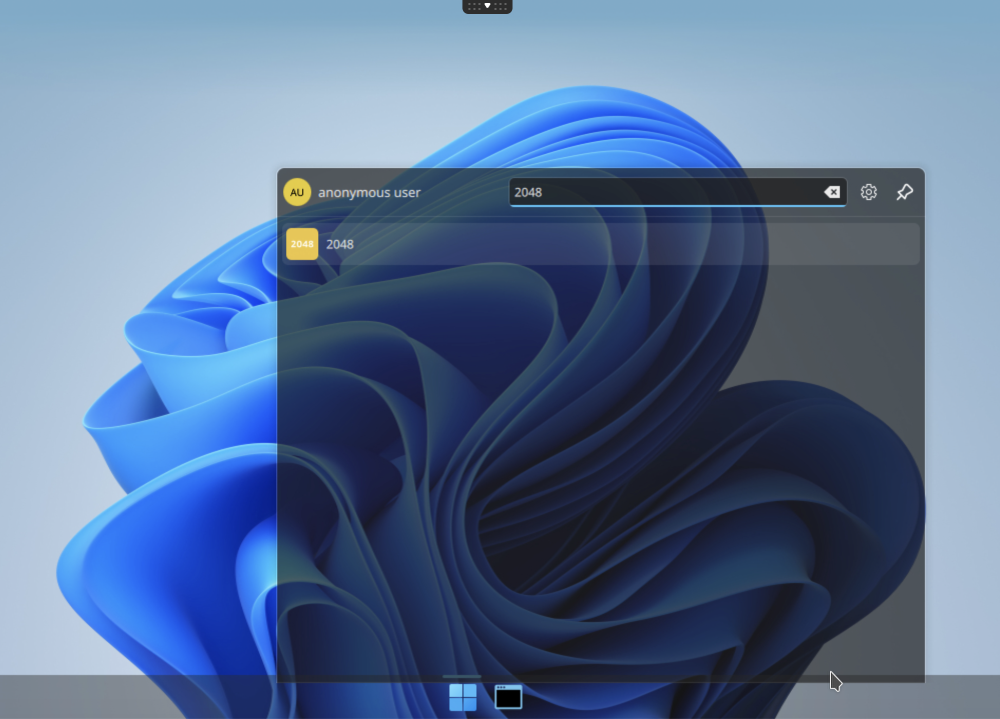
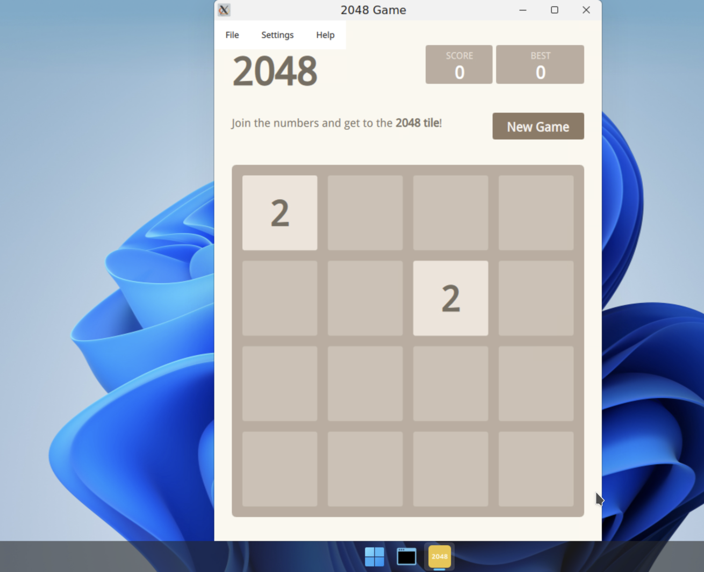

# Build an application from a template

Goal: Build a custom abcdesktop.io application image by extending an existing template container image.

abcdesktop.io uses the container image format with metadata labels to describe each application.

## Requirements

- Your own public or private container registry.
- `nodejs` installed on your host.
- `docker` command-line tool installed to build container images.
- `wget` command-line tool installed.


## Build your own application image

In this example, the new application image packages the `2048` game. The build process uses a JSON descriptor file and a Node.js script to generate a Dockerfile automatically.

Create a directory named `build`, and create a directory `icons` inside it:

```
mkdir -p build/icons
cd build
```

To build your own image, first create a JSON descriptor file that defines the application's metadata, package name, and runtime configuration.

Create a file named `applist.json` inside the `build` directory with the following content:

```
[
  {
    "cat": "games",
    "debpackage": "2048-qt",
    "icon": "2048_logo.svg",
    "keyword": "2048",
    "launch": "2048-qt.2048-qt",
    "name": "2048",
    "displayname": "2048",
    "path": "/usr/games/2048-qt",
    "template": "ghcr.io/abcdesktopio/oc.template.ubuntu.gtk.26.04"
  }
]
```

The table below describes each field in the JSON application descriptor:

| name                         | Type     |          Data                 |
|------------------------------|--------- |-------------------------------|
|  `cat`                       | string   | games |
|  `debpackage`                | string   | 2048-qt |
|  `icon`                      | string   | 2048_logo.svg |
|  `keyword`                   | string   | 2048 |
|  `launch`                    | string   | 2048-qt.2048-qt |
|  `name`                      | string   | 2048|
|  `path`                      | string   | /usr/games/2048-qt |
|  `template`                  | string   | ghcr.io/abcdesktopio/oc.template.ubuntu.gtk.26.04 |

The following descriptions explain how to determine the correct value for each field:

* `cat` is the application category. Choose the most appropriate value from the following list: `[ 'office', 'games', 'graphics', 'development', 'utilities', 'education' ]`
* `debpackage` is the name of the Ubuntu package to install. To look up the correct package name, refer to [2048 Ubuntu Package](https://packages.ubuntu.com/source/bionic/2048-qt).
* `icon` is the filename of the application icon. abcdesktop.io supports only the `svg` icon format. Download the icon from [https://upload.wikimedia.org/wikipedia/commons/1/18/2048_logo.svg](https://upload.wikimedia.org/wikipedia/commons/1/18/2048_logo.svg).
* `keyword` is a comma-separated list of search keywords for the application. Set the value to `2048`.
* `launch` is the X11 `WM_CLASS` identifier of the application window. To determine this value, run the application on a GNU/Linux system and inspect its window class using a tool such as `xprop`.
* `name` is the internal application name. Set the value to `2048`.
* `path` is the absolute filesystem path to the application binary.
* `template` is the name of the parent base image. The default parent image is `ghcr.io/abcdesktopio/oc.template.ubuntu.gtk.26.04`. Available templates are listed in the next section.


### Build your new image 2048


- Download the application icon

```
wget https://upload.wikimedia.org/wikipedia/commons/1/18/2048_logo.svg -O icons/2048_logo.svg
```

- Download the Node.js build scripts


```
wget https://raw.githubusercontent.com/abcdesktopio/oc.apps/refs/heads/4.4/make.js
wget https://raw.githubusercontent.com/abcdesktopio/oc.apps/refs/heads/4.4/package.json
```

Run `npm install` to install the required packages:

```
npm i
```

- Run `make.js` to generate a Dockerfile for the 2048 application. The script reads `applist.json` and produces a ready-to-build Dockerfile for each entry.

```
nodejs make.js
```

The expected output is:

```
Namespace(dockerfile=false, release='4.4', applicationfile='applist.json')
Read database json file=applist.json
opening file applist.json
applist.json entries: 1
Creating Dockerfile 2048.d
```

The following file has been generated:

- `2048.d` — the generated Dockerfile for the 2048 abcdesktop.io application

Inspect the content of `2048.d`. Verify that all required labels are present and that the icon data is base64-encoded (a binary-to-text encoding scheme used to embed binary assets in text files).

Build the 2048 application image using the `docker build` command.

> Replace the value of `REGISTRY` with your own registry name if needed.

```
REGISTRY=abcdesktopio
docker build -f 2048.d -t $REGISTRY/2048.d .
```

The expected output is:

```
[+] Building 62.3s (8/8) FINISHED                                                                                                                                                           docker:default
 => [internal] load build definition from 2048.d                                                                                                                                                      0.0s
 => => transferring dockerfile: 3.49kB                                                                                                                                                                0.0s
 => [internal] load metadata for ghcr.io/abcdesktopio/oc.template.ubuntu.gtk.26.04:4.4                                                                                                                0.0s
 => [internal] load .dockerignore                                                                                                                                                                     0.0s
 => => transferring context: 2B                                                                                                                                                                       0.0s
 => CACHED [1/4] FROM ghcr.io/abcdesktopio/oc.template.ubuntu.gtk.26.04:4.4                                                                                                                           0.0s
 => [2/4] RUN echo 'debconf debconf/frontend select Noninteractive' | debconf-set-selections                                                                                                          0.3s
 => [3/4] RUN DEBIAN_FRONTEND=noninteractive apt-get update && apt-get install -y  --no-install-recommends 2048-qt && apt-get clean && rm -rf /var/lib/apt/lists/*                                   59.9s
 => [4/4] RUN if [ -x /usr/bin/dbus-launch ]; then chmod g+r,g+w,o+r,o+w /var/lib/dbus ; fi                                                                                                           0.2s
 => exporting to image                                                                                                                                                                                1.8s
 => => exporting layers                                                                                                                                                                               1.8s
 => => writing image sha256:7804b6c77950a0f43daa13b7b0901eb4b795f984c6d888ab6ef513573b4d3147                                                                                                          0.0s
 => => naming to docker.io/abcdesktop/2048.d
```

- Push your image to your registry

> Replace the value of `REGISTRY` with your own registry name if needed.
> If you do not have your own registry, you can skip this step but keep `REGISTRY=abcdesktopio`.

```
REGISTRY=abcdesktopio
docker push $REGISTRY/2048.d
```

- Create a JSON file from your container image

> If you do not have your own registry, do not skip this step. Keep `REGISTRY=abcdesktopio`.

```
REGISTRY=abcdesktopio
docker inspect $REGISTRY/2048.d > 2048.json
```


## Push your image to abcdesktop service

* Send the image metadata to the abcdesktop pyos instance


```bash
NAMESPACE=abcdesktop
PYOS_POD_NAME=$(kubectl get pods -l run=pyos-od -o jsonpath={.items..metadata.name} -n "$NAMESPACE" | awk '{print $1}')
kubectl cp 2048.json $PYOS_POD_NAME:/tmp -n $NAMESPACE
kubectl exec -i $PYOS_POD_NAME -n abcdesktop -- curl -X POST -H 'Content-Type: text/javascript' http://localhost:8000/API/manager/image -d @/tmp/2048.json
```

These commands retrieve the `PYOS_POD` name, copy the `2048.json` file to the `/tmp` directory inside the pyos pod, and submit the file to the REST API server.

The image endpoint returns a JSON document

```
[
  {
    "cmd": [
      "/composer/appli-docker-entrypoint.sh"
    ],
    "path": "/usr/games/2048-qt",
    "sha_id": "sha256:7804b6c77950a0f43daa13b7b0901eb4b795f984c6d888ab6ef513573b4d3147",
    "id": "abcdesktop/2048.d:latest",
    "architecture": "amd64",
    "os": "linux",
    "rules": {},
    "acl": {
      "permit": [
        "all"
      ]
    },
    "launch": "2048-qt.2048-qt",
    "wm_class": null,
    "name": "2048",
    "icon": "2048_logo.svg",
    "icondata": "PD94bWwgdmVyc2lvbj0iMS4wIiBlbmNvZGluZz0iVVRGLTgiIHN0YW5kYWxvbmU9Im5vIj8+CjxzdmcgeG1sbnM9Imh0dHA6Ly93d3cudzMub3JnLzIwMDAvc3ZnIiB3aWR0aD0iMzAwIiBoZWlnaHQ9IjMwMCI+CiAgPHJlY3Qgd2lkdGg9IjMwMCIgaGVpZ2h0PSIzMDAiIGZpbGw9IiNlZGM1M2YiIHJ5PSI0Ni44MTIiLz4KICA8cGF0aCBmaWxsPSIjZmZmIiBmaWxsLW9wYWNpdHk9Ii45NDExOCIgZD0iTTkwLjQ5NCAxODAuMkg0Ni44Njl2LTkuOTI5NWM3LjgyMzgtNy44MjIzIDMwLjQ3NC0yNS40MDkgMjguMTUtMzUuNTMtMy4wNzIxLTkuNjg4OC0xNi41MTYtMy4xMDQxLTE4LjQ5NyAxLjMxNzlsLTkuNjA2LTcuMzRjOS45MDUxLTE1LjI3NyA0MC41NDgtMTMuNTE3IDQxLjQxOCA2LjE2MDguMTM0MTcgMTUuNTUzLTE1LjMyOCAyNS4wOS0yNC4zNDQgMzMuNjY4di41OTUzNmgyNi41MDR6bTU1LjE5Ni0zMC4wOGMuMDYzMSAxNy45MzQtNS4xMTQ2IDMxLjQ4NS0yMy4wMjcgMzEuNi0xOS4wODMtLjAzNTYtMjMuNTYtMTMuNzQzLTIzLjQ5NS0zMS40ODgtLjA2NDktMTcuNzggNC43ODEzLTMxLjU4IDIzLjQ5NS0zMS42MTQgMTguMDY2LjAzMzUgMjIuOTY0IDEzLjg1NCAyMy4wMjcgMzEuNTAyem0tMzMuNzM0LjExMjM2Yy4xMTU1NSA3LjAyNjYuNjc1OTkgMjAuNjE0IDEwLjQ4MyAyMC43MTEgOS43MDUzLjExMTY0IDEwLjUxMy0xNC4zODYgMTAuNTM4LTIwLjgyMy0uMTI2ODMtNi45OTEtLjQ4Nzc5LTIwLjUwMi0xMC40MjYtMjAuNTctMTAuMDk4LS4xODQxMi0xMC41MjggMTMuOTYzLTEwLjU5NSAyMC42ODJ6TTIzMS43MSAxMTguNjFjOC41MjQ1LjA0NTMgMjAuNDUgMy43MjU1IDIwLjQ1OSAxNC44MDMtLjAwOSA4Ljc1OC0zLjY0OTggMTAuNzI5LTEwLjY0IDE0LjU0OCA3LjY5NSA0LjY0NTMgMTIuNTM0IDguMTExMiAxMi42MjMgMTcuMjQxLS4wODkyIDExLjk1Ni0xMS42NTIgMTYuMjcxLTIyLjQ0MyAxNi4zNTEtMTEuMzYzLS4wNzk5LTIyLjU3LTQuMTM0Ni0yMi43NDQtMTYuNTIzLjE3ODk0LTguOTM3NiA1LjQxOTYtMTQuMDAxIDExLjEwMy0xNi44NjEtNi40OTA5LTMuOTgwNi05LjUzMzMtNi4wMzY0LTkuMzczMS0xNC44NC0uMTYwMi0xMC45MDcgMTEuODE3LTE0LjY3MyAyMS4wMTQtMTQuNzE5em0tMTAuNTM0IDQ1LjM0N2MtLjA0MzIgNS42ODM5IDQuNjk2MyA3Ljc0MzYgMTAuNDEgNy42OTU0IDUuNTA0OS4wNDgyIDkuNjcxOS0yLjI0NTMgOS43Mzk5LTcuMTY3NC4wNDc5LTguMjY2Ny05LjczNDQtMTEuODc5LTkuNzM0NC0xMS44NzlzLTEwLjQ1OSAzLjYxMjYtMTAuNDE2IDExLjM1MXptMTAuNDQxLTM0Ljk4MmMtNC43OTc5LS4wNDA5LTkuMTUxMiAxLjAzOTgtOS4xNzM5IDUuNjc3LjAyMjcgNS4zOTk1IDkuMDc3NCA5LjEwNCA5LjA3NzQgOS4xMDRzOC4zMzExLTMuNjU0NCA4LjQ1OTQtOS40ODQ3Yy0uMTkxOC00LjI1MjYtMy44MDg2LTUuMzM3Mi04LjM2MjktNS4yOTYzek0yMDIuMjIgMTcwLjA3aC03Ljc3djEwLjA4OGgtMTEuNTF2LTEwLjA4aC0zMC4wNnYtMTEuMTM3bDI5LjMzMi0zOC44NTNoMTIuMjM4djM5Ljc3Nmg3Ljc3em0tMTkuMjgtMzMuNzIzLTE4LjAzOCAyMy41MTdoMTguMDM4eiIvPgo8L3N2Zz4K",
    "keyword": "2048,2048",
    "uniquerunkey": null,
    "cat": "games",
    "args": null,
    "execmode": null,
    "showinview": null,
    "displayname": "2048",
    "desktopfile": null,
    "executeclassname": null,
    "runtimeClassName": null,
    "executablefilename": "2048-qt",
    "usedefaultapplication": false,
    "mimetype": [],
    "fileextensions": [],
    "legacyfileextensions": [],
    "secrets_requirement": null,
    "containerengine": "ephemeral_container",
    "securitycontext": {},
    "created": "2026-04-08T17:02:15.742581671+02:00"
  }
]
```


## Run your new application 2048

Return to your abcdesktop website at `http://localhost:30443` and log in as Anonymous.

In the search bar at the top-right corner, type the keyword `2048`.



Click the `2048` icon to launch the application:



The application is now running as an ephemeral container inside your abcdesktop.io user pod. Have fun!

## Other templates

Because each application runs inside its own dedicated container, you can run applications from multiple Linux distributions simultaneously on the same abcdesktop.io instance.
The full template repository is available at [https://github.com/abcdesktopio/oc.template](https://github.com/abcdesktopio/oc.template).

### templates for `almalinux`
- oc.template.almalinux.8
- oc.template.almalinux.9
- oc.template.almalinux.10
- oc.template.almalinux.gtk.8
- oc.template.almalinux.gtk.10
- oc.template.almalinux.gtk.9
- oc.template.almalinux.minimal.9
- oc.template.almalinux.minimal.10


### templates for `alpine`
- oc.template.alpine.edge
- oc.template.alpine
- oc.template.alpine.wine
- oc.template.alpine.edge.gtk
- oc.template.alpine.edge.gtk.libreoffice
- oc.template.alpine.libreoffice
- oc.template.alpine.3.23
- oc.template.alpine.minimal.3.20
- oc.template.alpine.minimal.3.21
- oc.template.alpine.minimal.3.22
- oc.template.alpine.minimal.3.23
- oc.template.alpine.minimal.edge
- oc.template.alpine.minimal

### templates for `debian`
- oc.template.debian.gtk
- oc.template.debian
- oc.template.debian.minimal

### templates for `ubuntu`
- oc.template.ubuntu.minimal.20.04
- oc.template.ubuntu.minimal.22.04
- oc.template.ubuntu.minimal.24.04
- oc.template.ubuntu.minimal.26.04
- oc.template.ubuntu.gtk.18.04
- oc.template.ubuntu.18.04
- oc.template.ubuntu.minimal.18.04
- oc.template.ubuntu.24.04
- oc.template.ubuntu.20.04
- oc.template.ubuntu.22.04
- oc.template.ubuntu.26.04
- oc.template.ubuntu.wine.mswindow
- oc.template.ubuntu.libreoffice
- oc.template.ubuntu.wine
- oc.template.ubuntu.gtk.java
- oc.template.ubuntu.gtk.24.04
- oc.template.ubuntu.gtk.22.04
- oc.template.ubuntu.gtk.20.04
- oc.template.ubuntu.gtk.26.04


### templates for `rockylinux`
- oc.template.rockylinux.gtk.libreoffice.9
- oc.template.rockylinux.gtk.9
- oc.template.rockylinux.gtk.8
- oc.template.rockylinux.8
- oc.template.rockylinux.9
- oc.template.rockylinux.minimal.8
- oc.template.rockylinux.minimal.9


### Templates with `nvidia` library support
- oc.template.rockylinux.nvidia.8
- oc.template.rockylinux.nvidia.9
- oc.template.ubuntu.nvidia.24.04
- oc.template.ubuntu.nvidia.22.04


You have successfully built your own abcdesktop.io 2048 application.


