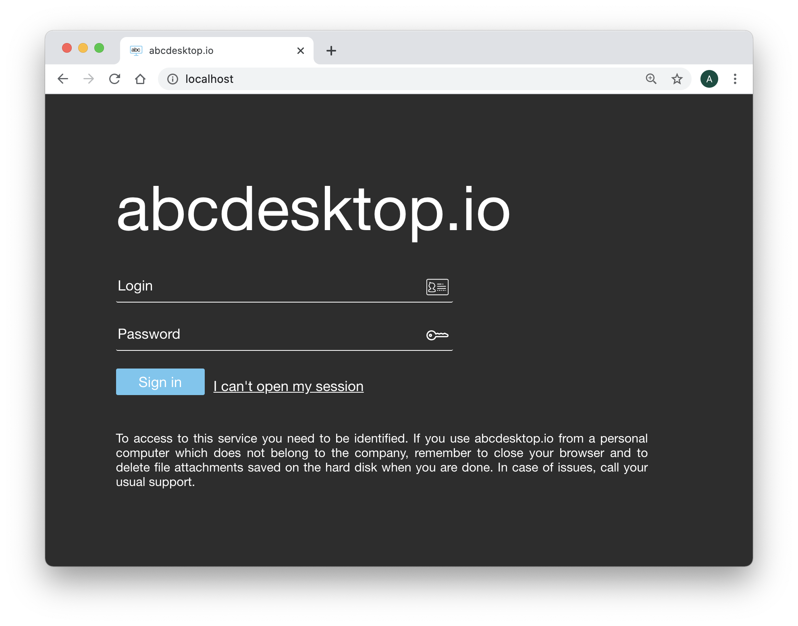

# Authentication `explicit`

## authmanagers `explicit`


The `explicit` authentication provider uses a directory service. The LDAP bind operation authenticates clients to the directory server and establishes an authorization identity that is used for all subsequent operations on that connection.

The `explicit` authentication configuration is defined as a dictionary object and contains an `explicit` provider.

The `explicit` authentication provider supports the directory services `ldap`, `ldaps`, and `Microsoft Active Directory`.


Configuration example for Microsoft Active Directory:

```
'explicit': {
    'show_domains': True,
    'providers': {
      'AD': { 
        'config_ref': 'adconfig', 
        'enabled': True
       }
}
```


```
adconfig : { 'AD': {   'default'       : True, 
                       'ldap_timeout'  : 15,
                       'ldap_protocol' : 'ldap',
                       'ldap_basedn'   : 'DC=ad,DC=domain,DC=local',
                       'ldap_fqdn'     : '_ldap._tcp.ad.domain.local',
                       'domain'        : 'AD',
                       'domain_fqdn': 'AD.DOMAIN.LOCAL',
                       'servers'	: [ '192.168.7.12' ],
          				'kerberos_realm': 'AD.DOMAIN.LOCAL',
          				'query_dcs'	: True,
          				'wins_servers'  : [ '192.168.1.12' ],
          				'serviceaccount': { 'login': 'SVCACCOUNT', 'password': 'SVCACCOUNTPASSWORD' }
     }
}
```

### Home Page Authentication

When the `explicit` authentication manager is enabled, the web home page displays `Login` and `Password` input fields to authenticate users.




### LDAP Authentication Manager

Read the specific chapter on LDAP: [LDAP and LDAPS explicit authmanagers](authexplicit-ldap.md)

### Microsoft Active Directory Authentication Manager

Microsoft Active Directory is implemented as an LDAP server. Start by reading the chapter on LDAP at [LDAP and LDAPS explicit authmanagers](authexplicit-ldap.md), then read the specific chapter for Microsoft Active Directory at [Microsoft Active Directory explicit authmanagers](authexplicit-activedirectory.md).

You have successfully reviewed how the explicit authentication configuration works.
