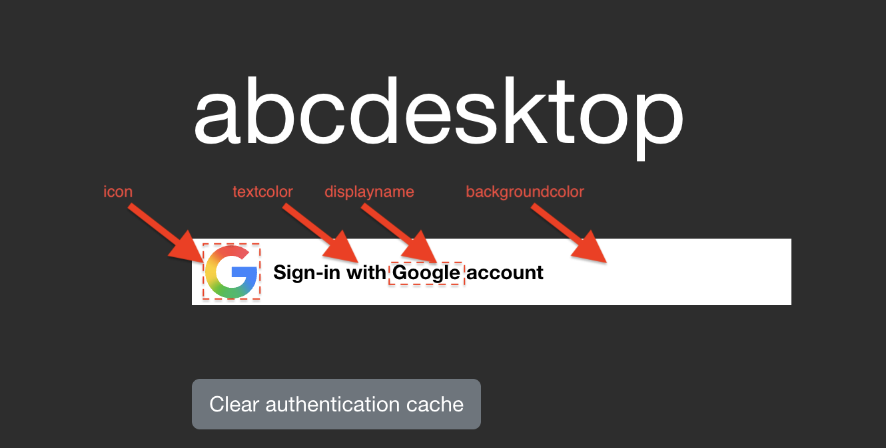

# Authentication: `external`

## Prerequisites

The `external` authentication provider requires a fully qualified domain name (FQDN) and HTTPS connectivity. OAuth 2.0 redirect URIs must use the `https://` scheme, as most OAuth 2.0 providers reject plaintext redirect URIs.

## Library

abcdesktop.io uses the [requests_oauthlib](https://requests-oauthlib.readthedocs.io/en/latest/oauth2_workflow.html) Python module to implement OAuth 2.0 authorization code flows. The `requests-oauthlib` library combines the Python `requests` HTTP client with the `oauthlib` standards-compliant OAuth 2.0 implementation, providing a unified interface for interacting with OAuth 2.0 providers.

## Configuration

The `external` authentication provider is configured as a dictionary that maps provider names to their respective OAuth 2.0 settings. Each entry represents an independent OAuth 2.0 identity provider.

The following example shows a provider configuration for Google OAuth 2.0:

```json
'external': {
  'providers': {
    'google': { 
        'icon': 'img/auth/google_icon.svg',
        'displayname': 'Google', 
        'textcolor': '#000000',
        'backgroundcolor': '#FFFFFF',
        'enabled': True,
        'client_id': 'xxxx', 
        'client_secret': 'xxxx',
        'userinfo_auth': True,
        'scope': [ 'https://www.googleapis.com/auth/userinfo.email',  'openid' ],
        'userinfo_url': 'https://www.googleapis.com/oauth2/v1/userinfo',
        'redirect_uri_prefix' : 'https://hostname.domain.local/API/auth/oauth',
        'redirect_uri_querystring': 'manager=external&provider=google',
        'authorization_base_url': 'https://accounts.google.com/o/oauth2/v2/auth',
        'token_url': 'https://oauth2.googleapis.com/token',
        'policies': { 
          'acl': { 'permit': [ 'all' ] } 
        }
      }
  }}
```

- `client_id` and `client_secret` are set to the placeholder value `'xxxx'`. Replace these with the actual OAuth 2.0 credentials issued by the identity provider.
- `redirect_uri_prefix` must reflect your server's actual FQDN. Replace `hostname.domain.local` with the FQDN assigned to your deployment.

The configuration above renders the following login area on the web frontend:



## Parameter Reference

| Parameter | Type | Description | Example |
|---|---|---|---|
| `displayname` | string | Display name shown on the login page | `Google` |
| `icon` | string | Path to the provider icon (SVG format required) | `'img/auth/google_icon.svg'` |
| `textcolor` | string | Button text color (CSS hex) | `'#000000'` |
| `backgroundcolor` | string | Button background color (CSS hex) | `'#FFFFFF'` |
| `enabled` | boolean | Enables or disables this provider | `True` |
| `client_id` | string | OAuth 2.0 client ID | `XXX-YYY.apps.googleusercontent.com` |
| `client_secret` | string | OAuth 2.0 client secret | `XXX` |
| `scope` | list of string | OAuth 2.0 scopes to request | `[ 'https://www.googleapis.com/auth/userinfo.email', 'openid' ]` |
| `userinfo_auth` | boolean | Enables the OAuth `userinfo` endpoint request. Default: `True`. | `True` |
| `userinfo_url` | string | URL of the OAuth 2.0 userinfo endpoint | `'https://www.googleapis.com/oauth2/v1/userinfo'` |
| `redirect_uri_prefix` | string | Base URL for the OAuth 2.0 redirect URI | `'https://hostname.domain.local/API/auth/oauth'` |
| `redirect_uri_querystring` | string | Query string appended to the redirect URI | `'manager=external&provider=google'` |
| `authorization_base_url` | string | OAuth 2.0 authorization endpoint | `'https://accounts.google.com/o/oauth2/v2/auth'` |
| `token_url` | string | OAuth 2.0 token endpoint | `'https://oauth2.googleapis.com/token'` |
| `userinfomap` | dictionary | Remaps keys in the userinfo JSON response | `{ '*': '*', 'picture': 'picture.data.url' }` |
| `policies` | dict | Access control policies. Default: `{}`. | `{ 'acl' : { 'permit': [ 'all' ] } }` |

The full redirect URI is constructed by concatenating `redirect_uri_prefix` and `redirect_uri_querystring`.

The `userinfomap` applies to all fields in `[ 'userid', 'name' ]` and to the POSIX account fields `[ 'cn', 'uid', 'gid', 'uidNumber', 'gidNumber', 'homeDirectory', 'loginShell', 'description', 'groups', 'gecos' ]`.

## Reading Groups and Assigning Roles from userinfo

If `userinfo_auth` is `True`, abcdesktop.io retrieves the JSON body from the `userinfo_url` endpoint. If the response contains a `groups` key whose value is a list of strings, each string is applied as a role label on the user's pod:

```python
     if isinstance( userinfo.get('groups'), list ):
            for role in userinfo.get('groups'):
                if isinstance(role, str):
                    roles.append(role)
```

For example, if the userinfo endpoint returns:

```json
{ 
    "id": "34567345623452",
    "email": "mail@yourdomain.com",
    "verified_email": true,
    "picture": "https://lh3.googleusercontent.com/x-/xxxxxxxxxxxx",
    "hd": "yourdomain.com",
    "groups": [ "admins", "developers" ]
}
```

The user pod receives the labels `admins=true` and `developers=true`:

```
kubectl describe pods user-746b8   -n abcdesktop
...
Labels:           abcdesktop/role=desktop
                  admins=true
                  developers=true
                  ...
```

## Google OAuth 2.0

Create a Google OAuth 2.0 client credential in the [Google Cloud Console](https://console.cloud.google.com/) and configure the provider:

```json
'google': { 
        'icon': 'img/auth/google_icon.svg',
        'displayname': 'Google', 
        'textcolor': '#000000',
        'backgroundcolor': '#FFFFFF',
        'enabled': True,
        'client_id': 'xxxx', 
        'client_secret': 'xxxx',
        'userinfo_auth': True,
        'scope': [ 'https://www.googleapis.com/auth/userinfo.email',  'openid' ],
        'userinfo_url': 'https://www.googleapis.com/oauth2/v1/userinfo',
        'redirect_uri_prefix' : 'https://hostname.domain.local/API/auth/oauth',
        'redirect_uri_querystring': 'manager=external&provider=google',
        'authorization_base_url': 'https://accounts.google.com/o/oauth2/v2/auth',
        'token_url': 'https://oauth2.googleapis.com/token',
        'policies': { 'acl'  : { 'permit': [ 'all' ] } }
      }
```

## Facebook OAuth 2.0

Create a Facebook application in the [Meta Developer Portal](https://developers.facebook.com/) and use the generated credentials to configure the provider:

```json
'facebook': { 
        'displayname': 'Facebook', 
        'icon': 'img/auth/facebook_icon.svg',
        'textcolor': '#000000',
        'backgroundcolor': '#FFFFFF',
        'enabled': True,
        'userinfo_auth': True,
        'client_id': 'xxxx', 
        'client_secret': 'xxxx', 
        'redirect_uri_prefix' : 'https://ocv4.pepins.net/API/auth/oauth',
        'redirect_uri_querystring': 'manager=external&provider=facebook',
        'authorization_base_url': 'https://www.facebook.com/dialog/oauth',
        'userinfo_url': 'https://graph.facebook.com/v2.6/me?fields=picture.width(400),name',
        'token_url': 'https://graph.facebook.com/v2.3/oauth/access_token',
        'userinfomap': {
            '*': '*',
            'picture': 'picture.data.url'
        },
        'policies': { 'acl'  : { 'permit': [ 'all' ] } }
      }
```

In this example, `userinfomap` remaps the `picture` key in the userinfo JSON response to the nested value at `picture.data.url`.

## Orange OAuth 2.0 / OpenID Connect

Orange's OAuth 2.0 API is built on the OpenID Connect protocol. Create your Orange application credentials and configure the provider:

```json
 'orange': {       
        'displayname': 'Orange', 
        'icon': 'img/auth/orange_icon.svg',
        'textcolor': '#000000',
        'backgroundcolor': '#FFFFFF',
        'enabled': True,
        'basic_auth': True,
        'userinfo_auth': True,
        'scope' : [ 'openid', 'form_filling' ],
        'client_id': 'xxxx',
        'client_secret': 'xxxx',
        'redirect_uri_prefix' : 'https://hostname.domain.local/API/auth/oauth',
        'redirect_uri_querystring': 'manager=external&provider=orange',
        'authorization_base_url': 'https://api.orange.com/openidconnect/fr/v1/authorize',
        'token_url': 'https://api.orange.com/openidconnect/fr/v1/token', 
        'userinfo_url': 'https://api.orange.com/formfilling/fr/v1/userinfo',
        'policies': { 'acl'  : { 'permit': [ 'all' ] } }
      },
```
