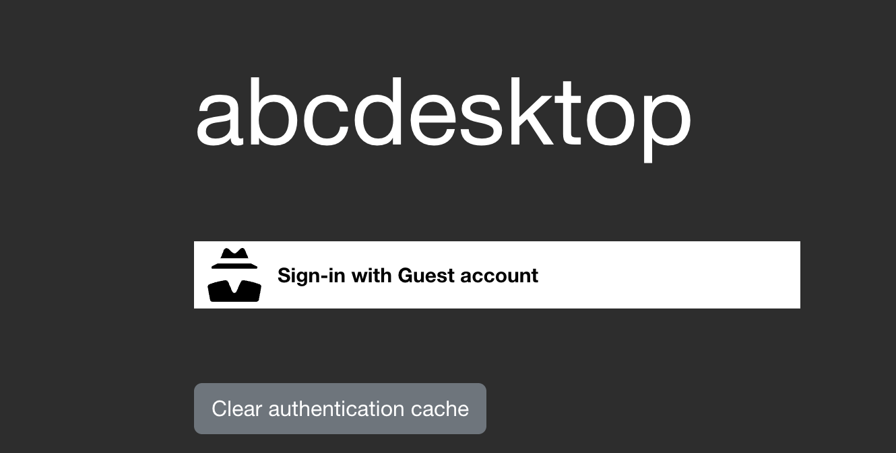

# Authentification ```implicit```

## authmanagers ```implicit```:

```implicit``` is the easyest configuration mode, and is used as 'Anonymous' authentification. 

The provider is defined as a dictionnary object and contains an ```anononymous``` provider.

```anononymous``` provider always permit authentification, and create a uuid as userid. ```anononymous``` provider is used to skip the authentification  process in a demonstration mode.

```
'implicit': {
    'providers': {
      'anonymous': {
        'displayname': 'Guest',
        'textcolor': '#000000',
        'icon': 'img/auth/anonymous_icon.svg',
        'backgroundcolor': '#FFFFFF',
        'caption': 'Have a look !',
        'userid': 'anonymous',
        'username': 'anonymous',
          'policies': {  'acl'   : { 'permit': [ 'all' ] } }
      }
    }
}
```

```anononymous``` provider always permit authentification, and create a uuid as userid. 

Set in your configuration file the authmanagers dictionnary as described

```
authmanagers: {
  'external': { },
  'explicit': { },
  'implicit': {
    'providers': {
      'anonymous': {
        'displayname': 'Guest',
        'textcolor': '#000000',
        'icon': 'img/auth/anonymous_icon.svg',
        'backgroundcolor': '#FFFFFF',
        'caption': 'Have a look !',
        'userid': 'anonymous',
        'username': 'anonymous',
          'policies': {  'acl'   : { 'permit': [ 'all' ] } }
      }
    }
  }
}
```

[Update your configuration file and apply the new configuration file](editconfig.md)

Open a new Web Browser and go to your abcdesktop URL. You should see the login HTML page with the Anonymous button :



Press the ```Sign-In Anonymously``` button.

Then, choose the ```settings``` in the menu at the upper right corner 


Choose the ```System``` in the settings control panel.

 

Then choose ```User containers```


When the anonymous container is removed, **the anonymous home directory is deleted**.

Great, you have check how the implicit Authentification configuration works.

