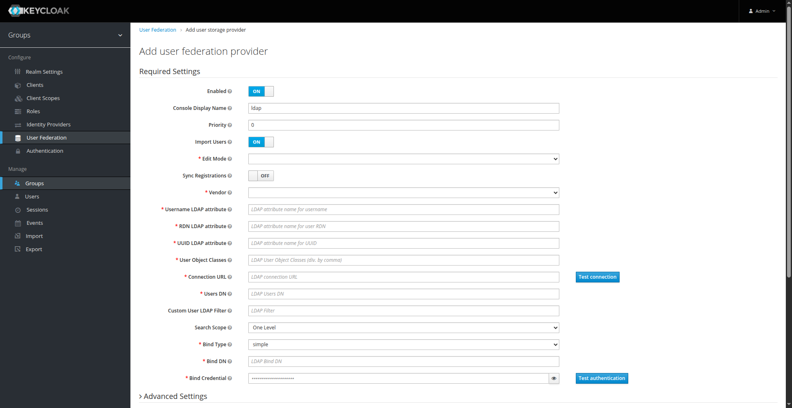
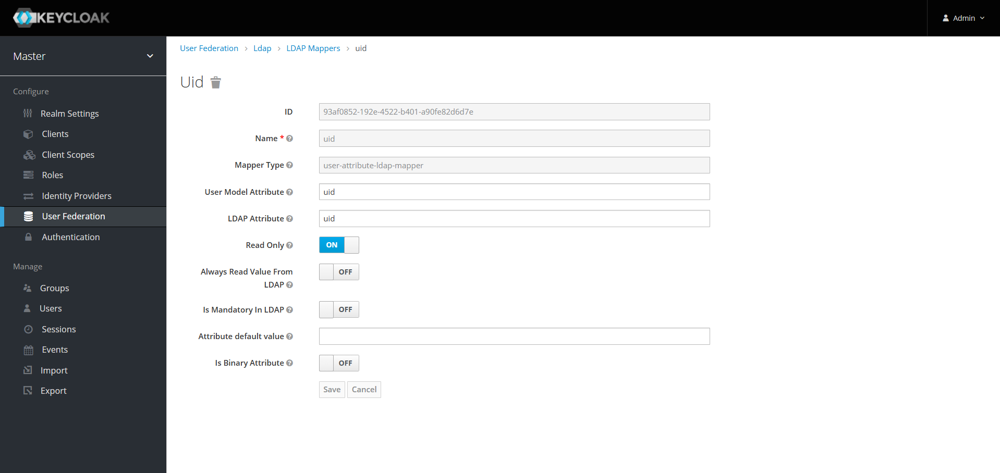
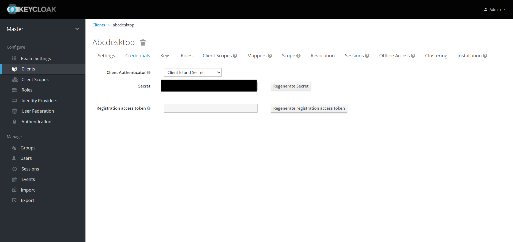
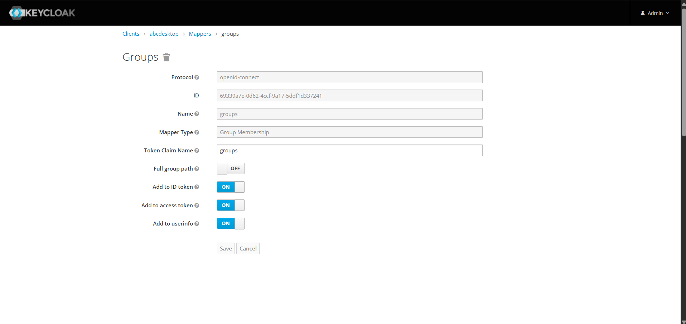
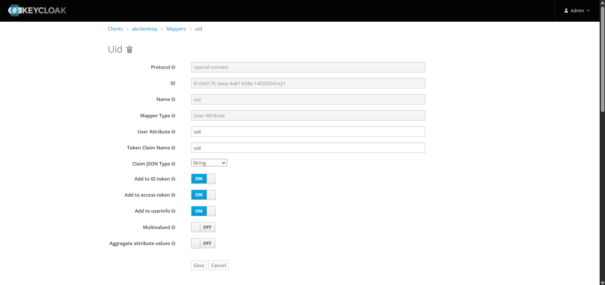
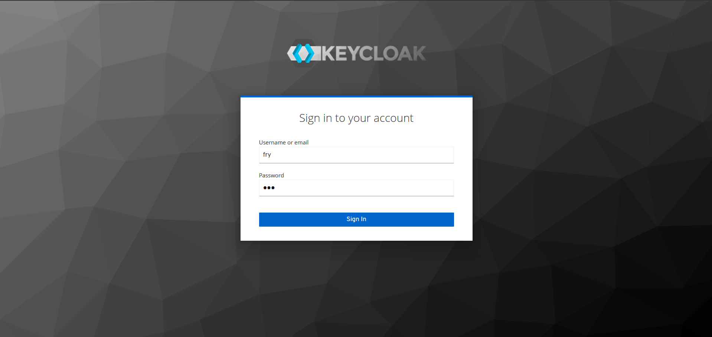

# Configure Keycloak with external LDAP for abcdesktop

## Prerequisites

- a Kubernetes cluster with abcdesktop installed
- `helm` command line
- an LDAP server

!!! note
    In this example, we will use [docker-test-openldap](https://github.com/rroemhild/docker-test-openldap)


## Install

There are many ways to install a keycloak server, in this tutorial, we will perform a Kubernetes install on the same cluster hosting our abcdesktop using helm command line.

!!! note 
    If you are curious about other ways to get started, please refer to the [keycloak documentation](https://www.keycloak.org/guides)

Connect to your control plane and run the following lines to perform keycloak install

```
helm repo add codecentric https://codecentric.github.io/helm-charts
helm repo update
```

```
helm install keycloak codecentric/keycloak \
  --namespace keycloak \
  --set postgresql.enabled=false \
  --set database.vendor=h2 \
  --set service.type=NodePort 
```

Once done, run the following command to check if the keycloak are running

```
kubectl get pods -n keycloak
NAME         READY   STATUS    RESTARTS   AGE
keycloak-0   1/1     Running   0          32s
```

Then check the keycloak service to see which port has been chosen for hte web UI

```
NAME                TYPE        CLUSTER-IP       EXTERNAL-IP   PORT(S)                                      AGE
keycloak-headless   ClusterIP   None             <none>        80/TCP                                       47s
keycloak-http       NodePort    10.111.139.181   <none>        80:31846/TCP,8443:30806/TCP,9990:32562/TCP   47s
```

In my case, the port is `31846`. You can now connect to `http://<YOUR_MASTER_IP>:<YOUR_KEYCLOAK_PORT>`


## Create admin user

In order to access keycloak administration console, you should create an admin user locally, directly on the keycloak pod.

First open a shell inside the pod

```
kubectl exec -it keycloak-0 -n keycloak -- bash
```

Once inside, ru the following commands to create the admin user

```
# You can replace admin and admin123 by the credentials of your choice
/opt/jboss/keycloak/bin/add-user-keycloak.sh \
  -u admin \
  -p admin123

# Then reload keycloak 
/opt/jboss/keycloak/bin/jboss-cli.sh --connect command=:reload
```

Now reconnect to the web UI, you should be able to connect and access admin console


## Import LDAP users

On the admin console, click on `User Federation` and then `Add provider > ldap` 


You can now fill the different fields according to your ldap configuration.



In our case, it will look like this


Once filled; click on `Synchronize all users` at the bottom, it should import your users. You can check it by going to the users page.


## Add mappers to User federation (Optionnal)

By default, while importing users, keycloak only imports a few attributes for each user that are :

- `full name`
- `modify date`
- `email`
- `creation date`
- `last name`
- `username`

But, you may want to import other attributes from your LDAP server. To do so, you need to create some Mappers.  
Go to `Mappers` tab on the `User Federation` page and create a mapper for each attribute you want to add.


In our example we need to import user's `groups` and `uid`





You can now check a user to see the updates


## Create a client 

In order to perform authentication with keycloak, we need to generate a client secret. For that go to the `Client` page and click on create. Fill the fields and save it.


Now go to the `Credentials` tab and you should see your client secret.



!!! info
    If you added mappers at previous step, you should create the same mappers on the client.

    ??? note "show details"
        Go to the `Mappers` tab and create one mapper for each previously created mapper.

        In our case, we need to create both client sides `groups` and `uid` mappers. 

      
      
      

## Update od.config file

Now you have to tell abcdesktop to use keycloak as an authentication provider. For that, you need to update the `od.config` file as explained on [this page](https://abcdesktop.pepins.net/advanced/4.4/authentication/authexternal/#keycloak-oauth).  

Restart pyos by running the following commands

```
kubectl create -n abcdesktop configmap abcdesktop-config --from-file=od.config -o yaml --dry-run=client | kubectl replace -n abcdesktop -f -
kubectl rollout restart deploy pyos-od -n abcdesktop
```

Now you can perform authentication with keycloak, let try to log in as `fry`.



It should work and create your desktop. You can also check pyos logs to see which that keycloak is the provider that has been used.

```
kubectl get pods -n abcdesktop
NAME                            READY   STATUS    RESTARTS   AGE
console-od-7f548d74fd-48rpv     1/1     Running   0          9d
fry-c3896                       3/3     Running   0          2d23h
memcached-od-796c455cd-hqhlb    1/1     Running   0          9d
mongodb-od-0                    2/2     Running   0          9d
nginx-od-6657dd8c9-c979g        1/1     Running   0          9d
openldap-od-6f4797f9d-86jdd     1/1     Running   0          9d
pyos-od-95789468f-9dl68         1/1     Running   0          2d23h
router-od-867f5576dd-p9hj5      1/1     Running   0          9d
speedtest-od-78cdbdd9c6-vphfl   1/1     Running   0          9d
```

```
kubectl logs pyos-od-95789468f-9dl68 -n abcdesktop|grep authservice
2026-04-02 13:42:52 test-pl-worker3 140187023907640 authservice [DEBUG  ] oc.auth.authservice.ODAuthTool.login:anonymous pdr.authenticate provider=keycloak done
2026-04-02 13:42:52 test-pl-worker3 140187023907640 authservice [DEBUG  ] oc.auth.authservice.ODAuthTool.login:anonymous pdr.getuserinfo provider=keycloak start
2026-04-02 13:42:52 test-pl-worker3 140187023907640 authservice [DEBUG  ] oc.auth.authservice.ODExternalAuthProvider.getuserinfo:anonymous dump userinfo data={'sub': 'f4dccc2c-f2c6-48ca-8938-5aa17319b238', 'uid': 'fry', 'email_verified': True, 'name': 'Philip J. Fry', 'groups': ['ship_crew'], 'preferred_username': 'fry', 'given_name': 'Philip J.', 'family_name': 'Fry', 'email': 'fry@planetexpress.com'}
2026-04-02 13:42:52 test-pl-worker3 140187023907640 authservice [DEBUG  ] oc.auth.authservice.ODExternalAuthProvider.getuserinfo:anonymous expecting to read posix account response format
2026-04-02 13:42:52 test-pl-worker3 140187023907640 authservice [DEBUG  ] oc.auth.authservice.ODExternalAuthProvider.getuserinfo:anonymous posix account posixuser={'cn': 'fry', 'uid': 'fry', 'gid': 'balloon', 'uidNumber': 4096, 'gidNumber': 4096, 'homeDirectory': '/home/fry', 'loginShell': '/bin/bash', 'description': 'abcdesktop generated account', 'groups': None, 'gecos': None}
2026-04-02 13:42:52 test-pl-worker3 140187023907640 authservice [DEBUG  ] oc.auth.authservice.ODExternalAuthProvider.getuserinfo:anonymous userinfo={'sub': 'f4dccc2c-f2c6-48ca-8938-5aa17319b238', 'uid': 'fry', 'email_verified': True, 'name': 'Philip J. Fry', 'groups': ['ship_crew'], 'preferred_username': 'fry', 'given_name': 'Philip J.', 'family_name': 'Fry', 'email': 'fry@planetexpress.com', 'userid': 'f4dccc2c-f2c6-48ca-8938-5aa17319b238', 'posix': {'cn': 'fry', 'uid': 'fry', 'gid': 'balloon', 'uidNumber': 4096, 'gidNumber': 4096, 'homeDirectory': '/home/fry', 'loginShell': '/bin/bash', 'description': 'abcdesktop generated account', 'groups': None, 'gecos': None}}
```


Great ! Now you can configure keycloak with external LDAP server for abcdesktop !