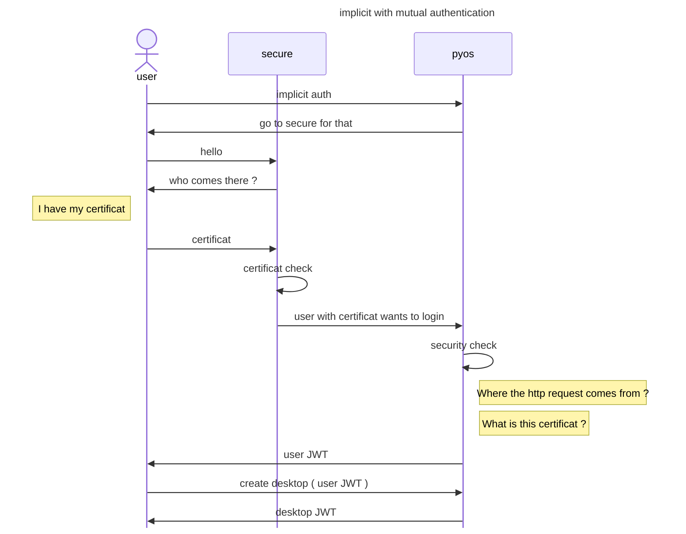

# logmein authentication


`logmein` permits to redirect user auth to https website to perform an mutual SSL authentication. 
In most cases, the user is rediected to a https service, the user is authenticated with his own X509 certificat, then the certificate is forwarded by a http header.  




 
- `logmein` is an `implicit` provider. 

The user is redirected to `dialog_url`. For example `https://secure.your_domain.com/protectedbyssl`

- implicit provider configuration

```
'implicit': {
  'providers'   : {
    'sslclient' : {
      'displayname': 'Logmein protected by SSL',
      'icon': 'img/auth/sslclient_icon.svg',
      'textcolor': '#000000',
      'backgroundcolor': '#FFFFFF',
      'enabled': True,
      'dialog_url' : 'https://secure.your_domain.com/protectedbyssl',
      'auth_protocol' : { 'localaccount': True }
    } 
  }
}
``` 

The SSL mutual authentifcation is done on `https://secure.your_domain.com/protectedbyssl`. Then the user is proxy passed from `https://secure.your_domain.com/protectedbyssl` to `$my_node/API/auth/logmein?provider=sslclient` 

```
location /protectedbyssl {
   if ($ssl_client_verify != SUCCESS) {return 403 $ssl_client_verify;}
   proxy_set_header AbcdesktopUserCert $ssl_client_escaped_cert;
   proxy_pass $my_node/API/auth/logmein?provider=sslclient;
}
```

> the server requests client's certificate in CertificateRequest message, so that the connection can be mutually authenticated

- logmein configuration

The endpoint `API/auth/logmein` performs security check to garantee that the request comes from authorized network_list, then check if requred the http_attribut name and value. It reads the X509 to get the userid from, then perform an implicit authentication for this userid 

```
auth.logmein : {  
	'enable' : True,
	'network_list' : ['0.0.0.0/0'],
	'permit_querystring' : False,
	'http_attribut' : 'ABCDESKTOPUSERCERT' }
```   


| Variable name       | Type     | Description   |
|---------------------|----------|-------------|
| `enable `           | boolean  | enable or disable the logmein feature, default value is `False` |
| `network_list`      | list     | list of subnet allow to query the `logmein` endpoint  | 
| `permit_querystring`| boolean  | allow to pass the `userid` as querystring parameter, the default value is `False` |
| `oid_list`          | list     | list of string to read the user_id, the default values are `[ cryptography.x509.oid.NameOID.USER_ID, cryptography.x509.oid.NameOID.COMMON_NAME ]` |
| `http_attribut`     | string   | (optional) name of the HTTP header, if set then the value of the header must be an X509 certificat | 


The `oid_list` entries are converted from oid dotted string format to ObjectIdentifier [ cryptography.x509.oid.NameOID.USER_ID, cryptography.x509.oid.NameOID.COMMON_NAME ] becomes [ '0.9.2342.19200300.100.1.1' and  '2.5.4.3' ]

> todo: check if the '2.5.4.3' is correct for `COMMON_NAME`


## nginx configuration with mutual authentication

- nginx reverse proxy sample

```
server {
	listen   443;
	server_name secure.your_domain.com;
	
	root /usr/share/nginx/www;
	index index.html index.htm;
	
	resolver a.b.c.d; # if need
	ssl on;
	ssl_certificate /etc/letsencrypt/live/secure.your_domain.com/fullchain.pem;
	ssl_certificate_key /etc/letsencrypt/live/secure.your_domain.com/privkey.pem;

	# where should you go ?
	# to your abcdesktop web site to call /API/auth/logmein endpoint
	set $my_node  http://abcdesktop_url:30443;

	# client certificate
	ssl_client_certificate /etc/nginx/ca/ca-cert.pem;
	# make verification optional, so we can display a 403 message to those
	# who fail authentication
	# ssl_verify_client optional;
	ssl_verify_depth 2;
	ssl_verify_client on;

	location /protectedbyssl {
	   if ($ssl_client_verify != SUCCESS) {return 403 $ssl_client_verify;}
	   proxy_set_header AbcdesktopUserCert $ssl_client_escaped_cert;
	   proxy_pass $my_node/API/auth/logmein?provider=sslclient;
	}
```


## od.config file


```
auth.logmein : {  
	'enable' : True,
	'network_list' : ['0.0.0.0/0'], 
	'permit_querystring' : False,
	'http_attribut' : 'ABCDESKTOPUSERCERT' }

authmanagers: {
  'implicit': {
     'providers'   : {
	     'sslclient' : {
	          'displayname': 'Logmein protected by SSL',
	          'icon': 'img/auth/sslclient_icon.svg',
	          'textcolor': '#000000',
	          'backgroundcolor': '#FFFFFF',
	          'enabled': True,
	          'dialog_url' : 'https://secure.your_domain.com/protectedbyssl',
	          'auth_protocol' : { 'localaccount': True }
	     } } } }
```


