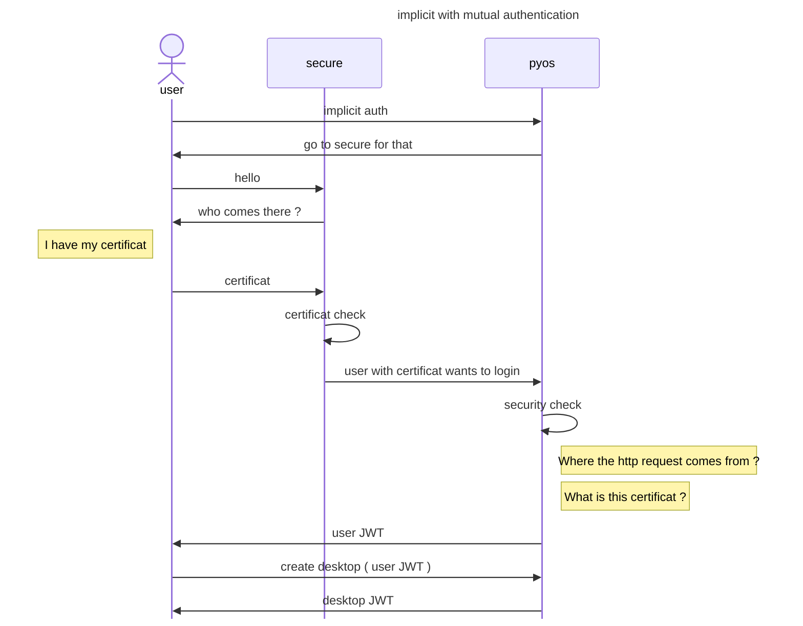

# logmein Authentication


`logmein` redirects users to an HTTPS website to perform mutual SSL (mTLS) authentication.



In the typical flow, the user is redirected to an HTTPS service, authenticated using their X.509 certificate, and the certificate is then forwarded via an HTTP header to `pyos`. `pyos` performs security checks and returns a user JWT to the client.


 
- `logmein` is an `implicit` provider.

The user is redirected to `dialog_url`. For example, `https://secure.your_domain.com/protectedbyssl`.
The implicit provider configuration looks like this:

```
'implicit': {
  'providers'   : {
    'sslclient' : {
      'displayname': 'Logmein protected by SSL',
      'icon': 'img/auth/sslclient_icon.svg',
      'textcolor': '#000000',
      'backgroundcolor': '#FFFFFF',
      'enabled': True,
      'dialog_url' : 'https://secure.your_domain.com/protectedbyssl',
      'auth_protocol' : { 'localaccount': True }
    } 
  }
}
``` 

Mutual SSL authentication is performed at `dialog_url`: `https://secure.your_domain.com/protectedbyssl`. The user is then proxy-passed from `https://secure.your_domain.com/protectedbyssl` to `$my_node/API/auth/logmein?provider=sslclient` if the SSL client certificate is verified.

```
location /protectedbyssl {
   if ($ssl_client_verify != SUCCESS) {return 403 $ssl_client_verify;}
   proxy_set_header AbcdesktopUserCert $ssl_client_escaped_cert;
   proxy_pass $my_node/API/auth/logmein?provider=sslclient;
}
```

> The server requests the client's certificate in a `CertificateRequest` message, enabling mutual TLS authentication.

- logmein configuration

The endpoint `API/auth/logmein` performs security checks to guarantee that the request originates from an authorized network in `network_list`. If configured, it also validates the required HTTP attribute name and value. It reads the X.509 certificate to extract the user ID, then performs implicit authentication for that user ID.

```
auth.logmein : {  
	'enable' : True,
	'network_list' : ['0.0.0.0/0'],
	'permit_querystring' : False,
	'http_attribut' : 'ABCDESKTOPUSERCERT' }
```   


| Variable name       | Type     | Description   |
|---------------------|----------|-------------|
| `enable `           | boolean  | Enables or disables the logmein feature. The default value is `False`. |
| `network_list`      | list     | List of subnets authorized to query the `logmein` endpoint. | 
| `permit_querystring`| boolean  | Allows passing the `userid` as a query string parameter. The default value is `False`. |
| `oid_list`          | list     | List of OID strings used to read the user ID from the X.509 certificate. The default values are `[ cryptography.x509.oid.NameOID.USER_ID, cryptography.x509.oid.NameOID.COMMON_NAME ]`. |
| `http_attribut`     | string   | (Optional) Name of the HTTP header. If set, the value of this header must be a PEM-encoded X.509 certificate. | 


The `oid_list` entries are converted from OID dotted-string format to `ObjectIdentifier` objects. For example, `[ cryptography.x509.oid.NameOID.USER_ID, cryptography.x509.oid.NameOID.COMMON_NAME ]` becomes `[ '0.9.2342.19200300.100.1.1', '2.5.4.3' ]`.


## nginx Configuration with Mutual Authentication

- nginx reverse proxy sample:

```
server {
	listen   443;
	server_name secure.your_domain.com;
	
	root /usr/share/nginx/www;
	index index.html index.htm;
	
	resolver a.b.c.d; # if need
	ssl on;
	ssl_certificate /etc/letsencrypt/live/secure.your_domain.com/fullchain.pem;
	ssl_certificate_key /etc/letsencrypt/live/secure.your_domain.com/privkey.pem;

	# where should you go ?
	# to your abcdesktop web site to call /API/auth/logmein endpoint
	set $my_node  http://abcdesktop_url:30443;

	# client certificate
	ssl_client_certificate /etc/nginx/ca/ca-cert.pem;
	# make verification optional, so we can display a 403 message to those
	# who fail authentication
	# ssl_verify_client optional;
	ssl_verify_depth 2;
	ssl_verify_client on;

	location /protectedbyssl {
	   if ($ssl_client_verify != SUCCESS) {return 403 $ssl_client_verify;}
	   proxy_set_header AbcdesktopUserCert $ssl_client_escaped_cert;
	   proxy_pass $my_node/API/auth/logmein?provider=sslclient;
	}
```


## od.config file


```
auth.logmein : {  
	'enable' : True,
	'network_list' : ['0.0.0.0/0'], 
	'permit_querystring' : False,
	'http_attribut' : 'ABCDESKTOPUSERCERT' }

authmanagers: {
  'implicit': {
     'providers'   : {
	     'sslclient' : {
	          'displayname': 'Logmein protected by SSL',
	          'icon': 'img/auth/sslclient_icon.svg',
	          'textcolor': '#000000',
	          'backgroundcolor': '#FFFFFF',
	          'enabled': True,
	          'dialog_url' : 'https://secure.your_domain.com/protectedbyssl',
	          'auth_protocol' : { 'localaccount': True }
	     } } } }
```
